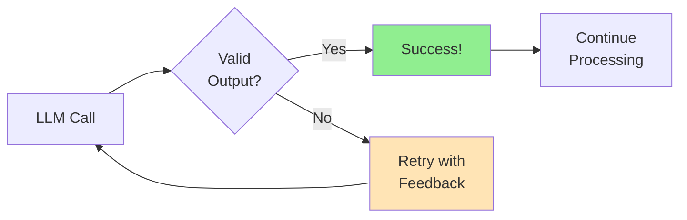
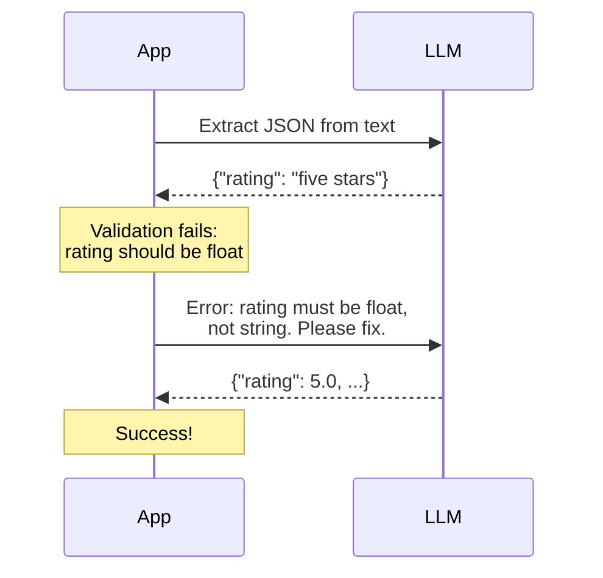

# Building Retry Loops for LLM Output Errors

Even with the best prompts and JSON modes, LLMs sometimes produce invalid output. A production-ready system needs **intelligent retry logic** that can recover from errors, provide feedback to the LLM, and eventually succeed.

> **Coming from Software Engineering?** Retry loops for LLMs are identical to retry patterns for any flaky external service — the same exponential backoff, jitter, and max-retries patterns from your HTTP client libraries (requests, axios) apply. The twist: you can send the error message back to the LLM so it learns from its mistake.

---

## Why Retry Loops Matter



### Common Failure Scenarios

| Scenario | Example | Recovery Strategy |
|----------|---------|-------------------|
| Invalid JSON | `{name: "John"}` | Clean and repair |
| Missing fields | `{"name": "John"}` (missing age) | Ask to complete |
| Wrong types | `{"age": "thirty"}` | Ask for correction |
| Schema mismatch | Extra/wrong fields | Provide specific feedback |
| Rate limiting | API 429 error | Exponential backoff |

---

## Basic Retry Pattern

```python
from openai import OpenAI
from pydantic import BaseModel, ValidationError
import json
import time

client = OpenAI()

class UserInfo(BaseModel):
    name: str
    age: int
    email: str

def extract_with_retry(
    text: str,
    max_retries: int = 3
) -> UserInfo | None:
    """Extract user info with basic retry logic."""

    schema = UserInfo.model_json_schema()
    last_error = None

    for attempt in range(max_retries):
        try:
            response = client.chat.completions.create(
                model="gpt-4o-mini",
                messages=[
                    {
                        "role": "user",
                        "content": f"""Extract user info as JSON:
Schema: {json.dumps(schema)}
Text: {text}
Return only JSON."""
                    }
                ],
                temperature=0,
                response_format={"type": "json_object"}
            )

            data = json.loads(response.choices[0].message.content)
            return UserInfo(**data)

        except json.JSONDecodeError as e:
            last_error = f"JSON parse error: {e}"
        except ValidationError as e:
            last_error = f"Validation error: {e}"
        except Exception as e:
            last_error = f"Unexpected error: {e}"

        print(f"Attempt {attempt + 1} failed: {last_error}")
        time.sleep(1)  # Brief pause between retries

    print(f"All {max_retries} attempts failed")
    return None

# Usage
result = extract_with_retry("Contact John Doe, age 30, at john@email.com")
if result:
    print(f"Success: {result}")
```

---

## Intelligent Retry with Feedback

The real power comes from telling the LLM what went wrong:

```python
from openai import OpenAI
from pydantic import BaseModel, ValidationError
import json

client = OpenAI()

class ProductReview(BaseModel):
    product_name: str
    rating: float  # 1-5
    sentiment: str  # positive, negative, neutral
    summary: str

def extract_with_feedback(
    text: str,
    max_retries: int = 3
) -> ProductReview | None:
    """Extract with error feedback to LLM."""

    schema = ProductReview.model_json_schema()

    messages = [
        {
            "role": "system",
            "content": """You are a JSON extraction assistant.
Extract information and return valid JSON matching the schema.
If you receive error feedback, correct your response accordingly."""
        },
        {
            "role": "user",
            "content": f"""Extract product review info from this text.

Schema: {json.dumps(schema, indent=2)}

Text: {text}

Return only valid JSON."""
        }
    ]

    for attempt in range(max_retries):
        try:
            response = client.chat.completions.create(
                model="gpt-4o-mini",
                messages=messages,
                temperature=0,
                response_format={"type": "json_object"}
            )

            content = response.choices[0].message.content
            data = json.loads(content)
            result = ProductReview(**data)

            print(f"✅ Success on attempt {attempt + 1}")
            return result

        except json.JSONDecodeError as e:
            error_feedback = f"JSON parsing failed: {e}. Please return valid JSON."

        except ValidationError as e:
            # Create detailed error feedback
            errors = e.errors()
            error_details = []
            for err in errors:
                field = ".".join(str(x) for x in err["loc"])
                error_details.append(f"- {field}: {err['msg']}")

            error_feedback = f"""Validation failed with these errors:
{chr(10).join(error_details)}

Please fix these issues and return corrected JSON."""

        # Add the failed response and error to conversation
        messages.append({
            "role": "assistant",
            "content": content if 'content' in dir() else "Invalid response"
        })
        messages.append({
            "role": "user",
            "content": error_feedback
        })

        print(f"Attempt {attempt + 1} failed, providing feedback...")

    return None

# Test with challenging input
review_text = """
OMG this phone is AMAZING!!! Battery lasts forever, camera is insane.
Definitely 5 stars, would buy again!!! Best purchase of 2024!
"""

result = extract_with_feedback(review_text)
if result:
    print(f"\nExtracted: {result.model_dump_json(indent=2)}")
```



---
