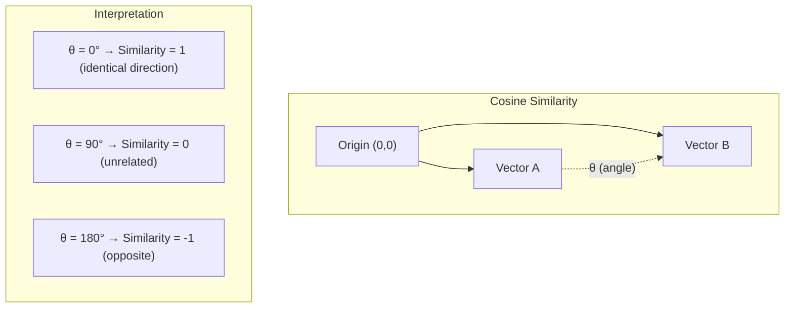
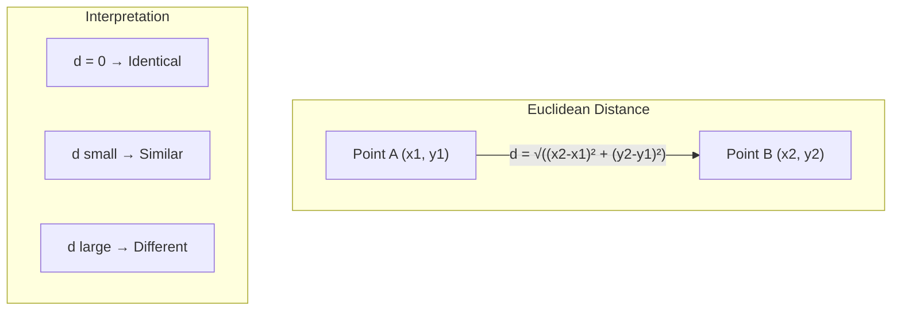
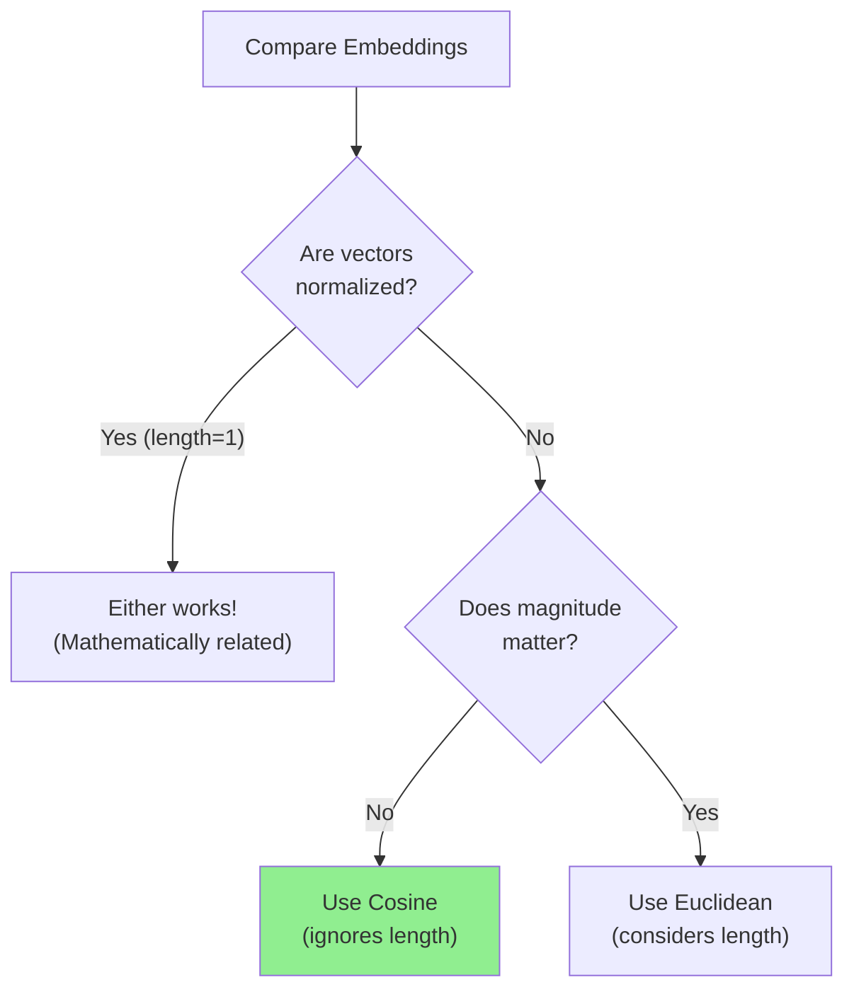
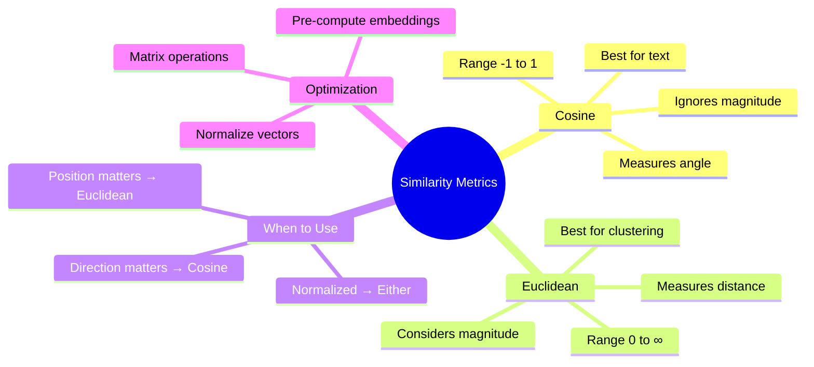

# Cosine Similarity and Euclidean Distance

You've learned that embeddings are lists of numbers representing meaning. But how do we actually measure "similarity" between two embeddings? In this guide, you'll master the two most important similarity metrics: **Cosine Similarity** and **Euclidean Distance**.

> **Coming from Software Engineering?** Similarity metrics for embeddings are like distance functions in spatial indexes (R-trees, k-d trees). If you've used PostGIS for geospatial queries ('find restaurants near me'), vector similarity is the same concept — just in 1536 dimensions instead of 2. Cosine similarity is the 'angular distance' equivalent.

---

## Why Measure Similarity?


Every time you:
- Search for similar items
- Find related documents
- Recommend content
- Detect duplicates

You need a way to measure "how similar" two embeddings are.

---

## Cosine Similarity: The Angle Approach

Cosine similarity measures the **angle** between two vectors, ignoring their length.

### The Intuition



Think of it like compass directions:
- **Same direction** (both pointing north) → Very similar
- **Perpendicular** (north vs east) → Unrelated
- **Opposite** (north vs south) → Very different

### The Formula

```
cosine_similarity = (A · B) / (||A|| × ||B||)

Where:
- A · B = dot product of A and B
- ||A|| = magnitude (length) of A
- ||B|| = magnitude (length) of B
```

### Python Implementation

```python
import numpy as np

def cosine_similarity(a: list, b: list) -> float:
    """
    Calculate cosine similarity between two vectors.

    Returns a value between -1 and 1:
    - 1: Identical direction (most similar)
    - 0: Perpendicular (unrelated)
    - -1: Opposite direction (least similar)
    """
    a = np.array(a)
    b = np.array(b)

    # Dot product
    dot_product = np.dot(a, b)

    # Magnitudes
    magnitude_a = np.linalg.norm(a)
    magnitude_b = np.linalg.norm(b)

    # Avoid division by zero
    if magnitude_a == 0 or magnitude_b == 0:
        return 0.0

    return dot_product / (magnitude_a * magnitude_b)

# Example with simple 2D vectors
v1 = [1, 0]  # Pointing right
v2 = [1, 0]  # Same direction
v3 = [0, 1]  # Pointing up (perpendicular)
v4 = [-1, 0]  # Pointing left (opposite)

print(f"Same direction: {cosine_similarity(v1, v2):.4f}")      # 1.0
print(f"Perpendicular: {cosine_similarity(v1, v3):.4f}")       # 0.0
print(f"Opposite: {cosine_similarity(v1, v4):.4f}")            # -1.0
```

### Real Embedding Example

```python
from openai import OpenAI
import numpy as np

client = OpenAI()

def get_embedding(text: str) -> list:
    response = client.embeddings.create(
        model="text-embedding-3-small",
        input=text
    )
    return response.data[0].embedding

def cosine_similarity(a: list, b: list) -> float:
    a, b = np.array(a), np.array(b)
    return np.dot(a, b) / (np.linalg.norm(a) * np.linalg.norm(b))

# Compare meanings
texts = {
    "base": "I love programming",
    "similar": "I enjoy coding",
    "related": "Software development is fun",
    "different": "The weather is nice today"
}

embeddings = {key: get_embedding(text) for key, text in texts.items()}

base_emb = embeddings["base"]
print(f"Base: '{texts['base']}'\n")

for key in ["similar", "related", "different"]:
    sim = cosine_similarity(base_emb, embeddings[key])
    print(f"  vs '{texts[key]}': {sim:.4f}")

# Expected output:
# Base: 'I love programming'
#   vs 'I enjoy coding': 0.8923 (high - similar meaning)
#   vs 'Software development is fun': 0.7845 (medium - related topic)
#   vs 'The weather is nice today': 0.4532 (low - different topic)
```

---

## Euclidean Distance: The Straight Line

Euclidean distance measures the **straight-line distance** between two points in space.

### The Intuition



It's literally the distance you'd measure with a ruler!

### The Formula

```
euclidean_distance = √(Σ(ai - bi)²)

Or in simpler terms:
distance = √((a1-b1)² + (a2-b2)² + ... + (an-bn)²)
```

### Python Implementation

```python
import numpy as np

def euclidean_distance(a: list, b: list) -> float:
    """
    Calculate Euclidean distance between two vectors.

    Returns a value >= 0:
    - 0: Identical points
    - Small: Similar
    - Large: Different
    """
    a = np.array(a)
    b = np.array(b)
    return np.linalg.norm(a - b)

# Simple 2D example
point1 = [0, 0]
point2 = [3, 4]
point3 = [0, 0]

print(f"Distance (0,0) to (3,4): {euclidean_distance(point1, point2):.4f}")  # 5.0
print(f"Distance (0,0) to (0,0): {euclidean_distance(point1, point3):.4f}")  # 0.0
```

### With Real Embeddings

```python
from openai import OpenAI
import numpy as np

client = OpenAI()

def get_embedding(text: str) -> list:
    response = client.embeddings.create(
        model="text-embedding-3-small",
        input=text
    )
    return response.data[0].embedding

def euclidean_distance(a: list, b: list) -> float:
    return np.linalg.norm(np.array(a) - np.array(b))

# Compare texts
texts = ["cat", "kitten", "dog", "pizza"]
embeddings = [get_embedding(t) for t in texts]

print("Euclidean distances from 'cat':\n")
for i, text in enumerate(texts[1:], 1):
    dist = euclidean_distance(embeddings[0], embeddings[i])
    print(f"  '{text}': {dist:.4f}")

# Expected:
# 'kitten': 0.45 (small - very similar)
# 'dog': 0.62 (medium - related animal)
# 'pizza': 1.23 (large - unrelated)
```

---

## Cosine vs Euclidean: When to Use Which?



### Comparison Table

| Aspect | Cosine Similarity | Euclidean Distance |
|--------|-------------------|-------------------|
| Measures | Angle between vectors | Straight-line distance |
| Range | -1 to 1 | 0 to ∞ |
| Best similarity | 1 (same direction) | 0 (same point) |
| Affected by magnitude? | No | Yes |
| Common use | Text similarity | Clustering |
| Interpretation | Direction match | Spatial closeness |

### Visual Comparison

```python
import numpy as np

def compare_metrics():
    """Show how cosine and euclidean can give different results."""

    # Two vectors with same direction but different magnitudes
    a = [1, 1]
    b = [2, 2]  # Same direction as a, but twice as long

    # Another vector at different angle
    c = [1, 0]

    cosine_ab = np.dot(a, b) / (np.linalg.norm(a) * np.linalg.norm(b))
    cosine_ac = np.dot(a, c) / (np.linalg.norm(a) * np.linalg.norm(c))

    euclidean_ab = np.linalg.norm(np.array(a) - np.array(b))
    euclidean_ac = np.linalg.norm(np.array(a) - np.array(c))

    print("Vectors: a=[1,1], b=[2,2], c=[1,0]")
    print("\nCosine Similarity:")
    print(f"  a vs b: {cosine_ab:.4f}  (same direction = identical!)")
    print(f"  a vs c: {cosine_ac:.4f}  (45° angle)")

    print("\nEuclidean Distance:")
    print(f"  a vs b: {euclidean_ab:.4f}  (different point)")
    print(f"  a vs c: {euclidean_ac:.4f}  (closer point)")

compare_metrics()
```

**Output:**
```
Vectors: a=[1,1], b=[2,2], c=[1,0]

Cosine Similarity:
  a vs b: 1.0000  (same direction = identical!)
  a vs c: 0.7071  (45° angle)

Euclidean Distance:
  a vs b: 1.4142  (different point)
  a vs c: 1.0000  (closer point)
```

Notice how cosine sees `a` and `b` as identical (same direction), while euclidean sees them as different (different positions)!

---

## Normalized Embeddings: Best of Both Worlds

When embeddings are **normalized** (length = 1), cosine and euclidean become mathematically related:

```python
import numpy as np

def normalize(v: list) -> np.array:
    """Normalize a vector to unit length."""
    v = np.array(v)
    return v / np.linalg.norm(v)

def cosine_similarity(a, b):
    return np.dot(a, b) / (np.linalg.norm(a) * np.linalg.norm(b))

def euclidean_distance(a, b):
    return np.linalg.norm(np.array(a) - np.array(b))

# Original vectors
a = [3, 4]
b = [1, 2]

# Normalized versions
a_norm = normalize(a)
b_norm = normalize(b)

print("Normalized vectors always have length 1:")
print(f"  |a_norm| = {np.linalg.norm(a_norm):.4f}")
print(f"  |b_norm| = {np.linalg.norm(b_norm):.4f}")

cosine = cosine_similarity(a_norm, b_norm)
euclidean = euclidean_distance(a_norm, b_norm)

print(f"\nCosine similarity: {cosine:.4f}")
print(f"Euclidean distance: {euclidean:.4f}")

# Mathematical relationship: euclidean² = 2(1 - cosine) for normalized vectors
print(f"\nVerify: euclidean² = {euclidean**2:.4f}")
print(f"        2(1 - cosine) = {2*(1-cosine):.4f}")
```

Many embedding models return **already normalized** vectors, making either metric work well.

---

## Efficient Similarity Search

For large-scale search, optimize your computations:

```python
import numpy as np
from openai import OpenAI

client = OpenAI()

class EfficientSearch:
    """Efficient similarity search using matrix operations."""

    def __init__(self, documents: list[str]):
        self.documents = documents
        self._embed_documents()

    def _embed_documents(self):
        """Embed all documents and normalize."""
        response = client.embeddings.create(
            model="text-embedding-3-small",
            input=self.documents
        )
        embeddings = [d.embedding for d in sorted(response.data, key=lambda x: x.index)]
        self.embeddings = np.array(embeddings)

        # Normalize for efficient cosine similarity
        norms = np.linalg.norm(self.embeddings, axis=1, keepdims=True)
        self.normalized = self.embeddings / norms

    def search(self, query: str, top_k: int = 5) -> list[tuple]:
        """Search for most similar documents."""
        # Embed query
        response = client.embeddings.create(
            model="text-embedding-3-small",
            input=query
        )
        query_emb = np.array(response.data[0].embedding)
        query_norm = query_emb / np.linalg.norm(query_emb)

        # Compute all similarities at once (matrix multiplication!)
        similarities = np.dot(self.normalized, query_norm)

        # Get top k
        top_indices = np.argsort(similarities)[::-1][:top_k]

        return [(self.documents[i], similarities[i]) for i in top_indices]

# Usage
documents = [
    "Python is great for data science",
    "JavaScript powers the web",
    "Machine learning requires math",
    "Deep learning uses neural networks",
    "Web development is creative work",
    "Data analysis reveals insights",
    "Cooking is a form of art",
    "Music brings people together"
]

searcher = EfficientSearch(documents)

# Search!
results = searcher.search("How do I analyze data?", top_k=3)
print("Query: 'How do I analyze data?'\n")
for doc, score in results:
    print(f"  {score:.4f}: {doc}")
```

---

## Converting Between Metrics

Sometimes you need to convert or use both:

```python
import numpy as np

def cosine_to_euclidean(cosine_sim: float) -> float:
    """
    Convert cosine similarity to euclidean distance.
    Only valid for normalized vectors!
    """
    return np.sqrt(2 * (1 - cosine_sim))

def euclidean_to_cosine(euclidean_dist: float) -> float:
    """
    Convert euclidean distance to cosine similarity.
    Only valid for normalized vectors!
    """
    return 1 - (euclidean_dist ** 2) / 2

# Test conversions
cosine_sim = 0.9
euclidean_dist = cosine_to_euclidean(cosine_sim)
print(f"Cosine {cosine_sim} → Euclidean {euclidean_dist:.4f}")

cosine_back = euclidean_to_cosine(euclidean_dist)
print(f"Euclidean {euclidean_dist:.4f} → Cosine {cosine_back:.4f}")
```

---

## Practical Similarity Thresholds

What counts as "similar"? Here are rough guidelines:


```python
def categorize_similarity(cosine_sim: float) -> str:
    """Categorize similarity score."""
    if cosine_sim >= 0.95:
        return "Near duplicate"
    elif cosine_sim >= 0.85:
        return "Very similar"
    elif cosine_sim >= 0.70:
        return "Related"
    elif cosine_sim >= 0.50:
        return "Somewhat related"
    else:
        return "Different topics"

# Example
similarities = [0.98, 0.91, 0.75, 0.55, 0.32]
for sim in similarities:
    print(f"{sim:.2f}: {categorize_similarity(sim)}")
```

---

## Summary



---

## Quick Reference

```python
import numpy as np

# Cosine Similarity (-1 to 1, higher = more similar)
def cosine_similarity(a, b):
    return np.dot(a, b) / (np.linalg.norm(a) * np.linalg.norm(b))

# Euclidean Distance (0 to ∞, lower = more similar)
def euclidean_distance(a, b):
    return np.linalg.norm(np.array(a) - np.array(b))

# Normalize vectors (for efficient comparison)
def normalize(v):
    return np.array(v) / np.linalg.norm(v)
```

---

## Exercises

1. **Threshold Finder**: Experiment with different similarity thresholds for your data to find the optimal cutoff

2. **Metric Comparison**: Compare cosine vs euclidean results on the same dataset - when do they differ?

3. **Speed Test**: Benchmark naive pairwise comparison vs matrix multiplication for 1000 documents

---

## What's Next?

You now understand the math of similarity! Next, let's learn about **Vector Databases** - specialized databases designed to store and search embeddings efficiently at scale.
