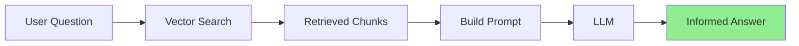
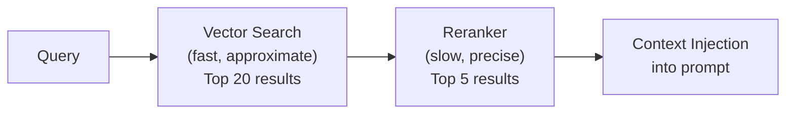
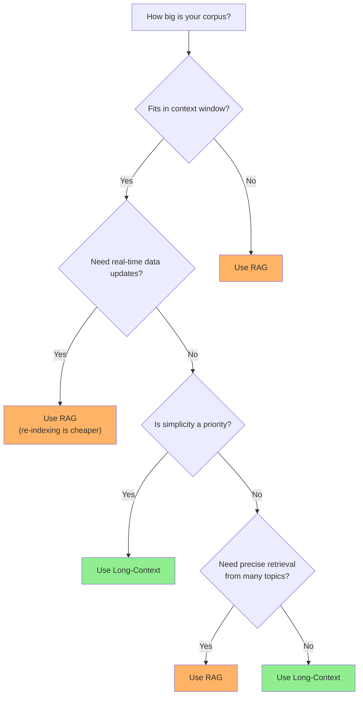
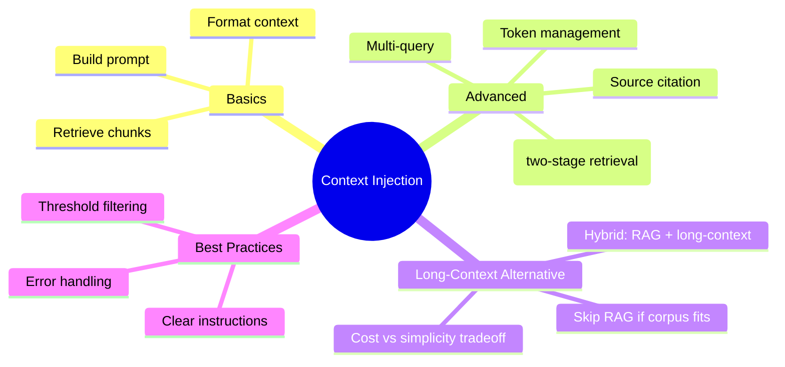

# Injecting Retrieved Context into Prompts

You've parsed documents, chunked them, and stored them in a vector database. Now comes the magic moment: **combining retrieved context with LLM prompts** to create a RAG system that actually works!

> **Coming from Software Engineering?** Context injection in RAG is just dependency injection for knowledge. Instead of injecting a database connection, you're injecting relevant documents into the prompt. The same patterns — interface-based injection, factory methods, lazy loading — apply to managing context.

---

## The RAG Flow



---

## Basic Context Injection

The simplest approach - stuff context into the prompt:

```python
from openai import OpenAI
import chromadb

openai_client = OpenAI()
chroma_client = chromadb.PersistentClient(path="./vectordb")
collection = chroma_client.get_collection("documents")

def simple_rag(question: str, n_results: int = 3) -> str:
    """Basic RAG implementation."""

    # 1. Get question embedding
    emb_response = openai_client.embeddings.create(
        model="text-embedding-3-small",
        input=question
    )
    query_embedding = emb_response.data[0].embedding

    # 2. Retrieve relevant chunks
    results = collection.query(
        query_embeddings=[query_embedding],
        n_results=n_results,
        include=["documents"]
    )

    context = "\n\n".join(results["documents"][0])

    # 3. Build prompt with context
    prompt = f"""Answer the question based on the following context.
If the context doesn't contain relevant information, say "I don't have enough information to answer that."

Context:
{context}

Question: {question}

Answer:"""

    # 4. Get LLM response
    response = openai_client.chat.completions.create(
        model="gpt-4o-mini",
        messages=[{"role": "user", "content": prompt}],
        temperature=0
    )

    return response.choices[0].message.content

# Usage
answer = simple_rag("What are the key features of Python?")
print(answer)
```

---

## Structured Prompt Templates

Use clear sections for better results:

```python
RAG_PROMPT_TEMPLATE = """You are a helpful assistant that answers questions based on provided context.

## Instructions
- Only use information from the provided context
- If the context doesn't contain the answer, clearly state that
- Cite specific parts of the context when possible
- Be concise but complete

## Context
{context}

## Question
{question}

## Answer"""

def format_context(chunks: list[dict]) -> str:
    """Format retrieved chunks with source info."""
    formatted_parts = []

    for i, chunk in enumerate(chunks, 1):
        source = chunk.get("metadata", {}).get("source", "Unknown")
        text = chunk.get("document", chunk.get("text", ""))
        formatted_parts.append(f"[Source {i}: {source}]\n{text}")

    return "\n\n---\n\n".join(formatted_parts)

def structured_rag(question: str, n_results: int = 5) -> dict:
    """RAG with structured prompt and metadata."""

    # Get embeddings and search
    emb_response = openai_client.embeddings.create(
        model="text-embedding-3-small",
        input=question
    )

    results = collection.query(
        query_embeddings=[emb_response.data[0].embedding],
        n_results=n_results,
        include=["documents", "metadatas", "distances"]
    )

    # Format chunks with metadata
    chunks = [
        {
            "document": results["documents"][0][i],
            "metadata": results["metadatas"][0][i],
            "similarity": 1 - results["distances"][0][i]
        }
        for i in range(len(results["ids"][0]))
    ]

    context = format_context(chunks)
    prompt = RAG_PROMPT_TEMPLATE.format(context=context, question=question)

    response = openai_client.chat.completions.create(
        model="gpt-4o-mini",
        messages=[{"role": "user", "content": prompt}],
        temperature=0
    )

    return {
        "answer": response.choices[0].message.content,
        "sources": [c["metadata"].get("source") for c in chunks],
        "top_similarity": chunks[0]["similarity"] if chunks else 0
    }
```

---

## Context Window Management

Don't overflow the context window!

```python
import tiktoken

def count_tokens(text: str, model: str = "gpt-4o-mini") -> int:
    """Count tokens in text."""
    encoder = tiktoken.encoding_for_model(model)
    return len(encoder.encode(text))

def fit_context_to_window(
    chunks: list[str],
    question: str,
    max_context_tokens: int = 3000,
    model: str = "gpt-4o-mini"
) -> str:
    """Select chunks that fit within token budget."""

    # Reserve tokens for question and response
    question_tokens = count_tokens(question, model)
    overhead_tokens = 500  # For prompt template and response buffer

    available_tokens = max_context_tokens - question_tokens - overhead_tokens

    selected_chunks = []
    current_tokens = 0

    for chunk in chunks:
        chunk_tokens = count_tokens(chunk, model)

        if current_tokens + chunk_tokens <= available_tokens:
            selected_chunks.append(chunk)
            current_tokens += chunk_tokens
        else:
            break  # Stop when budget exceeded

    return "\n\n".join(selected_chunks)

def token_aware_rag(question: str, max_tokens: int = 3000) -> str:
    """RAG with token budget management."""

    # Retrieve more chunks than needed
    emb_response = openai_client.embeddings.create(
        model="text-embedding-3-small",
        input=question
    )

    results = collection.query(
        query_embeddings=[emb_response.data[0].embedding],
        n_results=10,  # Get extra for selection
        include=["documents"]
    )

    chunks = results["documents"][0]

    # Fit to token budget
    context = fit_context_to_window(chunks, question, max_tokens)

    prompt = f"""Based on the context below, answer the question.

Context:
{context}

Question: {question}"""

    response = openai_client.chat.completions.create(
        model="gpt-4o-mini",
        messages=[{"role": "user", "content": prompt}],
        temperature=0
    )

    return response.choices[0].message.content
```

---

## Advanced: Multi-Query RAG

Generate multiple queries for better retrieval:

```python
def generate_query_variations(question: str, n_variations: int = 3) -> list[str]:
    """Generate variations of the question for better retrieval."""

    prompt = f"""Generate {n_variations} different ways to ask this question.
Return only the questions, one per line.

Original question: {question}"""

    response = openai_client.chat.completions.create(
        model="gpt-4o-mini",
        messages=[{"role": "user", "content": prompt}],
        temperature=0.7
    )

    variations = response.choices[0].message.content.strip().split("\n")
    return [question] + [v.strip() for v in variations if v.strip()]

def multi_query_rag(question: str, n_results: int = 3) -> str:
    """RAG with multiple query variations."""

    # Generate query variations
    queries = generate_query_variations(question)
    print(f"Searching with {len(queries)} query variations")

    # Collect unique chunks from all queries
    all_chunks = {}

    for query in queries:
        emb_response = openai_client.embeddings.create(
            model="text-embedding-3-small",
            input=query
        )

        results = collection.query(
            query_embeddings=[emb_response.data[0].embedding],
            n_results=n_results,
            include=["documents", "distances"]
        )

        for i, doc_id in enumerate(results["ids"][0]):
            similarity = 1 - results["distances"][0][i]
            if doc_id not in all_chunks or all_chunks[doc_id]["similarity"] < similarity:
                all_chunks[doc_id] = {
                    "text": results["documents"][0][i],
                    "similarity": similarity
                }

    # Sort by similarity and take top results
    sorted_chunks = sorted(all_chunks.values(), key=lambda x: x["similarity"], reverse=True)
    context = "\n\n".join(c["text"] for c in sorted_chunks[:n_results * 2])

    # Generate answer
    prompt = f"""Answer based on this context:

{context}

Question: {question}"""

    response = openai_client.chat.completions.create(
        model="gpt-4o-mini",
        messages=[{"role": "user", "content": prompt}],
        temperature=0
    )

    return response.choices[0].message.content
```

---

## Complete RAG System

```python
from dataclasses import dataclass
from typing import Optional
import chromadb
from openai import OpenAI

@dataclass
class RAGResponse:
    answer: str
    sources: list[dict]
    confidence: float
    tokens_used: int

class RAGSystem:
    """Production-ready RAG system."""

    def __init__(self, collection_name: str, persist_dir: str = "./vectordb"):
        self.openai = OpenAI()
        self.chroma = chromadb.PersistentClient(path=persist_dir)
        self.collection = self.chroma.get_or_create_collection(collection_name)

        self.system_prompt = """You are a helpful assistant that answers questions based on provided context.

Guidelines:
- Only use information from the context provided
- If you can't answer from the context, say so clearly
- Be concise but thorough
- Cite sources when possible using [Source N] notation"""

    def query(
        self,
        question: str,
        n_results: int = 5,
        similarity_threshold: float = 0.5
    ) -> RAGResponse:
        """Process a question through the RAG pipeline."""

        # Embed question
        emb = self.openai.embeddings.create(
            model="text-embedding-3-small",
            input=question
        )

        # Retrieve
        results = self.collection.query(
            query_embeddings=[emb.data[0].embedding],
            n_results=n_results,
            include=["documents", "metadatas", "distances"]
        )

        # Filter by threshold
        sources = []
        context_parts = []

        for i in range(len(results["ids"][0])):
            similarity = 1 - results["distances"][0][i]
            if similarity >= similarity_threshold:
                sources.append({
                    "id": results["ids"][0][i],
                    "text": results["documents"][0][i][:200] + "...",
                    "metadata": results["metadatas"][0][i],
                    "similarity": similarity
                })
                context_parts.append(
                    f"[Source {len(sources)}]\n{results['documents'][0][i]}"
                )

        if not sources:
            return RAGResponse(
                answer="I couldn't find relevant information to answer your question.",
                sources=[],
                confidence=0.0,
                tokens_used=0
            )

        context = "\n\n---\n\n".join(context_parts)

        # Generate response (with error handling for production)
        try:
            response = self.openai.chat.completions.create(
                model="gpt-4o-mini",
                messages=[
                    {"role": "system", "content": self.system_prompt},
                    {"role": "user", "content": f"Context:\n{context}\n\nQuestion: {question}"}
                ],
                temperature=0,
                timeout=30.0  # Don't let API calls hang
            )
        except Exception as e:
            return RAGResponse(
                answer=f"Sorry, I encountered an error generating a response: {type(e).__name__}",
                sources=sources,
                confidence=0.0,
                tokens_used=0
            )

        avg_similarity = sum(s["similarity"] for s in sources) / len(sources)

        return RAGResponse(
            answer=response.choices[0].message.content,
            sources=sources,
            confidence=avg_similarity,
            tokens_used=response.usage.total_tokens
        )

# Usage
rag = RAGSystem("knowledge_base")

# Add some documents first
rag.collection.add(
    ids=["1", "2", "3"],
    documents=[
        "Python is a programming language known for its simplicity.",
        "Machine learning uses algorithms to learn from data.",
        "RAG combines retrieval with generation for better answers."
    ],
    metadatas=[{"topic": "python"}, {"topic": "ml"}, {"topic": "rag"}]
)

# Query
result = rag.query("What is Python?")
print(f"Answer: {result.answer}")
print(f"Confidence: {result.confidence:.2%}")
print(f"Sources: {len(result.sources)}")
```

---

## Multi-Tenant RAG: Security Considerations

> **Coming from Software Engineering?** If you've built multi-tenant SaaS systems, you know that User A should never see User B's data. The same principle applies to RAG — but it's easy to accidentally leak documents across tenants through vector search.

In production RAG systems with multiple users or organizations, you **must** ensure document isolation:

### The Problem

Without access control, a vector similarity search returns the nearest neighbors across **all** documents in your collection — regardless of who uploaded them.

### Solutions

**1. Metadata filtering (simplest):** Tag every document with an `owner_id` and filter at query time.

```python
# When indexing
collection.add(
    documents=["Secret quarterly results..."],
    metadatas=[{"owner_id": "org_123", "department": "finance"}],
    ids=["doc_1"]
)

# When querying — ALWAYS include the owner filter
results = collection.query(
    query_texts=["quarterly results"],
    where={"owner_id": "org_123"},  # Critical: never omit this
    n_results=5
)
```

**2. Separate collections per tenant:** Stronger isolation but more operational overhead.

**3. Row-level security in the vector DB:** Pgvector with PostgreSQL RLS policies gives database-level enforcement.

> **Rule of thumb:** Start with metadata filtering for prototypes. Move to separate collections or database-level RLS before handling sensitive data in production. Never rely on the application layer alone — defense in depth applies here just like any other data access pattern.

---

## Reranking: Improving Retrieval Quality

Vector similarity search is fast but approximate. The top-K chunks from embedding search aren't always the *most useful* results — they're just the nearest neighbors in embedding space. **Reranking** adds a second pass: a more powerful model re-scores each candidate for actual relevance to the query.

### Two-Stage Retrieval Pipeline



### Cohere Rerank (Managed API)

```python
# pip install cohere
import cohere

co = cohere.Client()  # Uses COHERE_API_KEY env var

# After vector search returns 20 candidates
results = co.rerank(
    query="How does authentication work?",
    documents=[chunk.text for chunk in vector_results],
    top_n=5,
    model="rerank-v3.5",
)

# Use reranked results for context injection
reranked_chunks = [vector_results[r.index] for r in results.results]
```

### Cross-Encoder Reranking (Open-Source)

If you want to self-host and avoid API costs, cross-encoders give you the same two-stage pattern with no external dependency:

```python
from sentence_transformers import CrossEncoder

reranker = CrossEncoder("cross-encoder/ms-marco-MiniLM-L-6-v2")

pairs = [(query, chunk.text) for chunk in vector_results]
scores = reranker.predict(pairs)

# Sort by reranker score
reranked = sorted(zip(scores, vector_results), reverse=True)[:5]
```

### When to Use Reranking

- **Large corpora** where top-K embedding results are noisy
- **High-stakes applications** (legal, medical) where retrieval precision matters
- **Existing RAG pipelines** where answers sometimes miss the right context — reranking is often the highest-ROI fix

> **Coming from Software Engineering?** This is the same pattern as a two-phase search: a fast, approximate index scan (like Elasticsearch BM25 or vector ANN) followed by a precise re-scoring pass. If you've built search systems with a "candidate generation -> ranking" pipeline, reranking in RAG is exactly the same idea.

---

## The Long-Context Alternative

Everything above assumes you *need* retrieval. But the ground is shifting fast.

> **SWE Analogy:** RAG is like building a microservice with a search index to find relevant config files. Long-context is like just... loading the entire config directory into memory. If it fits, why build the plumbing?

With Claude supporting 200K tokens and Gemini pushing 1M tokens, many use cases that previously *required* RAG can now just stuff all the documents directly into the context window. No chunking, no embeddings, no vector database — just read the files and send them.

### When to Use RAG vs Long-Context



**Rules of thumb:**
- Corpus fits in the window and doesn't change often → try long-context first
- Corpus exceeds the window or updates frequently → RAG is the way
- Need pinpoint retrieval across thousands of documents → RAG
- Building a quick prototype or internal tool → long-context saves you days of infra

### Tradeoffs at a Glance

| Aspect | Long-Context | RAG |
|--------|-------------|-----|
| **Complexity** | Simple (no chunking, no vector DB) | Complex (chunking, embedding, retrieval) |
| **Cost per query** | Higher (more input tokens) | Lower (only relevant chunks) |
| **Indexing cost** | None | Embedding + storage |
| **Scalability** | Limited by context window | Scales to millions of docs |
| **Freshness** | Re-send each query | Re-index only changed docs |
| **Accuracy** | Good for small corpora | Better for large corpora with precise retrieval |

### The Long-Context Approach in Code

```python
from openai import OpenAI

client = OpenAI()

# Long-context approach: just load everything
with open("company_docs.txt") as f:
    all_docs = f.read()  # Say 50K tokens

response = client.chat.completions.create(
    model="gpt-4o",
    messages=[
        {"role": "system", "content": f"Answer based on these docs:\n\n{all_docs}"},
        {"role": "user", "content": user_question}
    ]
)
```

Compare that to the RAG system above — no embeddings, no ChromaDB, no chunking logic. If your documents fit, this is dramatically less code to ship and maintain.

### The Hybrid Approach

In practice, production systems often combine both strategies: use RAG to retrieve the top-K relevant chunks from a massive corpus, then stuff those chunks *plus surrounding context* into a generous context window. You get the scalability of retrieval with the comprehension benefits of feeding the model more complete documents.

```python
def hybrid_rag(question: str, n_chunks: int = 5, context_padding: int = 2) -> str:
    """Retrieve top chunks via RAG, then expand context for the LLM."""

    # Step 1: RAG retrieves the most relevant chunks
    top_chunks = retrieve_chunks(question, n_results=n_chunks)

    # Step 2: Expand each chunk with its neighbors for richer context
    expanded = []
    for chunk in top_chunks:
        neighbors = get_surrounding_chunks(
            chunk["doc_id"], chunk["chunk_index"], padding=context_padding
        )
        expanded.append("\n".join(neighbors))

    full_context = "\n\n---\n\n".join(expanded)

    # Step 3: Send the expanded context to a long-context model
    response = client.chat.completions.create(
        model="gpt-4o",
        messages=[
            {"role": "system", "content": f"Answer from this context:\n\n{full_context}"},
            {"role": "user", "content": question}
        ]
    )

    return response.choices[0].message.content
```

> **Bottom line:** RAG isn't going away — it's essential for large, dynamic corpora. But before you reach for the vector database, ask yourself: *does this actually need retrieval, or can I just send everything?* The cheapest infrastructure is the infrastructure you don't build.

---

## Summary



---

## Quick Reference

```python
# Basic RAG prompt
prompt = f"""Context: {context}

Question: {question}

Answer based only on the context above."""

# With system prompt
messages = [
    {"role": "system", "content": "Answer using only the provided context."},
    {"role": "user", "content": f"Context: {context}\n\nQuestion: {question}"}
]
```

---

## Long-Context Models vs RAG

Models with large context windows -- Gemini (1M tokens), Claude (200K tokens), and GPT-4o (128K tokens) -- can sometimes replace RAG entirely for smaller document sets. If your entire corpus fits in the context window, you can skip the chunking, embedding, and retrieval pipeline and simply send all documents directly to the model.

However, RAG is still necessary when:
- **Documents exceed the context window** -- even 1M tokens has limits, and many production corpora are far larger.
- **Documents change frequently** -- re-indexing changed documents is cheaper than re-sending everything each query.
- **You need source attribution** -- RAG naturally tracks which chunks contributed to an answer, making citations straightforward.
- **Cost matters at scale** -- sending 500K tokens per query is expensive; retrieving only the relevant 5K tokens is not.

Frameworks like **LangChain** and **LlamaIndex** (covered in Phase 3) can simplify RAG pipeline construction significantly, handling chunking, embedding, retrieval, and prompt assembly with just a few lines of code.

---

## Long-Context Models vs RAG

Models with large context windows -- Gemini (1M tokens), Claude (200K tokens), GPT-4o (128K tokens) -- can sometimes replace RAG entirely for smaller document sets. If your entire corpus fits in the context window, you can skip chunking, embeddings, and vector databases altogether and just send everything directly to the model.

However, RAG is still necessary when:
- Your documents are **too large** to fit in any context window (millions of pages, entire codebases)
- Your data **changes frequently** and re-sending everything each query is impractical or expensive
- You need **source attribution** -- RAG naturally tracks which chunks contributed to an answer
- You need **precise retrieval** across thousands of heterogeneous documents where the model might lose focus

For a deeper look at this tradeoff, see the "Long-Context Alternative" section earlier in this guide.

> **Framework Note:** Frameworks like **LangChain** and **LlamaIndex** (covered in Phase 3) can significantly simplify RAG pipeline construction -- handling chunking, embedding, retrieval, and prompt assembly with just a few lines of code. If you find yourself rebuilding these patterns from scratch, consider reaching for a framework.

---

## What's Next?

Now you've built a complete RAG system! Next week, we'll learn about **Tool Calling** - giving LLMs the ability to execute functions!
