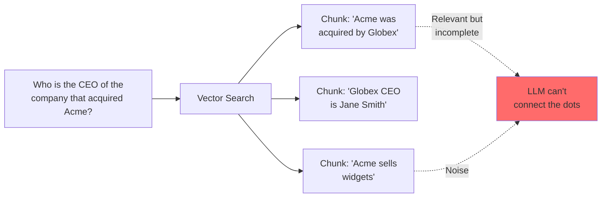
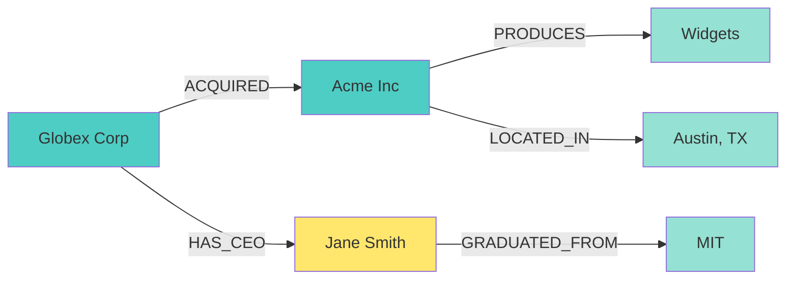
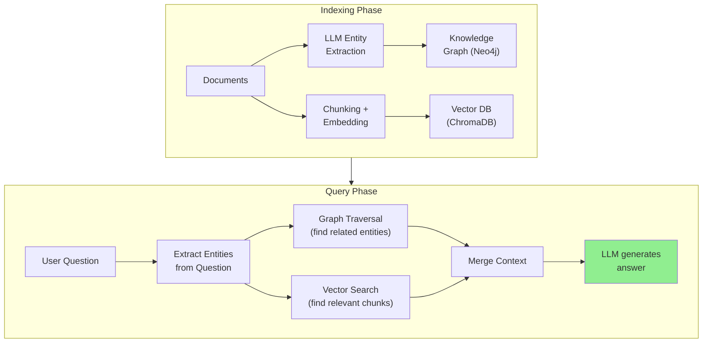
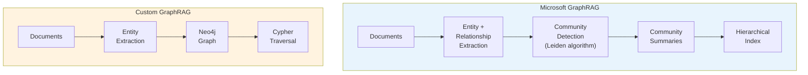
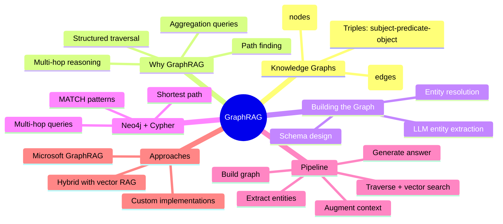

# GraphRAG and Knowledge Graphs

Standard vector RAG works brilliantly for single-hop questions like "What is our refund policy?" But ask it **"Who is the CEO of the company that acquired our biggest partner?"** and it falls apart. The answer requires *connecting* facts across multiple documents -- a multi-hop reasoning chain that embedding similarity alone cannot solve. **GraphRAG** fixes this by layering a knowledge graph on top of your retrieval pipeline, letting you traverse relationships instead of just matching vectors.

> **Coming from Software Engineering?** Knowledge graphs are like foreign key relationships on steroids. Instead of `JOIN users ON orders.user_id = users.id`, you traverse semantic relationships: `(Company)-[:ACQUIRED]->(Company)-[:HAS_CEO]->(Person)`. If you've modeled entity-relationship diagrams or worked with graph databases, you already think in nodes and edges -- GraphRAG just brings that power to LLM retrieval.

---

## Why Vector RAG Fails at Multi-Hop



Vector similarity retrieves chunks independently. Each chunk might be relevant, but the LLM has no guarantee it will receive *both* pieces of the chain -- and no way to know it needs to follow the `acquired by` relationship before looking up the CEO.

**Common failure modes of vector-only RAG:**

| Question Type | Example | Why It Fails |
|--------------|---------|--------------|
| Multi-hop | "Who manages the team that built feature X?" | Requires traversing: feature -> team -> manager |
| Aggregation | "How many subsidiaries does Globex have?" | Needs to collect all `HAS_SUBSIDIARY` edges |
| Comparison | "Which department has more employees, Sales or Engineering?" | Requires structured counts, not similarity |
| Path finding | "How is Alice connected to the Project Alpha team?" | Needs graph traversal, not nearest neighbors |

---

## Knowledge Graphs: The Core Concepts

A knowledge graph stores information as **triples**: `(Subject, Predicate, Object)`.



### Triples in Practice

```python
# A triple is simply (subject, predicate, object)
triples = [
    ("Globex Corp", "ACQUIRED", "Acme Inc"),
    ("Globex Corp", "HAS_CEO", "Jane Smith"),
    ("Acme Inc", "PRODUCES", "Widgets"),
    ("Acme Inc", "LOCATED_IN", "Austin, TX"),
    ("Jane Smith", "GRADUATED_FROM", "MIT"),
]

# Now you can answer multi-hop questions by traversal:
# Q: "Who is the CEO of the company that acquired Acme?"
# Step 1: Find who acquired Acme -> Globex Corp
# Step 2: Find CEO of Globex Corp -> Jane Smith
```

**Entity types** (nodes) and **relationship types** (edges) give your graph structure:

- **Entities:** Person, Company, Product, Location, Team, Project
- **Relationships:** ACQUIRED, HAS_CEO, WORKS_AT, REPORTS_TO, LOCATED_IN, PRODUCES

---

## Extracting Entities with an LLM

The first step in building a knowledge graph is extracting entities and relationships from unstructured text. LLMs are remarkably good at this.

```python
from openai import OpenAI
from pydantic import BaseModel
import json

client = OpenAI()

class Entity(BaseModel):
    name: str
    type: str  # Person, Company, Product, etc.

class Relationship(BaseModel):
    subject: str
    predicate: str
    object: str

class ExtractionResult(BaseModel):
    entities: list[Entity]
    relationships: list[Relationship]

def extract_entities(text: str) -> ExtractionResult:
    """Extract entities and relationships from text using an LLM."""

    response = client.beta.chat.completions.parse(
        model="gpt-4o-mini",
        messages=[
            {
                "role": "system",
                "content": """Extract all entities and relationships from the text.
Entities should have a name and type (Person, Company, Product, Location, etc.).
Relationships should be triples: (subject, PREDICATE, object).
Use UPPERCASE for relationship predicates.
Be thorough -- extract every factual relationship you can find."""
            },
            {"role": "user", "content": text}
        ],
        response_format=ExtractionResult,
    )

    return response.choices[0].message.parsed

# Example usage
text = """
Globex Corporation announced the acquisition of Acme Inc for $2.3 billion.
Globex CEO Jane Smith said the deal would strengthen their position in the
widget market. Acme, founded by Bob Johnson in 2015 and headquartered in
Austin, Texas, is known for its premium widget product line. After the
acquisition, Bob Johnson will serve as VP of Product at Globex.
"""

result = extract_entities(text)

print("Entities:")
for entity in result.entities:
    print(f"  ({entity.name}: {entity.type})")

print("\nRelationships:")
for rel in result.relationships:
    print(f"  ({rel.subject}) -[{rel.predicate}]-> ({rel.object})")
```

Expected output:

```
Entities:
  (Globex Corporation: Company)
  (Acme Inc: Company)
  (Jane Smith: Person)
  (Bob Johnson: Person)
  (Austin, Texas: Location)

Relationships:
  (Globex Corporation) -[ACQUIRED]-> (Acme Inc)
  (Globex Corporation) -[HAS_CEO]-> (Jane Smith)
  (Acme Inc) -[FOUNDED_BY]-> (Bob Johnson)
  (Acme Inc) -[HEADQUARTERED_IN]-> (Austin, Texas)
  (Bob Johnson) -[WILL_SERVE_AS]-> (VP of Product at Globex)
```

---

## Neo4j Basics: Storing and Querying the Graph

Neo4j is the most popular graph database. Its query language, **Cypher**, reads like ASCII art for graphs.

### Setting Up Neo4j with Python

```python
# pip install neo4j
from neo4j import GraphDatabase

driver = GraphDatabase.driver(
    "bolt://localhost:7687",
    auth=("neo4j", "your-password")
)

def run_query(query: str, parameters: dict = None) -> list:
    """Execute a Cypher query and return results."""
    with driver.session() as session:
        result = session.run(query, parameters or {})
        return [record.data() for record in result]
```

### Creating Nodes and Relationships

```python
# Create entities as nodes
def create_entity(name: str, entity_type: str, properties: dict = None):
    """Create a node in Neo4j."""
    props = properties or {}
    props["name"] = name

    query = f"""
    MERGE (e:{entity_type} {{name: $name}})
    SET e += $props
    RETURN e
    """
    return run_query(query, {"name": name, "props": props})

# Create relationships
def create_relationship(subject: str, predicate: str, obj: str):
    """Create a relationship between two nodes."""
    query = f"""
    MATCH (a {{name: $subject}})
    MATCH (b {{name: $object}})
    MERGE (a)-[r:{predicate}]->(b)
    RETURN a.name, type(r), b.name
    """
    return run_query(query, {"subject": subject, "object": obj})

# Build the graph from extracted entities
create_entity("Globex Corporation", "Company", {"industry": "Manufacturing"})
create_entity("Acme Inc", "Company", {"founded": 2015})
create_entity("Jane Smith", "Person", {"title": "CEO"})
create_entity("Bob Johnson", "Person", {"title": "Founder"})

create_relationship("Globex Corporation", "ACQUIRED", "Acme Inc")
create_relationship("Globex Corporation", "HAS_CEO", "Jane Smith")
create_relationship("Acme Inc", "FOUNDED_BY", "Bob Johnson")
```

### Cypher Query Patterns

```python
# 1. Simple match: Find a company's CEO
results = run_query("""
    MATCH (c:Company {name: "Globex Corporation"})-[:HAS_CEO]->(p:Person)
    RETURN p.name AS ceo
""")
# -> [{"ceo": "Jane Smith"}]

# 2. Multi-hop: CEO of the company that acquired Acme
results = run_query("""
    MATCH (target:Company {name: "Acme Inc"})
          <-[:ACQUIRED]-(acquirer:Company)
          -[:HAS_CEO]->(ceo:Person)
    RETURN ceo.name AS ceo, acquirer.name AS company
""")
# -> [{"ceo": "Jane Smith", "company": "Globex Corporation"}]

# 3. Path finding: How are two entities connected?
results = run_query("""
    MATCH path = shortestPath(
        (a {name: "Jane Smith"})-[*]-(b {name: "Bob Johnson"})
    )
    RETURN [node in nodes(path) | node.name] AS path_nodes,
           [rel in relationships(path) | type(rel)] AS path_rels
""")

# 4. Aggregation: Count subsidiaries
results = run_query("""
    MATCH (parent:Company {name: "Globex Corporation"})-[:ACQUIRED]->(sub:Company)
    RETURN count(sub) AS subsidiary_count
""")
```

---

## The GraphRAG Pipeline

Here is the full pipeline: extract entities from documents, build a graph, then combine graph traversal with vector search to answer complex queries.



### Full Implementation

```python
from openai import OpenAI
from neo4j import GraphDatabase
import chromadb

client = OpenAI()
neo4j_driver = GraphDatabase.driver("bolt://localhost:7687", auth=("neo4j", "password"))
chroma = chromadb.PersistentClient(path="./vectordb")
collection = chroma.get_or_create_collection("documents")

class GraphRAG:
    """Combines knowledge graph traversal with vector retrieval."""

    def __init__(self):
        self.client = client
        self.driver = neo4j_driver
        self.collection = collection

    def index_document(self, doc_id: str, text: str):
        """Index a document into both the graph and vector store."""

        # 1. Extract entities and relationships
        extraction = extract_entities(text)  # From our earlier function

        # 2. Add to knowledge graph
        with self.driver.session() as session:
            for entity in extraction.entities:
                session.run(
                    f"MERGE (e:{entity.type} {{name: $name}})",
                    {"name": entity.name}
                )
            for rel in extraction.relationships:
                session.run(
                    f"""
                    MATCH (a {{name: $subject}})
                    MATCH (b {{name: $object}})
                    MERGE (a)-[:{rel.predicate}]->(b)
                    """,
                    {"subject": rel.subject, "object": rel.object}
                )

        # 3. Add to vector store
        emb = self.client.embeddings.create(
            model="text-embedding-3-small", input=text
        )
        self.collection.add(
            ids=[doc_id],
            embeddings=[emb.data[0].embedding],
            documents=[text],
            metadatas=[{"entities": ", ".join(e.name for e in extraction.entities)}]
        )

    def query(self, question: str, max_hops: int = 2) -> str:
        """Answer a question using both graph and vector retrieval."""

        # 1. Extract entities from the question
        q_extraction = extract_entities(question)
        entity_names = [e.name for e in q_extraction.entities]

        # 2. Graph traversal: find related entities within max_hops
        graph_context = []
        with self.driver.session() as session:
            for name in entity_names:
                result = session.run(f"""
                    MATCH path = (start {{name: $name}})-[*1..{max_hops}]-(connected)
                    RETURN start.name AS source,
                           [rel in relationships(path) | type(rel)] AS rels,
                           connected.name AS target,
                           labels(connected) AS target_type
                    LIMIT 20
                """, {"name": name})

                for record in result:
                    rel_chain = " -> ".join(record["rels"])
                    graph_context.append(
                        f"{record['source']} -[{rel_chain}]-> "
                        f"{record['target']} ({record['target_type'][0]})"
                    )

        # 3. Vector search for relevant text chunks
        emb = self.client.embeddings.create(
            model="text-embedding-3-small", input=question
        )
        vector_results = self.collection.query(
            query_embeddings=[emb.data[0].embedding],
            n_results=5,
            include=["documents"]
        )
        text_context = "\n".join(vector_results["documents"][0])

        # 4. Combine graph + vector context and generate answer
        combined_context = f"""Graph relationships:
{chr(10).join(graph_context) if graph_context else "No graph relationships found."}

Relevant text:
{text_context}"""

        response = self.client.chat.completions.create(
            model="gpt-4o-mini",
            messages=[
                {"role": "system", "content": (
                    "Answer the question using the graph relationships and text context. "
                    "The graph relationships show how entities are connected. "
                    "Use both sources to form a complete answer."
                )},
                {"role": "user", "content": f"Context:\n{combined_context}\n\nQuestion: {question}"}
            ],
            temperature=0
        )

        return response.choices[0].message.content


# Usage
rag = GraphRAG()

# Index documents
rag.index_document("doc1", """
Globex Corporation announced the acquisition of Acme Inc for $2.3 billion.
Globex CEO Jane Smith said the deal strengthens their widget market position.
""")

rag.index_document("doc2", """
Acme Inc, founded by Bob Johnson in 2015 in Austin, Texas, is the leading
producer of premium widgets. Their flagship product, the Widget Pro, has
captured 40% market share.
""")

# Now we can answer multi-hop questions
answer = rag.query("Who is the CEO of the company that acquired the Widget Pro maker?")
print(answer)
# -> "Jane Smith is the CEO of Globex Corporation, which acquired Acme Inc,
#     the maker of Widget Pro."
```

---

## Microsoft GraphRAG vs Custom Implementations

Microsoft's [GraphRAG](https://github.com/microsoft/graphrag) paper and library introduced a specific approach that goes beyond simple entity extraction.



| Aspect | Microsoft GraphRAG | Custom Implementation |
|--------|-------------------|----------------------|
| **Approach** | Community detection + hierarchical summaries | Direct entity extraction + graph queries |
| **Best for** | Global summarization ("What are the main themes?") | Specific multi-hop queries ("Who is X's manager?") |
| **Cost** | High (many LLM calls for summarization) | Lower (extraction only at index time) |
| **Setup** | `pip install graphrag`, config-driven | Build your own with Neo4j + OpenAI |
| **Flexibility** | Opinionated pipeline | Full control over schema and queries |

### When to Use Which

- **Microsoft GraphRAG:** You need to answer broad, summarization-style questions over large corpora. "What are the major themes in these 10,000 documents?"
- **Custom GraphRAG:** You have specific entity types and relationships you care about, and your questions follow known patterns. "Find all projects managed by people in the London office."
- **Vector RAG only:** Your questions are single-hop and factual. "What is our return policy?"

---

## Practical Tips

**Entity resolution** is the hardest part. "Globex Corp", "Globex Corporation", and "Globex" are the same entity. Strategies:

```python
def normalize_entity(name: str) -> str:
    """Basic entity normalization."""
    # Strip common suffixes
    for suffix in [" Inc", " Corp", " Corporation", " LLC", " Ltd"]:
        name = name.replace(suffix, "")
    return name.strip()

# Better: Use the LLM to resolve entities
def resolve_entities(entities: list[str]) -> dict[str, str]:
    """Use LLM to map entity variants to canonical names."""
    response = client.chat.completions.create(
        model="gpt-4o-mini",
        messages=[{"role": "user", "content": f"""
Given these entity names, group them by the real-world entity they refer to.
Return a JSON mapping from each name to its canonical form.

Entities: {json.dumps(entities)}
"""}],
        response_format={"type": "json_object"}
    )
    return json.loads(response.choices[0].message.content)

# Example
mapping = resolve_entities(["Globex Corp", "Globex Corporation", "Globex"])
# -> {"Globex Corp": "Globex Corporation", "Globex": "Globex Corporation", ...}
```

**Keep your schema tight.** Don't let the LLM invent arbitrary relationship types -- constrain extraction to a predefined set:

```python
ALLOWED_RELATIONS = [
    "ACQUIRED", "HAS_CEO", "WORKS_AT", "REPORTS_TO",
    "FOUNDED_BY", "LOCATED_IN", "PRODUCES", "PARTNERS_WITH"
]

# Add to your extraction prompt:
# "Only use these relationship types: {ALLOWED_RELATIONS}"
```

---

## Summary



---

## Quick Reference

```python
# Extract entities with LLM
result = extract_entities("Globex acquired Acme. Jane Smith is Globex CEO.")

# Create Neo4j nodes
session.run("MERGE (c:Company {name: $name})", {"name": "Globex"})

# Create relationships
session.run("""
    MATCH (a {name: $subj}), (b {name: $obj})
    MERGE (a)-[:ACQUIRED]->(b)
""", {"subj": "Globex", "obj": "Acme"})

# Multi-hop Cypher query
session.run("""
    MATCH (target)<-[:ACQUIRED]-(acquirer)-[:HAS_CEO]->(ceo)
    WHERE target.name = $name
    RETURN ceo.name
""", {"name": "Acme"})

# Combine graph + vector context for the LLM
context = f"Graph: {graph_facts}\nText: {vector_chunks}"
```

---

## Exercises

1. **Entity Extraction Pipeline**: Take 3-5 Wikipedia paragraphs about related companies (e.g., tech acquisitions). Extract entities and relationships using the LLM extraction function, then print the full list of triples. Identify cases where entity resolution is needed.

2. **Cypher Query Challenge**: Using the Neo4j example above (or the free Neo4j Aura sandbox), create a graph of at least 10 entities and 15 relationships representing a fictional company org chart. Write Cypher queries to answer: (a) Who does person X report to? (b) What is the shortest path between two people? (c) How many people are in each department?

3. **GraphRAG vs Vector RAG Comparison**: Implement both a vector-only RAG and the GraphRAG pipeline from this tutorial. Index the same set of 5+ documents about interconnected topics. Test both systems with single-hop questions and multi-hop questions. Compare answer quality and identify where GraphRAG wins.

---

## What's Next?

Now let's give agents the ability to **call functions** and interact with the outside world!
