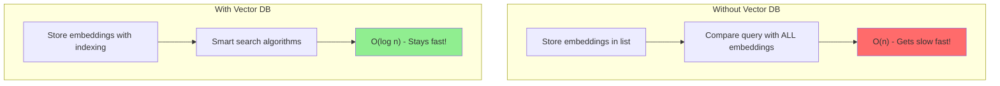
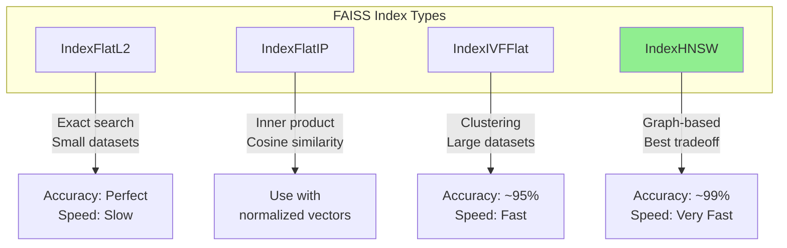
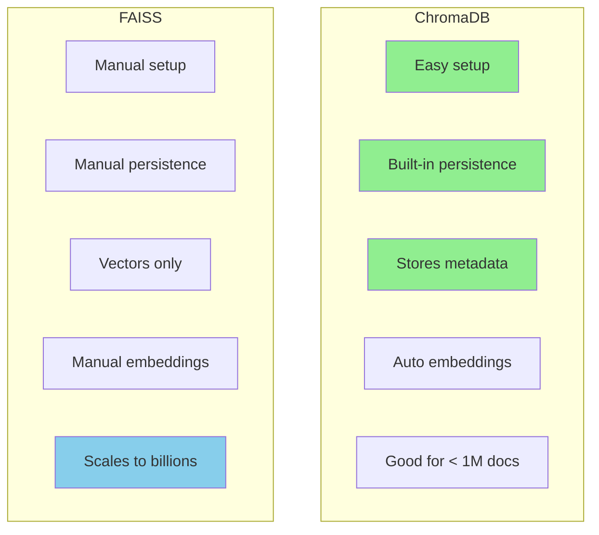
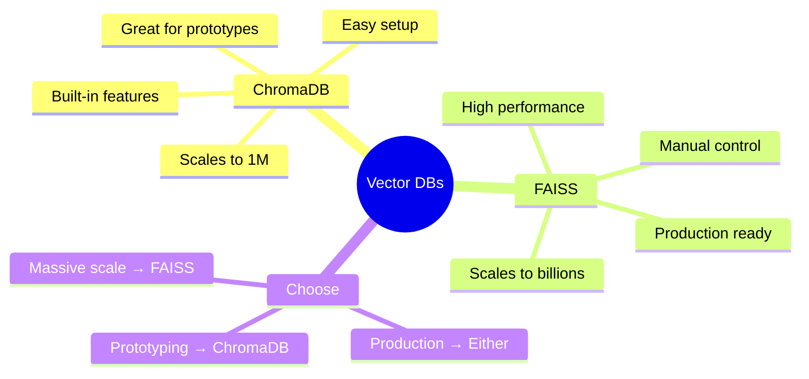

# Setting Up Vector Databases: ChromaDB and FAISS

You can generate embeddings and compare them - now where do you store them? For a few hundred documents, a Python list works fine. For thousands or millions, you need a **vector database**. Let's learn two popular options: **ChromaDB** and **FAISS**.

> **Coming from Software Engineering?** Vector databases are like Redis for semantic search. If you've set up Elasticsearch, Redis, or any specialized data store, ChromaDB and FAISS follow the same pattern: install, configure, index data, query. The key difference is you're indexing vectors instead of keywords.

---

## Why Vector Databases?



### Performance Comparison

| Documents | Naive Search | Vector DB Search |
|-----------|--------------|------------------|
| 1,000 | 50ms | 5ms |
| 10,000 | 500ms | 10ms |
| 100,000 | 5s | 20ms |
| 1,000,000 | 50s | 50ms |

---

## ChromaDB: The Easy Choice

ChromaDB is designed for simplicity. It's perfect for getting started and works great for most applications.

### Installation

```bash
pip install chromadb
```

### Basic Setup

```python
import chromadb

# Create an ephemeral client (in-memory)
client = chromadb.EphemeralClient()

# Create a collection (like a table)
collection = client.create_collection(
    name="my_documents",
    metadata={"hnsw:space": "cosine"}  # Use cosine similarity
)

print("Collection created!")
print(f"Name: {collection.name}")
```

### Persistent Storage

```python
import chromadb

# Persist data to disk
client = chromadb.PersistentClient(path="./chroma_db")

# Get or create collection
collection = client.get_or_create_collection(name="my_documents")

print(f"Data will be saved to ./chroma_db")
```

### Adding Documents

```python
import chromadb
from openai import OpenAI

chroma_client = chromadb.PersistentClient(path="./chroma_db")
openai_client = OpenAI()

collection = chroma_client.get_or_create_collection(name="documents")

def add_documents(documents: list[str], ids: list[str] = None):
    """Add documents to ChromaDB."""

    # Generate IDs if not provided
    if ids is None:
        ids = [f"doc_{i}" for i in range(len(documents))]

    # Get embeddings from OpenAI
    response = openai_client.embeddings.create(
        model="text-embedding-3-small",
        input=documents
    )
    embeddings = [d.embedding for d in sorted(response.data, key=lambda x: x.index)]

    # Add to collection
    collection.add(
        ids=ids,
        embeddings=embeddings,
        documents=documents,
        metadatas=[{"source": "manual"} for _ in documents]
    )

    print(f"Added {len(documents)} documents")

# Example
documents = [
    "Python is a great programming language",
    "Machine learning uses algorithms to learn from data",
    "The Eiffel Tower is in Paris",
    "JavaScript runs in web browsers",
    "Pizza originated in Italy"
]

add_documents(documents)
```

### ChromaDB with Built-in Embeddings

ChromaDB can generate embeddings automatically:

```python
import chromadb

# Uses sentence-transformers by default
client = chromadb.PersistentClient(path="./chroma_db")
collection = client.get_or_create_collection(name="auto_embed")

# Just add documents - embeddings generated automatically!
collection.add(
    ids=["doc1", "doc2", "doc3"],
    documents=[
        "Python programming",
        "Machine learning basics",
        "Cooking recipes"
    ]
)

# Query with text - also auto-embedded!
results = collection.query(
    query_texts=["How do I code?"],
    n_results=2
)

print(results["documents"])
```

---

## FAISS: The Performance Choice

FAISS (Facebook AI Similarity Search) is optimized for speed and scale. It's more manual but blazingly fast.

### Installation

```bash
pip install faiss-cpu
# Or for GPU support:
# pip install faiss-gpu
```

### Basic Setup

```python
import faiss
import numpy as np

# Define embedding dimension
dimension = 1536  # OpenAI text-embedding-3-small

# Create index
index = faiss.IndexFlatL2(dimension)  # L2 = Euclidean distance

print(f"Index created")
print(f"Dimension: {index.d}")
print(f"Total vectors: {index.ntotal}")
```

### Index Types



### Adding Vectors

```python
import faiss
import numpy as np
from openai import OpenAI

openai_client = OpenAI()

# Create index
dimension = 1536
index = faiss.IndexFlatL2(dimension)

# Document storage (FAISS only stores vectors, not text!)
documents = []

def add_to_faiss(texts: list[str]):
    """Add documents to FAISS index."""
    global documents

    # Get embeddings
    response = openai_client.embeddings.create(
        model="text-embedding-3-small",
        input=texts
    )
    embeddings = [d.embedding for d in sorted(response.data, key=lambda x: x.index)]

    # Convert to numpy array (FAISS requirement)
    vectors = np.array(embeddings).astype('float32')

    # Add to index
    index.add(vectors)

    # Store documents separately
    documents.extend(texts)

    print(f"Added {len(texts)} vectors. Total: {index.ntotal}")

# Example
sample_docs = [
    "Python programming basics",
    "Machine learning fundamentals",
    "Web development with JavaScript",
    "Data science with Python",
    "Deep learning neural networks"
]

add_to_faiss(sample_docs)
```

### Searching FAISS

```python
def search_faiss(query: str, k: int = 3) -> list[tuple]:
    """Search FAISS index."""

    # Get query embedding
    response = openai_client.embeddings.create(
        model="text-embedding-3-small",
        input=query
    )
    query_vector = np.array([response.data[0].embedding]).astype('float32')

    # Search
    distances, indices = index.search(query_vector, k)

    # Return documents with distances
    results = []
    for dist, idx in zip(distances[0], indices[0]):
        if idx < len(documents):  # Valid index
            results.append((documents[idx], float(dist)))

    return results

# Search!
results = search_faiss("How do I learn Python?", k=3)

print("Query: 'How do I learn Python?'\n")
for doc, distance in results:
    print(f"  [{distance:.4f}] {doc}")
```

### Saving and Loading FAISS Index

```python
import faiss
import pickle

def save_faiss_index(index, documents, path: str):
    """Save FAISS index and documents."""
    # Save index
    faiss.write_index(index, f"{path}.index")

    # Save documents
    with open(f"{path}.docs", "wb") as f:
        pickle.dump(documents, f)

    print(f"Saved index to {path}")

def load_faiss_index(path: str):
    """Load FAISS index and documents."""
    # Load index
    index = faiss.read_index(f"{path}.index")

    # Load documents
    with open(f"{path}.docs", "rb") as f:
        documents = pickle.load(f)

    print(f"Loaded {index.ntotal} vectors")
    return index, documents

# Usage
save_faiss_index(index, documents, "./my_faiss")
loaded_index, loaded_docs = load_faiss_index("./my_faiss")
```

---

## ChromaDB vs FAISS Comparison



| Feature | ChromaDB | FAISS |
|---------|----------|-------|
| Setup | Very easy | Moderate |
| Persistence | Built-in | Manual |
| Metadata | Yes | No (manual) |
| Auto-embedding | Yes | No |
| Scale | ~1M vectors | Billions |
| Speed | Fast | Very fast |
| Memory | Higher | Lower |
| Best for | Prototypes, small-medium | Production, large scale |

---

## Complete ChromaDB Example

```python
import chromadb
from openai import OpenAI

class VectorStore:
    """Simple vector store using ChromaDB."""

    def __init__(self, collection_name: str, persist_dir: str = "./vectordb"):
        self.chroma = chromadb.PersistentClient(path=persist_dir)
        self.openai = OpenAI()
        self.collection = self.chroma.get_or_create_collection(
            name=collection_name,
            metadata={"hnsw:space": "cosine"}
        )

    def add(self, texts: list[str], ids: list[str] = None, metadata: list[dict] = None):
        """Add texts to the vector store."""
        if ids is None:
            existing = self.collection.count()
            ids = [f"doc_{existing + i}" for i in range(len(texts))]

        if metadata is None:
            metadata = [{}] * len(texts)

        # Get embeddings
        response = self.openai.embeddings.create(
            model="text-embedding-3-small",
            input=texts
        )
        embeddings = [d.embedding for d in sorted(response.data, key=lambda x: x.index)]

        self.collection.add(
            ids=ids,
            embeddings=embeddings,
            documents=texts,
            metadatas=metadata
        )

        return ids

    def search(self, query: str, n_results: int = 5) -> list[dict]:
        """Search for similar documents."""
        # Get query embedding
        response = self.openai.embeddings.create(
            model="text-embedding-3-small",
            input=query
        )
        query_embedding = response.data[0].embedding

        results = self.collection.query(
            query_embeddings=[query_embedding],
            n_results=n_results,
            include=["documents", "metadatas", "distances"]
        )

        # Format results
        formatted = []
        for i in range(len(results["ids"][0])):
            formatted.append({
                "id": results["ids"][0][i],
                "document": results["documents"][0][i],
                "metadata": results["metadatas"][0][i],
                "distance": results["distances"][0][i]
            })

        return formatted

    def count(self) -> int:
        """Get total document count."""
        return self.collection.count()

# Usage
store = VectorStore("my_knowledge_base")

# Add documents
store.add([
    "Python is great for data science",
    "Machine learning models need training data",
    "Neural networks are inspired by the brain"
], metadata=[
    {"topic": "python"},
    {"topic": "ml"},
    {"topic": "dl"}
])

print(f"Total documents: {store.count()}")

# Search
results = store.search("How do I analyze data?")
for r in results:
    print(f"[{r['distance']:.4f}] {r['document']}")
```

---

## Summary



---

## Quick Reference

```python
# ChromaDB Quick Start
import chromadb
client = chromadb.PersistentClient(path="./db")
collection = client.get_or_create_collection("docs")
collection.add(ids=["1"], documents=["text"], embeddings=[[0.1]*1536])
results = collection.query(query_embeddings=[[0.1]*1536], n_results=5)

# FAISS Quick Start
import faiss
import numpy as np
index = faiss.IndexFlatL2(1536)
vectors = np.array([[0.1]*1536]).astype('float32')
index.add(vectors)
distances, indices = index.search(vectors, k=5)
```

---

## What's Next?

Now that you have vector databases set up, let's learn to **Index, Query, and Update** them effectively!
