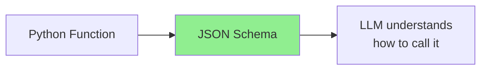
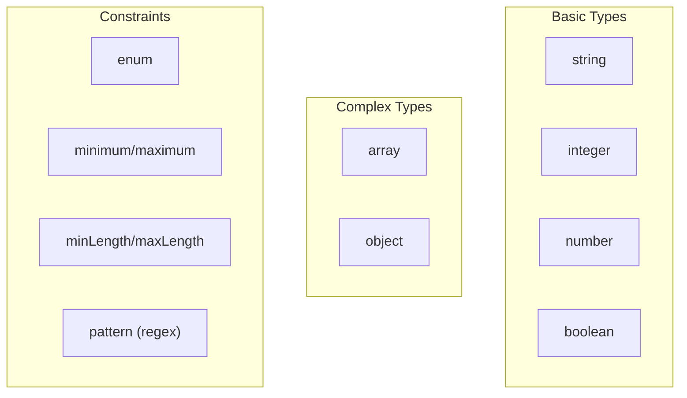
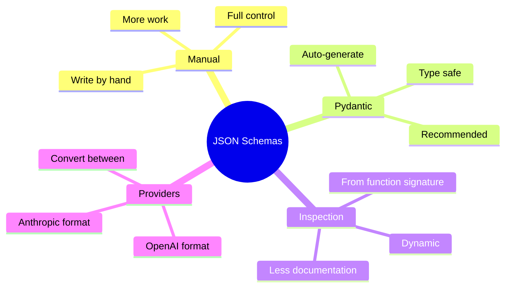

# Generating JSON Schemas for Python Functions

When you want an LLM to call your Python functions, you need to describe those functions in a format the LLM understands: **JSON Schema**. This guide shows you how to create these schemas.

> **Coming from Software Engineering?** JSON Schema generation for tool calling is like writing OpenAPI/Swagger specs for your internal functions. If you've used tools like Pydantic, Marshmallow, or Joi to define and validate API schemas, this is the same skill — just for an AI consumer instead of a frontend.

---

## What is a JSON Schema?

A JSON Schema is a blueprint that describes the structure of JSON data. For function calling, it tells the LLM:
- What the function does
- What parameters it accepts
- What types those parameters should be



---

## Basic Schema Structure

Here's the anatomy of a function schema for OpenAI:

```python
function_schema = {
    "name": "get_weather",           # Function name
    "description": "Get current weather for a city",  # What it does
    "parameters": {                   # Input parameters
        "type": "object",
        "properties": {
            "city": {
                "type": "string",
                "description": "The city name"
            },
            "unit": {
                "type": "string",
                "enum": ["celsius", "fahrenheit"],
                "description": "Temperature unit"
            }
        },
        "required": ["city"]          # Required parameters
    }
}
```

---

## Manual Schema Creation

### Simple Function

```python
# Your Python function
def search_products(query: str, max_results: int = 10) -> list:
    """Search for products in the catalog."""
    # Implementation here
    pass

# The JSON schema for it
search_schema = {
    "name": "search_products",
    "description": "Search for products in the catalog",
    "parameters": {
        "type": "object",
        "properties": {
            "query": {
                "type": "string",
                "description": "Search query for products"
            },
            "max_results": {
                "type": "integer",
                "description": "Maximum number of results to return",
                "default": 10
            }
        },
        "required": ["query"]
    }
}
```

### Function with Complex Types

```python
# Function with nested parameters
def create_event(
    title: str,
    date: str,
    attendees: list,
    location: dict
) -> dict:
    """Create a calendar event."""
    pass

# Schema with nested objects and arrays
event_schema = {
    "name": "create_event",
    "description": "Create a calendar event",
    "parameters": {
        "type": "object",
        "properties": {
            "title": {
                "type": "string",
                "description": "Event title"
            },
            "date": {
                "type": "string",
                "description": "Event date in ISO format (YYYY-MM-DD)"
            },
            "attendees": {
                "type": "array",
                "items": {
                    "type": "string"
                },
                "description": "List of attendee email addresses"
            },
            "location": {
                "type": "object",
                "properties": {
                    "name": {"type": "string"},
                    "address": {"type": "string"},
                    "virtual": {"type": "boolean"}
                },
                "description": "Event location details"
            }
        },
        "required": ["title", "date"]
    }
}
```

---

## Automatic Schema Generation with Pydantic

Let Pydantic generate schemas for you automatically!

```python
from pydantic import BaseModel, Field
from typing import Optional, List
import json

class ProductSearch(BaseModel):
    """Search parameters for products."""
    query: str = Field(description="Search query for products")
    category: Optional[str] = Field(None, description="Filter by category")
    max_price: Optional[float] = Field(None, description="Maximum price filter")
    max_results: int = Field(10, description="Maximum results to return")

# Generate JSON schema automatically
schema = ProductSearch.model_json_schema()
print(json.dumps(schema, indent=2))
```

Output:
```json
{
  "type": "object",
  "properties": {
    "query": {
      "type": "string",
      "description": "Search query for products"
    },
    "category": {
      "type": "string",
      "description": "Filter by category"
    },
    "max_price": {
      "type": "number",
      "description": "Maximum price filter"
    },
    "max_results": {
      "type": "integer",
      "default": 10,
      "description": "Maximum results to return"
    }
  },
  "required": ["query"]
}
```

### Converting Pydantic to OpenAI Format

```python
from pydantic import BaseModel, Field
from typing import Optional, List, get_type_hints
import inspect

def pydantic_to_openai_schema(model: type[BaseModel], func_name: str, description: str) -> dict:
    """Convert a Pydantic model to OpenAI function schema format."""

    schema = model.model_json_schema()

    # Remove Pydantic-specific fields
    schema.pop("title", None)

    return {
        "name": func_name,
        "description": description,
        "parameters": schema
    }

# Usage
class WeatherParams(BaseModel):
    city: str = Field(description="City name")
    unit: str = Field("celsius", description="Temperature unit")

openai_schema = pydantic_to_openai_schema(
    WeatherParams,
    "get_weather",
    "Get current weather for a city"
)

print(json.dumps(openai_schema, indent=2))
```

---

## Schema Generation from Function Signatures

Automatically generate schemas by inspecting Python functions:

```python
import inspect
from typing import get_type_hints, Optional, List, Dict, Any
import json

def generate_schema_from_function(func) -> dict:
    """
    Generate JSON schema from a Python function's signature and docstring.
    """

    # Get function name and docstring
    name = func.__name__
    description = func.__doc__ or f"Function {name}"

    # Get type hints
    hints = get_type_hints(func)

    # Get signature for defaults
    sig = inspect.signature(func)

    # Map Python types to JSON Schema types
    type_map = {
        str: "string",
        int: "integer",
        float: "number",
        bool: "boolean",
        list: "array",
        dict: "object",
        List: "array",
        Dict: "object",
    }

    properties = {}
    required = []

    for param_name, param in sig.parameters.items():
        if param_name == "return":
            continue

        # Get type
        param_type = hints.get(param_name, Any)
        json_type = type_map.get(param_type, "string")

        # Handle Optional types
        if hasattr(param_type, "__origin__"):
            if param_type.__origin__ is list:
                json_type = "array"
            elif param_type.__origin__ is dict:
                json_type = "object"

        properties[param_name] = {
            "type": json_type,
            "description": f"Parameter {param_name}"
        }

        # Check if required (no default value)
        if param.default == inspect.Parameter.empty:
            required.append(param_name)
        else:
            properties[param_name]["default"] = param.default

    return {
        "name": name,
        "description": description.strip(),
        "parameters": {
            "type": "object",
            "properties": properties,
            "required": required
        }
    }

# Example usage
def send_email(to: str, subject: str, body: str, cc: List[str] = None) -> bool:
    """Send an email to the specified recipient."""
    pass

schema = generate_schema_from_function(send_email)
print(json.dumps(schema, indent=2))
```

---

## Advanced: Decorator-Based Schema Generation

Create a decorator that automatically registers schemas:

```python
from functools import wraps
from typing import Callable, Dict, Any
import json

# Global registry of function schemas
FUNCTION_REGISTRY: Dict[str, dict] = {}

def tool(description: str = None):
    """
    Decorator to register a function as an LLM tool.

    Usage:
        @tool("Search for products in the catalog")
        def search_products(query: str, limit: int = 10):
            ...
    """
    def decorator(func: Callable) -> Callable:
        # Generate schema
        schema = generate_schema_from_function(func)
        if description:
            schema["description"] = description

        # Register the function
        FUNCTION_REGISTRY[func.__name__] = {
            "schema": schema,
            "function": func
        }

        @wraps(func)
        def wrapper(*args, **kwargs):
            return func(*args, **kwargs)

        return wrapper
    return decorator

def get_all_schemas() -> list:
    """Get all registered function schemas."""
    return [entry["schema"] for entry in FUNCTION_REGISTRY.values()]

def get_function(name: str) -> Callable:
    """Get a registered function by name."""
    return FUNCTION_REGISTRY.get(name, {}).get("function")

# Usage
@tool("Get current weather for a location")
def get_weather(city: str, unit: str = "celsius") -> dict:
    """Fetch weather data."""
    return {"city": city, "temp": 22, "unit": unit}

@tool("Search for restaurants nearby")
def find_restaurants(location: str, cuisine: str = None, max_results: int = 5) -> list:
    """Find restaurants near a location."""
    return [{"name": "Restaurant A", "cuisine": cuisine}]

# Get all schemas for the API call
all_tools = get_all_schemas()
print(json.dumps(all_tools, indent=2))
```

---

## Provider-Specific Formats

Different LLM providers use slightly different formats:

### OpenAI Format

```python
openai_tools = [
    {
        "type": "function",
        "function": {
            "name": "get_weather",
            "description": "Get weather for a city",
            "parameters": {
                "type": "object",
                "properties": {
                    "city": {"type": "string"}
                },
                "required": ["city"]
            }
        }
    }
]
```

### Anthropic Format

```python
anthropic_tools = [
    {
        "name": "get_weather",
        "description": "Get weather for a city",
        "input_schema": {
            "type": "object",
            "properties": {
                "city": {"type": "string", "description": "City name"}
            },
            "required": ["city"]
        }
    }
]
```

### Conversion Helper

```python
def convert_schema(schema: dict, target: str) -> dict:
    """Convert schema between provider formats."""

    if target == "openai":
        return {
            "type": "function",
            "function": {
                "name": schema["name"],
                "description": schema["description"],
                "parameters": schema["parameters"]
            }
        }

    elif target == "anthropic":
        return {
            "name": schema["name"],
            "description": schema["description"],
            "input_schema": schema["parameters"]
        }

    return schema

# Usage
base_schema = {
    "name": "get_weather",
    "description": "Get weather",
    "parameters": {"type": "object", "properties": {"city": {"type": "string"}}}
}

openai_format = convert_schema(base_schema, "openai")
anthropic_format = convert_schema(base_schema, "anthropic")
```

---

## Common JSON Schema Types



### Type Examples

```python
schema_examples = {
    # String with enum
    "status": {
        "type": "string",
        "enum": ["pending", "active", "completed"],
        "description": "Current status"
    },

    # Number with range
    "rating": {
        "type": "number",
        "minimum": 0,
        "maximum": 5,
        "description": "Rating from 0 to 5"
    },

    # String with pattern
    "email": {
        "type": "string",
        "pattern": "^[a-zA-Z0-9_.+-]+@[a-zA-Z0-9-]+\\.[a-zA-Z0-9-.]+$",
        "description": "Email address"
    },

    # Array with typed items
    "tags": {
        "type": "array",
        "items": {"type": "string"},
        "minItems": 1,
        "maxItems": 10,
        "description": "List of tags"
    },

    # Nested object
    "address": {
        "type": "object",
        "properties": {
            "street": {"type": "string"},
            "city": {"type": "string"},
            "zip": {"type": "string"}
        },
        "required": ["city"]
    }
}
```

---

## Summary



---

## Quick Reference

```python
# Manual schema
schema = {
    "name": "func_name",
    "description": "What it does",
    "parameters": {
        "type": "object",
        "properties": {
            "param": {"type": "string", "description": "..."}
        },
        "required": ["param"]
    }
}

# Pydantic auto-generation
class Params(BaseModel):
    param: str = Field(description="...")

schema = Params.model_json_schema()

# Function inspection
schema = generate_schema_from_function(my_func)
```

---

## What's Next?

Now that you can generate schemas, let's learn how to **execute tool calls and return results** back to the LLM!
