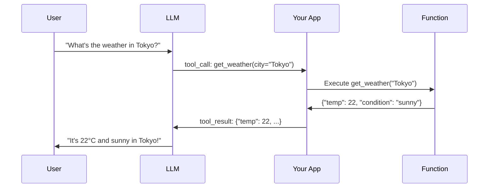

# Parsing Tool Calls, Executing Functions & Returning Results

The LLM has decided to call your function. Now what? This guide covers the complete flow: parsing the tool call, executing your Python function, and returning the result back to the LLM.

> **Coming from Software Engineering?** The tool execution loop (LLM requests → parse → execute → return) is just an event-driven message bus pattern. If you've built command handlers, message queues, or event sourcing systems, you'll recognize this: receive a message (tool call), dispatch to handler (function), return result.

---

## The Tool Calling Flow



---

## Step 1: Detect Tool Calls

When the LLM wants to call a function, it returns a special response:

```python
from openai import OpenAI
import json

client = OpenAI()

# Define your tools
tools = [
    {
        "type": "function",
        "function": {
            "name": "get_weather",
            "description": "Get current weather for a city",
            "parameters": {
                "type": "object",
                "properties": {
                    "city": {"type": "string", "description": "City name"},
                    "unit": {"type": "string", "enum": ["celsius", "fahrenheit"]}
                },
                "required": ["city"]
            }
        }
    }
]

# Make the API call
response = client.chat.completions.create(
    model="gpt-4o",
    messages=[{"role": "user", "content": "What's the weather in Tokyo?"}],
    tools=tools
)

message = response.choices[0].message

# Check if LLM wants to call a tool
if message.tool_calls:
    print("LLM wants to call tools!")
    for tool_call in message.tool_calls:
        print(f"  Function: {tool_call.function.name}")
        print(f"  Arguments: {tool_call.function.arguments}")
else:
    print("No tool calls, regular response:", message.content)
```

---

## Step 2: Parse the Tool Call

Extract the function name and arguments:

```python
def parse_tool_call(tool_call) -> dict:
    """
    Parse a tool call from the LLM response.

    Returns:
        dict with 'id', 'name', and 'arguments'
    """
    return {
        "id": tool_call.id,
        "name": tool_call.function.name,
        "arguments": json.loads(tool_call.function.arguments)
    }

# Usage
if message.tool_calls:
    for tool_call in message.tool_calls:
        parsed = parse_tool_call(tool_call)
        print(f"Call ID: {parsed['id']}")
        print(f"Function: {parsed['name']}")
        print(f"Arguments: {parsed['arguments']}")
```

---

## Step 3: Execute the Function

Map function names to actual Python functions and execute:

```python
# Define your actual functions
def get_weather(city: str, unit: str = "celsius") -> dict:
    """Get weather for a city (mock implementation)."""
    # In real code, call a weather API
    weather_data = {
        "Tokyo": {"temp": 22, "condition": "sunny"},
        "London": {"temp": 15, "condition": "cloudy"},
        "New York": {"temp": 18, "condition": "rainy"}
    }

    data = weather_data.get(city, {"temp": 20, "condition": "unknown"})

    if unit == "fahrenheit":
        data["temp"] = data["temp"] * 9/5 + 32

    data["unit"] = unit
    data["city"] = city
    return data

def search_web(query: str) -> str:
    """Search the web (mock implementation)."""
    return f"Search results for: {query}"

# Function registry
FUNCTIONS = {
    "get_weather": get_weather,
    "search_web": search_web
}

def execute_function(name: str, arguments: dict) -> any:
    """Execute a function by name with given arguments."""

    if name not in FUNCTIONS:
        raise ValueError(f"Unknown function: {name}")

    func = FUNCTIONS[name]
    return func(**arguments)

# Usage
result = execute_function("get_weather", {"city": "Tokyo", "unit": "celsius"})
print(result)  # {"temp": 22, "condition": "sunny", "unit": "celsius", "city": "Tokyo"}
```

---

## Step 4: Return Results to the LLM

Send the function result back so the LLM can formulate a response:

```python
def complete_tool_call(client, messages: list, tools: list) -> str:
    """
    Complete the full tool calling cycle.

    Returns the final text response from the LLM.
    """

    # Step 1: Initial request
    response = client.chat.completions.create(
        model="gpt-4o",
        messages=messages,
        tools=tools
    )

    message = response.choices[0].message

    # Step 2: Check for tool calls
    if not message.tool_calls:
        return message.content

    # Step 3: Add assistant message to history
    messages.append(message)

    # Step 4: Execute each tool call and add results
    for tool_call in message.tool_calls:
        parsed = parse_tool_call(tool_call)

        try:
            # Execute the function
            result = execute_function(parsed["name"], parsed["arguments"])
            result_str = json.dumps(result)
        except Exception as e:
            result_str = json.dumps({"error": str(e)})

        # Add tool result to messages
        messages.append({
            "role": "tool",
            "tool_call_id": tool_call.id,
            "content": result_str
        })

    # Step 5: Get final response from LLM
    final_response = client.chat.completions.create(
        model="gpt-4o",
        messages=messages,
        tools=tools
    )

    return final_response.choices[0].message.content

# Usage
messages = [{"role": "user", "content": "What's the weather in Tokyo?"}]
answer = complete_tool_call(client, messages, tools)
print(answer)  # "The current weather in Tokyo is 22°C and sunny!"
```

---

## Complete Example: Multi-Tool Agent

```python
from openai import OpenAI
import json
from datetime import datetime

client = OpenAI()

# Define multiple tools
def get_weather(city: str) -> dict:
    """Get weather for a city."""
    return {"city": city, "temp": 22, "condition": "sunny"}

def get_time(timezone: str = "UTC") -> dict:
    """Get current time in a timezone."""
    return {"timezone": timezone, "time": datetime.now().isoformat()}

def calculate(expression: str) -> dict:
    """Evaluate a math expression safely (no eval!)."""
    import ast, operator
    try:
        def safe_eval(node):
            if isinstance(node, ast.Constant): return node.value
            elif isinstance(node, ast.BinOp):
                ops = {ast.Add: operator.add, ast.Sub: operator.sub,
                       ast.Mult: operator.mul, ast.Div: operator.truediv}
                return ops[type(node.op)](safe_eval(node.left), safe_eval(node.right))
            elif isinstance(node, ast.UnaryOp) and isinstance(node.op, ast.USub):
                return -safe_eval(node.operand)
            raise ValueError("Unsupported expression")
        result = safe_eval(ast.parse(expression, mode='eval').body)
        return {"expression": expression, "result": result}
    except Exception as e:
        return {"error": str(e)}

# Tool registry
TOOLS = {
    "get_weather": get_weather,
    "get_time": get_time,
    "calculate": calculate
}

# Tool schemas
TOOL_SCHEMAS = [
    {
        "type": "function",
        "function": {
            "name": "get_weather",
            "description": "Get current weather for a city",
            "parameters": {
                "type": "object",
                "properties": {
                    "city": {"type": "string", "description": "City name"}
                },
                "required": ["city"]
            }
        }
    },
    {
        "type": "function",
        "function": {
            "name": "get_time",
            "description": "Get current time in a timezone",
            "parameters": {
                "type": "object",
                "properties": {
                    "timezone": {"type": "string", "description": "Timezone name"}
                },
                "required": []
            }
        }
    },
    {
        "type": "function",
        "function": {
            "name": "calculate",
            "description": "Evaluate a mathematical expression",
            "parameters": {
                "type": "object",
                "properties": {
                    "expression": {"type": "string", "description": "Math expression"}
                },
                "required": ["expression"]
            }
        }
    }
]

class ToolAgent:
    """Agent that can use multiple tools."""

    def __init__(self):
        self.client = OpenAI()
        self.messages = []

    def chat(self, user_message: str) -> str:
        """Process a user message, potentially using tools."""

        self.messages.append({"role": "user", "content": user_message})

        # Keep processing until we get a final response
        while True:
            response = self.client.chat.completions.create(
                model="gpt-4o",
                messages=self.messages,
                tools=TOOL_SCHEMAS
            )

            message = response.choices[0].message

            # No tool calls - we have our answer
            if not message.tool_calls:
                self.messages.append(message)
                return message.content

            # Process tool calls
            self.messages.append(message)

            for tool_call in message.tool_calls:
                name = tool_call.function.name
                args = json.loads(tool_call.function.arguments)

                print(f"  [Calling {name}({args})]")

                # Execute tool
                if name in TOOLS:
                    result = TOOLS[name](**args)
                else:
                    result = {"error": f"Unknown tool: {name}"}

                # Add result to messages
                self.messages.append({
                    "role": "tool",
                    "tool_call_id": tool_call.id,
                    "content": json.dumps(result)
                })

# Usage
agent = ToolAgent()

print(agent.chat("What's the weather in Paris?"))
print()
print(agent.chat("What's 15% of 230?"))
print()
print(agent.chat("What time is it in Tokyo timezone?"))
```

---
