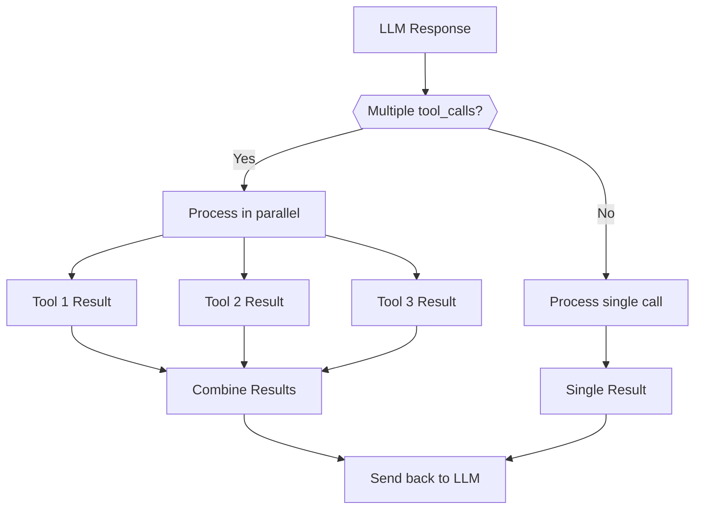
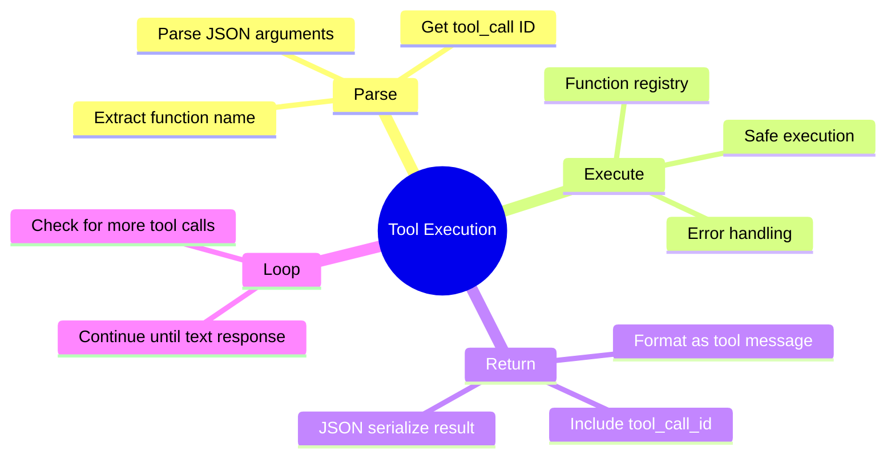

# Day 38: Tool Execution — Part 2: Parallel Calls & Error Recovery

> **Coming from Software Engineering?** Handling multiple tool calls and errors is like building a job queue with retry logic. If you've worked with Celery, Sidekiq, or AWS SQS, the patterns — parallel execution, error isolation, result aggregation — are directly transferable. The LLM is just another task orchestrator.

## Handling Multiple Tool Calls

The LLM might want to call multiple tools at once:

```python
def handle_parallel_tool_calls(message, functions: dict) -> list:
    """
    Handle multiple tool calls from a single LLM response.

    Returns list of tool results to send back.
    """
    results = []

    for tool_call in message.tool_calls:
        name = tool_call.function.name
        args = json.loads(tool_call.function.arguments)

        try:
            if name in functions:
                result = functions[name](**args)
            else:
                result = {"error": f"Function {name} not found"}
        except Exception as e:
            result = {"error": str(e)}

        results.append({
            "role": "tool",
            "tool_call_id": tool_call.id,
            "content": json.dumps(result)
        })

    return results

# Example: LLM calls both get_weather and get_time
# Response would contain two tool_calls
# We process both and return both results
```



---

## Error Handling

Always handle errors gracefully:

```python
def safe_execute_tool(name: str, args: dict, functions: dict) -> dict:
    """
    Safely execute a tool with comprehensive error handling.
    """

    # Check if function exists
    if name not in functions:
        return {
            "success": False,
            "error": f"Unknown function: {name}",
            "error_type": "function_not_found"
        }

    func = functions[name]

    try:
        # Validate arguments against function signature
        import inspect
        sig = inspect.signature(func)

        # Check for missing required arguments
        for param_name, param in sig.parameters.items():
            if param.default == inspect.Parameter.empty:
                if param_name not in args:
                    return {
                        "success": False,
                        "error": f"Missing required argument: {param_name}",
                        "error_type": "missing_argument"
                    }

        # Execute the function
        result = func(**args)

        return {
            "success": True,
            "result": result
        }

    except TypeError as e:
        return {
            "success": False,
            "error": f"Invalid arguments: {str(e)}",
            "error_type": "invalid_arguments"
        }
    except Exception as e:
        return {
            "success": False,
            "error": f"Execution error: {str(e)}",
            "error_type": "execution_error"
        }

# Usage
result = safe_execute_tool("get_weather", {"city": "Tokyo"}, TOOLS)

if result["success"]:
    print(f"Result: {result['result']}")
else:
    print(f"Error ({result['error_type']}): {result['error']}")
```

---

## Anthropic Tool Calling

Anthropic uses a slightly different format:

```python
from anthropic import Anthropic

client = Anthropic()

# Define tools in Anthropic format
tools = [
    {
        "name": "get_weather",
        "description": "Get current weather for a city",
        "input_schema": {
            "type": "object",
            "properties": {
                "city": {"type": "string", "description": "City name"}
            },
            "required": ["city"]
        }
    }
]

# Make request
response = client.messages.create(
    model="claude-sonnet-4-5",
    max_tokens=1024,
    tools=tools,
    messages=[{"role": "user", "content": "What's the weather in Tokyo?"}]
)

# Check for tool use
for block in response.content:
    if block.type == "tool_use":
        print(f"Tool: {block.name}")
        print(f"Input: {block.input}")
        print(f"ID: {block.id}")

        # Execute and return result
        result = get_weather(**block.input)

        # Continue conversation with tool result
        follow_up = client.messages.create(
            model="claude-sonnet-4-5",
            max_tokens=1024,
            tools=tools,
            messages=[
                {"role": "user", "content": "What's the weather in Tokyo?"},
                {"role": "assistant", "content": response.content},
                {
                    "role": "user",
                    "content": [
                        {
                            "type": "tool_result",
                            "tool_use_id": block.id,
                            "content": json.dumps(result)
                        }
                    ]
                }
            ]
        )

        print(follow_up.content[0].text)
```

---

## Summary



---

## Quick Reference

```python
# Parse tool call
name = tool_call.function.name
args = json.loads(tool_call.function.arguments)

# Execute function
result = FUNCTIONS[name](**args)

# Return to LLM
messages.append({
    "role": "tool",
    "tool_call_id": tool_call.id,
    "content": json.dumps(result)
})

# Get final response
response = client.chat.completions.create(
    model="gpt-4o",
    messages=messages,
    tools=tools
)
```

---

## Timeout Handling for Tool Calls

Tools can hang — a web request times out, a database query runs forever. Always wrap tool execution with timeouts:

```python
import asyncio
import concurrent.futures
from typing import Any

def execute_tool_with_timeout(
    func: callable,
    args: dict,
    timeout_seconds: float = 30.0
) -> dict:
    """Execute a tool function with a timeout."""
    with concurrent.futures.ThreadPoolExecutor(max_workers=1) as executor:
        future = executor.submit(func, **args)
        try:
            result = future.result(timeout=timeout_seconds)
            return {"status": "success", "result": result}
        except concurrent.futures.TimeoutError:
            future.cancel()
            return {
                "status": "timeout",
                "error": f"Tool execution timed out after {timeout_seconds}s"
            }
        except Exception as e:
            return {"status": "error", "error": str(e)}

# Usage in your tool dispatch loop
def dispatch_tool_call(tool_name: str, arguments: dict, functions: dict) -> str:
    """Dispatch a tool call with timeout and error handling."""
    if tool_name not in functions:
        return f"Error: Unknown tool '{tool_name}'"

    result = execute_tool_with_timeout(
        functions[tool_name],
        arguments,
        timeout_seconds=30.0
    )

    if result["status"] == "success":
        return str(result["result"])
    else:
        return f"Tool error ({result['status']}): {result['error']}"
```

---

## Error Categorization: Transient vs. Permanent

Not all errors are equal. Transient errors (rate limits, network timeouts) should be retried. Permanent errors (invalid arguments, missing resources) should not.

```python
from enum import Enum

class ErrorType(Enum):
    TRANSIENT = "transient"   # Retry these
    PERMANENT = "permanent"   # Don't retry — fix the input
    UNKNOWN = "unknown"       # Retry once, then fail

def categorize_error(error: Exception) -> ErrorType:
    """Classify an error as transient or permanent."""
    transient_indicators = [
        "rate limit", "timeout", "connection", "503", "429",
        "temporarily unavailable", "retry"
    ]
    permanent_indicators = [
        "not found", "invalid", "unauthorized", "403", "404",
        "missing required", "bad request", "400"
    ]

    error_msg = str(error).lower()

    if any(indicator in error_msg for indicator in permanent_indicators):
        return ErrorType.PERMANENT
    if any(indicator in error_msg for indicator in transient_indicators):
        return ErrorType.TRANSIENT
    return ErrorType.UNKNOWN

def execute_with_smart_retry(
    func: callable,
    args: dict,
    max_retries: int = 3
) -> dict:
    """Execute with retry only for transient errors."""
    import time

    for attempt in range(max_retries):
        try:
            result = func(**args)
            return {"status": "success", "result": result, "attempts": attempt + 1}
        except Exception as e:
            error_type = categorize_error(e)

            if error_type == ErrorType.PERMANENT:
                return {"status": "permanent_error", "error": str(e)}

            if attempt < max_retries - 1:
                wait_time = 2 ** attempt  # Exponential backoff
                time.sleep(wait_time)
            else:
                return {"status": "failed_after_retries", "error": str(e),
                        "attempts": attempt + 1}
```

---

## Quick Recap

| Pattern | When to Use | Key Takeaway |
|---------|-------------|--------------|
| Parallel tool calls | LLM requests multiple tools at once | Process all, return all results together |
| Timeout handling | Any tool that makes external calls | Always set a timeout — never let tools hang |
| Error categorization | Deciding whether to retry | Retry transient, fail fast on permanent |
| Smart retry | Production tool execution | Exponential backoff + error classification |

---

## What's Next?

You've mastered tool calling! Next up: **Cost Engineering for LLMs** — understanding what all these API calls actually cost and how to build systems that stay within budget.
