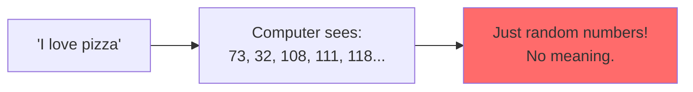
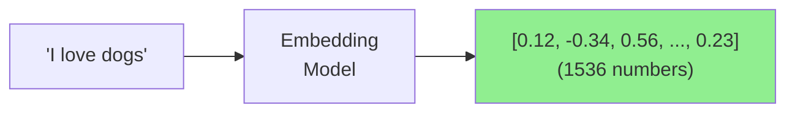
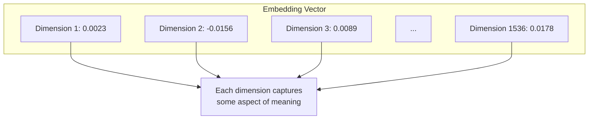
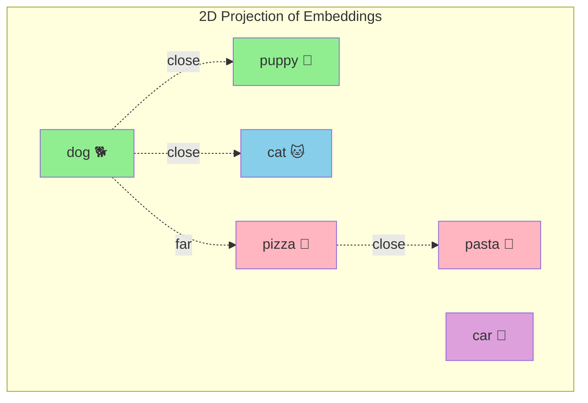
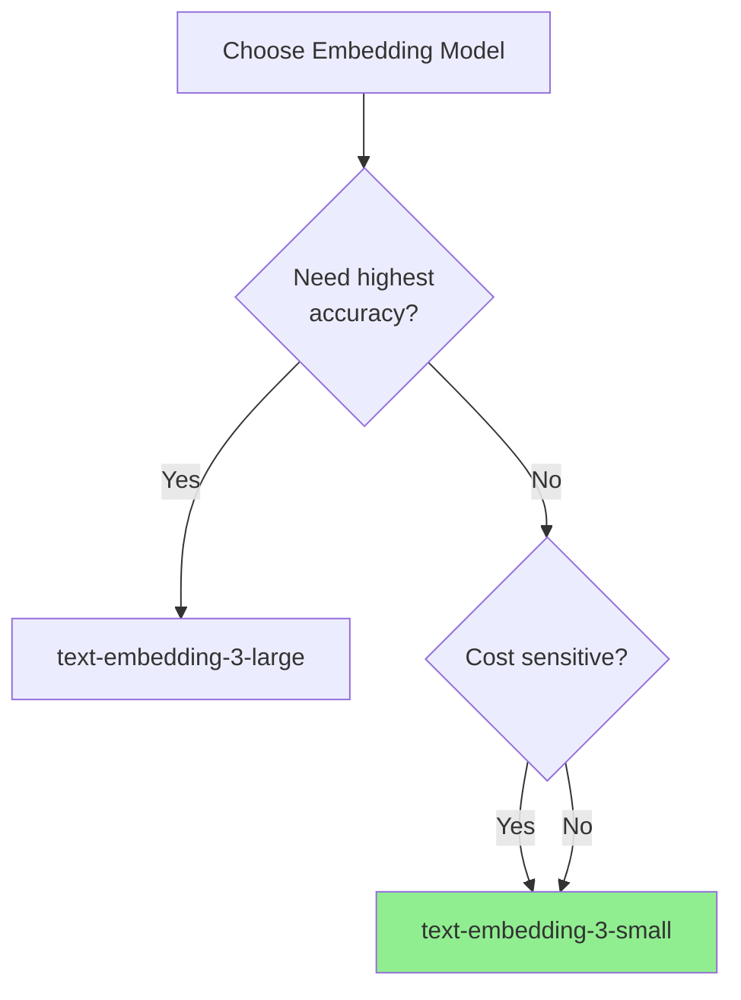
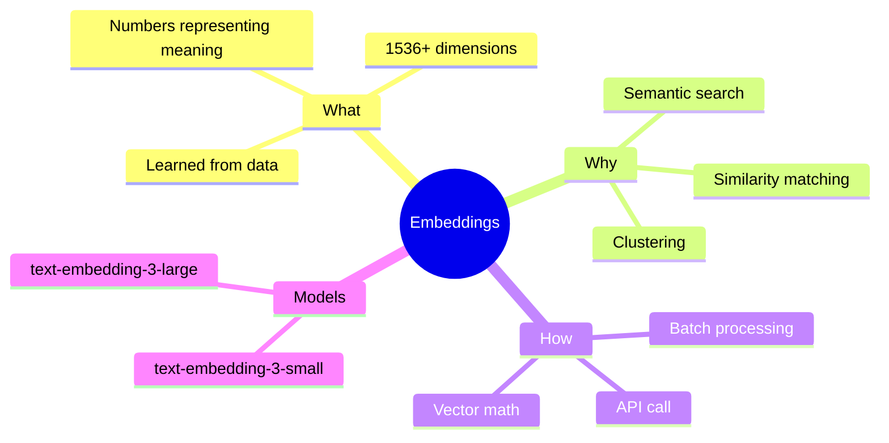

# What Are Embeddings?

Welcome to Month 2! We're about to unlock one of the most powerful concepts in AI: **embeddings**. These magical arrays of numbers allow computers to understand meaning, find similar content, and power search engines that actually understand what you're looking for.

> **Coming from Software Engineering?** Embeddings are like hash functions for meaning. Just as a hash maps data to a fixed-size number, an embedding maps text to a fixed-size vector — but preserving semantic similarity. If you've built search with TF-IDF or feature engineering for ML models, embeddings are the modern, learned version of those features.

---

## The Problem: Computers Don't Understand Text



When a computer sees text, it only sees character codes. It has no idea that:
- "dog" and "puppy" are related
- "happy" and "sad" are opposites
- "king" and "queen" share a relationship

**Embeddings solve this!**

---

## What is an Embedding?

An embedding is a way to represent text (or images, or any data) as a **list of numbers** that captures its **meaning**.



### The Key Insight

**Similar meanings = Similar numbers!**

```python
# script_id: day_019_what_are_embeddings/conceptual_similarity
# Conceptual example
embedding_dog = [0.8, 0.3, -0.5, 0.2, ...]
embedding_puppy = [0.79, 0.31, -0.48, 0.19, ...]  # Very similar!
embedding_pizza = [0.1, -0.7, 0.9, -0.4, ...]     # Very different!
```

---

## Why Embeddings Are Powerful

### Real-World Applications

| Use Case | How Embeddings Help |
|----------|---------------------|
| Search | Find documents about "cars" when user searches "automobiles" |
| Recommendations | Show similar products/articles |
| Deduplication | Find near-duplicate content |
| Clustering | Group similar support tickets |
| Anomaly Detection | Find unusual patterns |

---

## Generating Embeddings with OpenAI

```python
# script_id: day_019_what_are_embeddings/generate_embedding
from openai import OpenAI

client = OpenAI()

def get_embedding(text: str) -> list[float]:
    """Convert text to an embedding vector."""
    response = client.embeddings.create(
        model="text-embedding-3-small",
        input=text
    )
    return response.data[0].embedding

# Let's try it!
text = "I love programming in Python"
embedding = get_embedding(text)

print(f"Text: {text}")
print(f"Embedding dimensions: {len(embedding)}")
print(f"First 10 values: {embedding[:10]}")
```

**Output:**
```
Text: I love programming in Python
Embedding dimensions: 1536
First 10 values: [0.0023, -0.0156, 0.0089, -0.0234, 0.0178, ...]
```

### Understanding the Output



Each of the 1536 numbers represents something about the text's meaning. We don't know exactly what each dimension represents (it's learned during training), but together they form a "fingerprint" of the text's meaning.

---

## Comparing Embeddings: The Magic

The real power comes from comparing embeddings:

```python
# script_id: day_019_what_are_embeddings/compare_embeddings
from openai import OpenAI
import numpy as np

client = OpenAI()

def get_embedding(text: str) -> list[float]:
    response = client.embeddings.create(
        model="text-embedding-3-small",
        input=text
    )
    return response.data[0].embedding

def cosine_similarity(a: list, b: list) -> float:
    """Calculate cosine similarity between two vectors."""
    a = np.array(a)
    b = np.array(b)
    return np.dot(a, b) / (np.linalg.norm(a) * np.linalg.norm(b))

# Compare some texts
texts = [
    "I love dogs",
    "I adore puppies",
    "I enjoy pizza",
    "Machine learning is fascinating"
]

# Get all embeddings
embeddings = {text: get_embedding(text) for text in texts}

# Compare first text with all others
base_text = texts[0]
print(f"Comparing with: '{base_text}'\n")

for text in texts[1:]:
    similarity = cosine_similarity(embeddings[base_text], embeddings[text])
    print(f"'{text}': {similarity:.4f}")
```

**Output:**
```
Comparing with: 'I love dogs'

'I adore puppies': 0.9234      # Very similar! (dogs ≈ puppies)
'I enjoy pizza': 0.7123        # Somewhat similar (both positive statements)
'Machine learning is fascinating': 0.4567  # Not very similar
```

---

## Visualizing Embeddings

Embeddings exist in high-dimensional space, but we can project them to 2D to visualize:



```python
# script_id: day_019_what_are_embeddings/visualize_embeddings
# Visualization with matplotlib (requires: pip install matplotlib scikit-learn)
from openai import OpenAI
import numpy as np
import matplotlib.pyplot as plt
from sklearn.manifold import TSNE

client = OpenAI()

def visualize_embeddings(texts: list[str]):
    """Visualize embeddings in 2D space."""
    # Get embeddings
    embeddings = []
    for text in texts:
        response = client.embeddings.create(
            model="text-embedding-3-small",
            input=text
        )
        embeddings.append(response.data[0].embedding)

    embeddings = np.array(embeddings)

    # Reduce to 2D using t-SNE
    tsne = TSNE(n_components=2, random_state=42, perplexity=min(5, len(texts)-1))
    reduced = tsne.fit_transform(embeddings)

    # Plot
    plt.figure(figsize=(12, 8))
    for i, text in enumerate(texts):
        plt.scatter(reduced[i, 0], reduced[i, 1], s=100)
        plt.annotate(text, (reduced[i, 0], reduced[i, 1]), fontsize=9)

    plt.title("Embedding Space Visualization")
    plt.savefig("embeddings_viz.png", dpi=150, bbox_inches='tight')
    print("Saved visualization to embeddings_viz.png")

# Example usage
texts = [
    "dog", "puppy", "cat", "kitten",
    "pizza", "pasta", "burger",
    "car", "truck", "bicycle",
    "happy", "joyful", "sad"
]
visualize_embeddings(texts)
```

---

## Embedding Models Comparison

| Model | Dimensions | Best For | Cost |
|-------|------------|----------|------|
| text-embedding-3-small | 1536 | General use, cost-effective | $ |
| text-embedding-3-large | 3072 | Higher accuracy needs | $$ |
| text-embedding-ada-002 | 1536 | Legacy — do not use for new projects | $ |

### Choosing the Right Model



---

## Batch Processing Embeddings

For efficiency, process multiple texts at once:

```python
# script_id: day_019_what_are_embeddings/batch_embeddings
from openai import OpenAI

client = OpenAI()

def get_embeddings_batch(texts: list[str]) -> list[list[float]]:
    """Get embeddings for multiple texts at once."""
    response = client.embeddings.create(
        model="text-embedding-3-small",
        input=texts
    )
    # Sort by index to maintain order
    sorted_data = sorted(response.data, key=lambda x: x.index)
    return [item.embedding for item in sorted_data]

# Much more efficient than calling one at a time!
texts = [
    "First document about AI",
    "Second document about cooking",
    "Third document about sports",
    "Fourth document about music"
]

embeddings = get_embeddings_batch(texts)
print(f"Got {len(embeddings)} embeddings")
print(f"Each with {len(embeddings[0])} dimensions")
```

---

## Common Embedding Operations

### 1. Find Most Similar

```python
# script_id: day_019_what_are_embeddings/find_most_similar
from openai import OpenAI
import numpy as np

client = OpenAI()

def find_most_similar(query: str, documents: list[str], top_k: int = 3) -> list[tuple]:
    """Find the most similar documents to a query."""
    # Get all embeddings
    all_texts = [query] + documents
    response = client.embeddings.create(
        model="text-embedding-3-small",
        input=all_texts
    )

    embeddings = [d.embedding for d in sorted(response.data, key=lambda x: x.index)]
    query_embedding = embeddings[0]
    doc_embeddings = embeddings[1:]

    # Calculate similarities
    similarities = []
    for i, doc_emb in enumerate(doc_embeddings):
        sim = np.dot(query_embedding, doc_emb) / (
            np.linalg.norm(query_embedding) * np.linalg.norm(doc_emb)
        )
        similarities.append((documents[i], sim))

    # Sort and return top k
    similarities.sort(key=lambda x: x[1], reverse=True)
    return similarities[:top_k]

# Example
documents = [
    "Python is a great programming language for beginners",
    "Machine learning requires lots of data",
    "The best pizza is made in Italy",
    "Learning to code can change your career",
    "Artificial intelligence is transforming industries"
]

query = "How do I start programming?"
results = find_most_similar(query, documents, top_k=3)

print(f"Query: {query}\n")
for doc, score in results:
    print(f"  {score:.4f}: {doc}")
```

### 2. Cluster Similar Content

```python
# script_id: day_019_what_are_embeddings/cluster_documents
from openai import OpenAI
from sklearn.cluster import KMeans
import numpy as np

client = OpenAI()

def cluster_documents(documents: list[str], n_clusters: int = 3) -> dict:
    """Cluster documents by semantic similarity."""
    # Get embeddings
    response = client.embeddings.create(
        model="text-embedding-3-small",
        input=documents
    )
    embeddings = np.array([d.embedding for d in sorted(response.data, key=lambda x: x.index)])

    # Cluster
    kmeans = KMeans(n_clusters=n_clusters, random_state=42)
    labels = kmeans.fit_predict(embeddings)

    # Group documents by cluster
    clusters = {}
    for doc, label in zip(documents, labels):
        if label not in clusters:
            clusters[label] = []
        clusters[label].append(doc)

    return clusters

# Example
docs = [
    "Python programming tutorial",
    "JavaScript for web development",
    "Best pasta recipes",
    "How to make pizza at home",
    "Machine learning basics",
    "Deep learning with TensorFlow",
    "Italian cooking guide",
    "React framework tutorial"
]

clusters = cluster_documents(docs, n_clusters=3)
for cluster_id, docs in clusters.items():
    print(f"\nCluster {cluster_id}:")
    for doc in docs:
        print(f"  - {doc}")
```

---

## Summary



---

## Quick Reference

```python
# script_id: day_019_what_are_embeddings/quick_reference
from openai import OpenAI

client = OpenAI()

# Single embedding
response = client.embeddings.create(
    model="text-embedding-3-small",
    input="Your text here"
)
embedding = response.data[0].embedding

# Batch embeddings
response = client.embeddings.create(
    model="text-embedding-3-small",
    input=["Text 1", "Text 2", "Text 3"]
)
embeddings = [d.embedding for d in response.data]
```

---

## Exercises

1. **Similarity Explorer**: Create a tool that takes a word and finds the 5 most similar words from a predefined list

2. **Document Deduplicator**: Build a system that identifies near-duplicate documents using embedding similarity

3. **Topic Detector**: Create clusters of your own content and see what topics emerge

---

## What's Next?

Now that you understand what embeddings are, let's learn the math behind comparing them: **Cosine Similarity and Euclidean Distance**!
