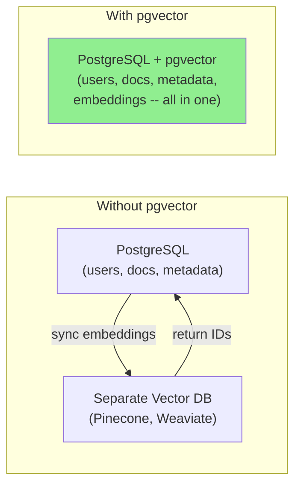
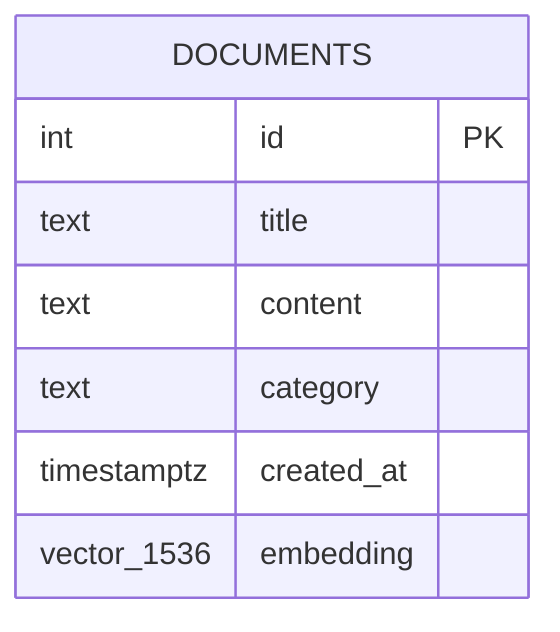
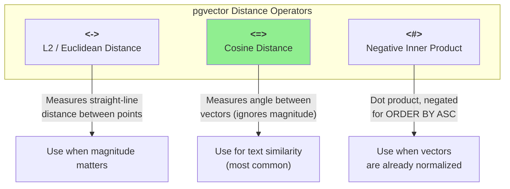
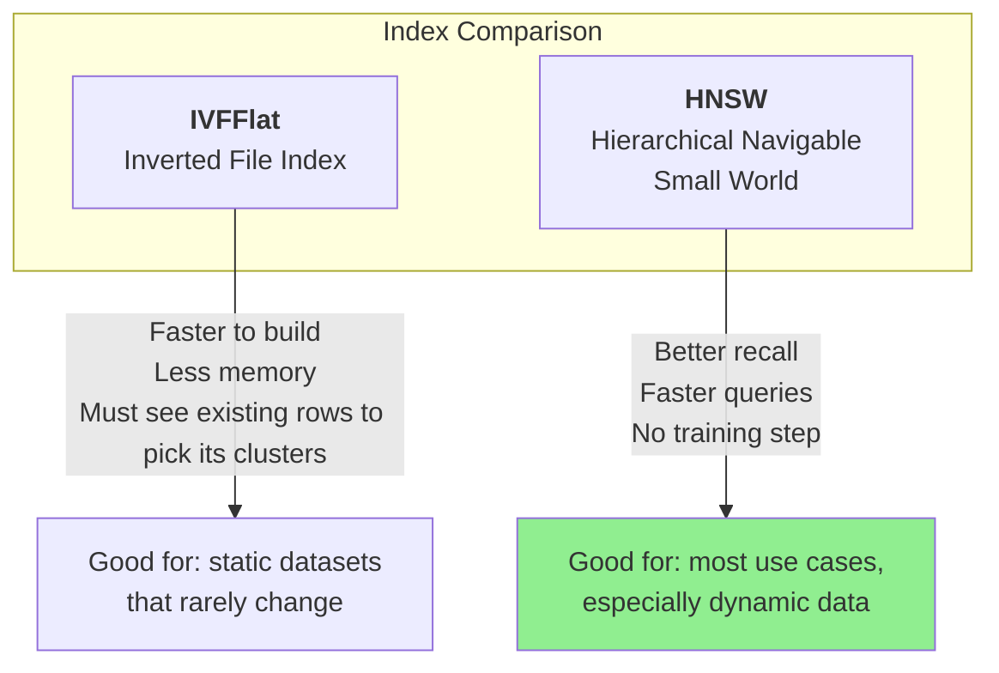

# pgvector -- Embeddings in PostgreSQL

You already know how to generate embeddings. Now the question is: **where do you put them?** If your application already uses PostgreSQL, the answer is surprisingly simple -- keep them right next to your relational data with **pgvector**, a PostgreSQL extension that adds vector storage, distance operators, and approximate nearest-neighbor indexing directly to your existing database.

> **Coming from Software Engineering?** pgvector is like adding a spatial index to PostGIS, but for meaning-space instead of geo-space. Just as PostGIS lets you run `ST_Distance` queries on geographic coordinates alongside your regular SQL, pgvector lets you run similarity searches on embedding vectors alongside JOINs, WHERE clauses, and transactions you already know. (Never used PostGIS? Think of it as a normal indexed column you can sort and filter by -- the index just ranks by similarity instead of `=`.)

---

## Why pgvector?



Key advantages:

- **Single source of truth** -- embeddings live in the same row as the data they represent. No sync issues.
- **ACID transactions** -- embedding inserts participate in the same transaction as your relational writes.
- **Familiar tooling** -- use psycopg2, SQLAlchemy, Alembic migrations, `pg_dump` backups. Nothing new to learn.
- **SQL power** -- combine vector similarity with WHERE filters, JOINs, GROUP BY, and full-text search in a single query.
- **Cost** -- no additional managed service bill. Your existing PostgreSQL instance handles it.

---

## Setting Up pgvector

### Installation

```bash
# Ubuntu / Debian
sudo apt install postgresql-16-pgvector

# macOS (Homebrew)
brew install pgvector

# Docker (easiest for local dev)
docker run --name pgvector-demo \
    -e POSTGRES_PASSWORD=secret \
    -p 5432:5432 \
    -d pgvector/pgvector:pg16
```

### Enable the Extension

```sql
-- Connect to your database and enable pgvector
CREATE EXTENSION IF NOT EXISTS vector;

-- Verify it's installed
SELECT extversion FROM pg_extension WHERE extname = 'vector';
```

---

## Creating Tables with Vector Columns

The `vector` type takes a dimension argument. Match it to your embedding model's output size.

```sql
CREATE TABLE documents (
    id          SERIAL PRIMARY KEY,
    title       TEXT NOT NULL,
    content     TEXT NOT NULL,
    category    TEXT,
    created_at  TIMESTAMPTZ DEFAULT now(),
    embedding   vector(1536)    -- OpenAI text-embedding-3-small dimensions
);
```



You can add a vector column to an existing table just as easily:

```sql
ALTER TABLE products ADD COLUMN embedding vector(1536);
```

---

## Storing Embeddings

Generate embeddings with the OpenAI API and insert them using psycopg2.

### Single Document

```python
# script_id: day_022_pgvector/pgvector_crud_operations
import psycopg2
from pgvector.psycopg2 import register_vector  # pip install pgvector
from openai import OpenAI

client = OpenAI()

def get_embedding(text: str) -> list[float]:
    """Generate an embedding from OpenAI."""
    response = client.embeddings.create(
        model="text-embedding-3-small",
        input=text
    )
    return response.data[0].embedding

# Connect to PostgreSQL
conn = psycopg2.connect(
    host="localhost",
    dbname="myapp",
    user="postgres",
    password="secret"
)
register_vector(conn)  # teaches psycopg2 how to bind/return vector columns
cur = conn.cursor()

# Insert a document with its embedding
title = "Introduction to Neural Networks"
content = "Neural networks are computing systems inspired by biological neural networks..."
embedding = get_embedding(content)

cur.execute(
    """
    INSERT INTO documents (title, content, category, embedding)
    VALUES (%s, %s, %s, %s)
    """,
    (title, content, "machine-learning", embedding)
)
conn.commit()
print("Document stored with embedding.")
```

### Batch Insert

```python
# script_id: day_022_pgvector/pgvector_crud_operations
import psycopg2.extras

def store_documents_batch(
    cur,
    documents: list[dict],
    batch_size: int = 50
):
    """Store multiple documents with embeddings efficiently."""
    for i in range(0, len(documents), batch_size):
        batch = documents[i:i + batch_size]

        # Generate embeddings for the batch
        texts = [doc["content"] for doc in batch]
        response = client.embeddings.create(
            model="text-embedding-3-small",
            input=texts
        )
        embeddings = [d.embedding for d in sorted(response.data, key=lambda x: x.index)]

        # Bulk insert with execute_values
        rows = [
            (doc["title"], doc["content"], doc["category"], emb)
            for doc, emb in zip(batch, embeddings)
        ]
        psycopg2.extras.execute_values(
            cur,
            """
            INSERT INTO documents (title, content, category, embedding)
            VALUES %s
            """,
            rows,
            template="(%s, %s, %s, %s)"
        )
        print(f"Inserted {min(i + batch_size, len(documents))}/{len(documents)}")

# Usage
docs = [
    {"title": "Doc 1", "content": "About transformers...", "category": "ml"},
    {"title": "Doc 2", "content": "About databases...", "category": "infra"},
    # ... more documents
]
store_documents_batch(cur, docs)
conn.commit()
```

---

## Distance Operators

For text embeddings, use cosine distance (`<=>`). The other two are optimizations for special cases. pgvector provides three distance operators.



### In SQL

```sql
-- Cosine distance (most common for text embeddings)
SELECT title, embedding <=> query_embedding AS distance
FROM documents
ORDER BY embedding <=> query_embedding
LIMIT 5;

-- L2 (Euclidean) distance
SELECT title, embedding <-> query_embedding AS distance
FROM documents
ORDER BY embedding <-> query_embedding
LIMIT 5;

-- Negative inner product
SELECT title, embedding <#> query_embedding AS distance
FROM documents
ORDER BY embedding <#> query_embedding
LIMIT 5;
```

> **Tip:** "Normalized" means every vector has been scaled to length 1, so only its direction matters. OpenAI's embeddings come this way. Because they are normalized, cosine distance (`<=>`) and negative inner product (`<#>`) produce equivalent rankings. Cosine distance is the safer default because it works correctly whether or not vectors are normalized.

---

## Querying Nearest Neighbors

This is the core use case: "given a query, find the most similar documents."

```python
# script_id: day_022_pgvector/pgvector_crud_operations
def search_documents(
    cur,
    query: str,
    category: str | None = None,
    limit: int = 5
) -> list[dict]:
    """Find documents most similar to a query string."""
    query_embedding = get_embedding(query)

    if category:
        cur.execute(
            """
            SELECT id, title, content, embedding <=> %s AS distance
            FROM documents
            WHERE category = %s
            ORDER BY embedding <=> %s
            LIMIT %s
            """,
            (query_embedding, category, query_embedding, limit)
        )
    else:
        cur.execute(
            """
            SELECT id, title, content, embedding <=> %s AS distance
            FROM documents
            ORDER BY embedding <=> %s
            LIMIT %s
            """,
            (query_embedding, query_embedding, limit)
        )

    results = []
    for row in cur.fetchall():
        results.append({
            "id": row[0],
            "title": row[1],
            "content": row[2],
            "distance": row[3]
        })
    return results

# Usage
results = search_documents(cur, "How do neural networks learn?")
for r in results:
    print(f"{r['title']} (distance: {r['distance']:.4f})")
```

The pattern is always the same: **embed the query, ORDER BY distance, LIMIT N**.

---

## Indexing: IVFFlat vs HNSW

Without an index, pgvector performs an exact (brute-force) scan of every row. That is fine for thousands of rows, but slows down at scale. pgvector offers two approximate nearest-neighbor (ANN) index types. An approximate index makes a trade a B-tree never does: instead of checking every candidate, it cleverly skips most of them and accepts a small chance of missing the true closest match -- in exchange for being far faster. For search ranking, usually-right-and-fast beats always-right-and-slow.



### IVFFlat

Partitions vectors into lists (clusters) and searches only a subset at query time. It groups your existing vectors into clusters once at build time, so the table cannot be empty -- nothing ML is being trained, it is just measuring where your current data sits.

```sql
-- Create IVFFlat index (requires data in the table first)
-- lists = number of clusters; rule of thumb: sqrt(num_rows)
CREATE INDEX ON documents
    USING ivfflat (embedding vector_cosine_ops)
    WITH (lists = 100);

-- At query time, control how many lists to search (higher = more accurate, slower)
SET ivfflat.probes = 10;
```

### HNSW

Builds a multi-layer graph for fast traversal. Generally the better choice.

```sql
-- Create HNSW index (can be created on an empty table)
CREATE INDEX ON documents
    USING hnsw (embedding vector_cosine_ops)
    WITH (m = 16, ef_construction = 64);

-- At query time, control search breadth (higher = more accurate, slower)
SET hnsw.ef_search = 40;
```

### Which Should You Pick?

Recall here just means: of the documents that are genuinely closest, what fraction did the index actually return? An approximate index trades a little recall -- it may occasionally miss a true match -- for a lot of speed.

| Factor | IVFFlat | HNSW |
|---|---|---|
| Build speed | Faster | Slower |
| Query speed | Good | Better |
| Recall accuracy | Good (tune probes) | Better |
| Memory usage | Lower | Higher |
| Works on empty table | No (must build clusters from existing rows first) | Yes |
| Insert performance | Fast | Slower (updates graph) |

**Default recommendation:** Use **HNSW** unless you have a very large, mostly-static dataset and need to minimize memory usage.

---

## Hybrid Search: Vectors + Full-Text

One of pgvector's biggest advantages is combining semantic similarity with PostgreSQL's built-in full-text search (`tsvector`). This gives you the best of both worlds: keyword precision and semantic understanding.

The hybrid query below has three moving parts: (1) get the top-N rows by meaning (vector distance), (2) get keyword matches with a full-text rank, (3) LEFT JOIN the two and blend their scores by weight, treating a missing keyword match as 0.

```sql
-- Add a tsvector column for full-text search
ALTER TABLE documents ADD COLUMN tsv tsvector
    GENERATED ALWAYS AS (to_tsvector('english', title || ' ' || content)) STORED;

CREATE INDEX ON documents USING gin(tsv);
```

```python
# script_id: day_022_pgvector/pgvector_crud_operations
def hybrid_search(
    cur,
    query: str,
    limit: int = 5,
    semantic_weight: float = 0.7
) -> list[dict]:
    """
    Combine semantic search (pgvector) with full-text search (tsvector).
    
    Scores are normalized and blended using the given weight.
    """
    query_embedding = get_embedding(query)

    cur.execute(
        """
        WITH semantic AS (
            -- <=> is a distance (0 = identical, higher = less similar);
            -- 1 - distance flips it to a similarity score (higher = better)
            -- so it lines up with the full-text rank, then we sort DESC.
            SELECT id, title, content,
                   1 - (embedding <=> %s) AS semantic_score
            FROM documents
            ORDER BY embedding <=> %s
            LIMIT %s
        ),
        fulltext AS (
            SELECT id,
                   ts_rank(tsv, plainto_tsquery('english', %s)) AS text_score
            FROM documents
            WHERE tsv @@ plainto_tsquery('english', %s)
        )
        SELECT s.id, s.title, s.content,
               (%s * s.semantic_score +
                %s * COALESCE(f.text_score, 0)) AS combined_score
        FROM semantic s
        LEFT JOIN fulltext f ON s.id = f.id
        ORDER BY combined_score DESC
        LIMIT %s
        """,
        (
            query_embedding, query_embedding, limit * 2,
            query, query,
            semantic_weight, 1 - semantic_weight,
            limit
        )
    )

    results = []
    for row in cur.fetchall():
        results.append({
            "id": row[0],
            "title": row[1],
            "content": row[2],
            "score": row[3]
        })
    return results

# Usage
results = hybrid_search(cur, "transformer attention mechanism")
for r in results:
    print(f"{r['title']} (score: {r['score']:.4f})")
```

Hybrid search helps when:
- A user searches for a **specific term** (e.g., an error code) that semantic search alone might miss.
- You want **semantic understanding** but also need to boost exact keyword matches.

---

## When to Consider Alternatives

pgvector is excellent when you already use PostgreSQL. But it is not the only option.

**ChromaDB** is a lightweight, in-process vector database that is great for prototyping and small-scale experiments:

```python
# script_id: day_022_pgvector/chromadb_alternative
import chromadb

client = chromadb.Client()
collection = client.create_collection("docs")

# Add documents (ChromaDB can auto-embed with built-in models)
collection.add(
    ids=["1", "2"],
    documents=["About neural networks...", "About databases..."]
)

# Query
results = collection.query(query_texts=["How do networks learn?"], n_results=2)
print(results["documents"])
```

Use ChromaDB when you need a quick prototype or are working in a notebook. Move to pgvector when you need transactions, existing relational data, or production durability.

---

## Checkpoint

Store a few documents with `store_documents_batch`, then run `search_documents` for a related query and confirm: the most relevant row comes back with the smallest distance. If the query errors with a dimension mismatch, check that your `vector(N)` column width matches your embedding model's output length (e.g. 1536 for `text-embedding-3-small`) — pgvector rejects vectors of the wrong size.

---

## Summary

```mermaid
mindmap
  root((pgvector))
    Setup
      CREATE EXTENSION vector
      vector(1536) column type
      psycopg2 for Python
    Distance Operators
      L2: <->
      Cosine: <=>
      Inner Product: <#>
    Indexing
      IVFFlat
        Faster build
        Needs existing rows to cluster
      HNSW
        Better recall
        Recommended default
    Hybrid Search
      tsvector + vector
      Keyword + semantic
    Alternatives
      ChromaDB for prototyping
      Dedicated vector DBs at scale
```

---

## Quick Reference

```python
# script_id: day_022_pgvector/quick_reference
import psycopg2
from pgvector.psycopg2 import register_vector  # pip install pgvector
from openai import OpenAI

client = OpenAI()
conn = psycopg2.connect(host="localhost", dbname="myapp", user="postgres", password="secret")
register_vector(conn)  # bind/return vector columns as Python lists
cur = conn.cursor()

# --- Setup ---
cur.execute("CREATE EXTENSION IF NOT EXISTS vector;")
cur.execute("""
    CREATE TABLE IF NOT EXISTS documents (
        id SERIAL PRIMARY KEY,
        content TEXT NOT NULL,
        embedding vector(1536)
    );
""")

# --- Store ---
text = "Some document text"
emb = client.embeddings.create(model="text-embedding-3-small", input=text).data[0].embedding
cur.execute("INSERT INTO documents (content, embedding) VALUES (%s, %s)", (text, emb))
conn.commit()

# --- Search ---
query_emb = client.embeddings.create(model="text-embedding-3-small", input="my query").data[0].embedding
cur.execute("""
    SELECT id, content, embedding <=> %s AS distance
    FROM documents
    ORDER BY embedding <=> %s
    LIMIT 5
""", (query_emb, query_emb))
results = cur.fetchall()

# --- Index ---
cur.execute("""
    CREATE INDEX ON documents USING hnsw (embedding vector_cosine_ops)
    WITH (m = 16, ef_construction = 64);
""")
conn.commit()
```

---

## Exercises

1. **Build a Knowledge Base**: Create a PostgreSQL table with pgvector, load 50+ text passages from a topic of your choice, and build a Python function that takes a natural-language question and returns the top 3 most relevant passages with their cosine distances.

2. **Index Benchmark**: Insert 10,000 randomly generated 1536-dimension vectors. Measure query latency (a) with no index, (b) with IVFFlat, and (c) with HNSW. Plot the results and note the recall-vs-speed tradeoff as you vary `probes` and `ef_search`.

3. **Hybrid Search Pipeline**: Extend your knowledge base with a `tsvector` column and implement the hybrid search function from this tutorial. Compare results for queries that contain specific technical terms versus vague conceptual questions. When does hybrid search outperform pure semantic search?

<details><summary>Solutions (approaches)</summary>

1. **Build a Knowledge Base**: Load your passages, `ALTER`/`CREATE` a `vector(1536)` column, embed each passage with `get_embedding`, and store it. To answer a question, embed it and `ORDER BY embedding <=> %s LIMIT 3`, returning each row's distance.
2. **Index Benchmark**: Time each query path with `time.perf_counter()` around the search. Raise `ivfflat.probes` / `hnsw.ef_search` to trade speed for recall -- higher values search more candidates, so you find more of the true closest matches but each query takes longer.
3. **Hybrid Search Pipeline**: Blend `ts_rank` with `1 - (embedding <=> q)` as in the lesson. Exact-term queries (error codes, function names) are where hybrid wins -- pure semantic search can miss a literal token that full-text matches exactly.

</details>

---

## What's Next?

Now that you can store embeddings, let's learn to **index, query, and search** them effectively!
