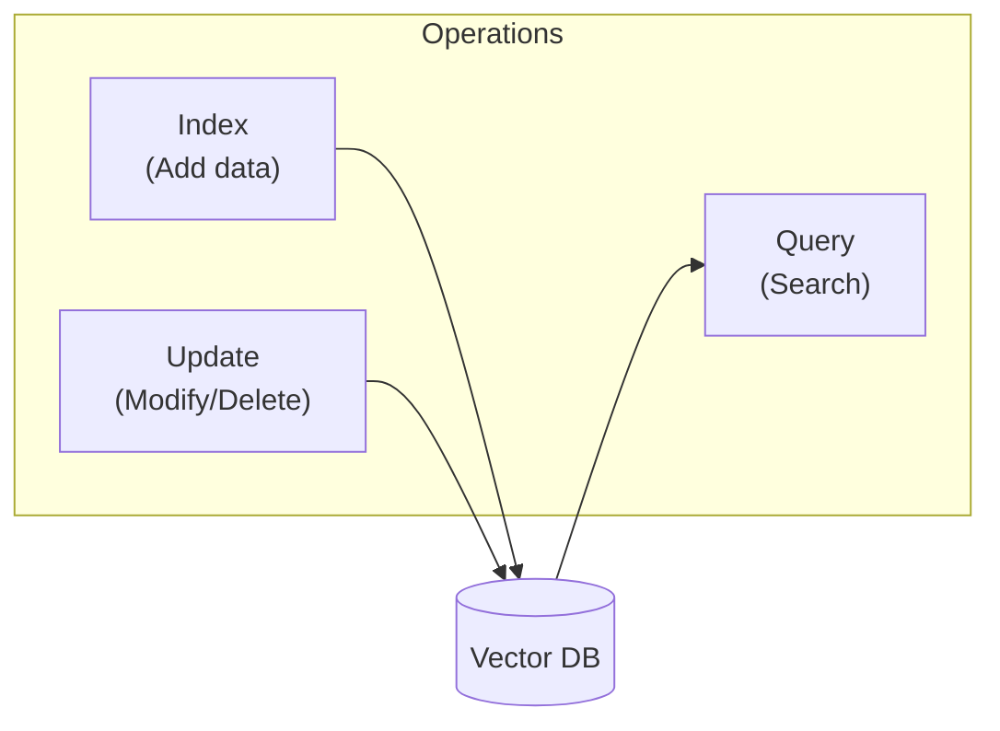
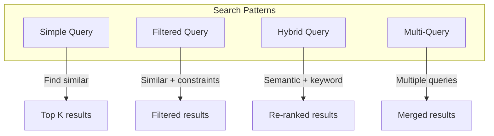
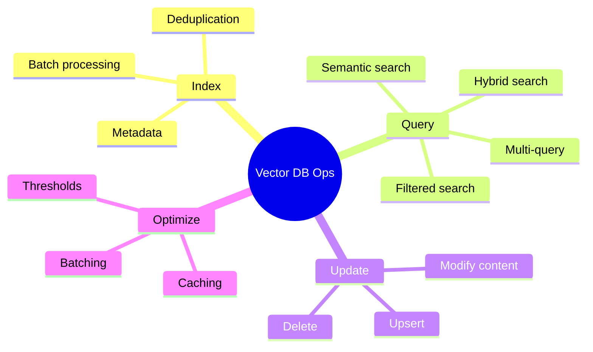

# Indexing, Querying, and Updating Vector Databases

Now that you have vector databases set up, let's master the core operations: adding data efficiently, searching smartly, and keeping your database up to date.

> Day 22 used **pgvector** (vectors inside Postgres). Today we use **ChromaDB** — a lightweight, embedded vector DB that needs no separate server, which keeps the examples focused on the *operations* rather than database setup. The patterns (index, query, filter, update, delete) are identical across vector stores; only the client API changes.

> **Coming from Software Engineering?** CRUD operations on vector DBs work exactly like any database — insert, query, update, delete. If you've built data access layers with SQLAlchemy or Mongoose, the patterns are identical. The only new concept is 'similarity search' instead of 'exact match' queries.

---

## The Three Core Operations



---

## Indexing: Adding Data Efficiently

### Batch Indexing for Performance

```python
# script_id: day_023_indexing_querying_updating/core_operations
import chromadb
from openai import OpenAI

client = chromadb.PersistentClient(path="./vectordb")
# ChromaDB defaults to L2 (squared Euclidean) distance. We explicitly request
# cosine so that `1 - distance` below is a valid cosine-similarity score. With
# the default L2 space, `1 - distance` is meaningless (it can go negative).
collection = client.get_or_create_collection(
    "documents",
    # "hnsw:space" picks Chroma's similarity index setting — HNSW is just the
    # name of that index (like choosing a B-tree vs hash index in SQL). What
    # matters here is space="cosine", which makes `1 - distance` a clean
    # 0-to-1 similarity score below.
    metadata={"hnsw:space": "cosine"},
)
openai_client = OpenAI()

def batch_index(
    documents: list[str],
    metadatas: list[dict] = None,
    batch_size: int = 100
):
    """Index documents in batches for efficiency."""
    total = len(documents)

    for i in range(0, total, batch_size):
        batch_docs = documents[i:i + batch_size]
        batch_meta = metadatas[i:i + batch_size] if metadatas else [{}] * len(batch_docs)
        # ids are positional within this run, so a second call reuses doc_0, doc_1, ...
        # For stable, re-runnable ids derive them from content (see generate_doc_id below).
        batch_ids = [f"doc_{i + j}" for j in range(len(batch_docs))]

        # Get embeddings in batch
        response = openai_client.embeddings.create(
            model="text-embedding-3-small",
            input=batch_docs
        )
        embeddings = [d.embedding for d in sorted(response.data, key=lambda x: x.index)]

        # Add to collection
        collection.add(
            ids=batch_ids,
            embeddings=embeddings,
            documents=batch_docs,
            metadatas=batch_meta
        )

        print(f"Indexed {min(i + batch_size, total)}/{total}")

# Usage
documents = [f"Document content {i}" for i in range(500)]
metadatas = [{"source": "test", "index": i} for i in range(500)]
batch_index(documents, metadatas)
```

### Handling Duplicates

```python
# script_id: day_023_indexing_querying_updating/core_operations
import hashlib

def generate_doc_id(content: str) -> str:
    """Generate deterministic ID from content to prevent duplicates."""
    return hashlib.sha256(content.encode()).hexdigest()[:16]

def index_with_dedup(documents: list[str], collection):
    """Index documents, skipping duplicates."""
    # Get existing IDs
    existing = set(collection.get()["ids"])

    new_docs = []
    new_ids = []
    new_metas = []

    for doc in documents:
        doc_id = generate_doc_id(doc)
        if doc_id not in existing:
            new_docs.append(doc)
            new_ids.append(doc_id)
            new_metas.append({"added": "new"})

    if new_docs:
        # Generate embeddings and add
        response = openai_client.embeddings.create(
            model="text-embedding-3-small",
            input=new_docs
        )
        embeddings = [d.embedding for d in sorted(response.data, key=lambda x: x.index)]

        collection.add(
            ids=new_ids,
            embeddings=embeddings,
            documents=new_docs,
            metadatas=new_metas
        )
        print(f"Added {len(new_docs)} new documents, skipped {len(documents) - len(new_docs)} duplicates")
    else:
        print("No new documents to add")
```

---

## Querying: Smart Search Strategies

### Basic Semantic Search

```python
# script_id: day_023_indexing_querying_updating/core_operations
def semantic_search(query: str, n_results: int = 5) -> list[dict]:
    """Perform basic semantic search."""
    # Get query embedding
    response = openai_client.embeddings.create(
        model="text-embedding-3-small",
        input=query
    )
    query_embedding = response.data[0].embedding

    # Search
    results = collection.query(
        query_embeddings=[query_embedding],
        n_results=n_results,
        include=["documents", "metadatas", "distances"]
    )

    # Format results
    return [
        {
            "document": results["documents"][0][i],
            "metadata": results["metadatas"][0][i],
            "similarity": 1 - results["distances"][0][i]  # valid because the collection uses cosine space
        }
        for i in range(len(results["ids"][0]))
    ]
```

### Filtered Search

```python
# script_id: day_023_indexing_querying_updating/core_operations
def filtered_search(
    query: str,
    filters: dict,
    n_results: int = 5
) -> list[dict]:
    """Search with metadata filters."""

    response = openai_client.embeddings.create(
        model="text-embedding-3-small",
        input=query
    )
    query_embedding = response.data[0].embedding

    # ChromaDB filter syntax
    results = collection.query(
        query_embeddings=[query_embedding],
        n_results=n_results,
        where=filters,  # e.g., {"category": "tech"} or {"year": {"$gte": 2020}}
        include=["documents", "metadatas", "distances"]
    )

    # Format the same way as semantic_search so the return shape is consistent
    return [
        {
            "document": results["documents"][0][i],
            "metadata": results["metadatas"][0][i],
            "similarity": 1 - results["distances"][0][i]
        }
        for i in range(len(results["ids"][0]))
    ]

# Examples
# Filter by exact match
results = filtered_search("AI news", {"category": "technology"})

# Filter by range
results = filtered_search("recent papers", {"year": {"$gte": 2023}})

# Multiple conditions
results = filtered_search(
    "Python tutorials",
    {"$and": [{"category": "programming"}, {"difficulty": "beginner"}]}
)
```

### Hybrid Search (Keyword + Semantic)

Semantic search finds things that *mean* the same thing, but it can whiff on exact tokens like error codes, SKUs, or names. Plain keyword matching nails those. Hybrid search runs both and blends the scores — like an `ORDER BY` that sorts on two columns at once.

```python
# script_id: day_023_indexing_querying_updating/core_operations
def hybrid_search(
    query: str,
    collection,
    n_results: int = 5,
    keyword_weight: float = 0.3  # a dial: 0.3 leans mostly on meaning,
                                 # 0.7 leans on exact words. Tune for your data.
) -> list[dict]:
    """Combine semantic search with keyword matching."""

    # Semantic search
    response = openai_client.embeddings.create(
        model="text-embedding-3-small",
        input=query
    )
    query_embedding = response.data[0].embedding

    semantic_results = collection.query(
        query_embeddings=[query_embedding],
        n_results=n_results * 2,  # fetch 2x candidates, then re-sort (re-rank) them by the blended score below
        include=["documents", "metadatas", "distances"]
    )

    # Keyword scoring
    query_terms = set(query.lower().split())
    scored_results = []

    for i in range(len(semantic_results["ids"][0])):
        doc = semantic_results["documents"][0][i]
        doc_terms = set(doc.lower().split())

        # Calculate keyword overlap
        keyword_score = len(query_terms & doc_terms) / len(query_terms) if query_terms else 0

        # Semantic score (convert distance to similarity)
        semantic_score = 1 - semantic_results["distances"][0][i]

        # Combined score
        combined = (1 - keyword_weight) * semantic_score + keyword_weight * keyword_score

        scored_results.append({
            "document": doc,
            "metadata": semantic_results["metadatas"][0][i],
            "semantic_score": semantic_score,
            "keyword_score": keyword_score,
            "combined_score": combined
        })

    # Sort by combined score
    scored_results.sort(key=lambda x: x["combined_score"], reverse=True)
    return scored_results[:n_results]
```

---

## Updating: Keeping Data Fresh

### Update Existing Documents

```python
# script_id: day_023_indexing_querying_updating/core_operations
def update_document(doc_id: str, new_content: str, new_metadata: dict = None):
    """Update an existing document."""

    # Generate new embedding
    response = openai_client.embeddings.create(
        model="text-embedding-3-small",
        input=new_content
    )
    new_embedding = response.data[0].embedding

    # ChromaDB update
    collection.update(
        ids=[doc_id],
        embeddings=[new_embedding],
        documents=[new_content],
        metadatas=[new_metadata] if new_metadata else None
    )

    print(f"Updated document {doc_id}")

# Usage
update_document(
    "doc_42",
    "Updated content for document 42",
    {"updated_at": "2024-01-15", "version": 2}
)
```

### Upsert: Add or Update

```python
# script_id: day_023_indexing_querying_updating/core_operations
def upsert_documents(
    documents: list[str],
    ids: list[str],
    metadatas: list[dict] = None
):
    """Add new documents or update existing ones."""

    # Generate embeddings
    response = openai_client.embeddings.create(
        model="text-embedding-3-small",
        input=documents
    )
    embeddings = [d.embedding for d in sorted(response.data, key=lambda x: x.index)]

    # ChromaDB upsert
    collection.upsert(
        ids=ids,
        embeddings=embeddings,
        documents=documents,
        metadatas=metadatas or [{}] * len(documents)
    )

    print(f"Upserted {len(documents)} documents")

# Usage - works for both new and existing IDs
upsert_documents(
    ["New or updated content 1", "New or updated content 2"],
    ["doc_1", "doc_2"],
    [{"source": "update"}, {"source": "update"}]
)
```

### Delete Documents

```python
# script_id: day_023_indexing_querying_updating/core_operations
def delete_documents(ids: list[str]):
    """Delete documents by ID."""
    collection.delete(ids=ids)
    print(f"Deleted {len(ids)} documents")

def delete_by_filter(where: dict):
    """Delete documents matching a filter."""
    collection.delete(where=where)
    print(f"Deleted documents matching filter: {where}")

# Usage
delete_documents(["doc_1", "doc_2"])
delete_by_filter({"category": "outdated"})
```

---

## Query Patterns



### Multi-Query Search

```python
# script_id: day_023_indexing_querying_updating/core_operations
def multi_query_search(
    queries: list[str],
    n_results_per_query: int = 5
) -> list[dict]:
    """Search with multiple queries and merge results."""

    all_results = {}

    for query in queries:
        response = openai_client.embeddings.create(
            model="text-embedding-3-small",
            input=query
        )
        query_embedding = response.data[0].embedding

        results = collection.query(
            query_embeddings=[query_embedding],
            n_results=n_results_per_query,
            include=["documents", "metadatas", "distances"]
        )

        # Merge results, keeping best score for duplicates
        for i in range(len(results["ids"][0])):
            doc_id = results["ids"][0][i]
            score = 1 - results["distances"][0][i]

            if doc_id not in all_results or all_results[doc_id]["score"] < score:
                all_results[doc_id] = {
                    "document": results["documents"][0][i],
                    "metadata": results["metadatas"][0][i],
                    "score": score,
                    "matched_query": query
                }

    # Sort by score
    sorted_results = sorted(all_results.values(), key=lambda x: x["score"], reverse=True)
    return sorted_results

# Usage - search with query variations
results = multi_query_search([
    "machine learning basics",
    "ML fundamentals",
    "intro to machine learning"
])
```

---

## Performance Optimization

```python
# script_id: day_023_indexing_querying_updating/optimized_vector_store
class OptimizedVectorStore:
    """Vector store with caching and batching."""

    def __init__(self, persist_dir: str = "./vectordb"):
        self.client = chromadb.PersistentClient(path=persist_dir)
        # cosine space so the `1 - distance` similarity below is valid (default is L2)
        self.collection = self.client.get_or_create_collection(
            "documents", metadata={"hnsw:space": "cosine"}
        )
        self.openai = OpenAI()
        self._embedding_cache = {}

    def _get_embedding(self, text: str) -> list[float]:
        """Get embedding with caching."""
        if text not in self._embedding_cache:
            response = self.openai.embeddings.create(
                model="text-embedding-3-small",
                input=text
            )
            self._embedding_cache[text] = response.data[0].embedding
        return self._embedding_cache[text]

    def search(
        self,
        query: str,
        n_results: int = 5,
        threshold: float = 0.7
    ) -> list[dict]:
        """Search with similarity threshold."""
        embedding = self._get_embedding(query)

        results = self.collection.query(
            query_embeddings=[embedding],
            n_results=n_results,
            include=["documents", "metadatas", "distances"]
        )

        # Filter by threshold
        filtered = []
        for i in range(len(results["ids"][0])):
            similarity = 1 - results["distances"][0][i]
            if similarity >= threshold:
                filtered.append({
                    "document": results["documents"][0][i],
                    "similarity": similarity
                })

        return filtered

    def clear_cache(self):
        """Clear embedding cache."""
        self._embedding_cache.clear()
```

---

## Retrieval Quality Metrics

How do you know your search is actually returning good results? Before we get to full evaluation frameworks like RAGAS (covered in Phase 5), here are the three essential metrics every retrieval system should track:

### Precision: Are the results relevant?

**Precision = relevant results / total returned results**

If you return 10 documents and only 6 are actually useful, your precision is 60%. High precision means less noise in your context window.

To measure any of these you first need a small hand-built answer key — the set of doc IDs you *know* are correct for a test query (think of it like the expected output in a unit test). Precision and recall compare what your search returned against that key.

```python
# script_id: day_023_indexing_querying_updating/precision_metric
def calculate_precision(retrieved_docs: list[str], relevant_docs: set[str]) -> float:
    """What fraction of retrieved docs are actually relevant?"""
    if not retrieved_docs:
        return 0.0
    relevant_count = sum(1 for doc in retrieved_docs if doc in relevant_docs)
    return relevant_count / len(retrieved_docs)
```

### Recall: Are you finding everything?

**Recall = relevant results found / total relevant results that exist**

If your knowledge base has 5 documents that answer a question but your search only finds 3, your recall is 60%. High recall means you're not missing important context.

```python
# script_id: day_023_indexing_querying_updating/recall_metric
def calculate_recall(retrieved_docs: list[str], relevant_docs: set[str]) -> float:
    """What fraction of all relevant docs did we find?"""
    if not relevant_docs:
        return 0.0
    found_count = sum(1 for doc in retrieved_docs if doc in relevant_docs)
    return found_count / len(relevant_docs)
```

### NDCG: Are the best results ranked first?

**Normalized Discounted Cumulative Gain** measures whether the most relevant results appear at the top. A search that returns the best result at position 1 scores higher than one that buries it at position 5.

Think of it like a teacher grading a results page. Each result gets a **relevance score** you (or a human labeler) assign: `3` = perfect answer, `2` = good, `1` = somewhat related, `0` = irrelevant. NDCG then asks: *did the high scores land at the top?* A correct answer buried at position 5 is worth less than the same answer at position 1, so we shrink (discount) each score the further down the list it sits — that's the `/ log2(position)` term. Finally we divide by the score of the *perfect* ordering, so the result is always 0-to-1 (1 = your ranking already matched the ideal).

```python
# script_id: day_023_indexing_querying_updating/ndcg_metric
import math

def calculate_dcg(relevance_scores: list[float]) -> float:
    """Discounted Cumulative Gain — rewards relevant docs ranked higher."""
    # log2(i + 2) is a position penalty: a relevant hit at rank 1 counts fully,
    # the same hit further down counts less, so ranking order matters.
    return sum(rel / math.log2(i + 2) for i, rel in enumerate(relevance_scores))

def calculate_ndcg(relevance_scores: list[float]) -> float:
    """NDCG normalizes DCG against the ideal ranking."""
    dcg = calculate_dcg(relevance_scores)
    ideal_dcg = calculate_dcg(sorted(relevance_scores, reverse=True))
    return dcg / ideal_dcg if ideal_dcg > 0 else 0.0

# Example: search returned docs with relevance scores [3, 1, 2, 0, 1]
# Perfect ranking would be [3, 2, 1, 1, 0]
scores = [3, 1, 2, 0, 1]
print(f"NDCG: {calculate_ndcg(scores):.3f}")  # < 1.0 because ranking isn't ideal
```

### When to Use Each

| Metric | Question It Answers | Optimize When |
|--------|-------------------|---------------|
| Precision | "Is there noise in results?" | Context window is expensive / small |
| Recall | "Am I missing relevant docs?" | Answers require multiple sources |
| NDCG | "Are the best results on top?" | Using top-K with small K |

> These metrics bridge directly to the RAGAS evaluation framework you'll learn in Phase 5. Building the measurement habit early pays off.

---

## Checkpoint

Run `index_with_dedup(docs, collection)` over a list that contains a duplicate. Because it ids each doc with `generate_doc_id(text)`, you can recompute any doc's id the same way — e.g. `doc_id = generate_doc_id(my_text)` — then call `update_document(doc_id, new_text)` and re-query. Confirm: the dedup pass reports it skipped the duplicate, and the re-query reflects the updated content rather than the old text. If duplicates slip through, check that your `generate_doc_id` hashes the content deterministically (same text in → same id out) so the store can recognize a repeat.

---

## Summary



---

## Quick Reference

```python
# script_id: day_023_indexing_querying_updating/quick_reference
# Add documents
collection.add(ids=["1"], documents=["text"], embeddings=[[...]])

# Query
collection.query(query_embeddings=[[...]], n_results=5, where={"key": "value"})

# Update
collection.update(ids=["1"], documents=["new text"], embeddings=[[...]])

# Upsert (add or update)
collection.upsert(ids=["1"], documents=["text"], embeddings=[[...]])

# Delete
collection.delete(ids=["1"])
collection.delete(where={"category": "old"})
```

---

## Exercises

1. **Extend the indexer to skip duplicates.** Before calling `collection.add`, query the collection by `ids` (or hash the document text into the id) and only add documents that aren't already present. Print how many you skipped.
2. **Measure batch vs. one-at-a-time indexing.** Time adding 200 documents in a single `add` call versus 200 separate calls. Report the wall-clock difference — embedding round-trips dominate.
3. **Add a metadata filter to your search.** Tag each document with a `category` in its metadata, then run the same query with and without a `where={"category": ...}` filter and compare the results.
4. **Build a tiny upsert loop.** Write a function that takes `(id, text)`, re-embeds the text, and `upsert`s it so re-running it twice never creates duplicates. Verify the collection count stays flat.

<details><summary>Solutions (approaches)</summary>

1. Fetch existing ids with `collection.get(ids=batch_ids)["ids"]`, diff against your batch, add only the remainder. Hashing text to a stable id (`hashlib.sha1`) makes "same content = same id".
2. Wrap each path in `time.perf_counter()`. The batch path wins because it sends one embedding request and one DB write instead of N of each.
3. Pass `where={"category": "docs"}` to `collection.query`. Fewer candidates come back; filtering happens before similarity ranking.
4. Re-embed inside the function and call `collection.upsert(ids=[id], documents=[text], embeddings=[vec])`. Check `collection.count()` before and after a second run — it should be unchanged.
</details>

---

## What's Next?

You can index, search, and keep a vector store fresh — but real documents (PDFs, HTML, scans) don't arrive as clean strings. Tomorrow, **Day 24: Document Parsing**, we extract usable text out of messy source files so it's ready to embed.
