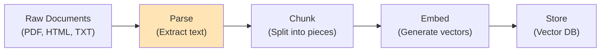
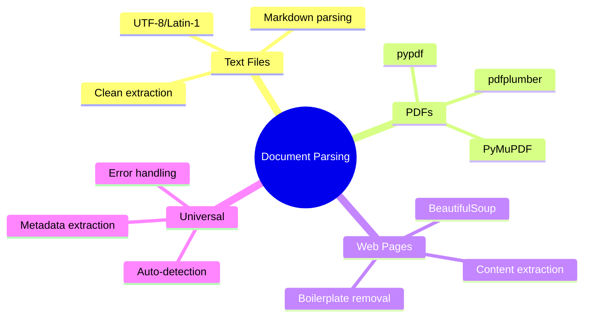

# Document Parsing for RAG

Before you can search your documents, you need to extract text from them. In this guide, you'll learn to parse PDFs, text files, and web pages - the foundation of any RAG system.

> **Coming from Software Engineering?** Document parsing for AI is the same ETL problem you've solved before — extract data from messy sources, transform it, load it somewhere useful. If you've built data pipelines that ingest PDFs, CSVs, or API responses, this is the same skill applied to AI knowledge bases.

---

## The RAG Pipeline



Today we focus on the **Parse** step!

---

## Parsing Text Files

The easiest format - just read it:

```python
# script_id: day_024_document_parsing/text_and_markdown_parsing
from pathlib import Path

def parse_text_file(file_path: str) -> str:
    """Parse a plain text file."""
    path = Path(file_path)

    if not path.exists():
        raise FileNotFoundError(f"File not found: {file_path}")

    # Handle different encodings
    encodings = ['utf-8', 'latin-1', 'cp1252']

    for encoding in encodings:
        try:
            return path.read_text(encoding=encoding)
        except UnicodeDecodeError:
            continue

    raise ValueError(f"Could not decode file: {file_path}")

# Usage
content = parse_text_file("document.txt")
print(f"Extracted {len(content)} characters")
```

### Parsing Markdown

```python
# script_id: day_024_document_parsing/text_and_markdown_parsing
import re

def parse_markdown(file_path: str) -> dict:
    """Parse markdown file, extracting structure."""
    content = parse_text_file(file_path)

    # Extract title (first H1)
    title_match = re.search(r'^#\s+(.+)$', content, re.MULTILINE)
    title = title_match.group(1) if title_match else "Untitled"

    # Extract sections
    sections = re.split(r'^##\s+', content, flags=re.MULTILINE)

    # Clean up code blocks for text extraction
    plain_text = re.sub(r'```[\s\S]*?```', '[CODE BLOCK]', content)
    plain_text = re.sub(r'`[^`]+`', '', plain_text)

    return {
        "title": title,
        "raw": content,
        "plain_text": plain_text,
        "sections": len(sections) - 1,  # First split is before first ##
    }
```

---

## Parsing PDFs

PDFs are trickier - they're designed for display, not extraction.

> **Recommendation:** For new projects, start with **PyMuPDF** (`fitz`) as your default PDF parser -- it is the fastest and handles most layouts accurately. Use **pdfplumber** when you need precise table extraction. `pypdf` is shown first below for simplicity, but PyMuPDF is the better production choice.

### Using pypdf

`PyPDF2` is unmaintained; its successor is the `pypdf` package (same API). Install and import `pypdf`:

```bash
pip install pypdf
```

```python
# script_id: day_024_document_parsing/parse_pdf_pypdf
from pypdf import PdfReader

def parse_pdf_pypdf(file_path: str) -> dict:
    """Parse PDF using pypdf."""
    reader = PdfReader(file_path)

    pages = []
    full_text = []

    for i, page in enumerate(reader.pages):
        text = page.extract_text() or ""
        pages.append({
            "page_number": i + 1,
            "text": text
        })
        full_text.append(text)

    return {
        "num_pages": len(reader.pages),
        "pages": pages,
        "full_text": "\n\n".join(full_text),
        "metadata": dict(reader.metadata) if reader.metadata else {}
    }

# Usage
result = parse_pdf_pypdf("document.pdf")
print(f"Extracted {result['num_pages']} pages")
print(f"Total text: {len(result['full_text'])} characters")
```

### Using pdfplumber (Better for Tables)

```bash
pip install pdfplumber
```

```python
# script_id: day_024_document_parsing/parse_pdf_plumber
import pdfplumber

def parse_pdf_plumber(file_path: str) -> dict:
    """Parse PDF with better table extraction."""
    pages = []
    tables = []

    with pdfplumber.open(file_path) as pdf:
        for i, page in enumerate(pdf.pages):
            # Extract text
            text = page.extract_text() or ""
            pages.append({
                "page_number": i + 1,
                "text": text
            })

            # Extract tables
            page_tables = page.extract_tables()
            for table in page_tables:
                tables.append({
                    "page": i + 1,
                    "data": table
                })

    return {
        "num_pages": len(pages),
        "pages": pages,
        "tables": tables,
        "full_text": "\n\n".join(p["text"] for p in pages)
    }
```

### Using PyMuPDF (Fastest)

```bash
pip install pymupdf
```

```python
# script_id: day_024_document_parsing/parse_pdf_mupdf
import fitz  # PyMuPDF

def parse_pdf_mupdf(file_path: str) -> dict:
    """Parse PDF using PyMuPDF (fastest option)."""
    doc = fitz.open(file_path)

    pages = []
    for i in range(len(doc)):
        page = doc[i]
        text = page.get_text()
        pages.append({
            "page_number": i + 1,
            "text": text
        })

    return {
        "num_pages": len(doc),
        "pages": pages,
        "full_text": "\n\n".join(p["text"] for p in pages),
        "metadata": doc.metadata
    }
```

---

## Web Scraping

Extract content from web pages:

### Using BeautifulSoup

```bash
pip install beautifulsoup4 requests
```

```python
# script_id: day_024_document_parsing/web_and_universal_loader
import requests
from bs4 import BeautifulSoup

def parse_webpage(url: str) -> dict:
    """Parse webpage content."""
    headers = {
        'User-Agent': 'Mozilla/5.0 (compatible; DocumentParser/1.0)'
    }

    response = requests.get(url, headers=headers, timeout=10)
    response.raise_for_status()

    soup = BeautifulSoup(response.text, 'html.parser')

    # Remove script and style elements
    for element in soup(['script', 'style', 'nav', 'footer', 'header']):
        element.decompose()

    # Get title
    title = soup.title.string if soup.title else "Untitled"

    # Get main content
    # Try common content containers
    main_content = None
    for selector in ['article', 'main', '.content', '#content', '.post']:
        main_content = soup.select_one(selector)
        if main_content:
            break

    if main_content:
        text = main_content.get_text(separator='\n', strip=True)
    else:
        text = soup.body.get_text(separator='\n', strip=True) if soup.body else ""

    # Extract links
    links = [a.get('href') for a in soup.find_all('a', href=True)]

    return {
        "url": url,
        "title": title,
        "text": text,
        "links": links[:20],  # First 20 links
        "raw_html": response.text
    }

# Usage
result = parse_webpage("https://example.com/article")
print(f"Title: {result['title']}")
print(f"Text length: {len(result['text'])}")
```

### Clean Text Extraction

```python
# script_id: day_024_document_parsing/web_and_universal_loader
import re

def clean_extracted_text(text: str) -> str:
    """Clean up extracted text."""
    # Normalize whitespace
    text = re.sub(r'\s+', ' ', text)

    # Remove excessive newlines
    text = re.sub(r'\n{3,}', '\n\n', text)

    # Remove common artifacts
    text = re.sub(r'[\x00-\x08\x0b\x0c\x0e-\x1f\x7f-\x9f]', '', text)

    # Strip leading/trailing whitespace
    text = text.strip()

    return text

def extract_main_content(html: str) -> str:
    """Extract main content, removing boilerplate."""
    soup = BeautifulSoup(html, 'html.parser')

    # Remove unwanted elements
    unwanted = [
        'script', 'style', 'nav', 'footer', 'header',
        'aside', 'form', 'iframe', 'noscript'
    ]
    for tag in unwanted:
        for element in soup.find_all(tag):
            element.decompose()

    # Remove elements by class/id patterns
    for element in soup.find_all(class_=re.compile(r'(nav|menu|sidebar|footer|header|ad|comment)')):
        element.decompose()

    text = soup.get_text(separator='\n', strip=True)
    return clean_extracted_text(text)
```

---

## Universal Document Loader

```python
# script_id: day_024_document_parsing/web_and_universal_loader
from pathlib import Path
from typing import Union
import mimetypes

class DocumentLoader:
    """Universal document loader supporting multiple formats."""

    def __init__(self):
        self.parsers = {
            '.txt': self._parse_text,
            '.md': self._parse_text,
            '.pdf': self._parse_pdf,
            '.html': self._parse_html,
            '.htm': self._parse_html,
        }

    def load(self, source: Union[str, Path]) -> dict:
        """Load document from file path or URL."""
        source = str(source)

        # Check if URL
        if source.startswith(('http://', 'https://')):
            return self._parse_url(source)

        # File path
        path = Path(source)
        suffix = path.suffix.lower()

        if suffix not in self.parsers:
            raise ValueError(f"Unsupported file type: {suffix}")

        return self.parsers[suffix](path)

    def _parse_text(self, path: Path) -> dict:
        content = path.read_text(encoding='utf-8')
        return {
            "source": str(path),
            "type": "text",
            "content": content,
            "metadata": {"filename": path.name}
        }

    def _parse_pdf(self, path: Path) -> dict:
        import fitz
        doc = fitz.open(str(path))
        text = "\n\n".join(page.get_text() for page in doc)
        return {
            "source": str(path),
            "type": "pdf",
            "content": text,
            "metadata": {
                "filename": path.name,
                "pages": len(doc),
                **doc.metadata
            }
        }

    def _parse_html(self, path: Path) -> dict:
        html = path.read_text(encoding='utf-8')
        text = extract_main_content(html)
        return {
            "source": str(path),
            "type": "html",
            "content": text,
            "metadata": {"filename": path.name}
        }

    def _parse_url(self, url: str) -> dict:
        result = parse_webpage(url)
        return {
            "source": url,
            "type": "url",
            "content": result["text"],
            "metadata": {"title": result["title"], "url": url}
        }

# Usage
loader = DocumentLoader()

# Load different formats
doc1 = loader.load("report.pdf")
doc2 = loader.load("article.md")
doc3 = loader.load("https://example.com/page")

for doc in [doc1, doc2, doc3]:
    print(f"{doc['type']}: {len(doc['content'])} chars")
```

---

## Handling Large Documents

```python
# script_id: day_024_document_parsing/web_and_universal_loader
def load_directory(
    directory: str,
    extensions: list[str] = None,
    max_files: int = None
) -> list[dict]:
    """Load all documents from a directory."""
    path = Path(directory)
    loader = DocumentLoader()

    if extensions is None:
        extensions = ['.txt', '.md', '.pdf', '.html']

    documents = []
    files = list(path.rglob('*'))

    for file_path in files:
        if file_path.suffix.lower() not in extensions:
            continue

        if file_path.is_file():
            try:
                doc = loader.load(file_path)
                documents.append(doc)
                print(f"Loaded: {file_path.name}")

                if max_files and len(documents) >= max_files:
                    break

            except Exception as e:
                print(f"Error loading {file_path}: {e}")

    return documents

# Usage
docs = load_directory("./documents", extensions=[".pdf", ".txt"], max_files=100)
print(f"Loaded {len(docs)} documents")
```

---

## Summary



---

## Quick Reference

```python
# script_id: day_024_document_parsing/quick_reference
# Text files
content = Path("file.txt").read_text()

# PDFs (PyMuPDF)
import fitz
doc = fitz.open("file.pdf")
text = "\n".join(page.get_text() for page in doc)

# Web pages
from bs4 import BeautifulSoup
import requests
html = requests.get(url).text
soup = BeautifulSoup(html, 'html.parser')
text = soup.get_text()
```

---

## Exercises

1. **Add a new file type to your universal parser.** Extend the auto-detection dispatch to handle `.docx` (try `python-docx`: `Document(path).paragraphs`). Fall back gracefully if the library isn't installed.
2. **Measure parser quality on the same PDF.** Run `pypdf`, `pdfplumber`, and PyMuPDF on one multi-column PDF and compare the extracted text — count characters and eyeball where columns get jumbled. Pick a winner for your use case.
3. **Strip web boilerplate.** Extend your HTML parser to remove `<nav>`, `<footer>`, and `<script>`/`<style>` tags before calling `get_text()`, so only article content survives.
4. **Capture metadata, not just text.** Make every parser return a dict like `{"text": ..., "source": ..., "page_count": ...}` so downstream chunking can keep provenance.

<details><summary>Solutions (approaches)</summary>

1. Add an `elif ext == ".docx"` branch; wrap the import in `try/except ImportError` and return a clear error string if missing.
2. Time and character-count each: `len(text)` plus a manual skim. `pdfplumber` usually handles tables/columns best; PyMuPDF is fastest.
3. `for tag in soup(["nav", "footer", "script", "style"]): tag.decompose()` before `soup.get_text()`.
4. Have each parser build and return the dict; the universal entry point just routes to the right parser and passes the dict through unchanged.
</details>

---

## What's Next?

Now that you can extract text, let's learn **Text Chunking Strategies** - how to split documents into optimal pieces for retrieval!
