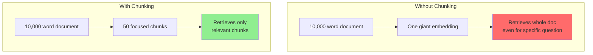
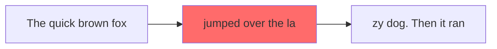
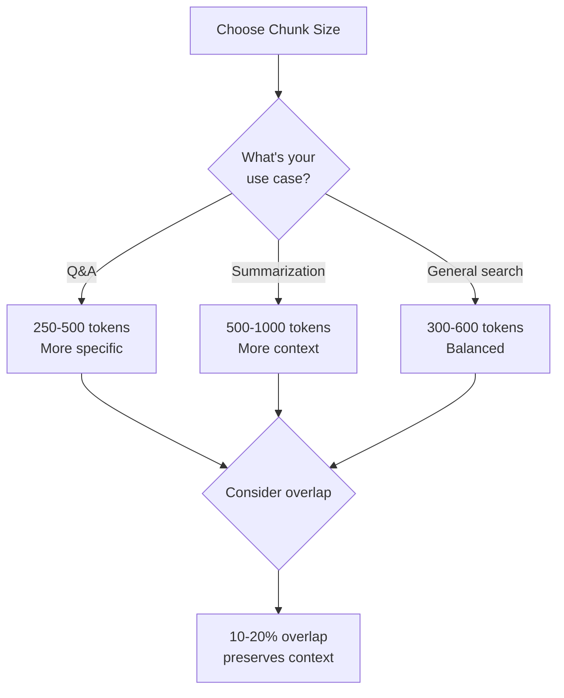
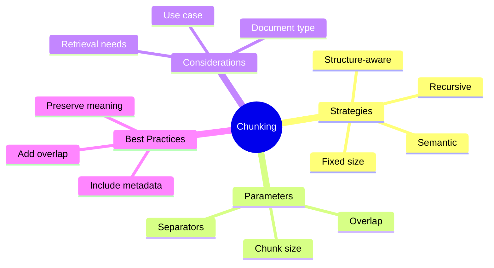

# Text Chunking Strategies

You've parsed your documents into text. But embedding entire documents isn't effective - they're too long and contain mixed topics. The solution? **Chunking** - splitting text into smaller, meaningful pieces.

> **Coming from Software Engineering?** Text chunking is like pagination or sharding — you're breaking large data into smaller, manageable pieces. If you've implemented paginated APIs or database sharding strategies, the tradeoffs are similar: chunk too small and you lose context, chunk too large and you waste resources.

---

## Why Chunk?



### Chunking Benefits

| Aspect | Without Chunks | With Chunks |
|--------|---------------|-------------|
| Search precision | Low | High |
| Context relevance | Mixed | Focused |
| Token usage | High | Optimal |
| Cost | Higher | Lower |

---

## Basic Chunking: Fixed Size

The simplest approach - split every N characters:

```python
# script_id: day_025_text_chunking/fixed_size_chunking
def chunk_by_characters(text: str, chunk_size: int = 1000, overlap: int = 200) -> list[str]:
    """Split text into fixed-size chunks with overlap."""
    chunks = []
    start = 0

    while start < len(text):
        end = start + chunk_size
        chunk = text[start:end]
        chunks.append(chunk)
        start = end - overlap  # Overlap to maintain context

    return chunks

# Usage
text = "Your very long document text here..." * 100
chunks = chunk_by_characters(text, chunk_size=500, overlap=50)
print(f"Created {len(chunks)} chunks")
```

### Problems with Fixed Size



Fixed size can split mid-sentence or mid-word!

---

## Smart Chunking: Recursive Character Splitter

Split at natural boundaries (paragraphs, sentences, words):

```python
# script_id: day_025_text_chunking/recursive_character_splitter
import re

def recursive_chunk(
    text: str,
    chunk_size: int = 1000,
    overlap: int = 200,
    separators: list[str] = None
) -> list[str]:
    """
    Recursively split text using multiple separators.
    Tries to split at paragraph > sentence > word boundaries.
    """
    if separators is None:
        separators = ["\n\n", "\n", ". ", " ", ""]

    chunks = []
    current_sep = separators[0]
    remaining_seps = separators[1:]

    # Base case: text fits in chunk
    if len(text) <= chunk_size:
        return [text.strip()] if text.strip() else []

    # Try to split with current separator
    splits = text.split(current_sep)

    current_chunk = ""
    for split in splits:
        test_chunk = current_chunk + current_sep + split if current_chunk else split

        if len(test_chunk) <= chunk_size:
            current_chunk = test_chunk
        else:
            # Save current chunk if valid
            if current_chunk:
                chunks.append(current_chunk.strip())

            # Handle split that's too large
            if len(split) > chunk_size and remaining_seps:
                # Recursively split with smaller separator
                sub_chunks = recursive_chunk(split, chunk_size, overlap, remaining_seps)
                chunks.extend(sub_chunks)
                current_chunk = ""
            else:
                current_chunk = split

    # Don't forget the last chunk
    if current_chunk:
        chunks.append(current_chunk.strip())

    return [c for c in chunks if c]  # Remove empty chunks

# Usage
document = """
# Introduction

This is the first paragraph about machine learning.
It contains important information about AI.

# Methods

The second section describes our methodology.
We used various techniques including deep learning.

# Results

Our results show significant improvements.
The accuracy increased by 15% compared to baseline.
"""

chunks = recursive_chunk(document, chunk_size=200, overlap=50)
for i, chunk in enumerate(chunks):
    print(f"\n--- Chunk {i+1} ({len(chunk)} chars) ---")
    print(chunk[:100] + "..." if len(chunk) > 100 else chunk)
```

---

## Semantic Chunking

Split based on meaning, not just characters:

```python
# script_id: day_025_text_chunking/semantic_chunking
from openai import OpenAI
import numpy as np

client = OpenAI()

def semantic_chunk(
    text: str,
    max_chunk_size: int = 1000,
    similarity_threshold: float = 0.8
) -> list[str]:
    """
    Split text into semantically coherent chunks.
    Splits when content topic changes significantly.
    """
    # First split into sentences
    sentences = re.split(r'(?<=[.!?])\s+', text)

    if len(sentences) <= 1:
        return [text] if text.strip() else []

    # Get embeddings for all sentences
    response = client.embeddings.create(
        model="text-embedding-3-small",
        input=sentences
    )
    embeddings = [d.embedding for d in sorted(response.data, key=lambda x: x.index)]

    # Find semantic breakpoints
    chunks = []
    current_chunk = [sentences[0]]

    for i in range(1, len(sentences)):
        # Compare with previous sentence
        similarity = np.dot(embeddings[i], embeddings[i-1]) / (
            np.linalg.norm(embeddings[i]) * np.linalg.norm(embeddings[i-1])
        )

        current_text = " ".join(current_chunk)

        # Start new chunk if:
        # 1. Topic changed (low similarity) OR
        # 2. Current chunk is too large
        if similarity < similarity_threshold or len(current_text) > max_chunk_size:
            if current_chunk:
                chunks.append(" ".join(current_chunk))
            current_chunk = [sentences[i]]
        else:
            current_chunk.append(sentences[i])

    # Add last chunk
    if current_chunk:
        chunks.append(" ".join(current_chunk))

    return chunks

# Usage
text = """
Machine learning is a subset of AI. It uses algorithms to learn from data.
Deep learning uses neural networks with many layers.

The weather today is sunny. It's a great day for a picnic.
We should pack sandwiches and drinks.

Back to technology, Python is popular for ML.
It has many libraries like TensorFlow and PyTorch.
"""

chunks = semantic_chunk(text, similarity_threshold=0.75)
for i, chunk in enumerate(chunks):
    print(f"\n--- Semantic Chunk {i+1} ---")
    print(chunk)
```

---

## Markdown-Aware Chunking

Respect document structure:

```python
# script_id: day_025_text_chunking/markdown_aware_chunking
import re
from dataclasses import dataclass

@dataclass
class Chunk:
    content: str
    metadata: dict

def chunk_markdown(
    text: str,
    chunk_size: int = 1000
) -> list[Chunk]:
    """Chunk markdown while preserving headers and structure."""

    # Split by headers
    pattern = r'^(#{1,6})\s+(.+)$'
    lines = text.split('\n')

    chunks = []
    current_chunk = []
    current_headers = {}

    for line in lines:
        header_match = re.match(pattern, line)

        if header_match:
            # Save current chunk if exists
            if current_chunk:
                content = '\n'.join(current_chunk)
                if content.strip():
                    chunks.append(Chunk(
                        content=content.strip(),
                        metadata=current_headers.copy()
                    ))
                current_chunk = []

            # Update header context
            level = len(header_match.group(1))
            header_text = header_match.group(2)

            # Clear lower level headers
            current_headers = {k: v for k, v in current_headers.items() if k < level}
            current_headers[level] = header_text

        current_chunk.append(line)

        # Check chunk size
        current_text = '\n'.join(current_chunk)
        if len(current_text) > chunk_size:
            # Split current chunk
            if len(current_chunk) > 1:
                # Keep last line for next chunk
                content = '\n'.join(current_chunk[:-1])
                if content.strip():
                    chunks.append(Chunk(
                        content=content.strip(),
                        metadata=current_headers.copy()
                    ))
                current_chunk = [current_chunk[-1]]

    # Don't forget last chunk
    if current_chunk:
        content = '\n'.join(current_chunk)
        if content.strip():
            chunks.append(Chunk(
                content=content.strip(),
                metadata=current_headers.copy()
            ))

    return chunks

# Usage
markdown_doc = """
# Chapter 1: Introduction

This is the introduction section.
It provides an overview of the topic.

## 1.1 Background

The background section explains the history.
Many researchers have studied this area.

## 1.2 Motivation

Why is this work important?
There are several key reasons.

# Chapter 2: Methods

Our methodology is described here.

## 2.1 Data Collection

We collected data from various sources.
"""

chunks = chunk_markdown(markdown_doc, chunk_size=200)
for i, chunk in enumerate(chunks):
    print(f"\n--- Chunk {i+1} ---")
    print(f"Headers: {chunk.metadata}")
    print(f"Content: {chunk.content[:100]}...")
```

---

## Choosing Chunk Size



### Chunk Size Guidelines

| Use Case | Chunk Size | Overlap | Reasoning |
|----------|-----------|---------|-----------|
| Precise Q&A | 200-400 chars | 50 | Specific retrieval |
| General search | 500-800 chars | 100 | Balance precision/context |
| Summarization | 1000-1500 chars | 200 | Need full context |
| Code | 50-100 lines | 10 lines | Preserve functions |

---

## Complete Chunking Pipeline

```python
# script_id: day_025_text_chunking/complete_chunking_pipeline
from dataclasses import dataclass
from typing import List, Optional
import re

@dataclass
class DocumentChunk:
    content: str
    source: str
    chunk_index: int
    total_chunks: int
    metadata: dict

class DocumentChunker:
    """Flexible document chunking with multiple strategies."""

    def __init__(
        self,
        chunk_size: int = 500,
        overlap: int = 50,
        strategy: str = "recursive"  # "fixed", "recursive", "sentence"
    ):
        self.chunk_size = chunk_size
        self.overlap = overlap
        self.strategy = strategy

    def chunk(self, text: str, source: str = "unknown", metadata: dict = None) -> List[DocumentChunk]:
        """Chunk a document using the configured strategy."""

        if self.strategy == "fixed":
            raw_chunks = self._fixed_chunk(text)
        elif self.strategy == "recursive":
            raw_chunks = self._recursive_chunk(text)
        elif self.strategy == "sentence":
            raw_chunks = self._sentence_chunk(text)
        else:
            raise ValueError(f"Unknown strategy: {self.strategy}")

        # Wrap in DocumentChunk objects
        return [
            DocumentChunk(
                content=chunk,
                source=source,
                chunk_index=i,
                total_chunks=len(raw_chunks),
                metadata=metadata or {}
            )
            for i, chunk in enumerate(raw_chunks)
        ]

    def _fixed_chunk(self, text: str) -> List[str]:
        """Simple fixed-size chunking."""
        chunks = []
        start = 0
        while start < len(text):
            end = start + self.chunk_size
            chunks.append(text[start:end])
            start = end - self.overlap
        return [c.strip() for c in chunks if c.strip()]

    def _recursive_chunk(self, text: str) -> List[str]:
        """Recursive chunking with smart separators."""
        separators = ["\n\n", "\n", ". ", ", ", " "]
        return self._split_recursive(text, separators)

    def _split_recursive(self, text: str, separators: List[str]) -> List[str]:
        if len(text) <= self.chunk_size:
            return [text] if text.strip() else []

        if not separators:
            # Last resort: hard split
            return self._fixed_chunk(text)

        sep = separators[0]
        splits = text.split(sep)

        chunks = []
        current = ""

        for split in splits:
            test = (current + sep + split) if current else split

            if len(test) <= self.chunk_size:
                current = test
            else:
                if current:
                    chunks.append(current)
                if len(split) > self.chunk_size:
                    chunks.extend(self._split_recursive(split, separators[1:]))
                    current = ""
                else:
                    current = split

        if current:
            chunks.append(current)

        return [c.strip() for c in chunks if c.strip()]

    def _sentence_chunk(self, text: str) -> List[str]:
        """Sentence-based chunking."""
        sentences = re.split(r'(?<=[.!?])\s+', text)

        chunks = []
        current = ""

        for sentence in sentences:
            test = (current + " " + sentence) if current else sentence

            if len(test) <= self.chunk_size:
                current = test
            else:
                if current:
                    chunks.append(current)
                current = sentence

        if current:
            chunks.append(current)

        return [c.strip() for c in chunks if c.strip()]

# Usage
chunker = DocumentChunker(chunk_size=300, overlap=50, strategy="recursive")

document = """
Machine learning is transforming how we build software.

Traditional programming requires explicit rules. Machine learning learns from data instead.

There are three main types of machine learning:
1. Supervised learning uses labeled data
2. Unsupervised learning finds patterns in unlabeled data
3. Reinforcement learning learns through trial and error
"""

chunks = chunker.chunk(document, source="ml_intro.txt", metadata={"topic": "ml"})

print(f"Created {len(chunks)} chunks:\n")
for chunk in chunks:
    print(f"--- Chunk {chunk.chunk_index + 1}/{chunk.total_chunks} ---")
    print(f"Content: {chunk.content}")
    print()
```

---

## Summary



---

## Quick Reference

```python
# script_id: day_025_text_chunking/quick_reference
# Simple fixed-size chunks
def chunk_simple(text, size=500):
    return [text[i:i+size] for i in range(0, len(text), size)]

# Sentence-aware chunks
import re
sentences = re.split(r'(?<=[.!?])\s+', text)

# Paragraph-aware chunks
paragraphs = text.split('\n\n')
```

---

## What's Next?

Now that you can chunk documents effectively, let's learn how to **Inject Retrieved Context into Prompts** - the final piece of the RAG puzzle!
