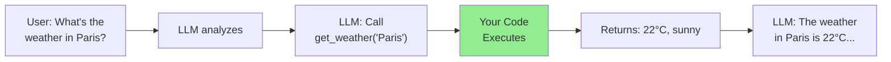
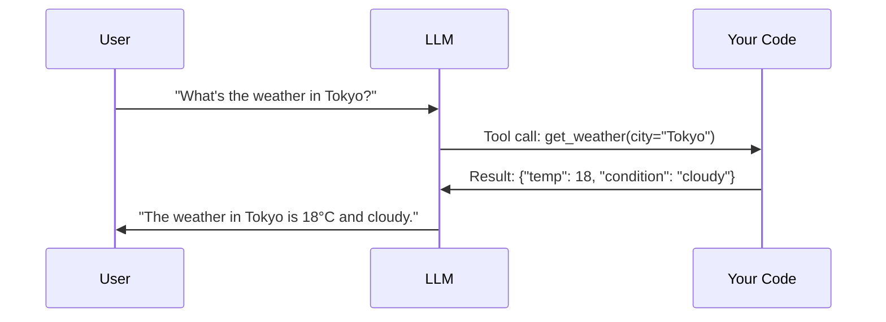
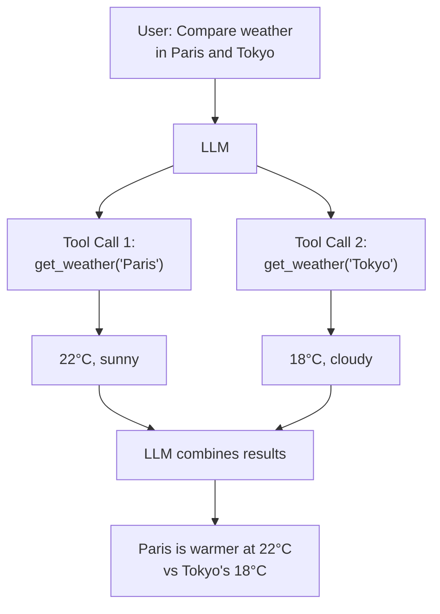
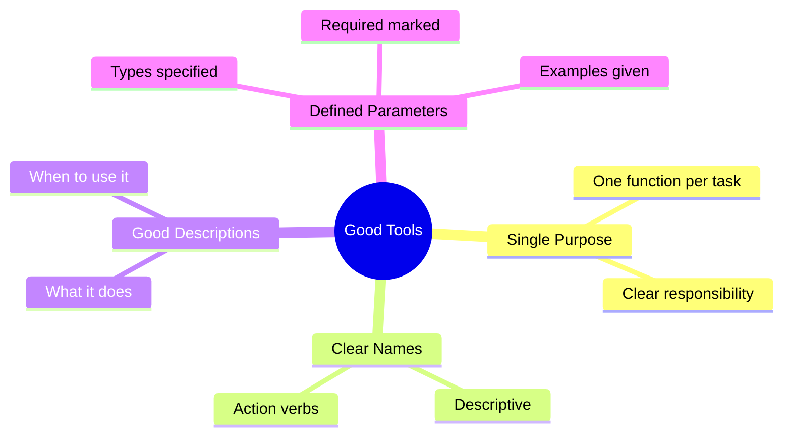
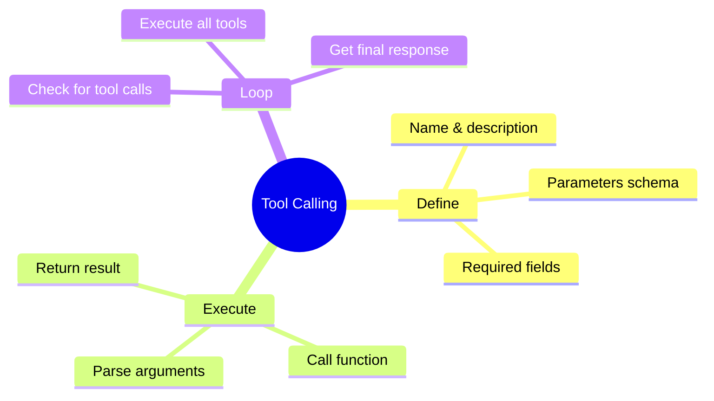

# Native Tool Calling (Function Calling)

Welcome to one of the most powerful LLM capabilities: **Tool Calling** (also known as Function Calling). This allows LLMs to invoke your Python functions, access real-time data, and take actions in the real world!

> **Coming from Software Engineering?** Function calling is RPC for AI. The LLM sees a function signature (like a gRPC proto or OpenAPI spec) and decides to call it with arguments. If you've built webhook systems or defined API contracts, you already understand the core pattern — you're just exposing your functions to an AI client instead of a human one.

---

## What is Tool Calling?



Instead of the LLM making up information, it can request to call your functions!

> **What Can Go Wrong?** Tool calling introduces real-world side effects — the LLM is now triggering your code. Common failure modes:
> - **Hallucinated arguments:** The LLM invents parameters that don't match your schema (e.g., calling `get_weather("Atlantis")`)
> - **Wrong tool selection:** The LLM picks `delete_user()` when it should pick `get_user()`
> - **Infinite loops:** The LLM keeps calling the same tool without making progress
> - **Injection via arguments:** User input flows through the LLM into tool arguments — never pass them to `eval()`, SQL, or shell commands without sanitization
> - **Cost spirals:** Multi-turn tool loops burn tokens on every round trip
>
> We'll address error handling patterns in Days 37-38, but keep these failure modes in mind as you design tool schemas.

---

## The Tool Calling Flow



---

## Defining Tools: The Modern Way

Modern SDKs auto-generate JSON schemas from Pydantic models — no hand-writing schemas.

### OpenAI with Pydantic (Recommended)

```python
# script_id: day_028_function_calling_basics/pydantic_tool_definition
from openai import OpenAI, pydantic_function_tool
from pydantic import BaseModel, Field

client = OpenAI()

# Define your tool as a Pydantic model — the SDK generates the schema for you
class GetWeather(BaseModel):
    """Get the current weather for a location."""
    city: str = Field(description="The city name, e.g., 'London'")
    unit: str = Field(default="celsius", description="Temperature unit", json_schema_extra={"enum": ["celsius", "fahrenheit"]})

# pydantic_function_tool() converts the model to the OpenAI tool format automatically
tools = [pydantic_function_tool(GetWeather)]

# Make a request with tools
response = client.chat.completions.create(
    model="gpt-4o-mini",
    messages=[{"role": "user", "content": "What's the weather in Tokyo?"}],
    tools=tools,
    tool_choice="auto"  # Let the model decide when to use tools
)

print(response.choices[0].message)
```

### What the SDK Generates Under the Hood

The `pydantic_function_tool()` call above produces this raw JSON schema — you rarely need to write this by hand anymore, but understanding it helps with debugging:

```python
# script_id: day_028_function_calling_basics/generated_schema_example
# This is what pydantic_function_tool(GetWeather) generates:
{
    "type": "function",
    "function": {
        "name": "GetWeather",
        "description": "Get the current weather for a location.",
        "parameters": {
            "type": "object",
            "properties": {
                "city": {
                    "type": "string",
                    "description": "The city name, e.g., 'London'"
                },
                "unit": {
                    "type": "string",
                    "enum": ["celsius", "fahrenheit"],
                    "description": "Temperature unit"
                }
            },
            "required": ["city"]
        }
    }
}
```

---

## Implementing Tool Functions

```python
# script_id: day_028_function_calling_basics/tool_calling_loop
import json
from openai import OpenAI, pydantic_function_tool
from pydantic import BaseModel, Field

client = OpenAI()

# Define tool schemas as Pydantic models
class GetWeather(BaseModel):
    """Get current weather for a city."""
    city: str = Field(description="City name")
    unit: str = Field(default="celsius", description="Temperature unit", json_schema_extra={"enum": ["celsius", "fahrenheit"]})

class Calculate(BaseModel):
    """Perform mathematical calculations."""
    expression: str = Field(description="Math expression like '2 + 2'")

# Your actual function implementations
def get_weather(city: str, unit: str = "celsius") -> dict:
    """Get weather for a city (mock implementation)."""
    # In reality, you'd call a weather API here
    weather_data = {
        "Tokyo": {"temp": 18, "condition": "cloudy"},
        "London": {"temp": 12, "condition": "rainy"},
        "Paris": {"temp": 22, "condition": "sunny"},
    }

    data = weather_data.get(city, {"temp": 20, "condition": "unknown"})

    if unit == "fahrenheit":
        data["temp"] = data["temp"] * 9/5 + 32

    return {"city": city, **data, "unit": unit}

def calculate(expression: str) -> dict:
    """Safely evaluate a mathematical expression."""
    try:
        import ast, operator
        def safe_eval(node):
            if isinstance(node, ast.Constant):
                return node.value
            elif isinstance(node, ast.BinOp):
                ops = {ast.Add: operator.add, ast.Sub: operator.sub,
                       ast.Mult: operator.mul, ast.Div: operator.truediv}
                return ops[type(node.op)](safe_eval(node.left), safe_eval(node.right))
            elif isinstance(node, ast.UnaryOp) and isinstance(node.op, ast.USub):
                return -safe_eval(node.operand)
            raise ValueError(f"Unsupported expression")
        
        tree = ast.parse(expression, mode='eval')
        result = safe_eval(tree.body)
        return {"expression": expression, "result": result}
    except Exception as e:
        return {"error": str(e)}

# Map function names to implementations
AVAILABLE_FUNCTIONS = {
    "GetWeather": get_weather,
    "Calculate": calculate,
}

# Generate tool schemas from Pydantic models — no manual JSON needed
tools = [pydantic_function_tool(GetWeather), pydantic_function_tool(Calculate)]
```

---

## Complete Tool Calling Loop

```python
# script_id: day_028_function_calling_basics/tool_calling_loop
def chat_with_tools(user_message: str) -> str:
    """Chat with tool calling capability."""
    messages = [{"role": "user", "content": user_message}]

    # First API call - might request tool use
    response = client.chat.completions.create(
        model="gpt-4o-mini",
        messages=messages,
        tools=tools,
        tool_choice="auto"
    )

    assistant_message = response.choices[0].message

    # Check if model wants to use tools
    if assistant_message.tool_calls:
        # Add assistant's response to messages
        messages.append(assistant_message)

        # Process each tool call
        for tool_call in assistant_message.tool_calls:
            function_name = tool_call.function.name
            function_args = json.loads(tool_call.function.arguments)

            print(f"Calling {function_name} with {function_args}")

            # Execute the function
            if function_name in AVAILABLE_FUNCTIONS:
                result = AVAILABLE_FUNCTIONS[function_name](**function_args)
            else:
                result = {"error": f"Unknown function: {function_name}"}

            # Add tool result to messages
            messages.append({
                "role": "tool",
                "tool_call_id": tool_call.id,
                "content": json.dumps(result)
            })

        # Second API call with tool results
        final_response = client.chat.completions.create(
            model="gpt-4o-mini",
            messages=messages
        )

        return final_response.choices[0].message.content
    else:
        return assistant_message.content

# Test it!
print(chat_with_tools("What's the weather in Paris?"))
print()
print(chat_with_tools("Calculate 15 * 7 + 23"))
print()
print(chat_with_tools("What's 2+2 and what's the weather in London?"))
```

---

## Multiple Tool Calls

LLMs can request multiple tools at once:



```python
# script_id: day_028_function_calling_basics/tool_calling_loop
def process_parallel_tools(response_message):
    """Process multiple tool calls in parallel."""
    results = []

    for tool_call in response_message.tool_calls:
        function_name = tool_call.function.name
        function_args = json.loads(tool_call.function.arguments)

        if function_name in AVAILABLE_FUNCTIONS:
            result = AVAILABLE_FUNCTIONS[function_name](**function_args)
        else:
            result = {"error": f"Unknown function: {function_name}"}

        results.append({
            "role": "tool",
            "tool_call_id": tool_call.id,
            "content": json.dumps(result)
        })

    return results
```

---

## Tool Calling with Anthropic (Claude)

Anthropic uses `input_schema` instead of `parameters`. You can generate this from Pydantic too:

```python
# script_id: day_028_function_calling_basics/tool_calling_loop
from anthropic import Anthropic
from pydantic import BaseModel, Field

client = Anthropic()

# Same Pydantic model, different SDK format
class GetWeather(BaseModel):
    """Get current weather for a city."""
    city: str = Field(description="City name")
    unit: str = Field(default="celsius", description="Temperature unit", json_schema_extra={"enum": ["celsius", "fahrenheit"]})

# Anthropic format: use model_json_schema() to generate input_schema
tools = [
    {
        "name": "get_weather",
        "description": GetWeather.__doc__,
        "input_schema": GetWeather.model_json_schema(),
    }
]

def chat_with_claude_tools(user_message: str) -> str:
    """Chat using Claude's tool calling."""
    messages = [{"role": "user", "content": user_message}]

    response = client.messages.create(
        model="claude-sonnet-4-5",
        max_tokens=1024,
        tools=tools,
        messages=messages
    )

    # Check for tool use
    for block in response.content:
        if block.type == "tool_use":
            tool_name = block.name
            tool_input = block.input

            # Execute function
            result = AVAILABLE_FUNCTIONS[tool_name](**tool_input)

            # Continue conversation with result
            messages.append({"role": "assistant", "content": response.content})
            messages.append({
                "role": "user",
                "content": [{
                    "type": "tool_result",
                    "tool_use_id": block.id,
                    "content": json.dumps(result)
                }]
            })

            # Get final response
            final = client.messages.create(
                model="claude-sonnet-4-5",
                max_tokens=1024,
                messages=messages
            )

            return final.content[0].text

    return response.content[0].text
```

---

## Tool Design Best Practices



### Good Tool Definition

```python
# script_id: day_028_function_calling_basics/good_tool_example
good_tool = {
    "type": "function",
    "function": {
        "name": "search_products",  # Clear, action-oriented name
        "description": "Search for products in the catalog by name, category, or price range. Use this when the user wants to find products to buy.",  # Detailed description
        "parameters": {
            "type": "object",
            "properties": {
                "query": {
                    "type": "string",
                    "description": "Search query, e.g., 'red shoes' or 'laptop'"
                },
                "category": {
                    "type": "string",
                    "enum": ["electronics", "clothing", "home", "sports"],
                    "description": "Product category to filter by"
                },
                "max_price": {
                    "type": "number",
                    "description": "Maximum price in USD"
                },
                "min_price": {
                    "type": "number",
                    "description": "Minimum price in USD"
                }
            },
            "required": ["query"]  # Only truly required params
        }
    }
}
```

### Bad Tool Definition

```python
# script_id: day_028_function_calling_basics/bad_tool_example
bad_tool = {
    "type": "function",
    "function": {
        "name": "do_stuff",  # Vague name
        "description": "Does stuff",  # Useless description
        "parameters": {
            "type": "object",
            "properties": {
                "x": {"type": "string"}  # No description
            },
            "required": ["x", "y", "z"]  # Too many required params
        }
    }
}
```

---

## Forcing Tool Use

Sometimes you want to ensure a specific tool is called:

```python
# script_id: day_028_function_calling_basics/forcing_tool_use
# Force specific tool
response = client.chat.completions.create(
    model="gpt-4o-mini",
    messages=messages,
    tools=tools,
    tool_choice={"type": "function", "function": {"name": "get_weather"}}
)

# Force ANY tool (no direct response allowed)
response = client.chat.completions.create(
    model="gpt-4o-mini",
    messages=messages,
    tools=tools,
    tool_choice="required"
)

# Let model decide (default)
response = client.chat.completions.create(
    model="gpt-4o-mini",
    messages=messages,
    tools=tools,
    tool_choice="auto"
)

# No tools (even if defined)
response = client.chat.completions.create(
    model="gpt-4o-mini",
    messages=messages,
    tools=tools,
    tool_choice="none"
)
```

---

## Complete Tool Calling System

```python
# script_id: day_028_function_calling_basics/complete_tool_system
from openai import OpenAI, pydantic_function_tool
from pydantic import BaseModel, Field
from typing import Callable
import json

class ToolSystem:
    """Reusable tool calling system with Pydantic-based tool registration."""

    def __init__(self):
        self.client = OpenAI()
        self.tools = []
        self.functions = {}

    def register(self, schema: type[BaseModel]):
        """Decorator to register a function as a tool using a Pydantic model."""
        def decorator(func: Callable):
            self.tools.append(pydantic_function_tool(schema))
            self.functions[schema.__name__] = func
            return func
        return decorator

    def chat(self, message: str, max_tool_rounds: int = 5) -> str:
        """Chat with automatic tool handling."""
        messages = [{"role": "user", "content": message}]

        for _ in range(max_tool_rounds):
            response = self.client.chat.completions.create(
                model="gpt-4o-mini",
                messages=messages,
                tools=self.tools if self.tools else None,
                tool_choice="auto" if self.tools else None
            )

            assistant_message = response.choices[0].message

            if not assistant_message.tool_calls:
                return assistant_message.content

            messages.append(assistant_message)

            for tool_call in assistant_message.tool_calls:
                func = self.functions.get(tool_call.function.name)
                if func:
                    args = json.loads(tool_call.function.arguments)
                    result = func(**args)
                else:
                    result = {"error": "Unknown function"}

                messages.append({
                    "role": "tool",
                    "tool_call_id": tool_call.id,
                    "content": json.dumps(result)
                })

        return "Max tool rounds exceeded"

# Usage — define schemas as Pydantic models, register with decorator
system = ToolSystem()

class GetTime(BaseModel):
    """Get the current time."""
    pass

class AddNumbers(BaseModel):
    """Add two numbers together."""
    a: float = Field(description="First number")
    b: float = Field(description="Second number")

@system.register(GetTime)
def get_time():
    from datetime import datetime
    return {"time": datetime.now().strftime("%H:%M:%S")}

@system.register(AddNumbers)
def add_numbers(a: float, b: float):
    return {"result": a + b}

# Chat!
print(system.chat("What time is it?"))
print(system.chat("What's 42 + 17?"))
```

---

## Summary



---

## Quick Reference

| Step | OpenAI | What it does |
|---|---|---|
| Define a tool | `pydantic_function_tool(MyModel)` | Turns a Pydantic model into the tool schema |
| Send tools | `client.chat.completions.create(model="gpt-4o-mini", tools=tools, messages=...)` | Let the model see your functions |
| Detect a call | `response.choices[0].message.tool_calls` | `None` if the model just answered in text |
| Read arguments | `json.loads(tool_call.function.arguments)` | Arguments arrive as a JSON string |
| Return a result | `{"role": "tool", "tool_call_id": tc.id, "content": result}` | Feed the function output back in |
| Loop | re-call `create(...)` with the tool result appended | Model produces the final answer |

---

## Exercises

1. **Add a second tool.** You have a calculator and a clock — add a `get_weather(city)` tool (return a hardcoded dict for now) and confirm the model picks the right tool per question.
2. **Handle the no-tool case.** Ask a question that needs no tool ("Tell me a joke") and verify your loop returns the model's text answer directly without crashing on an empty `tool_calls`.
3. **Measure tool-selection accuracy.** Write 10 prompts where you know the correct tool, run them, and count how often the model calls the expected function.
4. **Make the model call two tools at once.** Ask "What time is it and what's 8 times 9?" — inspect whether the model returns multiple entries in `tool_calls` and make sure your loop executes all of them.

<details><summary>Solutions (approaches)</summary>

1. Define a `Weather` Pydantic model with a `city` field, register it alongside the others, and dispatch on `tool_call.function.name`.
2. Guard the loop: `if not message.tool_calls: return message.content`. Only enter the execute-and-resend branch when calls exist.
3. Store `(prompt, expected_tool)` pairs, run each, compare `tool_calls[0].function.name` to the expected name, and print the hit rate.
4. Iterate over every item in `tool_calls`, append one `{"role": "tool", ...}` message per call (matching `tool_call_id`), then re-call the model once.
</details>

---

## What's Next?

You can expose functions and let the model call them — but hand-writing JSON schemas is brittle. Tomorrow, **Day 29: Tool Schemas with Pydantic**, we generate clean, validated tool definitions from Pydantic models so your contracts stay correct as they grow.
