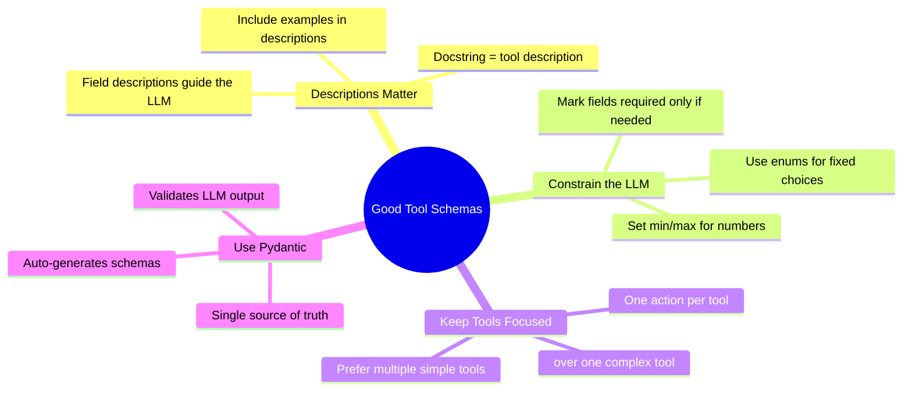
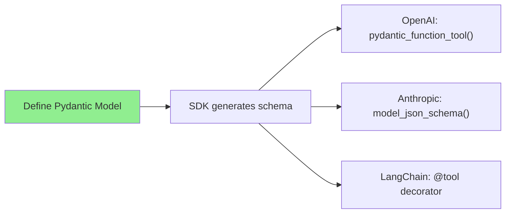

# Tool Schemas: From Pydantic Models to LLM-Ready Definitions

When you want an LLM to call your Python functions, you need to describe those functions in a format the LLM understands: **JSON Schema** (a standard way to describe the shape of a JSON object — its fields, their types, and which are required). The good news: modern SDKs generate these schemas automatically from Pydantic models. You rarely need to write them by hand.

> **Coming from Software Engineering?** This is like OpenAPI/Swagger spec generation. Just as FastAPI auto-generates API docs from your type annotations, LLM SDKs auto-generate tool schemas from Pydantic models. The days of hand-writing JSON schemas for every function are over. The LLM never runs your code. It reads your tool descriptions and, when it decides a tool fits, returns a JSON object naming the tool and its arguments — your code does the actual call. The schema is how the model knows which arguments are valid. And just as a frontend reads your OpenAPI spec to know which endpoints exist and what to send, the LLM reads these tool schemas to pick a tool and fill in its arguments.

---

## The Modern Approach: Pydantic Does the Work

Every major LLM SDK now supports generating tool schemas from Pydantic models. Define your tool once, use it everywhere.

### OpenAI: `pydantic_function_tool()`

```python
# script_id: day_029_tool_schemas_pydantic/openai_pydantic_tool
from openai import OpenAI, pydantic_function_tool
from pydantic import BaseModel, Field
from typing import Optional

client = OpenAI()

class SearchProducts(BaseModel):
    """Search for products in the catalog."""
    query: str = Field(description="Search query for products")
    category: Optional[str] = Field(None, description="Filter by category")
    max_price: Optional[float] = Field(None, description="Maximum price filter")
    max_results: int = Field(10, description="Maximum results to return")

# One line — the SDK generates the full JSON schema
tools = [pydantic_function_tool(SearchProducts)]

response = client.chat.completions.create(
    model="gpt-4o-mini",
    messages=[{"role": "user", "content": "Find me running shoes under $100"}],
    tools=tools,
)
```

That's it. The SDK inspects `SearchProducts`, pulls the docstring as the description, reads field types and descriptions, and produces the full OpenAI tool schema.

### Anthropic: `model_json_schema()`

Anthropic's SDK doesn't have a `pydantic_function_tool()` equivalent, but Pydantic's built-in `model_json_schema()` gets you there:

```python
# script_id: day_029_tool_schemas_pydantic/anthropic_pydantic_tool
from anthropic import Anthropic
from pydantic import BaseModel, Field
from typing import Optional

client = Anthropic()

class SearchProducts(BaseModel):
    """Search for products in the catalog."""
    query: str = Field(description="Search query for products")
    category: Optional[str] = Field(None, description="Filter by category")
    max_price: Optional[float] = Field(None, description="Maximum price filter")
    max_results: int = Field(10, description="Maximum results to return")

# Generate Anthropic-format tool definition from the same Pydantic model
tools = [
    {
        "name": "search_products",
        "description": SearchProducts.__doc__,
        "input_schema": SearchProducts.model_json_schema(),
    }
]

response = client.messages.create(
    model="claude-sonnet-4-6",
    max_tokens=1024,
    tools=tools,
    messages=[{"role": "user", "content": "Find me running shoes under $100"}],
)
```

### LangChain: `@tool` Decorator

LangChain goes even further — it generates schemas directly from function signatures:

```python
# script_id: day_029_tool_schemas_pydantic/langchain_tool_decorator
from langchain_core.tools import tool

@tool
def search_products(query: str, category: str | None = None, max_price: float | None = None) -> list:
    """Search for products in the catalog by name, category, or price range."""
    # Your implementation here
    return [{"name": "Running Shoe", "price": 89.99}]

# Schema is auto-generated from the function signature + docstring
print(search_products.name)          # "search_products"
print(search_products.description)   # "Search for products in the catalog..."
print(search_products.args_schema)   # Pydantic model generated from type hints
```

For more control, combine `@tool` with a Pydantic input model:

```python
# script_id: day_029_tool_schemas_pydantic/langchain_tool_with_schema
from langchain_core.tools import tool
from pydantic import BaseModel, Field

class SearchInput(BaseModel):
    query: str = Field(description="Search query for products")
    category: str | None = Field(None, description="Filter by category")
    max_price: float | None = Field(None, description="Maximum price filter")

@tool(args_schema=SearchInput)
def search_products(query: str, category: str | None = None, max_price: float | None = None) -> list:
    """Search for products in the catalog."""
    return [{"name": "Running Shoe", "price": 89.99}]
```

---

## Under the Hood: What a Raw JSON Schema Looks Like

You rarely write these by hand, but understanding the format helps when debugging tool-calling issues.

```python
# script_id: day_029_tool_schemas_pydantic/raw_json_schema_example
# This is what pydantic_function_tool(SearchProducts) generates for OpenAI.
# Note the strict-mode artifacts: "strict": true, every field in "required",
# optionals expressed as anyOf with null, and additionalProperties: false.
{
    "type": "function",
    "function": {
        "name": "SearchProducts",
        "strict": True,
        "description": "Search for products in the catalog.",
        "parameters": {
            "type": "object",
            "title": "SearchProducts",
            "description": "Search for products in the catalog.",
            "properties": {
                "query": {
                    "type": "string",
                    "title": "Query",
                    "description": "Search query for products"
                },
                "category": {
                    "anyOf": [{"type": "string"}, {"type": "null"}],
                    "title": "Category",
                    "description": "Filter by category"
                },
                "max_price": {
                    "anyOf": [{"type": "number"}, {"type": "null"}],
                    "title": "Max Price",
                    "description": "Maximum price filter"
                },
                "max_results": {
                    "type": "integer",
                    "default": 10,
                    "title": "Max Results",
                    "description": "Maximum results to return"
                }
            },
            "required": ["query", "category", "max_price", "max_results"],
            "additionalProperties": False
        }
    }
}
```

Key things to notice:
- **`name`** comes from the class name (OpenAI) or you set it explicitly (Anthropic)
- **`description`** comes from the docstring
- **`properties`** map to Pydantic fields with types auto-converted
- **`required`**: with bare `model_json_schema()` (the Anthropic path) this includes only fields without defaults; OpenAI's `pydantic_function_tool` uses strict mode, so all fields land in `required` and optional fields become `anyOf` with null
- Anthropic uses `input_schema` instead of `parameters` — same content, different key

---

## Provider Format Differences

The schema content is identical — only the wrapper differs:

```python
# script_id: day_029_tool_schemas_pydantic/provider_format_helpers
from pydantic import BaseModel, Field

class GetWeather(BaseModel):
    """Get current weather for a city."""
    city: str = Field(description="City name")

# Helper to generate for any provider from one Pydantic model
def to_openai(model: type[BaseModel]) -> dict:
    """Convert Pydantic model to OpenAI tool format."""
    from openai import pydantic_function_tool
    return pydantic_function_tool(model)

def to_anthropic(model: type[BaseModel], name: str = None) -> dict:
    """Convert Pydantic model to Anthropic tool format."""
    tool_name = name or model.__name__.lower()
    return {
        "name": tool_name,
        "description": model.__doc__ or "",
        "input_schema": model.model_json_schema(),
    }

# Same model, both providers
openai_tool = to_openai(GetWeather)
anthropic_tool = to_anthropic(GetWeather, name="get_weather")
```

---

## Pydantic Features That Map to Schema Constraints

Pydantic gives you rich schema control through field definitions:

```python
# script_id: day_029_tool_schemas_pydantic/pydantic_schema_constraints
from pydantic import BaseModel, Field
from typing import Literal, Optional
from enum import Enum

class Priority(str, Enum):
    LOW = "low"
    MEDIUM = "medium"
    HIGH = "high"

class CreateTicket(BaseModel):
    """Create a support ticket."""
    
    # String with enum constraint — LLM will only output these values
    priority: Priority = Field(description="Ticket priority level")
    
    # Literal type — alternative to enum for small fixed sets
    category: Literal["bug", "feature", "question"] = Field(description="Ticket type")
    
    # String with length constraints
    title: str = Field(description="Ticket title", min_length=5, max_length=200)
    
    # Optional field with default
    assignee: Optional[str] = Field(None, description="Assign to a team member")
    
    # Number with range
    severity: int = Field(description="Severity from 1 to 5", ge=1, le=5)
    
    # Array field
    tags: list[str] = Field(default_factory=list, description="Tags for categorization")

# See what schema Pydantic generates:
import json
print(json.dumps(CreateTicket.model_json_schema(), indent=2))
```

| Pydantic Feature | JSON Schema Result | LLM Behavior |
|---|---|---|
| `str` | `"type": "string"` | Free text |
| `int` | `"type": "integer"` | Whole numbers |
| `float` | `"type": "number"` | Any number |
| `bool` | `"type": "boolean"` | true/false |
| `list[str]` | `"type": "array", "items": {"type": "string"}` | Array of strings |
| `Literal["a", "b"]` | `"enum": ["a", "b"]` | Constrained choices |
| `Enum` | `"enum": [...]` | Constrained choices |
| `Optional[str]` | Not in `required` (bare `model_json_schema()` path) | LLM may omit |
| `Field(ge=1, le=5)` | `"minimum": 1, "maximum": 5` | Bounded range |
| `Field(min_length=5)` | `"minLength": 5` | Minimum string length |

---

## Nested Models for Complex Tools

```python
# script_id: day_029_tool_schemas_pydantic/nested_models
from pydantic import BaseModel, Field
from typing import Optional

class Location(BaseModel):
    """Event location details."""
    name: str = Field(description="Venue name")
    address: Optional[str] = Field(None, description="Street address")
    virtual: bool = Field(False, description="Whether this is a virtual event")

class CreateEvent(BaseModel):
    """Create a calendar event."""
    title: str = Field(description="Event title")
    date: str = Field(description="Event date in ISO format (YYYY-MM-DD)")
    attendees: list[str] = Field(default_factory=list, description="Attendee email addresses")
    location: Optional[Location] = Field(None, description="Event location")

# Pydantic handles nested models automatically — the generated schema
# includes the Location sub-schema within CreateEvent's properties
```

---

## Best Practices for Tool Schema Design



**Good:** Descriptive fields that guide the LLM
```python
# script_id: day_029_tool_schemas_pydantic/good_schema_example
class SearchProducts(BaseModel):
    """Search for products in the catalog by name, category, or price range.
    Use this when the user wants to find products to buy."""
    query: str = Field(description="Search query, e.g., 'red shoes' or 'laptop'")
    category: Literal["electronics", "clothing", "home", "sports"] | None = Field(
        None, description="Product category to filter by"
    )
```

**Bad:** Vague names and no descriptions
```python
# script_id: day_029_tool_schemas_pydantic/bad_schema_example
class DoStuff(BaseModel):
    """Does stuff."""
    x: str  # No description — LLM will guess what to put here
```

---

## Strict Schemas: Guaranteeing Valid Output

A normal tool schema *describes* the shape you want, but the model can still
return something slightly off. **Strict / structured-output modes** make the
provider *enforce* the schema, so you get valid, parseable output every time —
no defensive `try/except json.loads` dance. Under the hood the provider
restricts the model so it can only produce output that keeps matching the
schema — you don't need the internals, just that the result is guaranteed to
parse.

> **Coming from Software Engineering?** This is the difference between
> documenting an API contract and having the framework validate it. Strict mode
> is server-side request validation for the model's output.

```python
# script_id: day_029_tool_schemas_pydantic/strict_outputs
from openai import OpenAI
client = OpenAI()

# OpenAI: strict tool — the function arguments are guaranteed to match the schema
response = client.chat.completions.create(
    model="gpt-4o",
    messages=[{"role": "user", "content": "Book a flight to Tokyo on 2026-03-15 for 2"}],
    tools=[{
        "type": "function",
        "function": {
            "name": "book_flight",
            "strict": True,                       # enforce the schema
            "parameters": {
                "type": "object",
                "properties": {
                    "destination": {"type": "string"},
                    "date": {"type": "string"},
                    "passengers": {"type": "integer"},
                },
                "required": ["destination", "date", "passengers"],
                "additionalProperties": False,    # required when strict=True
            },
        },
    }],
)
```

On the Anthropic side, the Messages API offers the same guarantee via
`output_config={"format": {"type": "json_schema", "schema": {...}}}` for the
response body, and `strict: True` on a tool to validate its inputs. Either way,
the rule is the same: **let the provider enforce the contract instead of
parsing-and-hoping.**

> **In production:** strict mode removes a whole class of "the model returned
> almost-JSON" bugs. The trade-offs: schemas compile on first use (a one-time
> latency hit, then cached), and a few JSON-Schema features (recursion, numeric
> ranges) aren't supported — validate those client-side.

---

## Summary



| Approach | When to Use |
|---|---|
| `pydantic_function_tool()` (OpenAI) | OpenAI SDK — one-liner, recommended |
| `model_json_schema()` (Anthropic) | Anthropic SDK — generate input_schema from Pydantic |
| `@tool` decorator (LangChain) | LangChain — auto-schema from function signature |
| Raw JSON schema | Debugging, understanding what SDKs generate, edge cases |

---

## Quick Reference

| Goal | Code | Notes |
|---|---|---|
| Define a tool model | `class GetWeather(BaseModel): city: str = Field(..., description="...")` | Descriptions are the model's only hint — write them |
| OpenAI tool spec | `pydantic_function_tool(GetWeather)` | One-liner, OpenAI-formatted |
| Anthropic input_schema | `GetWeather.model_json_schema()` | Feed into `{"name", "description", "input_schema"}` |
| LangChain tool | `@tool` on a typed function | Schema inferred from the signature |
| Validate model output | `GetWeather(**json.loads(args))` | Pydantic raises if the LLM sent bad args |
| Inspect generated schema | `GetWeather.model_json_schema()` | See exactly what the LLM will receive |

---

## Exercises

1. **Add validation to a tool model.** Add a `@field_validator` (Pydantic v2) that rejects an empty `city`, then feed it deliberately bad LLM arguments and confirm it raises before you ever call the function.
2. **Compare generated schemas.** Run `model_json_schema()` and `pydantic_function_tool()` on the same model and diff the output — note how the OpenAI wrapper nests the schema under `function`.
3. **Document a poorly-described tool.** Take a model with a bare `x: str` field, add a real `Field(description=...)`, and measure whether the LLM fills the argument more correctly.
4. **Build a tool registry.** Write a dict mapping tool name → (Pydantic model, handler function) so adding a tool is one entry instead of edits in three places.

<details><summary>Solutions (approaches)</summary>

1. Use `@field_validator("city") @classmethod def non_empty(cls, v): ...` raising `ValueError`. Construct the model from bad args inside a `try/except ValidationError`.
2. Print both as JSON; the OpenAI form is `{"type": "function", "function": {...schema...}}` while `model_json_schema()` is the bare schema.
3. Swap the docstring/`Field(description=...)` and rerun the same prompts; clearer descriptions reduce wrong or empty arguments.
4. `REGISTRY = {"get_weather": (GetWeather, get_weather)}`; generate tool specs by iterating the registry and dispatch by name on a tool call.
</details>

---

## Checkpoint

Run `to_openai` and `to_anthropic` on the same Pydantic model and confirm: both emit valid tool schemas with your fields, types, and descriptions intact — one Pydantic class, two provider formats, no hand-written JSON. If a constraint like an enum or `Field(description=...)` is missing from the output, check that you generated the schema with `model_json_schema()` rather than copying field names by hand.

---

## What's Next?

Now that your tools have proper schemas, let's learn how to **execute tool calls and return results** back to the LLM!
