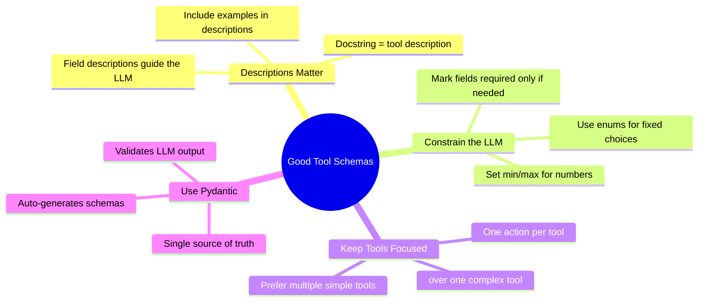
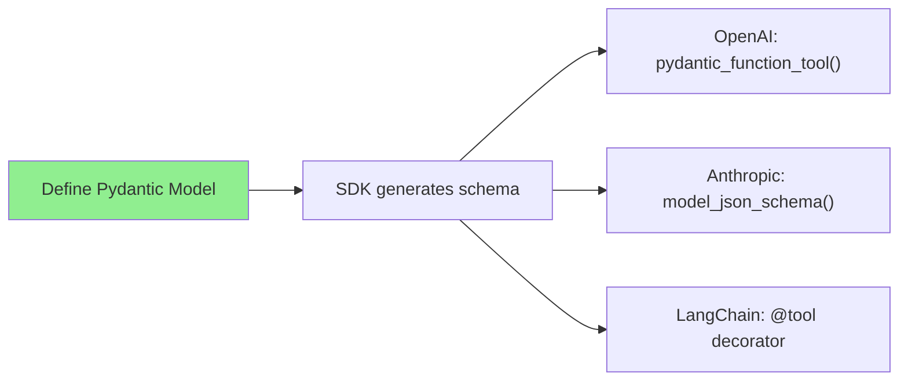

# Tool Schemas: From Pydantic Models to LLM-Ready Definitions

When you want an LLM to call your Python functions, you need to describe those functions in a format the LLM understands: **JSON Schema**. The good news: modern SDKs generate these schemas automatically from Pydantic models. You rarely need to write them by hand.

> **Coming from Software Engineering?** This is like OpenAPI/Swagger spec generation. Just as FastAPI auto-generates API docs from your type annotations, LLM SDKs auto-generate tool schemas from Pydantic models. The days of hand-writing JSON schemas for every function are over.

---

## The Modern Approach: Pydantic Does the Work

Every major LLM SDK now supports generating tool schemas from Pydantic models. Define your tool once, use it everywhere.

### OpenAI: `pydantic_function_tool()`

```python
# script_id: day_029_tool_schemas_pydantic/openai_pydantic_tool
from openai import OpenAI, pydantic_function_tool
from pydantic import BaseModel, Field
from typing import Optional

client = OpenAI()

class SearchProducts(BaseModel):
    """Search for products in the catalog."""
    query: str = Field(description="Search query for products")
    category: Optional[str] = Field(None, description="Filter by category")
    max_price: Optional[float] = Field(None, description="Maximum price filter")
    max_results: int = Field(10, description="Maximum results to return")

# One line — the SDK generates the full JSON schema
tools = [pydantic_function_tool(SearchProducts)]

response = client.chat.completions.create(
    model="gpt-4o-mini",
    messages=[{"role": "user", "content": "Find me running shoes under $100"}],
    tools=tools,
)
```

That's it. The SDK inspects `SearchProducts`, pulls the docstring as the description, reads field types and descriptions, and produces the full OpenAI tool schema.

### Anthropic: `model_json_schema()`

Anthropic's SDK doesn't have a `pydantic_function_tool()` equivalent, but Pydantic's built-in `model_json_schema()` gets you there:

```python
# script_id: day_029_tool_schemas_pydantic/anthropic_pydantic_tool
from anthropic import Anthropic
from pydantic import BaseModel, Field
from typing import Optional

client = Anthropic()

class SearchProducts(BaseModel):
    """Search for products in the catalog."""
    query: str = Field(description="Search query for products")
    category: Optional[str] = Field(None, description="Filter by category")
    max_price: Optional[float] = Field(None, description="Maximum price filter")
    max_results: int = Field(10, description="Maximum results to return")

# Generate Anthropic-format tool definition from the same Pydantic model
tools = [
    {
        "name": "search_products",
        "description": SearchProducts.__doc__,
        "input_schema": SearchProducts.model_json_schema(),
    }
]

response = client.messages.create(
    model="claude-sonnet-4-5",
    max_tokens=1024,
    tools=tools,
    messages=[{"role": "user", "content": "Find me running shoes under $100"}],
)
```

### LangChain: `@tool` Decorator

LangChain goes even further — it generates schemas directly from function signatures:

```python
# script_id: day_029_tool_schemas_pydantic/langchain_tool_decorator
from langchain_core.tools import tool

@tool
def search_products(query: str, category: str = None, max_price: float = None) -> list:
    """Search for products in the catalog by name, category, or price range."""
    # Your implementation here
    return [{"name": "Running Shoe", "price": 89.99}]

# Schema is auto-generated from the function signature + docstring
print(search_products.name)          # "search_products"
print(search_products.description)   # "Search for products in the catalog..."
print(search_products.args_schema)   # Pydantic model generated from type hints
```

For more control, combine `@tool` with a Pydantic input model:

```python
# script_id: day_029_tool_schemas_pydantic/langchain_tool_with_schema
from langchain_core.tools import tool
from pydantic import BaseModel, Field

class SearchInput(BaseModel):
    query: str = Field(description="Search query for products")
    category: str | None = Field(None, description="Filter by category")
    max_price: float | None = Field(None, description="Maximum price filter")

@tool(args_schema=SearchInput)
def search_products(query: str, category: str = None, max_price: float = None) -> list:
    """Search for products in the catalog."""
    return [{"name": "Running Shoe", "price": 89.99}]
```

---

## Under the Hood: What a Raw JSON Schema Looks Like

You rarely write these by hand, but understanding the format helps when debugging tool-calling issues.

```python
# script_id: day_029_tool_schemas_pydantic/raw_json_schema_example
# This is what pydantic_function_tool(SearchProducts) generates for OpenAI:
{
    "type": "function",
    "function": {
        "name": "SearchProducts",
        "description": "Search for products in the catalog.",
        "parameters": {
            "type": "object",
            "properties": {
                "query": {
                    "type": "string",
                    "description": "Search query for products"
                },
                "category": {
                    "type": "string",
                    "description": "Filter by category"
                },
                "max_price": {
                    "type": "number",
                    "description": "Maximum price filter"
                },
                "max_results": {
                    "type": "integer",
                    "default": 10,
                    "description": "Maximum results to return"
                }
            },
            "required": ["query"]
        }
    }
}
```

Key things to notice:
- **`name`** comes from the class name (OpenAI) or you set it explicitly (Anthropic)
- **`description`** comes from the docstring
- **`properties`** map to Pydantic fields with types auto-converted
- **`required`** only includes fields without defaults
- Anthropic uses `input_schema` instead of `parameters` — same content, different key

---

## Provider Format Differences

The schema content is identical — only the wrapper differs:

```python
# script_id: day_029_tool_schemas_pydantic/provider_format_helpers
from pydantic import BaseModel, Field

class GetWeather(BaseModel):
    """Get current weather for a city."""
    city: str = Field(description="City name")

# Helper to generate for any provider from one Pydantic model
def to_openai(model: type[BaseModel]) -> dict:
    """Convert Pydantic model to OpenAI tool format."""
    from openai import pydantic_function_tool
    return pydantic_function_tool(model)

def to_anthropic(model: type[BaseModel], name: str = None) -> dict:
    """Convert Pydantic model to Anthropic tool format."""
    tool_name = name or model.__name__.lower()
    return {
        "name": tool_name,
        "description": model.__doc__ or "",
        "input_schema": model.model_json_schema(),
    }

# Same model, both providers
openai_tool = to_openai(GetWeather)
anthropic_tool = to_anthropic(GetWeather, name="get_weather")
```

---

## Pydantic Features That Map to Schema Constraints

Pydantic gives you rich schema control through field definitions:

```python
# script_id: day_029_tool_schemas_pydantic/pydantic_schema_constraints
from pydantic import BaseModel, Field
from typing import Literal, Optional
from enum import Enum

class Priority(str, Enum):
    LOW = "low"
    MEDIUM = "medium"
    HIGH = "high"

class CreateTicket(BaseModel):
    """Create a support ticket."""
    
    # String with enum constraint — LLM will only output these values
    priority: Priority = Field(description="Ticket priority level")
    
    # Literal type — alternative to enum for small fixed sets
    category: Literal["bug", "feature", "question"] = Field(description="Ticket type")
    
    # String with length constraints
    title: str = Field(description="Ticket title", min_length=5, max_length=200)
    
    # Optional field with default
    assignee: Optional[str] = Field(None, description="Assign to a team member")
    
    # Number with range
    severity: int = Field(description="Severity from 1 to 5", ge=1, le=5)
    
    # Array field
    tags: list[str] = Field(default_factory=list, description="Tags for categorization")

# See what schema Pydantic generates:
import json
print(json.dumps(CreateTicket.model_json_schema(), indent=2))
```

| Pydantic Feature | JSON Schema Result | LLM Behavior |
|---|---|---|
| `str` | `"type": "string"` | Free text |
| `int` | `"type": "integer"` | Whole numbers |
| `float` | `"type": "number"` | Any number |
| `bool` | `"type": "boolean"` | true/false |
| `list[str]` | `"type": "array", "items": {"type": "string"}` | Array of strings |
| `Literal["a", "b"]` | `"enum": ["a", "b"]` | Constrained choices |
| `Enum` | `"enum": [...]` | Constrained choices |
| `Optional[str]` | Not in `required` | LLM may omit |
| `Field(ge=1, le=5)` | `"minimum": 1, "maximum": 5` | Bounded range |
| `Field(min_length=5)` | `"minLength": 5` | Minimum string length |

---

## Nested Models for Complex Tools

```python
# script_id: day_029_tool_schemas_pydantic/nested_models
from pydantic import BaseModel, Field
from typing import Optional

class Location(BaseModel):
    """Event location details."""
    name: str = Field(description="Venue name")
    address: Optional[str] = Field(None, description="Street address")
    virtual: bool = Field(False, description="Whether this is a virtual event")

class CreateEvent(BaseModel):
    """Create a calendar event."""
    title: str = Field(description="Event title")
    date: str = Field(description="Event date in ISO format (YYYY-MM-DD)")
    attendees: list[str] = Field(default_factory=list, description="Attendee email addresses")
    location: Optional[Location] = Field(None, description="Event location")

# Pydantic handles nested models automatically — the generated schema
# includes the Location sub-schema within CreateEvent's properties
```

---

## Best Practices for Tool Schema Design



**Good:** Descriptive fields that guide the LLM
```python
# script_id: day_029_tool_schemas_pydantic/good_schema_example
class SearchProducts(BaseModel):
    """Search for products in the catalog by name, category, or price range.
    Use this when the user wants to find products to buy."""
    query: str = Field(description="Search query, e.g., 'red shoes' or 'laptop'")
    category: Literal["electronics", "clothing", "home", "sports"] | None = Field(
        None, description="Product category to filter by"
    )
```

**Bad:** Vague names and no descriptions
```python
# script_id: day_029_tool_schemas_pydantic/bad_schema_example
class DoStuff(BaseModel):
    """Does stuff."""
    x: str  # No description — LLM will guess what to put here
```

---

## Summary



| Approach | When to Use |
|---|---|
| `pydantic_function_tool()` (OpenAI) | OpenAI SDK — one-liner, recommended |
| `model_json_schema()` (Anthropic) | Anthropic SDK — generate input_schema from Pydantic |
| `@tool` decorator (LangChain) | LangChain — auto-schema from function signature |
| Raw JSON schema | Debugging, understanding what SDKs generate, edge cases |

---

## What's Next?

Now that your tools have proper schemas, let's learn how to **execute tool calls and return results** back to the LLM!
