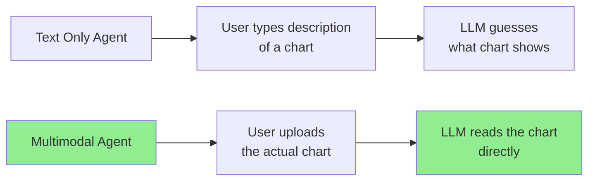
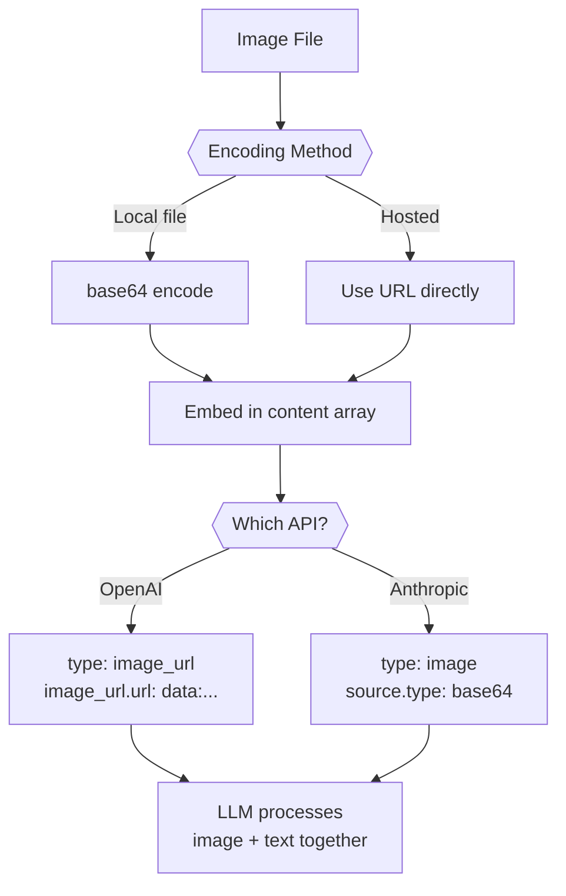
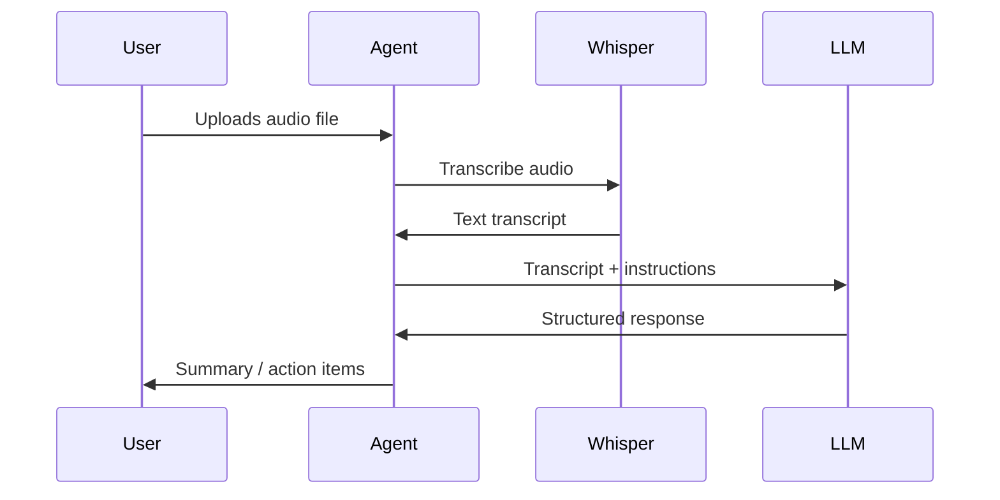
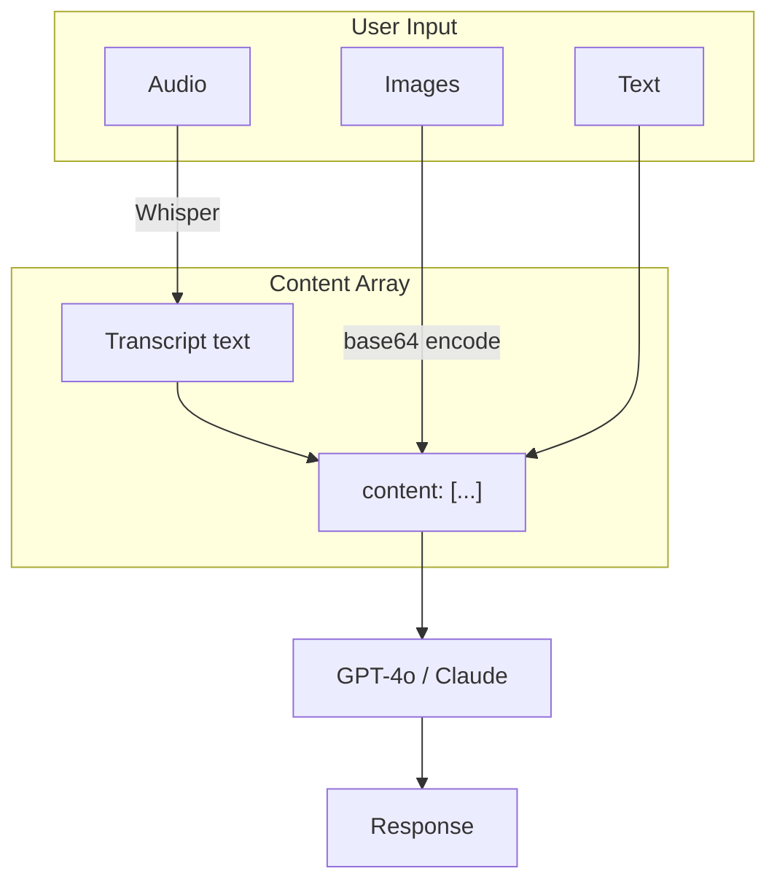
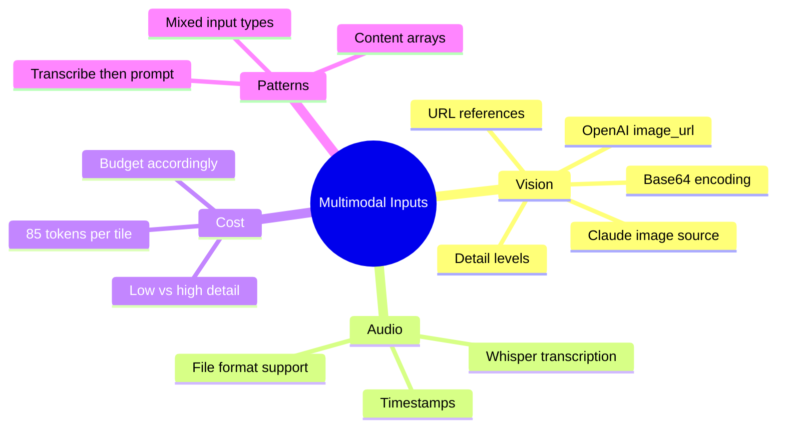

# Multimodal Agent Inputs: Vision and Audio

So far, every agent we have built processes text. The user types a question, the LLM reads it, and text comes back. But the real world is not text-only. Users want to upload a photo of a receipt and ask "how much did I spend on food?", or dictate a voice memo and have an agent summarize it. Multimodal inputs unlock these workflows by letting your agent see images and hear audio alongside text.

> **Coming from Software Engineering?** Multimodal inputs are like adding file upload support to your API — same endpoint, richer payload types. If you have built a REST endpoint that accepts `multipart/form-data` with both JSON fields and file attachments, you already understand the pattern. The LLM API works the same way: instead of a plain text message, you send a content array containing text blocks, image blocks, and audio blocks. The model processes them all in a single request.

---

## Why Multimodal Matters for Agents



Text-only agents force users to describe what they see. Multimodal agents see it for themselves. This eliminates a lossy translation step and opens up use cases that are impossible with text alone:

| Use Case | Input Type | What the Agent Does |
|---|---|---|
| Receipt analysis | Photo | Extracts line items, totals, tax |
| Chart interpretation | Screenshot | Reads axes, trends, data points |
| Document processing | Scanned PDF page | Extracts text, tables, signatures |
| UI bug reports | Screenshot | Identifies layout issues, broken elements |
| Voice commands | Audio recording | Transcribes and executes instructions |
| Meeting notes | Audio file | Transcribes and summarizes discussion |

---

## Vision APIs: Sending Images to LLMs

Both OpenAI and Anthropic support vision through their chat APIs. You send images as part of the message content array — no separate endpoint needed.

### Method 1: Base64-Encoded Images

Encode the image bytes as a base64 string and embed them directly in the API request. This is the most reliable method — no public URL required.

```python
# script_id: day_032_multimodal_inputs/vision_api_examples
import base64
from pathlib import Path
from openai import OpenAI

client = OpenAI()


def encode_image(image_path: str) -> str:
    """Read an image file and return its base64 encoding."""
    image_bytes = Path(image_path).read_bytes()
    return base64.standard_b64encode(image_bytes).decode("utf-8")


def analyze_image(image_path: str, question: str) -> str:
    """Send an image to GPT-4o and ask a question about it."""
    b64_image = encode_image(image_path)

    # Determine MIME type from extension
    suffix = Path(image_path).suffix.lower()
    mime_types = {".png": "image/png", ".jpg": "image/jpeg", ".jpeg": "image/jpeg", ".gif": "image/gif", ".webp": "image/webp"}
    mime_type = mime_types.get(suffix, "image/png")

    response = client.chat.completions.create(
        model="gpt-4o",
        messages=[
            {
                "role": "user",
                "content": [
                    {"type": "text", "text": question},
                    {
                        "type": "image_url",
                        "image_url": {
                            "url": f"data:{mime_type};base64,{b64_image}",
                            "detail": "high"  # how closely the model looks: "low" cheap/coarse, "high" reads fine text but costs more, "auto" picks for you (cost details below)
                        },
                    },
                ],
            }
        ],
        max_tokens=1024,
    )

    return response.choices[0].message.content


# Usage
result = analyze_image("receipt.png", "List every line item and the total.")
print(result)
```

### Method 2: URL-Based Image References

If your image is already hosted at a public URL, skip the encoding step entirely:

```python
# script_id: day_032_multimodal_inputs/vision_api_examples
def analyze_image_url(image_url: str, question: str) -> str:
    """Analyze an image from a URL."""
    response = client.chat.completions.create(
        model="gpt-4o",
        messages=[
            {
                "role": "user",
                "content": [
                    {"type": "text", "text": question},
                    {
                        "type": "image_url",
                        "image_url": {"url": image_url, "detail": "auto"},
                    },
                ],
            }
        ],
        max_tokens=1024,
    )

    return response.choices[0].message.content


# Usage — image already hosted somewhere
result = analyze_image_url(
    "https://example.com/charts/q4-revenue.png",
    "What was the revenue trend in Q4?"
)
```

> **When to use which?** Use base64 for local files, user uploads, and anything not publicly accessible. Use URLs for images already hosted on S3, CDN, or the public web. URLs are faster (no encoding overhead) but require the image to be reachable by the API server.

---

## Vision with Anthropic (Claude)

Claude uses a slightly different content block format — `image` type with `source` instead of `image_url`:

```python
# script_id: day_032_multimodal_inputs/vision_claude
import base64
from pathlib import Path
from anthropic import Anthropic

client = Anthropic()


def encode_image(image_path: str) -> str:
    """Read an image file and return its base64 encoding."""
    return base64.standard_b64encode(Path(image_path).read_bytes()).decode("utf-8")


def analyze_image_claude(image_path: str, question: str) -> str:
    """Send an image to Claude and ask a question about it."""
    b64_image = encode_image(image_path)

    suffix = Path(image_path).suffix.lower()
    media_type = {".png": "image/png", ".jpg": "image/jpeg", ".jpeg": "image/jpeg", ".gif": "image/gif", ".webp": "image/webp"}.get(suffix, "image/png")

    response = client.messages.create(
        model="claude-sonnet-4-6",
        max_tokens=1024,
        messages=[
            {
                "role": "user",
                "content": [
                    {
                        "type": "image",
                        "source": {
                            "type": "base64",
                            "media_type": media_type,
                            "data": b64_image,
                        },
                    },
                    {"type": "text", "text": question},
                ],
            }
        ],
    )

    return response.content[0].text
```



---

## Image Token Costs

Vision is not free. The API tiles your image into chunks and each tile costs tokens. This adds up fast.

### How Tiling Works (OpenAI)

| Detail Level | How It Works | Tokens |
|---|---|---|
| `low` | Image resized to 512x512, single tile | 85 tokens fixed |
| `high` | Image split into 512x512 tiles + thumbnail | 170 tokens per tile + 85 base |
| `auto` | API chooses based on image size | Varies |

OpenAI first shrinks the image so the long side is <=2048px and the short side is <=768px, then counts 512px tiles. A 2048x2048 image shrinks to 768x768 = 4 tiles: `(4 * 170) + 85 = 765 tokens`. At GPT-4o input pricing (~$2.50 per 1M tokens as of 2026-06, verify at OpenAI), that is about $0.0019 per image. Cheap per image, but it adds up across 10,000 receipts.

These constants are OpenAI's documented vision sizing rule, not ML magic: it shrinks the image to fit within 2048px (long side) and 768px (short side), then charges a fixed number of tokens per 512x512 tile plus an 85-token base.

```python
# script_id: day_032_multimodal_inputs/estimate_image_tokens
import math


def estimate_image_tokens(width: int, height: int, detail: str = "high") -> int:
    """Estimate token cost for an image based on dimensions and detail level."""
    if detail == "low":
        return 85

    # High detail: OpenAI's two-step resize, then tile into 512x512.
    # Step 1: shrink so the long side fits within 2048px.
    scale = min(2048 / max(width, height), 1.0)  # long side cap
    w, h = int(width * scale), int(height * scale)
    # Step 2: shrink so the short side fits within 768px.
    scale = min(768 / min(w, h), 1.0)  # short side cap
    w, h = int(w * scale), int(h * scale)

    # Count 512x512 tiles (ceiling division)
    tiles_x = math.ceil(w / 512)
    tiles_y = math.ceil(h / 512)
    total_tiles = tiles_x * tiles_y

    return (total_tiles * 170) + 85  # 170 per tile + 85 base


# Examples
print(estimate_image_tokens(1024, 1024, "high"))   # 765 tokens
print(estimate_image_tokens(2048, 2048, "high"))   # 765 tokens (shrinks to 768x768 = 4 tiles)
print(estimate_image_tokens(512, 512, "low"))      # 85 tokens
```

> **Cost tip:** Always use `detail: "low"` unless you genuinely need to read fine text or small UI elements. For chart trend analysis, `low` is usually sufficient. For reading a receipt line by line, you need `high`.

---

## Audio: Transcription with OpenAI Whisper

For audio inputs, the standard approach is a two-step pipeline: transcribe the audio to text with Whisper, then pass the text to your LLM.

```python
# script_id: day_032_multimodal_inputs/whisper_transcription
from openai import OpenAI
from pathlib import Path

client = OpenAI()


def transcribe_audio(audio_path: str, language: str = None) -> str:
    """Transcribe an audio file using OpenAI Whisper."""
    with open(audio_path, "rb") as audio_file:
        transcript = client.audio.transcriptions.create(
            model="whisper-1",
            file=audio_file,
            language=language,  # Optional: "en", "es", "fr", etc.
            response_format="text",
        )

    return transcript


def transcribe_with_timestamps(audio_path: str) -> dict:
    """Transcribe with word-level timestamps for precise alignment."""
    with open(audio_path, "rb") as audio_file:
        transcript = client.audio.transcriptions.create(
            model="whisper-1",
            file=audio_file,
            response_format="verbose_json",
            timestamp_granularities=["word"],
        )

    return transcript


# Usage
text = transcribe_audio("meeting_recording.mp3")
print(text)

# With timestamps
detailed = transcribe_with_timestamps("meeting_recording.mp3")
for word_info in detailed.words[:10]:
    print(f"  [{word_info.start:.1f}s] {word_info.word}")
```



Whisper supports mp3, mp4, mpeg, mpga, m4a, wav, and webm files up to 25 MB. For longer recordings, split them into chunks first.

---

## Building a Multimodal Agent

Now let us combine everything into an agent that handles text, images, and audio in a single conversation:

```python
# script_id: day_032_multimodal_inputs/multimodal_agent
import base64
import json
from pathlib import Path
from openai import OpenAI

client = OpenAI()


class MultimodalAgent:
    """Agent that processes text, images, and audio inputs."""

    def __init__(self, system_prompt: str = "You are a helpful multimodal assistant."):
        self.system_prompt = system_prompt
        self.messages = [{"role": "system", "content": system_prompt}]

    def _encode_image(self, path: str) -> tuple[str, str]:
        """Encode image and determine MIME type."""
        data = base64.standard_b64encode(Path(path).read_bytes()).decode()
        suffix = Path(path).suffix.lower()
        mime = {".png": "image/png", ".jpg": "image/jpeg",
                ".jpeg": "image/jpeg", ".webp": "image/webp"}.get(suffix, "image/png")
        return data, mime

    def _transcribe(self, audio_path: str) -> str:
        """Transcribe audio to text via Whisper."""
        with open(audio_path, "rb") as f:
            return client.audio.transcriptions.create(
                model="whisper-1", file=f, response_format="text"
            )

    def send(
        self,
        text: str = None,
        image_paths: list[str] = None,
        audio_paths: list[str] = None,
    ) -> str:
        """
        Send a multimodal message. Any combination of text, images,
        and audio can be provided.
        """
        content = []

        # Transcribe any audio files and prepend as text
        if audio_paths:
            for path in audio_paths:
                transcript = self._transcribe(path)
                content.append({
                    "type": "text",
                    "text": f"[Transcribed audio from {Path(path).name}]:\n{transcript}",
                })

        # Add images
        if image_paths:
            for path in image_paths:
                data, mime = self._encode_image(path)
                content.append({
                    "type": "image_url",
                    "image_url": {
                        "url": f"data:{mime};base64,{data}",
                        "detail": "auto",
                    },
                })

        # Add text prompt
        if text:
            content.append({"type": "text", "text": text})

        # Build message — use plain string if text-only
        if len(content) == 1 and content[0]["type"] == "text":
            self.messages.append({"role": "user", "content": content[0]["text"]})
        else:
            self.messages.append({"role": "user", "content": content})

        # Call the model
        response = client.chat.completions.create(
            model="gpt-4o",
            messages=self.messages,
            max_tokens=2048,
        )

        reply = response.choices[0].message.content
        self.messages.append({"role": "assistant", "content": reply})
        return reply


# Usage examples
agent = MultimodalAgent(
    system_prompt="You are an expense tracking assistant. "
    "Extract amounts, categories, and dates from receipts."
)

# Text only
print(agent.send(text="Hi, I need help tracking my expenses this month."))

# Image + text
print(agent.send(
    text="What did I buy and how much did it cost?",
    image_paths=["receipt_lunch.jpg"],
))

# Audio + image + text
print(agent.send(
    text="Here is a voice note about this receipt. Summarize everything.",
    image_paths=["receipt_dinner.png"],
    audio_paths=["voice_note.m4a"],
))
```



---

## Practical Use Case: Screenshot Analyzer

Here is a focused agent that analyzes UI screenshots for a QA workflow:

```python
# script_id: day_032_multimodal_inputs/screenshot_analyzer
import base64
from pathlib import Path
from openai import OpenAI


class ScreenshotAnalyzer:
    """Analyze UI screenshots for bugs, layout issues, and accessibility."""

    def __init__(self):
        self.client = OpenAI()
        self.system_prompt = (
            "You are a QA engineer analyzing UI screenshots. "
            "For each screenshot, report:\n"
            "1. Visual bugs (misalignment, overflow, clipping)\n"
            "2. Accessibility issues (contrast, missing labels)\n"
            "3. Content issues (typos, placeholder text)\n"
            "Format as a structured list with severity: HIGH, MEDIUM, LOW."
        )

    def analyze(self, screenshot_path: str, context: str = "") -> str:
        """Analyze a single screenshot."""
        b64 = base64.standard_b64encode(
            Path(screenshot_path).read_bytes()
        ).decode()

        prompt = "Analyze this UI screenshot for issues."
        if context:
            prompt += f"\nContext: {context}"

        response = self.client.chat.completions.create(
            model="gpt-4o",
            messages=[
                {"role": "system", "content": self.system_prompt},
                {
                    "role": "user",
                    "content": [
                        {"type": "text", "text": prompt},
                        {
                            "type": "image_url",
                            "image_url": {
                                "url": f"data:image/png;base64,{b64}",
                                "detail": "high",  # Need high for UI details
                            },
                        },
                    ],
                },
            ],
            max_tokens=1024,
        )

        return response.choices[0].message.content


# Usage
qa = ScreenshotAnalyzer()
issues = qa.analyze(
    "checkout_page.png",
    context="This is the checkout page on mobile Safari, iOS 17."
)
print(issues)
```

---

## Cost Comparison: Text vs. Multimodal

Understanding cost differences helps you decide when vision is worth it:

| Input Type | Tokens (approx) | Cost per request (GPT-4o) |
|---|---|---|
| 500-word text prompt | ~700 tokens | $0.0018 |
| Single image (low detail) | 85 tokens | $0.0002 |
| Single image (high detail, 1024x1024) | 765 tokens | $0.0019 |
| Single image (high detail, 2048x2048) | 765 tokens | $0.0019 |
| 1-minute audio (Whisper) | N/A (flat rate) | ~$0.006/min (as of 2026-06, verify at OpenAI) |
| Image + text combo | ~1,500 tokens | $0.0038 |

> **Key insight:** A single high-resolution image costs roughly the same as a 500-word text prompt. The real cost danger is processing many images per request or using `high` detail when `low` would suffice.

---

## Checkpoint

Run `analyze_image` on a local screenshot with a concrete question and confirm: the model answers about what's actually in the picture, not a generic guess. If you get a 400/invalid-image error, check that `encode_image` base64-encodes the bytes *and* that you set the correct media type in the request (`image/png` vs. `image/jpeg`) — a mismatched type is the usual culprit.

---

## Summary



---

## Quick Reference

```text
# Base64 encode an image
import base64; b64 = base64.standard_b64encode(open("img.png","rb").read()).decode()

# OpenAI vision message
{"type": "image_url", "image_url": {"url": f"data:image/png;base64,{b64}", "detail": "auto"}}

# Claude vision message
{"type": "image", "source": {"type": "base64", "media_type": "image/png", "data": b64}}

# OpenAI URL-based image
{"type": "image_url", "image_url": {"url": "https://example.com/image.png"}}

# Whisper transcription
client.audio.transcriptions.create(model="whisper-1", file=open("audio.mp3","rb"))

# Estimate image tokens (high detail)
# First fit within 2048x2048, then shrink short side to <=768; then:
tokens = (ceil(w/512) * ceil(h/512) * 170) + 85
```

---

## Practice Exercises

1. **Receipt Scanner:** Build an agent that accepts a photo of a receipt, extracts all line items into a structured JSON object with fields for `item`, `quantity`, `price`, and `total`, and calculates whether the listed total matches the sum of line items.

2. **Voice Memo Summarizer:** Create a pipeline that takes an audio file, transcribes it with Whisper, then passes the transcript to an LLM with instructions to produce a bullet-point summary and a list of action items. Add word-level timestamps so each action item references when it was mentioned.

3. **Multimodal QA Bot:** Build an agent that accepts a screenshot of a web page plus a text question (e.g., "Is the navigation bar aligned correctly?"). The agent should analyze the image, answer the question, and output a severity-rated list of any other issues it notices. Compare costs between `low` and `high` detail modes for the same image.

<details>
<summary>Solutions (approaches)</summary>

1. **Receipt Scanner:** Encode the receipt with `encode_image`, prompt GPT-4o for strict JSON line items (`item`, `quantity`, `price`, `total`), then in plain Python assert `sum(line prices) == total` — the model reads the image, your code does the arithmetic check.
2. **Voice Memo Summarizer:** Call Whisper with `response_format="verbose_json"` and `timestamp_granularities=["word"]`, feed the transcript to an LLM asking for bullet-point notes plus action items, then tag each action item with the nearest `word.start` timestamp.
3. **Multimodal QA Bot:** Send the screenshot + question at `detail="high"`, then re-run the same call at `detail="low"` and diff the token counts via `estimate_image_tokens` to see the cost trade-off for yourself.

</details>

---

## What's Next?

With vision and audio in our toolkit, let's understand the **cost engineering** behind all these API calls! In the next lesson, we will learn how to estimate, track, and optimize LLM spending — because multimodal inputs make cost awareness even more critical when every image eats hundreds of tokens.
