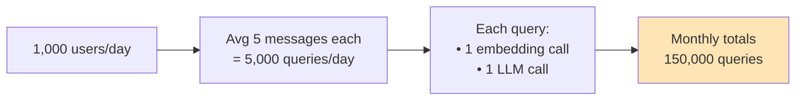
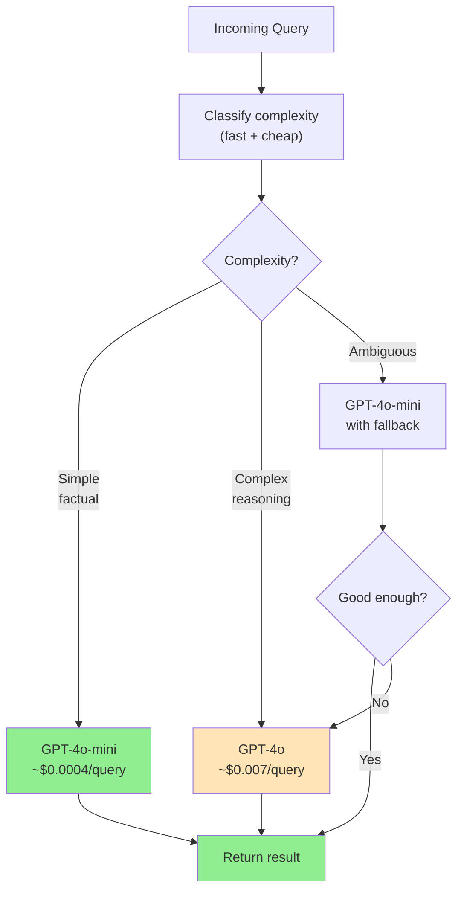
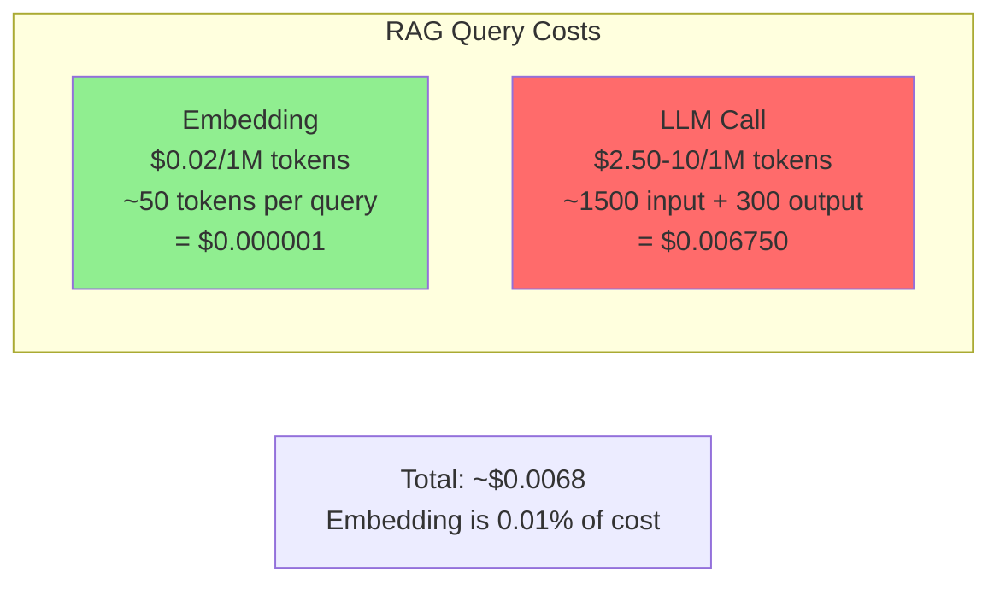

# Cost Engineering for LLMs

You have built a working RAG chatbot. It answers questions, users love it. Then you get the AWS bill. $3,400 for the month. Nobody told you it would cost that. Nobody asked you to think about it.

> **Coming from Software Engineering?** Cost engineering for LLMs is like capacity planning for cloud infrastructure — but per-request instead of per-server. You already think about compute costs, caching strategies, and choosing the right instance size. Here, the "instance" is the model tier, the "compute" is tokens, and the "cache" is prompt caching or response memoization. The same discipline of measuring, budgeting, and optimizing applies — the units just changed from CPU-hours to token-dollars.

Cost engineering is the discipline that prevents that moment. It is not about being cheap — it is about knowing exactly what things cost, predicting those costs, and building systems that stay within budget while delivering value.

---

## Token Pricing: The Reality Check

> **Note:** API prices change frequently. The rates below are approximate as of early 2025. Always check provider pricing pages for current rates before making budget decisions.

Every LLM call costs money based on tokens. Here is the current landscape:

| Model | Input (per 1M tokens) | Output (per 1M tokens) | Notes |
|---|---|---|---|
| GPT-4o | $2.50 | $10.00 | OpenAI flagship |
| GPT-4o-mini | $0.15 | $0.60 | 17x cheaper than GPT-4o |
| Claude Sonnet 4.6 | $3.00 | $15.00 | Balanced Anthropic model |
| Claude Haiku 4.5 | $1.00 | $5.00 | Fast, cheap Anthropic model |
| Claude Opus 4.6 | $5.00 | $25.00 | Most capable Opus-tier |
| Gemini 2.0 Flash | $0.075 | $0.30 | Very cheap, good for high volume |
| Llama 3.1 70B (self-hosted) | ~$0.50-1.00 | ~$0.50-1.00 | Depends on your GPU costs |

*Prices as of early 2025, always verify at the provider's pricing page.*

The key insight: **output tokens cost 4-5x more than input tokens**. Your prompt is relatively cheap. The response is expensive.

---

## Counting Tokens Before You Spend

The `tiktoken` library lets you count tokens exactly before making an API call.

```python
# script_id: day_033_cost_engineering_for_llms/token_counting
import tiktoken
from openai import OpenAI

def count_tokens(text: str, model: str = "gpt-4o") -> int:
    """Count tokens for a given text and model."""
    enc = tiktoken.encoding_for_model(model)
    return len(enc.encode(text))


def count_message_tokens(messages: list[dict], model: str = "gpt-4o") -> int:
    """Count tokens for a messages array (includes formatting overhead)."""
    enc = tiktoken.encoding_for_model(model)
    
    # OpenAI adds per-message overhead
    tokens_per_message = 3
    tokens_per_name = 1
    
    total = 0
    for message in messages:
        total += tokens_per_message
        for key, value in message.items():
            # `content` can be a list for multimodal messages (text + image
            # parts); tiktoken.encode only accepts a str, so guard for it.
            if isinstance(value, str):
                total += len(enc.encode(value))
            elif isinstance(value, list):
                for part in value:
                    if isinstance(part, dict) and part.get("type") == "text":
                        total += len(enc.encode(part.get("text", "")))
                    # image parts are priced separately, not by tiktoken
            if key == "name":
                total += tokens_per_name
    
    total += 3  # Reply priming tokens
    return total


# Usage
messages = [
    {"role": "system", "content": "You are a helpful assistant."},
    {"role": "user", "content": "Summarize the French Revolution in 3 bullet points."},
]

input_tokens = count_message_tokens(messages)
print(f"Input tokens: {input_tokens}")
print(f"Estimated input cost (GPT-4o): ${input_tokens / 1_000_000 * 2.50:.6f}")
```

---

## Calculating Real Costs

```python
# script_id: day_033_cost_engineering_for_llms/cost_calculation
from dataclasses import dataclass


@dataclass
class ModelPricing:
    input_per_million: float   # USD per 1M input tokens
    output_per_million: float  # USD per 1M output tokens


PRICING = {
    "gpt-4o": ModelPricing(input_per_million=2.50, output_per_million=10.00),
    "gpt-4o-mini": ModelPricing(input_per_million=0.15, output_per_million=0.60),
    "claude-sonnet-4-5": ModelPricing(input_per_million=3.00, output_per_million=15.00),
    "claude-haiku-4-5": ModelPricing(input_per_million=1.00, output_per_million=5.00),
}


def calculate_cost(
    model: str,
    input_tokens: int,
    output_tokens: int
) -> float:
    """Calculate cost in USD for a single API call."""
    pricing = PRICING.get(model)
    if not pricing:
        raise ValueError(f"Unknown model: {model}")
    
    input_cost = (input_tokens / 1_000_000) * pricing.input_per_million
    output_cost = (output_tokens / 1_000_000) * pricing.output_per_million
    return input_cost + output_cost


# Example: A typical RAG query
rag_query_cost = calculate_cost(
    model="gpt-4o",
    input_tokens=1500,   # System prompt + context + question
    output_tokens=300,   # Answer
)
print(f"Cost per RAG query (GPT-4o): ${rag_query_cost:.6f}")
# → $0.006750

# Same query on GPT-4o-mini
rag_query_mini_cost = calculate_cost(
    model="gpt-4o-mini",
    input_tokens=1500,
    output_tokens=300,
)
print(f"Cost per RAG query (GPT-4o-mini): ${rag_query_mini_cost:.6f}")
# → $0.000405
```

---

## The Real Cost Breakdown: A RAG Chatbot

Let's build a real cost model for a RAG chatbot serving 1,000 users per day.



```python
# script_id: day_033_cost_engineering_for_llms/cost_calculation
def estimate_monthly_cost(
    daily_users: int,
    messages_per_user: float,
    avg_input_tokens: int,
    avg_output_tokens: int,
    llm_model: str,
    embedding_model: str = "text-embedding-3-small",
) -> dict:
    """Estimate monthly cost for a RAG chatbot."""
    
    # Embedding costs
    EMBEDDING_COST_PER_MILLION = {
        "text-embedding-3-small": 0.02,
        "text-embedding-3-large": 0.13,
    }
    
    monthly_queries = daily_users * messages_per_user * 30
    
    # Embedding: each query gets embedded (short, ~50 tokens)
    embedding_tokens = monthly_queries * 50
    embedding_cost = (embedding_tokens / 1_000_000) * EMBEDDING_COST_PER_MILLION[embedding_model]
    
    # LLM calls
    llm_cost = monthly_queries * calculate_cost(llm_model, avg_input_tokens, avg_output_tokens)
    
    total = embedding_cost + llm_cost
    cost_per_user_per_month = total / (daily_users * 30)
    
    return {
        "monthly_queries": monthly_queries,
        "embedding_cost_usd": round(embedding_cost, 2),
        "llm_cost_usd": round(llm_cost, 2),
        "total_usd": round(total, 2),
        "cost_per_user_per_month_usd": round(cost_per_user_per_month, 4),
    }


# Scenario 1: GPT-4o (premium quality)
premium = estimate_monthly_cost(
    daily_users=1000,
    messages_per_user=5,
    avg_input_tokens=1500,
    avg_output_tokens=300,
    llm_model="gpt-4o",
)
print("GPT-4o scenario:")
print(f"  Monthly cost: ${premium['total_usd']:,.2f}")
print(f"  Cost per user/month: ${premium['cost_per_user_per_month_usd']:.4f}")
# → Monthly cost: $1,012.50 (~$1K/month)

# Scenario 2: GPT-4o-mini (budget)
budget = estimate_monthly_cost(
    daily_users=1000,
    messages_per_user=5,
    avg_input_tokens=1500,
    avg_output_tokens=300,
    llm_model="gpt-4o-mini",
)
print("\nGPT-4o-mini scenario:")
print(f"  Monthly cost: ${budget['total_usd']:,.2f}")
print(f"  Cost per user/month: ${budget['cost_per_user_per_month_usd']:.4f}")
# → Monthly cost: ~$61/month (16x cheaper!)
```

**The takeaway:** switching from GPT-4o to GPT-4o-mini for a 1,000 user RAG chatbot saves about $950/month. That is not an engineering decision — that is a business decision you need data to make.

---

## Model Routing: Smart Cost Optimization

The best strategy is not to always use the cheap model or always use the expensive one. It is to **route intelligently**: use the cheap model for easy queries, escalate to the expensive model only when needed.



```python
# script_id: day_033_cost_engineering_for_llms/model_routing
from openai import OpenAI
from pydantic import BaseModel
from enum import Enum

client = OpenAI()


class QueryComplexity(str, Enum):
    SIMPLE = "simple"
    COMPLEX = "complex"


class ComplexityResult(BaseModel):
    complexity: QueryComplexity
    reason: str


def classify_query(query: str) -> QueryComplexity:
    """Classify query complexity using a cheap, fast model."""
    response = client.chat.completions.create(
        model="gpt-4o-mini",  # Always use cheap model for routing
        messages=[
            {
                "role": "system",
                "content": """Classify this query as 'simple' or 'complex'.
                
Simple: factual questions, lookups, definitions, yes/no, greetings
Complex: multi-step reasoning, code generation, analysis, comparisons, synthesis

Respond with JSON: {"complexity": "simple" or "complex", "reason": "brief reason"}"""
            },
            {"role": "user", "content": query},
        ],
        response_format={"type": "json_object"},
        max_tokens=50,  # Keep routing cheap
    )
    
    import json
    data = json.loads(response.choices[0].message.content)
    return QueryComplexity(data["complexity"])


def smart_query(query: str, context: str = "") -> tuple[str, str]:
    """Route query to appropriate model based on complexity.
    
    Returns: (answer, model_used)
    """
    complexity = classify_query(query)
    
    model = "gpt-4o" if complexity == QueryComplexity.COMPLEX else "gpt-4o-mini"
    
    messages = [
        {"role": "system", "content": "You are a helpful assistant."},
    ]
    if context:
        messages.append({"role": "system", "content": f"Context:\n{context}"})
    messages.append({"role": "user", "content": query})
    
    response = client.chat.completions.create(
        model=model,
        messages=messages,
    )
    
    return response.choices[0].message.content, model


# Test it
queries = [
    "What is the capital of France?",       # Simple
    "Compare and contrast React vs Vue for a large enterprise app with 50 developers",  # Complex
    "How do I install Python?",             # Simple
    "Design a caching strategy for a distributed system with 10M requests/day",  # Complex
]

for q in queries:
    answer, model_used = smart_query(q)
    print(f"Model: {model_used:15} | Query: {q[:50]}...")
```

---

## Caching: The Biggest Cost Saver

### Exact Match Cache

For deterministic queries (same input = same output), cache aggressively.

```python
# script_id: day_033_cost_engineering_for_llms/cost_calculation
import hashlib
import json
import time
from functools import wraps

# Simple in-memory cache (use Redis in production)
_cache: dict[str, dict] = {}


def cache_key(model: str, messages: list[dict]) -> str:
    """Generate a deterministic cache key."""
    content = json.dumps({"model": model, "messages": messages}, sort_keys=True)
    return hashlib.sha256(content.encode()).hexdigest()


def cached_completion(
    client,
    model: str,
    messages: list[dict],
    temperature: float = 0,
    ttl_seconds: int = 3600,
    **kwargs
):
    """LLM completion with exact-match caching.
    
    Only safe to cache when temperature=0 (deterministic).
    """
    if temperature != 0:
        # Non-deterministic: skip cache
        return client.chat.completions.create(
            model=model,
            messages=messages,
            temperature=temperature,
            **kwargs
        )
    
    key = cache_key(model, messages)
    now = time.time()
    
    if key in _cache:
        entry = _cache[key]
        if now - entry["timestamp"] < ttl_seconds:
            print(f"Cache HIT (saved ~${entry['estimated_cost']:.6f})")
            return entry["response"]
    
    # Cache MISS: make the real call
    response = client.chat.completions.create(
        model=model,
        messages=messages,
        temperature=temperature,
        **kwargs
    )
    
    cost = calculate_cost(
        model,
        response.usage.prompt_tokens,
        response.usage.completion_tokens
    )
    
    _cache[key] = {
        "response": response,
        "timestamp": now,
        "estimated_cost": cost,
    }
    
    return response
```

### Semantic Cache

For similar queries that should get the same answer, use embedding similarity.

```python
# script_id: day_033_cost_engineering_for_llms/semantic_cache
import numpy as np
from openai import OpenAI

client = OpenAI()

class SemanticCache:
    """Cache LLM responses based on semantic similarity of queries."""
    
    def __init__(self, similarity_threshold: float = 0.95):
        self.threshold = similarity_threshold
        self.entries: list[dict] = []  # In prod: use a vector DB
    
    def _embed(self, text: str) -> list[float]:
        response = client.embeddings.create(
            model="text-embedding-3-small",
            input=text,
        )
        return response.data[0].embedding
    
    def _cosine_similarity(self, a: list[float], b: list[float]) -> float:
        a, b = np.array(a), np.array(b)
        return float(np.dot(a, b) / (np.linalg.norm(a) * np.linalg.norm(b)))
    
    def get(self, query: str) -> str | None:
        """Find a cached response for a semantically similar query."""
        if not self.entries:
            return None
        
        query_embedding = self._embed(query)
        
        best_match = None
        best_score = 0
        
        for entry in self.entries:
            score = self._cosine_similarity(query_embedding, entry["embedding"])
            if score > best_score:
                best_score = score
                best_match = entry
        
        if best_score >= self.threshold:
            print(f"Semantic cache HIT (similarity: {best_score:.3f})")
            return best_match["response"]
        
        return None
    
    def set(self, query: str, response: str):
        """Cache a response with its query embedding."""
        embedding = self._embed(query)
        self.entries.append({
            "query": query,
            "embedding": embedding,
            "response": response,
        })


# Usage
cache = SemanticCache(similarity_threshold=0.92)

def cached_rag_query(query: str) -> str:
    # Check semantic cache first (cheap: just one embedding call)
    cached = cache.get(query)
    if cached:
        return cached
    
    # Full RAG pipeline (expensive)
    response = "... full LLM response ..."
    cache.set(query, response)
    return response

# These two queries should hit the same cache entry:
# "What is the return policy?" → cache miss, stores embedding
# "How do I return a product?" → cache hit! (semantically similar)
```

---

## Prompt Caching

Application-level caching (exact match, semantic) is powerful, but the API providers themselves offer server-side caching that works at the token level. Anthropic's prompt caching is the most impactful example.

**How it works:** Anthropic caches the prefix of your prompt on their servers. If the same prefix appears in subsequent requests, those cached input tokens cost 90% less. You mark cacheable content with `cache_control` in the API call.

> **Coming from Software Engineering?** This is conceptually identical to HTTP `Cache-Control` headers. The API provider maintains a shared prefix cache keyed on your prompt content. You are paying for a cache write on the first request and getting cheap cache reads on subsequent requests — the same pattern as a CDN warming its cache.

**When it helps most:**
- Large system prompts that stay constant across requests
- RAG context documents reused within a conversation
- Few-shot examples appended to every call
- Any scenario where the first N thousand tokens are identical across requests

```python
# script_id: day_033_cost_engineering_for_llms/prompt_caching
from anthropic import Anthropic

client = Anthropic()

# The system prompt and documents are cached after the first request
# Subsequent requests with the same prefix get 90% input discount
response = client.messages.create(
    model="claude-sonnet-4-5",
    max_tokens=1024,
    system=[
        {
            "type": "text",
            "text": "You are a legal document analyst...",  # Large system prompt
            "cache_control": {"type": "ephemeral"}
        }
    ],
    messages=[{"role": "user", "content": "Summarize section 3."}]
)

# Check cache usage in the response
print(f"Input tokens: {response.usage.input_tokens}")
print(f"Cache read tokens: {response.usage.cache_read_input_tokens}")
print(f"Cache creation tokens: {response.usage.cache_creation_input_tokens}")
```

**Cost math for a RAG chatbot:**

| Scenario | Input tokens | Cost per 1K requests | Savings |
|---|---|---|---|
| No caching (Claude Sonnet 4.6) | 4,000 tokens @ $3.00/1M | $12.00 | — |
| With prompt caching (90% of prefix cached) | 4,000 tokens, 3,600 cached | ~$9.30 | ~$2.70 per 1K requests |

Over 150,000 monthly queries, that is roughly **$405/month saved** — just from marking your system prompt as cacheable.

**Caveats:**
- Cache has a **5-minute TTL**. If requests are infrequent, the cache expires before the next hit.
- Works best for high-frequency patterns — chatbots, batch processing, and eval loops where the same prefix fires many times per minute.
- Cache writes cost 25% more than regular input tokens. You only save money if you get enough cache reads to offset the initial write.

---

## Batch API

Real-time API calls are priced for real-time response. If you do not need results immediately, OpenAI's Batch API gives you the same models at **50% off**.

> **Coming from Software Engineering?** This is the same tradeoff as spot instances vs on-demand in AWS. You give up latency guarantees in exchange for significant cost reduction. If your workload is not user-facing, there is no reason to pay real-time prices.

**When to use:**
- **Evaluation runs** — scoring hundreds of test cases against your prompt
- **Bulk data processing** — classifying, summarizing, or extracting from large datasets
- **Nightly batch jobs** — generating reports, updating embeddings, pre-computing responses
- Anything where "done within 24 hours" is fast enough

```python
# script_id: day_033_cost_engineering_for_llms/batch_api
from openai import OpenAI
import json

client = OpenAI()

# 1. Create a JSONL file with requests
requests = [
    {
        "custom_id": f"request-{i}",
        "method": "POST",
        "url": "/v1/chat/completions",
        "body": {
            "model": "gpt-4o-mini",
            "messages": [{"role": "user", "content": f"Summarize document {i}"}],
            "max_tokens": 500
        }
    }
    for i in range(100)
]

with open("batch_requests.jsonl", "w") as f:
    for req in requests:
        f.write(json.dumps(req) + "\n")

# 2. Upload and create batch
batch_file = client.files.create(file=open("batch_requests.jsonl", "rb"), purpose="batch")
batch = client.batches.create(input_file_id=batch_file.id, endpoint="/v1/chat/completions", completion_window="24h")

# 3. Check status (completes within 24h, usually much faster)
status = client.batches.retrieve(batch.id)
print(f"Status: {status.status}")  # validating, in_progress, completed
```

**Cost comparison — 100 eval calls with GPT-4o-mini:**

| Method | Input cost (1M tokens) | Output cost (1M tokens) | Total for 100 calls (~500 input + 500 output tokens each) | Savings |
|---|---|---|---|---|
| Real-time API | $0.15 | $0.60 | ~$0.075 | — |
| Batch API | $0.075 | $0.30 | ~$0.0375 | **50%** |

At scale this adds up fast. If you run 10,000 eval calls per week during development, batch processing saves ~$3.75/week on GPT-4o-mini — and proportionally more on expensive models like GPT-4o where the same 50% discount applies to higher base prices.

**Practical tips:**
- Batch jobs complete within 24 hours but usually finish in minutes to a few hours.
- Each request in the batch is independent — failures in one request do not affect others.
- Results come back as a downloadable JSONL file, matched by `custom_id`.
- Combine with model routing: use real-time API for user-facing queries, batch API for everything else.

---

## Cost Tracking Middleware

In production, you need to track costs per request, per user, and per day.

```python
# script_id: day_033_cost_engineering_for_llms/cost_calculation
import time
import logging
from dataclasses import dataclass, field
from collections import defaultdict
from openai import OpenAI

logger = logging.getLogger(__name__)


@dataclass
class CostTracker:
    """Track LLM costs with per-user and global budgets."""
    
    daily_budget_usd: float = 100.0
    per_user_daily_budget_usd: float = 1.0
    
    _daily_spend: float = field(default=0.0, init=False)
    _user_spend: dict[str, float] = field(default_factory=lambda: defaultdict(float), init=False)
    _day: str = field(default_factory=lambda: time.strftime("%Y-%m-%d"), init=False)
    
    def _reset_if_new_day(self):
        today = time.strftime("%Y-%m-%d")
        if today != self._day:
            self._day = today
            self._daily_spend = 0.0
            self._user_spend.clear()
            logger.info("Daily cost counters reset")
    
    def check_budget(self, user_id: str) -> tuple[bool, str]:
        """Check if a user is within budget. Returns (allowed, reason)."""
        self._reset_if_new_day()
        
        if self._daily_spend >= self.daily_budget_usd:
            return False, f"Daily budget exhausted (${self._daily_spend:.2f}/${self.daily_budget_usd})"
        
        user_spend = self._user_spend[user_id]
        if user_spend >= self.per_user_daily_budget_usd:
            return False, f"User daily budget exhausted (${user_spend:.4f}/${self.per_user_daily_budget_usd})"
        
        return True, "OK"
    
    def record_cost(self, user_id: str, model: str, input_tokens: int, output_tokens: int):
        """Record cost after a successful API call."""
        cost = calculate_cost(model, input_tokens, output_tokens)
        self._daily_spend += cost
        self._user_spend[user_id] += cost
        
        logger.info(
            "llm_cost",
            extra={
                "user_id": user_id,
                "model": model,
                "input_tokens": input_tokens,
                "output_tokens": output_tokens,
                "cost_usd": cost,
                "daily_total_usd": self._daily_spend,
            }
        )
        
        # Alert at 80% of daily budget
        if self._daily_spend >= self.daily_budget_usd * 0.8:
            logger.warning(f"Daily budget at {self._daily_spend / self.daily_budget_usd:.0%}")
        
        return cost
    
    @property
    def daily_spend(self) -> float:
        self._reset_if_new_day()
        return self._daily_spend


# Global tracker instance
tracker = CostTracker(daily_budget_usd=50.0, per_user_daily_budget_usd=0.50)
client = OpenAI()


def guarded_completion(user_id: str, model: str, messages: list[dict], **kwargs):
    """LLM completion with budget enforcement and cost tracking."""
    
    # Check budget before calling
    allowed, reason = tracker.check_budget(user_id)
    if not allowed:
        raise PermissionError(f"Budget exceeded: {reason}")
    
    response = client.chat.completions.create(
        model=model,
        messages=messages,
        **kwargs
    )
    
    # Record actual cost after call
    cost = tracker.record_cost(
        user_id=user_id,
        model=model,
        input_tokens=response.usage.prompt_tokens,
        output_tokens=response.usage.completion_tokens,
    )
    
    return response, cost
```

---

## Embedding Cost vs LLM Cost



Embeddings are so cheap they are almost free. The LLM call dominates. This means:
- Optimize your prompt length ruthlessly
- Retrieve fewer, more relevant chunks
- Use shorter system prompts
- Control output length with `max_tokens`

```python
# script_id: day_033_cost_engineering_for_llms/cost_conscious_chunking
# Cost-conscious chunking: fewer, better chunks
def optimize_context(chunks: list[str], query: str, max_tokens: int = 800) -> list[str]:
    """Select top chunks that fit within a token budget."""
    enc = tiktoken.encoding_for_model("gpt-4o")
    
    selected = []
    used_tokens = 0
    
    # Assume chunks are pre-ranked by relevance
    for chunk in chunks:
        chunk_tokens = len(enc.encode(chunk))
        if used_tokens + chunk_tokens <= max_tokens:
            selected.append(chunk)
            used_tokens += chunk_tokens
        else:
            break
    
    return selected
```

---

## SWE to AI Engineering Bridge

| Backend Engineering Concept | LLM Cost Equivalent |
|---|---|
| N+1 query problem | Unnecessary LLM calls in loops |
| Database indexing | Prompt caching / semantic cache |
| Query optimization | Token count reduction |
| Rate limiting | Per-user token budgets |
| Cost allocation | Per-request cost tracking |
| CDN / edge caching | Semantic cache at the API layer |
| Load testing | Cost projection modeling |

---

## Key Takeaways

1. **Output tokens cost 4-5x more than input** — optimize for shorter responses when quality allows
2. **GPT-4o-mini is 17x cheaper than GPT-4o** — most queries do not need the flagship model
3. **Model routing saves 50-70%** — classify query complexity before choosing a model
4. **Caching is the highest-leverage optimization** — identical queries should never hit the API twice
5. **Prompt caching cuts input costs by 90%** — mark stable prefixes (system prompts, context docs) as cacheable
6. **Batch API is 50% cheaper than real-time** — use it for evals, bulk processing, and anything not user-facing
7. **Track costs per user from day one** — retrofitting cost tracking is painful
8. **A 1,000 user RAG chatbot costs ~$60-1,000/month** — depending on model and optimization

---

## Practice Exercises

1. Build a cost calculator that takes a system prompt, expected user messages, and daily user count — and outputs monthly cost for three different models
2. Implement model routing for a customer support bot: simple greetings use Haiku, complex technical questions use Sonnet
3. Add a semantic cache to your Day 34 RAG chatbot and measure the cache hit rate after 50 test queries
4. Build a cost dashboard that tracks spend by hour and alerts when you hit 50% of your daily budget

---

**Next up:** Capstone — RAG Chatbot, where you will build and deploy a complete RAG system with cost tracking built in from the start.
