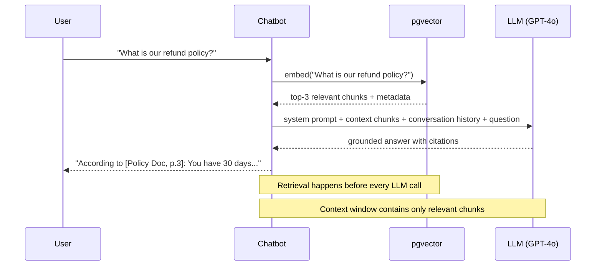
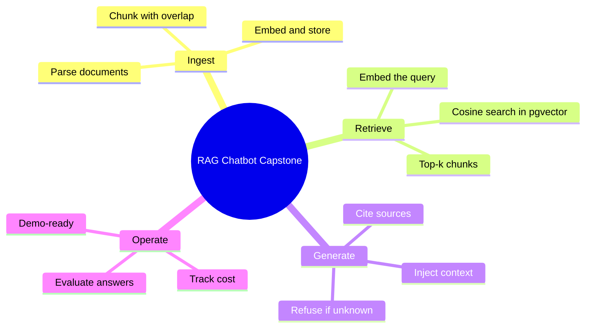

# Capstone — Build a RAG Chatbot

You've spent the last two weeks learning how embeddings work, how to store and query vectors in pgvector, and how to inject retrieved context into prompts. Today you assemble all of it into something you can actually demo to a hiring manager: a chatbot that answers questions from a document collection.

> **Coming from Software Engineering?** A RAG chatbot is architecturally identical to a search-powered web app: query comes in, you hit a database for relevant results, format them, and return a response. The difference is the "database" is a vector store and the "response formatter" is an LLM. If you've built anything with Elasticsearch + a templating layer, you already understand 80% of this architecture. The new pieces are embedding-based retrieval and prompt construction.

> **Portfolio thread (2 of 5).** This builds on the **Day 18** extraction pipeline (reuse it to ingest and structure your documents) and becomes a *tool* the **Day 48** research agent calls. It's capstone #2 of the five-project system you'll deploy on Day 97 and present on Day 99.

This is a real product. Variations of this exact architecture are running in production at hundreds of companies right now — answering support questions from documentation, helping lawyers search case files, letting employees query internal wikis. By the end of today, you'll have built one.

---

## What You're Building

A RAG chatbot that:
1. Ingests a collection of documents (PDF, text, or markdown)
2. Chunks and embeds them into pgvector
3. On each user question, retrieves the most relevant chunks
4. Injects retrieved context into the LLM prompt
5. Responds with cited, grounded answers
6. Uses tool calling for additional actions (lookup, calculate)
7. Maintains conversation history



---

## Project Structure

```
rag_chatbot/
├── ingest.py          # Document loading and embedding
├── retriever.py       # pgvector query interface
├── tools.py           # Tool definitions for tool calling
├── chatbot.py         # Main chatbot loop
├── eval.py            # Evaluation utilities
├── requirements.txt
└── docs/              # Your document collection goes here
```

---

## Step 1: Document Ingestion

```python
# script_id: day_034_capstone_rag_chatbot/ingest
# ingest.py
import os
import hashlib
from pathlib import Path
from typing import List
import psycopg2
from pgvector.psycopg2 import register_vector
from openai import OpenAI

client = OpenAI()

DB_URL = os.getenv("DATABASE_URL", "postgresql://localhost:5432/rag_chatbot")


def get_connection():
    """Create a PostgreSQL connection with pgvector support."""
    conn = psycopg2.connect(DB_URL)
    register_vector(conn)
    return conn


def init_db():
    """Create the pgvector extension and documents table if they don't exist."""
    conn = get_connection()
    cur = conn.cursor()
    cur.execute("CREATE EXTENSION IF NOT EXISTS vector")
    cur.execute("""
        CREATE TABLE IF NOT EXISTS documents (
            id TEXT PRIMARY KEY,
            embedding vector(1536),
            content TEXT NOT NULL,
            source TEXT NOT NULL,
            chunk_index INTEGER NOT NULL,
            char_count INTEGER NOT NULL
        )
    """)
    # Index for fast cosine similarity search.
    # We use HNSW rather than IVFFlat here: IVFFlat must be built AFTER data is
    # loaded (it clusters existing vectors, so building it on an empty table
    # produces a useless index), whereas HNSW builds incrementally and works on
    # an empty table at init time. See Day 22 for the IVFFlat vs HNSW tradeoffs.
    cur.execute("""
        CREATE INDEX IF NOT EXISTS documents_embedding_idx
        ON documents USING hnsw (embedding vector_cosine_ops)
    """)
    conn.commit()
    cur.close()
    conn.close()


def chunk_text(text: str, chunk_size: int = 500, overlap: int = 50) -> List[str]:
    """
    Split text into overlapping chunks.
    Overlap prevents context loss at chunk boundaries.
    """
    words = text.split()
    chunks = []
    start = 0

    while start < len(words):
        end = min(start + chunk_size, len(words))
        chunk = " ".join(words[start:end])
        chunks.append(chunk)
        start += chunk_size - overlap  # step forward with overlap

    return chunks


def embed_texts(texts: List[str], batch_size: int = 100) -> List[List[float]]:
    """
    Embed a list of texts using OpenAI's embedding model.
    Batches requests to stay within API limits.
    """
    all_embeddings = []
    for i in range(0, len(texts), batch_size):
        batch = texts[i : i + batch_size]
        response = client.embeddings.create(
            model="text-embedding-3-small",
            input=batch,
        )
        batch_embeddings = [item.embedding for item in response.data]
        all_embeddings.extend(batch_embeddings)
    return all_embeddings


def ingest_documents(docs_dir: str) -> int:
    """
    Load all .txt and .md files from a directory,
    chunk them, embed them, and store in pgvector.
    """
    init_db()
    conn = get_connection()
    cur = conn.cursor()

    docs_path = Path(docs_dir)
    files = list(docs_path.glob("**/*.txt")) + list(docs_path.glob("**/*.md"))

    print(f"Found {len(files)} documents to ingest...")

    for file_path in files:
        text = file_path.read_text(encoding="utf-8")
        chunks = chunk_text(text)

        # Generate stable IDs so re-ingesting is idempotent
        ids = [
            hashlib.md5(f"{file_path.name}:{i}:{chunk[:50]}".encode()).hexdigest()
            for i, chunk in enumerate(chunks)
        ]

        embeddings = embed_texts(chunks)

        for i, (doc_id, chunk, embedding) in enumerate(zip(ids, chunks, embeddings)):
            # Upsert: safe to run multiple times
            cur.execute(
                """INSERT INTO documents (id, embedding, content, source, chunk_index, char_count)
                   VALUES (%s, %s, %s, %s, %s, %s)
                   ON CONFLICT (id) DO UPDATE SET
                       embedding = EXCLUDED.embedding,
                       content = EXCLUDED.content""",
                (doc_id, embedding, chunk, file_path.name, i, len(chunk)),
            )

        conn.commit()
        print(f"  Ingested {file_path.name}: {len(chunks)} chunks")

    cur.execute("SELECT COUNT(*) FROM documents")
    total = cur.fetchone()[0]
    print(f"\nTotal chunks in collection: {total}")

    cur.close()
    conn.close()
    return total


if __name__ == "__main__":
    ingest_documents("./docs")
    print("Ingestion complete.")
```

---

## Step 2: The Retriever

```python
# script_id: day_034_capstone_rag_chatbot/retriever
# retriever.py
import os
from typing import List, Optional
import psycopg2
from pgvector.psycopg2 import register_vector
from openai import OpenAI
from dataclasses import dataclass

client = OpenAI()

DB_URL = os.getenv("DATABASE_URL", "postgresql://localhost:5432/rag_chatbot")


def get_connection():
    """Create a PostgreSQL connection with pgvector support."""
    conn = psycopg2.connect(DB_URL)
    register_vector(conn)
    return conn


@dataclass
class RetrievedChunk:
    text: str
    source: str
    chunk_index: int
    relevance_score: float


def retrieve(
    query: str,
    n_results: int = 4,
    min_relevance: float = 0.3,
) -> List[RetrievedChunk]:
    """
    Retrieve the most relevant chunks for a query.
    Filters out low-relevance results below min_relevance threshold.
    """
    # Embed the query
    response = client.embeddings.create(
        model="text-embedding-3-small",
        input=[query],
    )
    query_embedding = response.data[0].embedding

    # Query pgvector using cosine distance (<=> operator)
    # pgvector cosine distance: 0 = identical, 1 = opposite
    conn = get_connection()
    cur = conn.cursor()
    cur.execute(
        """SELECT content, source, chunk_index, embedding <=> %s::vector AS distance
           FROM documents
           ORDER BY embedding <=> %s::vector
           LIMIT %s""",
        (query_embedding, query_embedding, n_results),
    )

    chunks = []
    for content, source, chunk_index, distance in cur.fetchall():
        # pgvector cosine distance: 0 = identical, 1 = opposite
        # Convert to relevance score 0-1
        relevance = 1 - distance

        if relevance >= min_relevance:
            chunks.append(
                RetrievedChunk(
                    text=content,
                    source=source,
                    chunk_index=chunk_index,
                    relevance_score=relevance,
                )
            )

    cur.close()
    conn.close()

    # Sort by relevance (highest first)
    return sorted(chunks, key=lambda c: c.relevance_score, reverse=True)


def format_context(chunks: List[RetrievedChunk]) -> str:
    """Format retrieved chunks into a context block for the prompt."""
    if not chunks:
        return "No relevant documents found."

    parts = []
    for i, chunk in enumerate(chunks, 1):
        parts.append(
            f"[Source {i}: {chunk.source}] (relevance: {chunk.relevance_score:.2f})\n{chunk.text}"
        )

    return "\n\n---\n\n".join(parts)
```

---

## Step 3: Tool Definitions

Tool calling lets the chatbot take actions beyond answering from context. Here we add a direct document search tool and a simple calculator.

```python
# script_id: day_034_capstone_rag_chatbot/tools
# tools.py
import json
from retriever import retrieve, format_context

TOOLS = [
    {
        "type": "function",
        "function": {
            "name": "search_documents",
            "description": "Search the knowledge base for information on a specific topic. Use this when you need to find specific facts, policies, or procedures.",
            "parameters": {
                "type": "object",
                "properties": {
                    "query": {
                        "type": "string",
                        "description": "The search query. Be specific and descriptive.",
                    },
                    "n_results": {
                        "type": "integer",
                        "description": "Number of results to retrieve (1-8). Default 4.",
                        "default": 4,
                    },
                },
                "required": ["query"],
            },
        },
    },
    {
        "type": "function",
        "function": {
            "name": "calculate",
            "description": "Evaluate a mathematical expression. Use for calculations mentioned in user questions.",
            "parameters": {
                "type": "object",
                "properties": {
                    "expression": {
                        "type": "string",
                        "description": "A safe mathematical expression, e.g. '(450 * 0.15) + 200'",
                    }
                },
                "required": ["expression"],
            },
        },
    },
]


def execute_tool(tool_name: str, arguments: dict) -> str:
    """Execute a tool call and return the result as a string."""
    if tool_name == "search_documents":
        query = arguments["query"]
        n = arguments.get("n_results", 4)
        chunks = retrieve(query, n_results=n)
        return format_context(chunks)

    elif tool_name == "calculate":
        expr = arguments["expression"]
        # Safe math evaluation using AST (never use eval with untrusted input!)
        import ast, operator
        def safe_eval(node):
            if isinstance(node, ast.Constant): return node.value
            elif isinstance(node, ast.BinOp):
                ops = {ast.Add: operator.add, ast.Sub: operator.sub,
                       ast.Mult: operator.mul, ast.Div: operator.truediv}
                return ops[type(node.op)](safe_eval(node.left), safe_eval(node.right))
            elif isinstance(node, ast.UnaryOp) and isinstance(node.op, ast.USub):
                return -safe_eval(node.operand)
            raise ValueError("Unsupported expression")
        try:
            result = safe_eval(ast.parse(expr, mode='eval').body)
            return f"{expr} = {result}"
        except Exception as e:
            return f"Calculation error: {e}"

    return f"Unknown tool: {tool_name}"
```

---

## Step 4: The Chatbot

```python
# script_id: day_034_capstone_rag_chatbot/chatbot
# chatbot.py
import json
from typing import List
from openai import OpenAI
from retriever import retrieve, format_context
from tools import TOOLS, execute_tool

client = OpenAI()

SYSTEM_PROMPT = """You are a helpful assistant with access to a knowledge base.

When answering questions:
1. Use the provided context from the knowledge base as your primary source.
2. If the context doesn't fully answer the question, use the search_documents tool to find more information.
3. Always cite your sources using [Source N: filename] format.
4. If you cannot find relevant information, say so clearly rather than guessing.
5. For calculations, use the calculate tool rather than doing mental math.

Be concise and direct. Users are looking for specific answers."""


class RAGChatbot:
    def __init__(self):
        self.conversation_history: List[dict] = []

    def _get_initial_context(self, question: str) -> str:
        """Retrieve context for the initial question before sending to LLM."""
        chunks = retrieve(question, n_results=4)
        return format_context(chunks)

    def chat(self, user_message: str) -> str:
        """
        Process a user message and return the assistant's response.
        Handles RAG context injection and tool calling.
        """
        # Retrieve initial context for this question
        context = self._get_initial_context(user_message)

        # Add context to the user message (RAG injection)
        augmented_message = f"""Context from knowledge base:
---
{context}
---

User question: {user_message}"""

        self.conversation_history.append({
            "role": "user",
            "content": augmented_message,
        })

        # Agentic loop: keep going until no more tool calls
        max_iterations = 5
        for iteration in range(max_iterations):
            try:
                response = client.chat.completions.create(
                    model="gpt-4o-mini",
                    messages=[
                        {"role": "system", "content": SYSTEM_PROMPT},
                        *self.conversation_history,
                    ],
                    tools=TOOLS,
                    tool_choice="auto",
                    temperature=0.3,
                    timeout=30.0,
                )
            except Exception as e:
                error_msg = f"I'm having trouble connecting to the AI service ({type(e).__name__}). Please try again."
                self.conversation_history.append({"role": "assistant", "content": error_msg})
                return error_msg

            message = response.choices[0].message

            # Check if we need to handle tool calls
            if message.tool_calls:
                # Add assistant message with tool calls to history
                self.conversation_history.append(message.model_dump(exclude_none=True))

                # Execute each tool call
                for tool_call in message.tool_calls:
                    tool_name = tool_call.function.name
                    arguments = json.loads(tool_call.function.arguments)

                    print(f"  [Tool: {tool_name}({arguments})]")
                    result = execute_tool(tool_name, arguments)

                    # Add tool result to history
                    self.conversation_history.append({
                        "role": "tool",
                        "tool_call_id": tool_call.id,
                        "content": result,
                    })

                # Continue the loop to get the final response
                continue

            # No tool calls — we have the final answer
            assistant_response = message.content

            # Store clean version of the response (without the injected context)
            self.conversation_history.append({
                "role": "assistant",
                "content": assistant_response,
            })

            return assistant_response

        return "I was unable to generate a response after multiple attempts."

    def reset(self):
        """Clear conversation history."""
        self.conversation_history = []


def run_interactive():
    """Run an interactive chat session in the terminal."""
    print("RAG Chatbot initialized. Type 'quit' to exit, 'reset' to clear history.")
    print("-" * 60)

    bot = RAGChatbot()

    while True:
        user_input = input("\nYou: ").strip()

        if not user_input:
            continue
        if user_input.lower() == "quit":
            print("Goodbye!")
            break
        if user_input.lower() == "reset":
            bot.reset()
            print("Conversation history cleared.")
            continue

        response = bot.chat(user_input)
        print(f"\nAssistant: {response}")


if __name__ == "__main__":
    run_interactive()
```

---

## Step 5: Evaluation — How Do You Know It's Good?

This is the part most tutorials skip, and it's the part that separates junior AI engineers from senior ones.

### Building a Good Eval Dataset

Your evaluation dataset should be **curated by hand, not generated by an LLM.** Here's why and how:

1. **Start with real user questions.** If you have access to actual queries (from support tickets, user testing, etc.), use those. If not, write questions you'd actually ask.
2. **Cover edge cases deliberately.** Include questions where the answer is NOT in your documents — you want to test the system's ability to say "I don't know."
3. **Write ground truth answers yourself.** Read the source documents and write what the correct answer should be. This is tedious but essential.
4. **Include negative examples.** Questions that are similar to your domain but shouldn't be answered (out-of-scope, adversarial).
5. **Aim for 20-50 cases minimum.** Fewer than 20 won't catch regressions; more than 100 becomes hard to maintain by hand.

| Dataset Quality Indicator | Good Sign | Bad Sign |
|--------------------------|-----------|----------|
| Source of questions | Real user queries | LLM-generated |
| Edge case coverage | Explicit "I don't know" cases | Only happy-path |
| Ground truth | Human-written from source docs | Copy-pasted from LLM |
| Size | 20-50 curated cases | 5 rushed examples |

```python
# script_id: day_034_capstone_rag_chatbot/eval
# eval.py
import json
from typing import List
from dataclasses import dataclass
from openai import OpenAI
from chatbot import RAGChatbot

client = OpenAI()


@dataclass
class EvalCase:
    question: str
    expected_answer: str  # Ground truth
    expected_sources: List[str]  # Which docs should be cited


# Your evaluation dataset — curated, not generated
EVAL_DATASET = [
    EvalCase(
        question="What is the return policy?",
        expected_answer="30-day return window for unused items",
        expected_sources=["return_policy.txt"],
    ),
    EvalCase(
        question="How do I reset my password?",
        expected_answer="Use the 'Forgot Password' link on the login page",
        expected_sources=["user_guide.txt"],
    ),
    # Add more cases for your specific domain
]


def evaluate_answer(
    question: str,
    actual_answer: str,
    expected_answer: str,
) -> dict:
    """
    Use LLM-as-judge to evaluate answer quality.
    Returns scores for correctness, completeness, and groundedness.
    """
    prompt = f"""Evaluate the following answer against the expected answer.

Question: {question}
Expected answer: {expected_answer}
Actual answer: {actual_answer}

Score each dimension 1-5:
- correctness: Is the information factually correct?
- completeness: Does it cover all key points from the expected answer?
- conciseness: Is it appropriately concise without being too brief?

Return JSON only:
{{"correctness": <1-5>, "completeness": <1-5>, "conciseness": <1-5>, "reasoning": "<brief explanation>"}}"""

    response = client.chat.completions.create(
        model="gpt-4o-mini",
        messages=[{"role": "user", "content": prompt}],
        response_format={"type": "json_object"},
        temperature=0,
    )

    return json.loads(response.choices[0].message.content)


def run_eval(eval_dataset: List[EvalCase] = None) -> dict:
    """Run evaluation suite and report aggregate metrics."""
    if eval_dataset is None:
        eval_dataset = EVAL_DATASET

    bot = RAGChatbot()
    results = []

    for case in eval_dataset:
        bot.reset()
        actual_answer = bot.chat(case.question)
        scores = evaluate_answer(case.question, actual_answer, case.expected_answer)

        results.append({
            "question": case.question,
            "scores": scores,
            "actual_answer": actual_answer[:200] + "..." if len(actual_answer) > 200 else actual_answer,
        })

        print(f"Q: {case.question[:50]}...")
        print(f"  Scores: {scores}")

    # Aggregate metrics
    avg_correctness = sum(r["scores"]["correctness"] for r in results) / len(results)
    avg_completeness = sum(r["scores"]["completeness"] for r in results) / len(results)

    summary = {
        "total_cases": len(results),
        "avg_correctness": round(avg_correctness, 2),
        "avg_completeness": round(avg_completeness, 2),
        "results": results,
    }

    print(f"\nEval Summary: correctness={avg_correctness:.2f}/5, completeness={avg_completeness:.2f}/5")
    return summary


if __name__ == "__main__":
    run_eval()
```

---

## Step 6: Putting It All Together

```bash
# requirements.txt
openai>=1.30.0
psycopg2-binary>=2.9.0
pgvector>=0.3.0
pydantic>=2.0.0
```

```bash
# Setup and run
pip install -r requirements.txt
export OPENAI_API_KEY="sk-..."

# Add some documents to ./docs/
mkdir docs
echo "Our return policy: Items can be returned within 30 days of purchase for a full refund." > docs/return_policy.txt
echo "Password reset: Click 'Forgot Password' on the login page and enter your email." > docs/user_guide.txt

# Ingest documents
python ingest.py

# Start chatting
python chatbot.py

# Run evaluation
python eval.py
```

---

## Architecture Decisions Worth Discussing

When you demo this in an interview, you'll get questions. Here are the real answers:

**Why pgvector?**
Your embeddings live alongside your relational data in PostgreSQL -- one fewer service to manage, and PostgreSQL is battle-tested infrastructure that most teams already run. pgvector supports exact and approximate nearest-neighbor search, handles millions of vectors with IVFFlat or HNSW indexes, and you get full SQL for filtering and joins. For prototyping or quick experiments, ChromaDB is a lightweight alternative that needs zero setup. For production, pgvector gives you the reliability and operational tooling of PostgreSQL.

**Why `text-embedding-3-small` over `text-embedding-3-large`?**
Small is 5x cheaper and in practice the quality difference is small for most retrieval tasks. Always start with the cheaper model and only upgrade if evals show a meaningful gap.

**Why chunk size 500 with 50 overlap?**
This is a starting point, not a law. Shorter chunks (200-300 words) give more precise retrieval but lose context. Longer chunks (800-1000 words) preserve context but retrieve noisier results. The 50-word overlap prevents important information from being split across chunk boundaries. Your ideal values depend on your documents — this is something you tune with evals.

**Why not just put all documents in the context window?**
Modern LLMs have large context windows (128k+ tokens), so you could theoretically fit a lot. But it's expensive, slow, and LLMs actually perform worse with very long contexts (the "lost in the middle" problem). RAG retrieves only what's relevant, which is cheaper, faster, and often more accurate.

---

## Cost Analysis: What Does This Chatbot Cost to Run?

Every AI project should have a cost estimate. Here's the math for this RAG chatbot:

```python
# script_id: day_034_capstone_rag_chatbot/cost_analysis
# Cost breakdown per query (GPT-4o, 2025 pricing)
# Embedding: ~200 tokens per query → $0.000004 (negligible)
# Retrieval: free (pgvector local)
# LLM call: ~500 input tokens (system + context + query) + ~300 output tokens
#   Input:  500 × $2.50 / 1M = $0.00125
#   Output: 300 × $10.00 / 1M = $0.003
# Total per query: ~$0.004

# At scale:
#   100 queries/day  → ~$0.40/day  → ~$12/month
#   1000 queries/day → ~$4.00/day  → ~$120/month
#   10k queries/day  → ~$40/day    → ~$1,200/month

# Cost optimization levers:
# 1. Use GPT-4o-mini: drops to ~$0.0003/query (13x cheaper)
# 2. Cache frequent queries: can cut costs 30-50%
# 3. Reduce retrieved context: fewer chunks = fewer input tokens
# 4. Prompt compression: shorter system prompts save on every call
```

> **Rule of thumb:** Always estimate cost before building. If the per-query cost × expected volume exceeds budget, design differently *before* writing code.

---

## What You Built

A working RAG chatbot with:
- Document ingestion with chunking and embedding
- Semantic retrieval from a persistent vector store
- Context injection with source attribution
- Tool calling for dynamic information retrieval and calculation
- Conversation history for multi-turn dialogue
- LLM-as-judge evaluation framework

**For your portfolio:**

*"I built a RAG chatbot that ingests documents, stores them as embeddings in pgvector (PostgreSQL), and answers questions with cited sources. It uses tool calling to perform dynamic searches when the initial context isn't sufficient. I also built an LLM-as-judge evaluation framework to measure answer quality across correctness, completeness, and conciseness."*

That's a complete story. It demonstrates you can build the system and measure whether it works — both critical skills.

---

## Going Further

Once you have this RAG chatbot working, there are several ways to extend it:

- **Structured extraction with `instructor`**: The [instructor](https://github.com/jxnl/instructor) library lets you extract structured, validated data from LLM responses using Pydantic models. This is especially useful in RAG pipelines where you need to parse specific fields (dates, amounts, entities) from retrieved context rather than returning free-form text.
- **LangChain and LlamaIndex**: These frameworks provide higher-level abstractions for building RAG pipelines -- document loaders, chunking strategies, retriever chains, and more. They trade flexibility for development speed. Both are covered in detail in Phase 3.

---

## Checkpoint

Run `ingest` to load your documents, then start the `RAGChatbot` loop and ask a question your corpus answers: confirm it retrieves relevant chunks, optionally fires a tool (you'll see `[Tool: ...]`), and grounds its reply in the sources. Then run `run_eval` and confirm it prints aggregate correctness/completeness scores. If ingestion reports zero chunks, check that the documents directory path is right and that `chunk_text` is actually splitting the files before they're embedded and stored.

---

## Summary



---

## Quick Reference

| Stage | Key call | Notes |
|---|---|---|
| Init store | `CREATE EXTENSION vector; CREATE TABLE ... embedding vector(1536)` | pgvector, HNSW + `vector_cosine_ops` index |
| Embed | `client.embeddings.create(model="text-embedding-3-small", input=texts)` | 1536-dim; batch for speed |
| Ingest | parse → `chunk_text(...)` → `embed_texts(...)` → upsert | `ON CONFLICT ... DO UPDATE` for idempotent re-ingest |
| Retrieve | `ORDER BY embedding <=> query_vec LIMIT k` | `<=>` is cosine distance in pgvector |
| Generate | inject top-k chunks into the prompt, call the chat model | Instruct it to cite and to refuse when unsupported |
| Operate | count tokens, track cost, eval answers | Carry forward Day 33's cost discipline |

---

## Exercises

1. **Add source citations end to end.** Return the `source` and `chunk_index` for each retrieved chunk and have the chatbot cite which document(s) it used. Verify against the stored metadata.
2. **Measure retrieval quality.** Write 10 question/expected-source pairs, run them, and report how often the correct document appears in the top-k. This is your retrieval recall number for the README.
3. **Add a cost meter.** Wrap each turn to count input/output tokens and accumulate dollar cost (reuse Day 33's calculator). Print running spend after a demo session.
4. **Make it refuse gracefully.** Add a similarity threshold so that when no chunk is relevant, the bot says it doesn't know instead of inventing an answer. Test with an off-corpus question.

<details><summary>Solutions (approaches)</summary>

1. Select `content, source, chunk_index` in the retriever, number the chunks in the prompt, and instruct the model to cite the numbers; map cited numbers back to `source`.
2. Store `(question, expected_source)` pairs; for each, check whether `expected_source` is among the top-k retrieved `source` values; print `hits / 10`.
3. Reuse the per-million pricing table; after each turn add `input_tokens*in_rate + output_tokens*out_rate` to a running total and log it.
4. Compare the top result's cosine similarity (`1 - distance`) to a threshold; below it, short-circuit to "I don't have that information in my documents."
</details>

---

## What's Next?

Phase 2 is complete. You now know how to give an LLM external knowledge. In Phase 3, we're going to give it the ability to take actions in the world. We're building agents.

The jump from "a chatbot that retrieves information" to "an agent that takes actions" is one of the most exciting in AI engineering. See you on **Day 35: The ReAct Loop — Building Your First Agent**.

---

*Next up: The ReAct Loop — Building Your First Agent*
