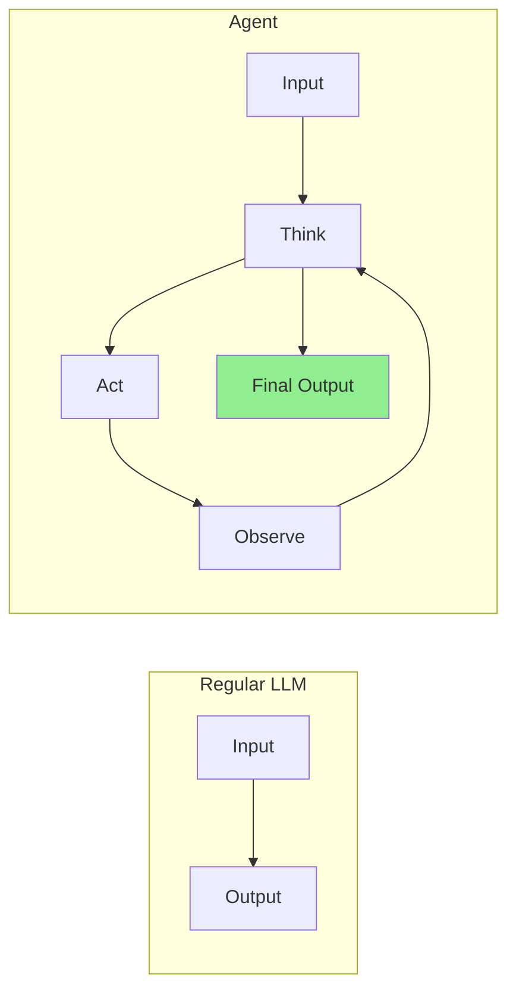
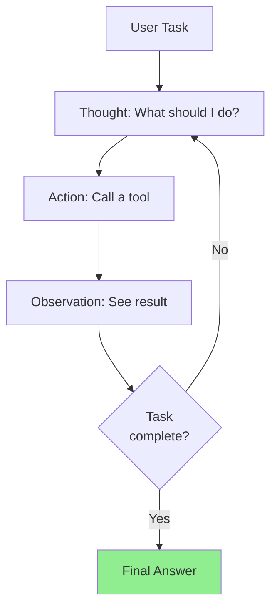
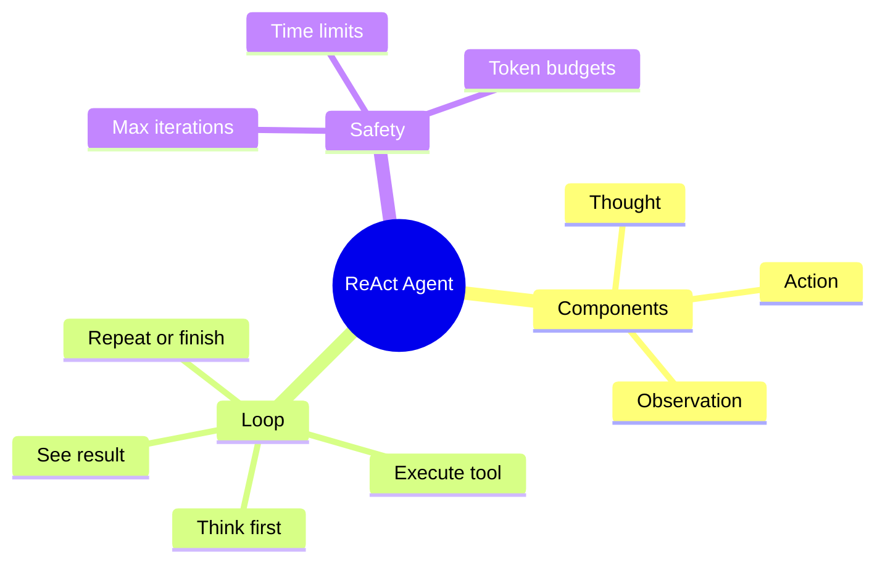

# Building the ReAct (Reason + Act) Loop

Welcome to Month 3! Now we're building **agents** - AI systems that can think, plan, and take actions autonomously. Let's start with the foundational pattern: **ReAct** (Reasoning + Acting).

> **Coming from Software Engineering?** The ReAct loop is a game loop. If you've built game engines (update → render → check input → repeat) or event loops (Node.js, asyncio), the ReAct pattern is the same: observe → think → act → repeat. Feeding each tool result back is like a REPL: the agent runs a command, reads the output, and decides the next command from it. The LLM is both the 'brain' and the 'controller' in this loop.

---

## What is an Agent?



An agent **loops** - it thinks, acts, observes the result, and thinks again until the task is complete.

---

## The ReAct Pattern

ReAct combines:
- **Reasoning**: The model explains its thinking
- **Acting**: The model takes actions (tool calls)
- **Observing**: The model sees the results

The key trick: making the model spell out its reasoning before it picks an action measurably improves the action it picks — think rubber-duck debugging, where writing out the problem leads you to the fix. The Thought step is not just a log line; it is what makes the loop work.



---

## Building a ReAct Agent from Scratch

```python
# script_id: day_035_react_loop/react_agent_core
from openai import OpenAI
import json
import re

client = OpenAI()

class ReActAgent:
    """A simple ReAct agent built from scratch."""

    def __init__(self, tools: dict, max_iterations: int = 10):
        self.tools = tools
        self.max_iterations = max_iterations
        self.system_prompt = self._build_system_prompt()

    def _build_system_prompt(self) -> str:
        tool_descriptions = "\n".join([
            f"- {name}: {func.__doc__}"
            for name, func in self.tools.items()
        ])

        return f"""You are a helpful assistant that solves problems step by step.

Available tools:
{tool_descriptions}

For each step, use this format:

Thought: [Your reasoning about what to do next]
Action: [tool_name]
Action Input: [input for the tool as JSON]

After receiving an observation, continue with another Thought.

When you have the final answer, respond with:
Thought: I now have the answer.
Final Answer: [your answer]

Always start with a Thought. Never skip the thinking step."""

    def _parse_response(self, text: str) -> dict:
        """Parse the agent's response to extract action or final answer."""

        # Check for final answer
        if "Final Answer:" in text:
            answer = text.split("Final Answer:")[-1].strip()
            return {"type": "final", "answer": answer}

        # Extract action
        action_match = re.search(r"Action:\s*(\w+)", text)
        input_match = re.search(r"Action Input:\s*(.+?)(?=\n|$)", text, re.DOTALL)

        if action_match:
            action = action_match.group(1)
            action_input = input_match.group(1).strip() if input_match else "{}"

            # Try to parse as JSON
            try:
                action_input = json.loads(action_input)
            except json.JSONDecodeError:
                # Keep as string if not valid JSON
                pass

            return {"type": "action", "action": action, "input": action_input}

        return {"type": "unknown", "text": text}
```

> **Production Tip:** In production, use OpenAI's native function calling or `response_format={"type": "json_object"}` instead of regex parsing. This eliminates parsing failures.

### Modern Alternative: Structured JSON Output

Instead of parsing free-text with regex, you can ask the LLM to return structured JSON directly using JSON mode (`response_format={"type": "json_object"}`) — an OpenAI setting that guarantees the model returns syntactically valid JSON, so you can `json.loads()` it directly instead of regex-scraping free text:

```python
# script_id: day_035_react_loop/structured_response_json_mode
# fragment: illustrative cheat-sheet / not standalone-runnable
    def _get_structured_response(self, messages: list) -> dict:
        """Get a structured response using JSON mode instead of regex parsing."""
        json_system_prompt = """You are a helpful assistant that solves problems step by step.
Return your response as JSON with this exact schema:
{
    "thought": "your reasoning about what to do next",
    "action": "tool_name or null if you have the final answer",
    "action_input": "input for the tool as a JSON string, or null",
    "final_answer": "your final answer, or null if you need to use a tool"
}"""

        response = client.chat.completions.create(
            model="gpt-4o",
            messages=[{"role": "system", "content": json_system_prompt}] + messages[1:],
            temperature=0,
            response_format={"type": "json_object"}
        )

        return json.loads(response.choices[0].message.content)

    # Usage in the run loop:
    # parsed = self._get_structured_response(messages)
    # if parsed["final_answer"]:
    #     return parsed["final_answer"]
    # elif parsed["action"]:
    #     result = self.tools[parsed["action"]](parsed["action_input"])
```

The regex approach above is valuable for understanding how ReAct works under the hood, but structured output eliminates an entire class of parsing bugs. With JSON mode, `_parse_response` becomes a simple dictionary lookup — no regex, no parsing failures.

---

## Putting It Together: The Run Loop

Here's the full ReAct loop and a runnable example tying the pieces together:

```python
# script_id: day_035_react_loop/react_agent_core
    def run(self, task: str) -> str:
        """Run the agent on a task."""
        messages = [
            {"role": "system", "content": self.system_prompt},
            {"role": "user", "content": f"Task: {task}"}
        ]

        for iteration in range(self.max_iterations):
            print(f"\n--- Iteration {iteration + 1} ---")

            # Get model response.
            # temperature=0 tells the model to be as predictable as possible
            # (higher values make it more random/creative). For an agent we want
            # it boringly consistent so it reliably emits the exact
            # Thought/Action format our parser expects.
            response = client.chat.completions.create(
                model="gpt-4o",
                messages=messages,
                temperature=0
            )

            assistant_text = response.choices[0].message.content
            print(f"Agent:\n{assistant_text}")

            messages.append({"role": "assistant", "content": assistant_text})

            # Parse response
            parsed = self._parse_response(assistant_text)

            if parsed["type"] == "final":
                return parsed["answer"]

            elif parsed["type"] == "action":
                action = parsed["action"]
                action_input = parsed["input"]

                # Execute tool
                if action in self.tools:
                    try:
                        if isinstance(action_input, dict):
                            result = self.tools[action](**action_input)
                        else:
                            result = self.tools[action](action_input)
                        observation = f"Observation: {result}"
                    except Exception as e:
                        observation = f"Observation: Error - {str(e)}"
                else:
                    observation = f"Observation: Error - Unknown tool '{action}'"

                print(observation)
                # We send the tool result back as a user message: in this
                # hand-rolled approach the model only reads user/assistant text,
                # so the observation is just the next thing we "say" to it.
                # (OpenAI native function calling uses a dedicated "tool" role instead.)
                messages.append({"role": "user", "content": observation})

            else:
                messages.append({
                    "role": "user",
                    "content": "Please follow the format: Thought, Action, Action Input"
                })

        return "Max iterations reached without finding an answer."

# Define tools
def search(query: str) -> str:
    """Search for information on a topic."""
    # Mock search results
    results = {
        "python": "Python is a programming language created by Guido van Rossum in 1991.",
        "weather": "Weather varies by location. Use a weather API for current conditions.",
        "capital france": "The capital of France is Paris.",
    }
    for key, value in results.items():
        if key in query.lower():
            return value
    return f"No results found for: {query}"

def calculate(expression: str) -> str:
    """Calculate a mathematical expression safely (no eval!)."""
    import ast, operator
    try:
        def safe_eval(node):
            if isinstance(node, ast.Constant): return node.value
            elif isinstance(node, ast.BinOp):
                ops = {ast.Add: operator.add, ast.Sub: operator.sub,
                       ast.Mult: operator.mul, ast.Div: operator.truediv}
                return ops[type(node.op)](safe_eval(node.left), safe_eval(node.right))
            elif isinstance(node, ast.UnaryOp) and isinstance(node.op, ast.USub):
                return -safe_eval(node.operand)
            raise ValueError("Unsupported expression")
        result = safe_eval(ast.parse(expression, mode='eval').body)
        return f"Result: {result}"
    except Exception as e:
        return f"Error: {str(e)}"

def get_current_date() -> str:
    """Get the current date."""
    from datetime import datetime
    return datetime.now().strftime("%Y-%m-%d")

# Create and run agent
agent = ReActAgent(
    tools={
        "search": search,
        "calculate": calculate,
        "get_current_date": get_current_date
    },
    max_iterations=5
)

# Test the agent
result = agent.run("What is the capital of France, and what is 15 * 23?")
print(f"\n=== Final Result ===\n{result}")
```

---

## Managing Conversation History

The run loop above appended to a raw `messages` list. As tasks get longer that list grows without bound and eventually overflows the model's context window. Here is a small helper that caps history while always keeping the system prompt — we go deeper on this tomorrow (Day 36).

```python
# script_id: day_035_react_loop/conversation_manager
class ConversationManager:
    """Manage conversation history for agents."""

    def __init__(self, max_history: int = 20):
        self.messages = []
        self.max_history = max_history

    def add_system(self, content: str):
        """Add system message (only one, at the start)."""
        self.messages = [{"role": "system", "content": content}]

    def add_user(self, content: str):
        """Add user message."""
        self.messages.append({"role": "user", "content": content})
        self._trim_history()

    def add_assistant(self, content: str):
        """Add assistant message."""
        self.messages.append({"role": "assistant", "content": content})
        self._trim_history()

    def _trim_history(self):
        """Keep history within limits."""
        if len(self.messages) > self.max_history:
            # Keep system message + recent messages
            system = self.messages[0] if self.messages[0]["role"] == "system" else None
            recent = self.messages[-(self.max_history - 1):]
            self.messages = [system] + recent if system else recent

    def get_messages(self) -> list:
        """Get current message history."""
        return self.messages.copy()

    def get_last_n(self, n: int) -> list:
        """Get last n messages."""
        return self.messages[-n:]

    def clear(self):
        """Clear history except system message."""
        system = self.messages[0] if self.messages and self.messages[0]["role"] == "system" else None
        self.messages = [system] if system else []
```

---

## Implementing Hard Stops

Prevent infinite loops:

```python
# script_id: day_035_react_loop/safe_agent
# fragment: illustrative — guard scaffolding only; assumes client from the core block and omits the loop body
import time

class SafeAgent:
    """Agent with safety limits."""

    def __init__(self, tools: dict):
        self.tools = tools
        self.max_iterations = 10
        self.max_time_seconds = 60
        self.max_tokens_per_run = 10000

    def run(self, task: str) -> dict:
        """Run with safety limits."""
        start_time = time.time()
        total_tokens = 0
        iterations = 0

        messages = [
            {"role": "system", "content": self._get_system_prompt()},
            {"role": "user", "content": task}
        ]

        while True:
            # Check iteration limit
            iterations += 1
            if iterations > self.max_iterations:
                return {
                    "status": "stopped",
                    "reason": "max_iterations",
                    "iterations": iterations
                }

            # Check time limit
            elapsed = time.time() - start_time
            if elapsed > self.max_time_seconds:
                return {
                    "status": "stopped",
                    "reason": "timeout",
                    "elapsed_seconds": elapsed
                }

            # Make API call. This safety-demo agent uses the cheaper gpt-4o-mini
            # to keep iteration costs low while you experiment with the stop conditions.
            response = client.chat.completions.create(
                model="gpt-4o-mini",
                messages=messages,
                temperature=0
            )

            # Track tokens. (Recall tokens are the chunks the model bills and
            # counts context in — capping them bounds both cost and runaway loops.)
            total_tokens += response.usage.total_tokens
            if total_tokens > self.max_tokens_per_run:
                return {
                    "status": "stopped",
                    "reason": "token_limit",
                    "tokens_used": total_tokens
                }

            # Process response
            content = response.choices[0].message.content

            if "Final Answer:" in content:
                answer = content.split("Final Answer:")[-1].strip()
                return {
                    "status": "success",
                    "answer": answer,
                    "iterations": iterations,
                    "tokens_used": total_tokens,
                    "elapsed_seconds": time.time() - start_time
                }

            # Continue loop (add messages, execute tools, etc.)
            # ... (similar to previous implementation)

    def _get_system_prompt(self) -> str:
        return "You are a helpful agent. Use 'Final Answer:' when done."
```

---

## Complete ReAct Agent

This is a standalone, more complete rewrite of the scratch agent above — it replaces, not extends, the earlier `ReActAgent`. Paste this one on its own, not alongside the scratch version.

```python
# script_id: day_035_react_loop/complete_react_agent
from openai import OpenAI
from typing import Callable, Any
import json
import re
import time

class ReActAgent:
    """Production-ready ReAct agent."""

    def __init__(
        self,
        model: str = "gpt-4o",
        max_iterations: int = 10,
        max_time: int = 120,
        verbose: bool = True
    ):
        self.client = OpenAI()
        self.model = model
        self.max_iterations = max_iterations
        self.max_time = max_time
        self.verbose = verbose
        self.tools = {}

    def add_tool(self, name: str, description: str, func: Callable):
        """Register a tool."""
        self.tools[name] = {
            "function": func,
            "description": description
        }

    def run(self, task: str) -> dict:
        """Execute the agent on a task."""
        start_time = time.time()

        # Build system prompt
        tools_text = "\n".join([
            f"- {name}: {info['description']}"
            for name, info in self.tools.items()
        ])

        system_prompt = f"""You are a ReAct agent. Solve tasks step by step.

Available tools:
{tools_text}

Format for each step:
Thought: [your reasoning]
Action: [tool_name]
Action Input: {{"param": "value"}}

When finished:
Thought: I have the answer.
Final Answer: [your answer]"""

        messages = [
            {"role": "system", "content": system_prompt},
            {"role": "user", "content": f"Task: {task}"}
        ]

        trajectory = []

        for i in range(self.max_iterations):
            # Time check
            if time.time() - start_time > self.max_time:
                return {"status": "timeout", "trajectory": trajectory}

            # Get response
            response = self.client.chat.completions.create(
                model=self.model,
                messages=messages,
                temperature=0
            )

            content = response.choices[0].message.content

            if self.verbose:
                print(f"\n[Step {i+1}]\n{content}")

            trajectory.append({"step": i + 1, "thought": content})
            messages.append({"role": "assistant", "content": content})

            # Check for final answer
            if "Final Answer:" in content:
                answer = content.split("Final Answer:")[-1].strip()
                return {
                    "status": "success",
                    "answer": answer,
                    "iterations": i + 1,
                    "trajectory": trajectory
                }

            # Parse and execute action
            action_match = re.search(r"Action:\s*(\w+)", content)
            input_match = re.search(r"Action Input:\s*({.+})", content, re.DOTALL)

            if action_match:
                action_name = action_match.group(1)
                try:
                    action_input = json.loads(input_match.group(1)) if input_match else {}
                except:
                    action_input = {}

                # Execute tool
                if action_name in self.tools:
                    try:
                        result = self.tools[action_name]["function"](**action_input)
                        observation = f"Observation: {result}"
                    except Exception as e:
                        observation = f"Observation: Error - {e}"
                else:
                    observation = f"Observation: Unknown tool '{action_name}'"

                if self.verbose:
                    print(observation)

                trajectory[-1]["action"] = action_name
                trajectory[-1]["observation"] = observation
                messages.append({"role": "user", "content": observation})

        return {"status": "max_iterations", "trajectory": trajectory}

# Usage
agent = ReActAgent(verbose=True)

# Safe arithmetic: ast.literal_eval CANNOT evaluate expressions like "25 * 4"
# (it only parses literals and raises ValueError on operators). Use a small
# AST walker that allows only arithmetic nodes — same idea as the `calculate`
# tool earlier in this lesson.
import ast, operator
_OPS = {ast.Add: operator.add, ast.Sub: operator.sub,
        ast.Mult: operator.mul, ast.Div: operator.truediv, ast.Pow: operator.pow}

def safe_calculate(expression: str) -> str:
    def _eval(node):
        if isinstance(node, ast.Constant):
            return node.value
        if isinstance(node, ast.BinOp):
            return _OPS[type(node.op)](_eval(node.left), _eval(node.right))
        if isinstance(node, ast.UnaryOp) and isinstance(node.op, ast.USub):
            return -_eval(node.operand)
        raise ValueError("Unsupported expression")
    return str(_eval(ast.parse(expression, mode="eval").body))

agent.add_tool(
    "search",
    "Search for information",
    lambda query: f"Results for '{query}': [mock data]"
)

agent.add_tool(
    "calculate",
    "Do math calculations",
    safe_calculate  # NOT ast.literal_eval — that can't do arithmetic
)

result = agent.run("What is 25 * 4, and search for 'Python programming'")
print(f"\nFinal: {result}")
```

---

## Summary



---

## Quick Reference

| Piece | What it does | Sketch |
|---|---|---|
| System prompt | Teaches the Thought/Action/Observation format | `"Thought: ...\nAction: tool\nAction Input: {...}"` |
| Parse step | Pull the next action (or final answer) out of model text | `re.search(r"Action:\s*(\w+)", text)` |
| Tool dispatch | Map a tool name to a Python callable | `self.tools[action](**action_input)` |
| Observation | Feed the tool result back as a new message | `messages.append({"role": "user", "content": obs})` |
| Stop conditions | Bound the loop | `max_iterations`, `max_time`, `max_tokens` |
| Structured output | Skip regex; ask for JSON directly | `response_format={"type": "json_object"}` |

---

## Exercises

1. Add a third tool (e.g. `word_count(text)` that returns the number of words) to the scratch-built `ReActAgent`, then ask it a task that needs both `search` and `word_count`.
2. Make the loop refuse to run the *same* action with the *same* input twice in a row — print a warning and inject a nudge message instead of re-executing the tool.
3. Swap the regex parser for the JSON-mode approach (`response_format={"type": "json_object"}`) and confirm `_parse_response` becomes a plain dict lookup.
4. Add a `total_tokens` accumulator to `run()` and stop the loop once it crosses a budget you pick (e.g. 8000 tokens).

<details><summary>Solutions (approaches)</summary>

1. Register it like the others: `agent.add_tool("word_count", "Count words", lambda text: str(len(text.split())))`. The model picks it when the task mentions counting.
2. Track `(action, json.dumps(input, sort_keys=True))` from the previous step; if it repeats, append a user message like `"You already tried that. Try a different action or give the Final Answer."`.
3. Use the `_get_structured_response` helper already in the lesson; the returned dict has `final_answer` / `action` / `action_input`, so no parsing is needed.
4. Add `total_tokens += response.usage.total_tokens` after each call and `if total_tokens > BUDGET: return "Token budget exceeded"` — mirrors `SafeAgent`.
</details>

---

## Checkpoint

Run the Complete ReAct Agent at the end of this lesson on `"What is 25 * 4, and search for 'Python programming'"`. With `verbose=True` you should see numbered `[Step N]` blocks where the agent emits a Thought/Action, the `calculate` tool returns `100`, and the loop ends with a `status: success` dict — not `max_iterations`. If it loops forever or never calls a tool, the most likely cause is the model not emitting the exact `Action:` / `Action Input:` format the regex expects — tighten the system prompt or switch to the JSON-mode approach shown above.

---

## What's Next?

Now that you can build agents from scratch, let's give them better memory: **Conversation History** — managing the message list so agents stay coherent across many turns without blowing the context window.
