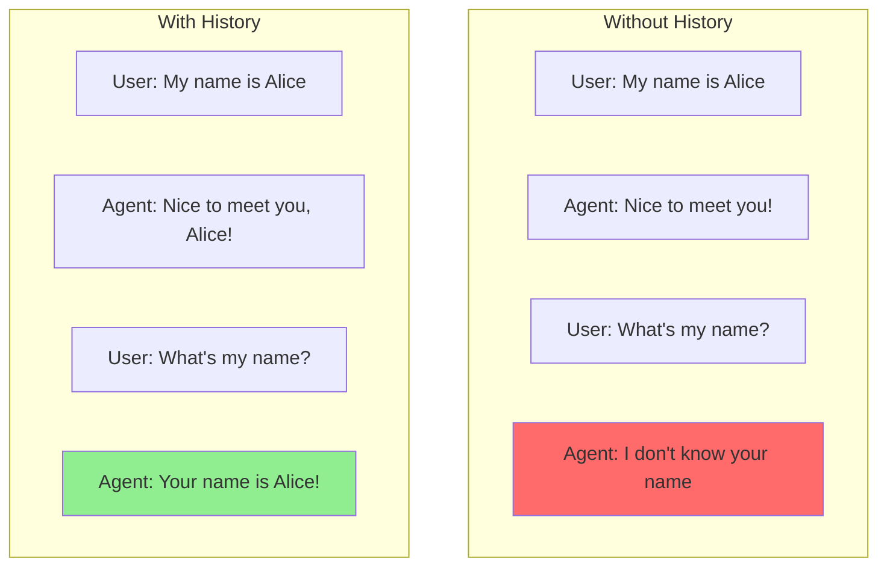
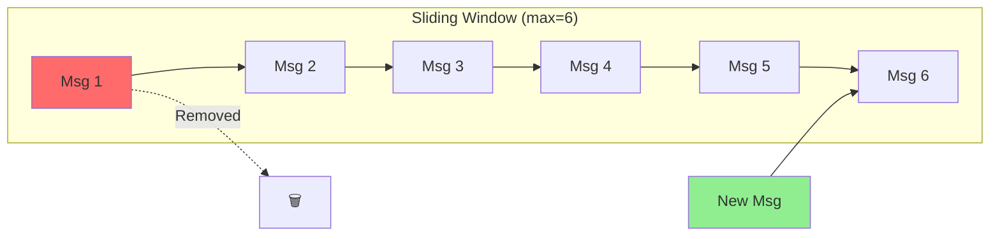
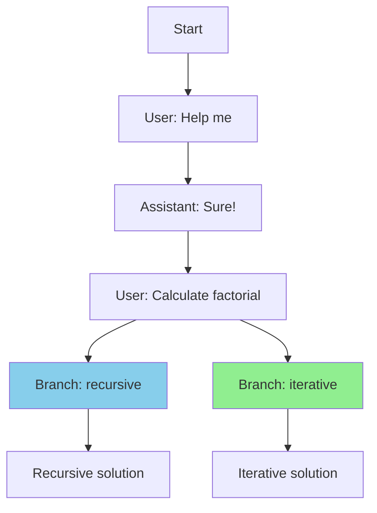
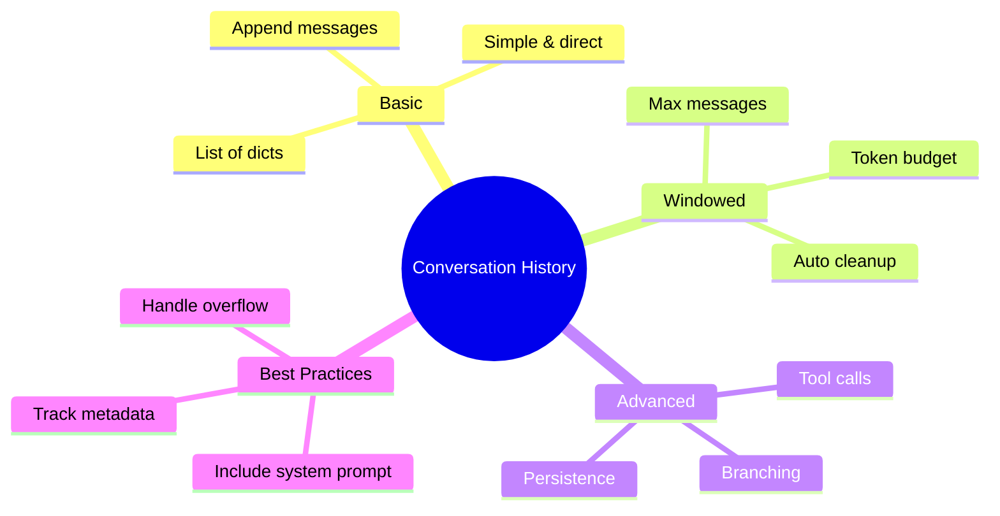

# Managing Conversation History

Agents need memory to maintain context. This guide shows you how to manage conversation history using simple Python data structures.

> **Coming from Software Engineering?** Conversation history management is just session state. If you've built web apps with server-side sessions, JWT tokens, or Redis-backed session stores, you already know how to manage conversational state. The 'messages' array is your session object.

---

## Why Conversation History Matters



---

## Basic History: List of Dictionaries

The simplest approach - store messages as a list:

```python
# script_id: day_036_conversation_history/basic_chat_history
from openai import OpenAI

client = OpenAI()

# Initialize conversation history
history = []

def chat(user_message: str) -> str:
    """Send a message and maintain history."""

    # Add user message to history
    history.append({
        "role": "user",
        "content": user_message
    })

    # Call the LLM with full history
    response = client.chat.completions.create(
        model="gpt-4o-mini",
        messages=[
            {"role": "system", "content": "You are a helpful assistant."}
        ] + history
    )

    assistant_message = response.choices[0].message.content

    # Add assistant response to history
    history.append({
        "role": "assistant",
        "content": assistant_message
    })

    return assistant_message

# Usage
print(chat("My name is Alice"))
print(chat("What's my name?"))  # Remembers!
print(chat("What did I first tell you?"))  # Still remembers!
```

---

## Structured History Class

A cleaner, reusable approach:

```python
# script_id: day_036_conversation_history/structured_history_class
from dataclasses import dataclass, field
from typing import List, Optional
from datetime import datetime

@dataclass
class Message:
    role: str  # "user", "assistant", or "system"
    content: str
    timestamp: datetime = field(default_factory=datetime.now)
    metadata: dict = field(default_factory=dict)

class ConversationHistory:
    """Manage conversation history for an agent."""

    def __init__(self, system_prompt: str = "You are a helpful assistant."):
        self.system_prompt = system_prompt
        self.messages: List[Message] = []

    def add_user_message(self, content: str, metadata: dict = None):
        """Add a user message to history."""
        self.messages.append(Message(
            role="user",
            content=content,
            metadata=metadata or {}
        ))

    def add_assistant_message(self, content: str, metadata: dict = None):
        """Add an assistant message to history."""
        self.messages.append(Message(
            role="assistant",
            content=content,
            metadata=metadata or {}
        ))

    def get_messages_for_api(self) -> List[dict]:
        """Get messages formatted for API call."""
        api_messages = [{"role": "system", "content": self.system_prompt}]

        for msg in self.messages:
            api_messages.append({
                "role": msg.role,
                "content": msg.content
            })

        return api_messages

    def clear(self):
        """Clear all history."""
        self.messages = []

    def get_last_n_messages(self, n: int) -> List[Message]:
        """Get the last n messages."""
        return self.messages[-n:]

    def __len__(self):
        return len(self.messages)

# Usage
history = ConversationHistory(system_prompt="You are a coding assistant.")
history.add_user_message("How do I read a file in Python?")
history.add_assistant_message("You can use the open() function...")

messages = history.get_messages_for_api()
# Ready to send to LLM!
```

---

## Sliding Window History

Prevent token overflow by keeping only recent messages:

```python
# script_id: day_036_conversation_history/sliding_window_history
from collections import deque

class SlidingWindowHistory:
    """Keep only the most recent N messages."""

    def __init__(self, max_messages: int = 20, system_prompt: str = "You are helpful."):
        self.max_messages = max_messages
        self.system_prompt = system_prompt
        self.messages = deque(maxlen=max_messages)

    def add(self, role: str, content: str):
        """Add a message (oldest messages auto-removed when full)."""
        self.messages.append({"role": role, "content": content})

    def get_messages(self) -> list:
        """Get all messages with system prompt."""
        return [
            {"role": "system", "content": self.system_prompt}
        ] + list(self.messages)

    def get_token_estimate(self) -> int:
        """Rough estimate of token count."""
        total_chars = sum(len(m["content"]) for m in self.messages)
        return total_chars // 4  # Rough estimate: 4 chars per token

# Usage
history = SlidingWindowHistory(max_messages=10)

for i in range(15):
    history.add("user", f"Message {i}")
    history.add("assistant", f"Response {i}")

print(f"Messages kept: {len(history.messages)}")  # 10, not 30
```

> **Modern Alternative:** LangGraph 0.4+ handles conversation history automatically with the `add_messages` reducer in state definitions. The manual approaches shown here are educational — in production, prefer LangGraph's built-in message management.



---

## Token-Aware History

Keep messages within a token budget:

```python
# script_id: day_036_conversation_history/token_aware_history
import tiktoken

class TokenAwareHistory:
    """Manage history within a token budget."""

    def __init__(self, max_tokens: int = 4000, model: str = "gpt-4o-mini"):
        self.max_tokens = max_tokens
        self.model = model
        self.encoder = tiktoken.encoding_for_model(model)
        self.system_prompt = "You are a helpful assistant."
        self.messages = []

    def count_tokens(self, text: str) -> int:
        """Count tokens in text."""
        return len(self.encoder.encode(text))

    def total_tokens(self) -> int:
        """Count total tokens in history."""
        total = self.count_tokens(self.system_prompt)
        for msg in self.messages:
            total += self.count_tokens(msg["content"])
            total += 4  # Overhead per message
        return total

    def add(self, role: str, content: str):
        """Add message, removing old ones if over budget."""
        new_tokens = self.count_tokens(content) + 4

        # Remove old messages until we have room
        while self.messages and (self.total_tokens() + new_tokens > self.max_tokens):
            removed = self.messages.pop(0)
            print(f"Removed old message to stay within budget")

        self.messages.append({"role": role, "content": content})

    def get_messages(self) -> list:
        """Get messages for API call."""
        return [
            {"role": "system", "content": self.system_prompt}
        ] + self.messages

# Usage
history = TokenAwareHistory(max_tokens=1000)

history.add("user", "Tell me about Python")
history.add("assistant", "Python is a programming language..." * 50)  # Long response
history.add("user", "What about JavaScript?")  # Might trigger cleanup

print(f"Current tokens: {history.total_tokens()}")
```

---

## History with Tool Calls

Include tool calls in your history:

```python
# script_id: day_036_conversation_history/tool_aware_history
class ToolAwareHistory:
    """History that handles tool calls."""

    def __init__(self):
        self.messages = []

    def add_user(self, content: str):
        self.messages.append({"role": "user", "content": content})

    def add_assistant(self, content: str = None, tool_calls: list = None):
        """Add assistant message, optionally with tool calls."""
        message = {"role": "assistant"}

        if content:
            message["content"] = content

        if tool_calls:
            message["tool_calls"] = tool_calls

        self.messages.append(message)

    def add_tool_result(self, tool_call_id: str, result: str):
        """Add a tool result."""
        self.messages.append({
            "role": "tool",
            "tool_call_id": tool_call_id,
            "content": result
        })

    def get_messages(self) -> list:
        return self.messages.copy()

# Usage with tool calls
history = ToolAwareHistory()

history.add_user("What's the weather in Tokyo?")

# LLM responds with tool call
history.add_assistant(tool_calls=[{
    "id": "call_123",
    "type": "function",
    "function": {
        "name": "get_weather",
        "arguments": '{"city": "Tokyo"}'
    }
}])

# Add tool result
history.add_tool_result("call_123", '{"temp": 22, "condition": "sunny"}')

# LLM gives final response
history.add_assistant("The weather in Tokyo is 22°C and sunny!")
```

---

## Conversation Branching

Support for exploring different conversation paths:

```python
# script_id: day_036_conversation_history/branchable_history
from typing import Dict, List, Optional
import copy

class BranchableHistory:
    """History that supports branching and rollback."""

    def __init__(self):
        self.messages: List[dict] = []
        self.branches: Dict[str, List[dict]] = {}
        self.current_branch: str = "main"

    def add(self, role: str, content: str):
        """Add message to current branch."""
        self.messages.append({
            "role": role,
            "content": content,
            "branch": self.current_branch
        })

    def create_branch(self, name: str):
        """Create a new branch from current state."""
        self.branches[name] = copy.deepcopy(self.messages)
        self.current_branch = name

    def switch_branch(self, name: str):
        """Switch to a different branch."""
        if name == "main":
            # Switching to main - keep current messages
            pass
        elif name in self.branches:
            self.messages = copy.deepcopy(self.branches[name])
            self.current_branch = name
        else:
            raise ValueError(f"Branch {name} not found")

    def rollback(self, n: int = 1):
        """Remove the last n messages."""
        self.messages = self.messages[:-n]

    def get_messages(self) -> list:
        """Get messages for API (without metadata)."""
        return [
            {"role": m["role"], "content": m["content"]}
            for m in self.messages
        ]

# Usage
history = BranchableHistory()

history.add("user", "Help me write a function")
history.add("assistant", "Sure! What should it do?")
history.add("user", "Calculate factorial")

# Create a branch to try a different approach
history.create_branch("recursive")
history.add("assistant", "Here's a recursive approach...")

# Go back and try iterative
history.switch_branch("main")
history.create_branch("iterative")
history.add("assistant", "Here's an iterative approach...")

# Can switch between branches!
```



---

## Persisting History

Save and load conversation history:

```python
# script_id: day_036_conversation_history/persistent_history
import json
from pathlib import Path
from datetime import datetime

class PersistentHistory:
    """History that can be saved to and loaded from disk."""

    def __init__(self, filepath: str = None):
        self.filepath = filepath
        self.messages = []
        self.metadata = {
            "created_at": datetime.now().isoformat(),
            "updated_at": None
        }

        if filepath and Path(filepath).exists():
            self.load()

    def add(self, role: str, content: str):
        """Add a message."""
        self.messages.append({
            "role": role,
            "content": content,
            "timestamp": datetime.now().isoformat()
        })
        self.metadata["updated_at"] = datetime.now().isoformat()

    def save(self, filepath: str = None):
        """Save history to file."""
        path = filepath or self.filepath
        if not path:
            raise ValueError("No filepath specified")

        data = {
            "metadata": self.metadata,
            "messages": self.messages
        }

        with open(path, 'w') as f:
            json.dump(data, f, indent=2)

    def load(self, filepath: str = None):
        """Load history from file."""
        path = filepath or self.filepath
        if not path:
            raise ValueError("No filepath specified")

        with open(path, 'r') as f:
            data = json.load(f)

        self.metadata = data.get("metadata", {})
        self.messages = data.get("messages", [])

    def get_messages_for_api(self) -> list:
        """Get messages without timestamps."""
        return [
            {"role": m["role"], "content": m["content"]}
            for m in self.messages
        ]

# Usage
history = PersistentHistory("conversation.json")
history.add("user", "Hello!")
history.add("assistant", "Hi there!")
history.save()

# Later...
loaded_history = PersistentHistory("conversation.json")
print(loaded_history.messages)  # Previous conversation loaded!
```

---

## Summary



---

## Quick Reference

```python
# script_id: day_036_conversation_history/quick_reference
# Basic history
history = []
history.append({"role": "user", "content": "Hello"})
history.append({"role": "assistant", "content": "Hi!"})

# Sliding window
from collections import deque
history = deque(maxlen=20)

# Token-aware
while total_tokens > max_tokens:
    history.pop(0)

# Save/Load
json.dump(history, open("history.json", "w"))
history = json.load(open("history.json"))
```

---

## Exercises

1. Build a sliding-window history with `deque(maxlen=20)` and confirm that the oldest messages drop off after the 21st append — but make sure the system message never gets evicted.
2. Write a `token_budget_trim(history, max_tokens)` that removes the *oldest non-system* messages until the estimated token count fits, then test it on a long fake conversation.
3. Add `save(path)` / `load(path)` methods that round-trip the history to JSON and back, and verify the reloaded list equals the original.
4. Extend a history entry to carry a `tool_calls` field, then write a function that reconstructs only the user/assistant turns (dropping tool noise) for a clean transcript view.

<details><summary>Solutions (approaches)</summary>

1. Keep the system message separate: store it once, build the window from `deque(maxlen=19)` of the rest, and prepend system on read. Append 21 user turns and assert `len(window) == 19`.
2. Estimate tokens with `len(content) // 4` (or `tiktoken`); loop `while total > max_tokens: history.pop(1)` (index 1 skips system) and recompute.
3. `json.dump(self.messages, open(path, "w"))` and `self.messages = json.load(open(path))`; assert equality after reload.
4. Filter with `[m for m in history if m["role"] in ("user", "assistant") and not m.get("tool_calls")]`.
</details>

---

## What's Next?

Now let's learn about **implementing hard stops and max iterations** to prevent your agent from running forever!
