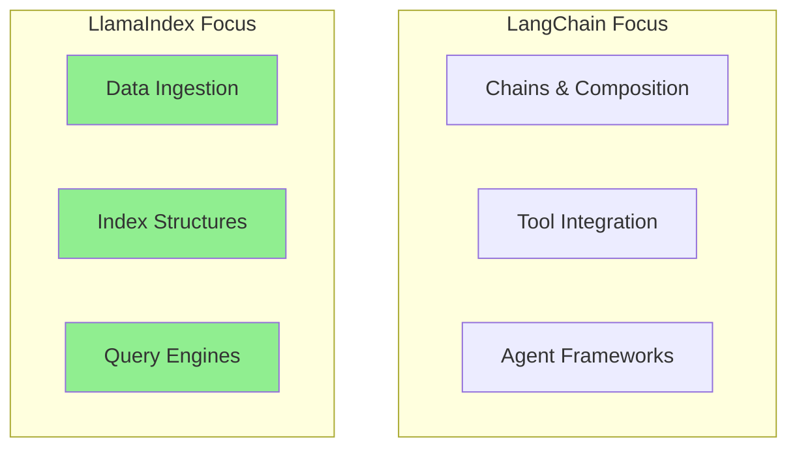
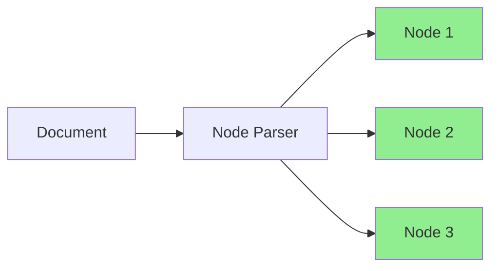
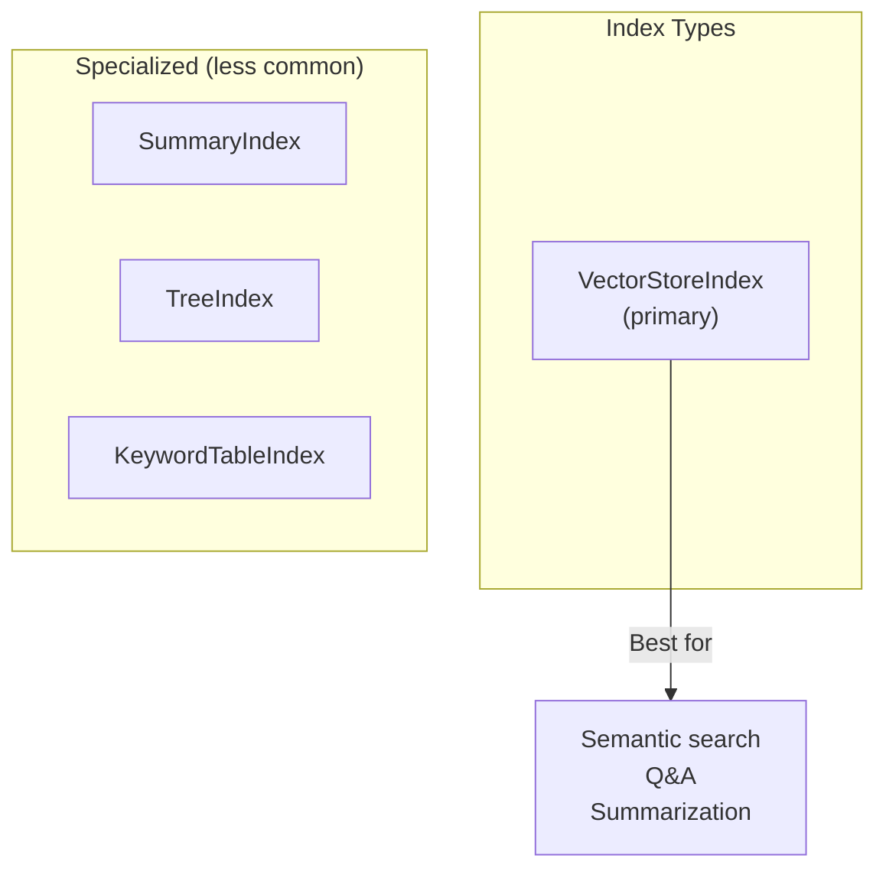
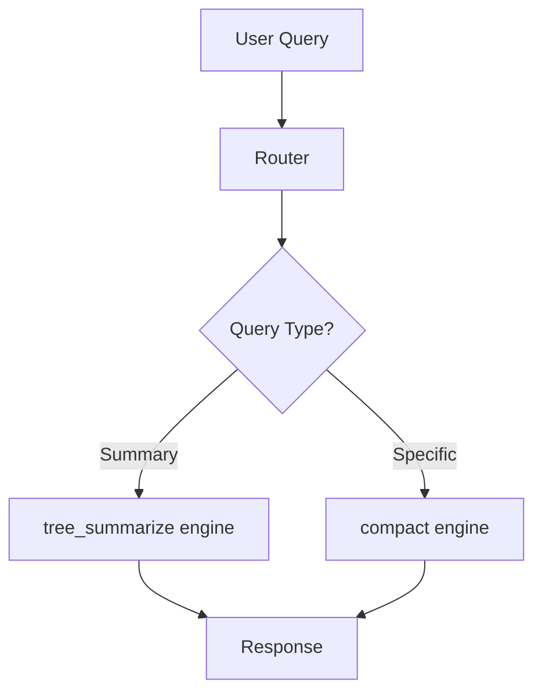
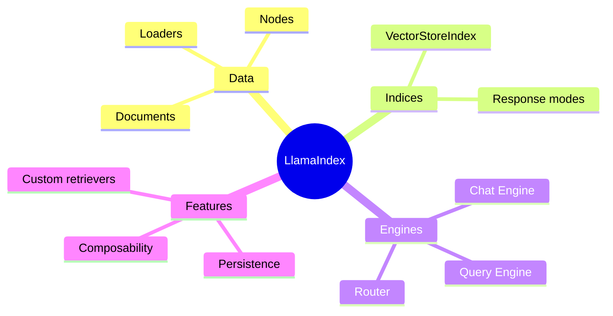
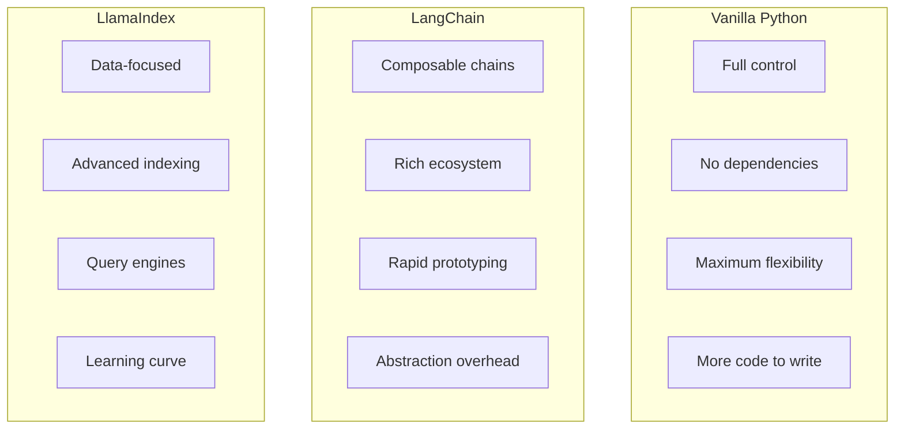
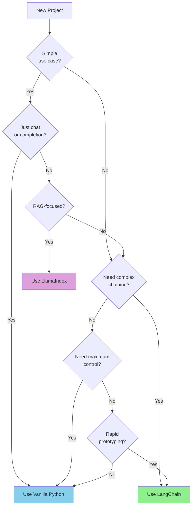
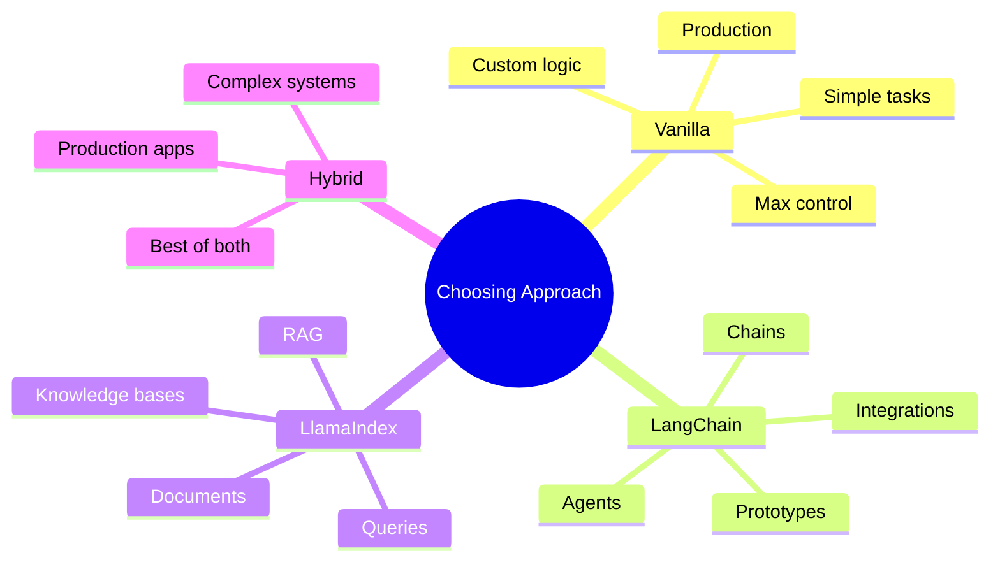

# Introduction to LlamaIndex

While LangChain focuses on composable chains, **LlamaIndex** specializes in connecting LLMs with your data. It excels at data ingestion, indexing, and building powerful query engines.

> **Coming from Software Engineering?** Choosing between LangChain, LlamaIndex, and vanilla Python is like choosing between Django, Flask, and raw WSGI. Each trades off differently on flexibility vs batteries-included. If you've made framework decisions before, apply the same criteria: team familiarity, project complexity, long-term maintenance.

> **This is a two-part day.** **Part 1** is a hands-on tour of LlamaIndex (ingestion, indexing, query/chat engines). **Part 2** ("When to Use a Framework vs. Vanilla Python") is the decision guide — read it once for the mental model, then use it as a reference. If you're short on time, do Part 1 now and skim Part 2.

---

## LlamaIndex vs LangChain



| Aspect | LangChain | LlamaIndex |
|--------|-----------|------------|
| Primary focus | Chains & agents | Data & retrieval |
| Indexing | Basic | Advanced |
| Query types | Simple | Complex (SQL, graphs) |
| Best for | General LLM apps | Knowledge-heavy apps |

---

## Installation

```bash
pip install llama-index llama-index-llms-openai llama-index-embeddings-openai
```

---

## Quick Start

```python
# script_id: day_039_llamaindex_and_framework_comparison/quick_start
from llama_index.core import VectorStoreIndex, SimpleDirectoryReader

# Load documents from a directory
documents = SimpleDirectoryReader("./data").load_data()

# Create index (automatically chunks, embeds, and stores)
index = VectorStoreIndex.from_documents(documents)

# Query the index
query_engine = index.as_query_engine()
response = query_engine.query("What is this document about?")
print(response)
```

That's it! LlamaIndex handles chunking, embedding, and retrieval automatically.

The three steps you wrote by hand in Phase 2 — splitting documents into chunks (Day 25), turning each chunk into an embedding vector so similar text sits near similar text (Day 19), and storing them for fast lookup — all happen inside that one `from_documents()` call.

---

## Core Components

### 1. Documents and Nodes

```python
# script_id: day_039_llamaindex_and_framework_comparison/documents_and_nodes
from llama_index.core import Document
from llama_index.core.node_parser import SentenceSplitter

# Create a document
doc = Document(
    text="LlamaIndex is a data framework for LLM applications...",
    metadata={"source": "manual", "author": "user"}
)

# Parse into nodes (chunks)
parser = SentenceSplitter(chunk_size=256, chunk_overlap=20)  # ~256 tokens per chunk; overlap repeats ~20 tokens across boundaries so an idea split across two chunks is still retrievable (Day 25)
nodes = parser.get_nodes_from_documents([doc])

print(f"Document split into {len(nodes)} nodes")
for node in nodes:
    print(f"  - {node.text[:50]}...")
```



### 2. Data Loaders

```python
# script_id: day_039_llamaindex_and_framework_comparison/data_loaders
from llama_index.core import SimpleDirectoryReader
from llama_index.readers.web import SimpleWebPageReader

# Load from directory
dir_reader = SimpleDirectoryReader(
    input_dir="./documents",
    recursive=True,
    required_exts=[".txt", ".pdf", ".md"]
)
docs = dir_reader.load_data()

# Load from web
web_reader = SimpleWebPageReader()
web_docs = web_reader.load_data(urls=["https://example.com/article"])

# Load from various sources using LlamaHub.
# In LlamaIndex 0.10+, loaders ship as separate namespace packages — install
# the one you need (the old monolithic `llama-hub` package is deprecated):
#   pip install llama-index-readers-github llama-index-readers-notion
from llama_index.readers.github import GithubRepositoryReader
from llama_index.readers.notion import NotionPageReader

# 100+ loaders available on LlamaHub, each as its own llama-index-readers-* package.
```

### 3. Index Types

```python
# script_id: day_039_llamaindex_and_framework_comparison/index_types
from llama_index.core import VectorStoreIndex
from llama_index.embeddings.openai import OpenAIEmbedding

embed_model = OpenAIEmbedding()

# Vector Index - finds chunks by meaning, not exact keywords (semantic search) - recommended primary path
vector_index = VectorStoreIndex.from_documents(documents, embed_model=embed_model)
```

> **Note:** `VectorStoreIndex` is the most common primary index for semantic Q&A, and the one to learn first. `SummaryIndex`, `TreeIndex`, and `KeywordTableIndex` still exist for specialized needs (e.g. `SummaryIndex` for whole-corpus summarization); we focus on `VectorStoreIndex` here.



---

## Query Engines

### Basic Query Engine

```python
# script_id: day_039_llamaindex_and_framework_comparison/basic_query_engine
from llama_index.core import VectorStoreIndex, SimpleDirectoryReader

# Load and index
documents = SimpleDirectoryReader("./data").load_data()
index = VectorStoreIndex.from_documents(documents)

# Create query engine
query_engine = index.as_query_engine(
    similarity_top_k=3,  # Retrieve top 3 chunks
    response_mode="compact"  # combine retrieved chunks into one answer
)

response = query_engine.query("Explain the main concepts")
print(response)
print(f"\nSources: {len(response.source_nodes)}")
```

### Response Modes

After retrieving the top chunks, how should they be combined into one answer?

```python
# script_id: day_039_llamaindex_and_framework_comparison/basic_query_engine
# Different ways to combine the retrieved chunks into one answer
query_engine = index.as_query_engine(
    response_mode="refine"  # answer from chunk 1, then revise with each later chunk (more LLM calls; good when chunks conflict)
)

query_engine = index.as_query_engine(
    response_mode="compact"  # stuff as many chunks as fit into one call, answer once (cheapest, default)
)

query_engine = index.as_query_engine(
    response_mode="tree_summarize"  # summarize in a tree; best for summarize-everything questions
)

query_engine = index.as_query_engine(
    response_mode="simple_summarize"  # naively concatenate chunks
)
```

### Customizing Retrieval

```python
# script_id: day_039_llamaindex_and_framework_comparison/custom_retrieval
from llama_index.core import VectorStoreIndex
from llama_index.core.retrievers import VectorIndexRetriever
from llama_index.core.query_engine import RetrieverQueryEngine
from llama_index.core.postprocessor import SimilarityPostprocessor

# Create custom retriever
retriever = VectorIndexRetriever(
    index=index,
    similarity_top_k=10
)

# Add post-processing
postprocessor = SimilarityPostprocessor(similarity_cutoff=0.7)  # keep only chunks scoring >= 0.7 out of 1.0 (higher = more related); raise to be stricter, lower if you get too few results

# Build custom query engine
query_engine = RetrieverQueryEngine(
    retriever=retriever,
    node_postprocessors=[postprocessor]
)

response = query_engine.query("Your question here")
```

---

## Chat Engines

For conversational interactions with memory:

```python
# script_id: day_039_llamaindex_and_framework_comparison/chat_engine
from llama_index.core import VectorStoreIndex, SimpleDirectoryReader

documents = SimpleDirectoryReader("./data").load_data()
index = VectorStoreIndex.from_documents(documents)

# Create chat engine
chat_engine = index.as_chat_engine(
    chat_mode="condense_question",  # Reformulates questions with context
    verbose=True
)

# Have a conversation
response1 = chat_engine.chat("What is this document about?")
print(response1)

response2 = chat_engine.chat("Can you tell me more about that?")
print(response2)

response3 = chat_engine.chat("How does it compare to alternatives?")
print(response3)

# Reset conversation
chat_engine.reset()
```

### Chat Modes

A follow-up like "tell me more about that" is meaningless to a retriever on its own. `condense_question` first rewrites it into a standalone question using the chat history before searching; `context` always pastes recent history into the prompt; `condense_plus_context` does both.

```python
# script_id: day_039_llamaindex_and_framework_comparison/chat_engine
# Different chat modes
chat_engine = index.as_chat_engine(chat_mode="simple")  # Basic
chat_engine = index.as_chat_engine(chat_mode="condense_question")  # Reformulates
chat_engine = index.as_chat_engine(chat_mode="context")  # Always uses context
chat_engine = index.as_chat_engine(chat_mode="condense_plus_context")  # Best of both
```

---

## Persistence

```python
# script_id: day_039_llamaindex_and_framework_comparison/persistence
from llama_index.core import VectorStoreIndex, StorageContext, load_index_from_storage

# Create and persist index
index = VectorStoreIndex.from_documents(documents)
index.storage_context.persist(persist_dir="./storage")

# Load existing index
storage_context = StorageContext.from_defaults(persist_dir="./storage")
loaded_index = load_index_from_storage(storage_context)

query_engine = loaded_index.as_query_engine()
```

---

## Using Different Vector Stores

```python
# script_id: day_039_llamaindex_and_framework_comparison/vector_stores
# ChromaDB
from llama_index.vector_stores.chroma import ChromaVectorStore
import chromadb

chroma_client = chromadb.PersistentClient(path="./chroma_db")
chroma_collection = chroma_client.get_or_create_collection("my_collection")
vector_store = ChromaVectorStore(chroma_collection=chroma_collection)

# Create index with custom vector store
from llama_index.core import StorageContext

storage_context = StorageContext.from_defaults(vector_store=vector_store)
index = VectorStoreIndex.from_documents(documents, storage_context=storage_context)
```

---

## Advanced: Composable Indices

Combine multiple indices:

```python
# script_id: day_039_llamaindex_and_framework_comparison/composable_indices
from llama_index.core import VectorStoreIndex, SimpleDirectoryReader
from llama_index.llms.openai import OpenAI
from llama_index.embeddings.openai import OpenAIEmbedding
from llama_index.core.tools import QueryEngineTool, ToolMetadata
from llama_index.core.query_engine import RouterQueryEngine
from llama_index.core.selectors import LLMSingleSelector

llm = OpenAI(model="gpt-4o-mini")
embed_model = OpenAIEmbedding()

# Create different query engines for different purposes
docs = SimpleDirectoryReader("./data").load_data()

vector_index = VectorStoreIndex.from_documents(docs, embed_model=embed_model)

# Create tools from query engines with different response modes
detail_tool = QueryEngineTool(
    query_engine=vector_index.as_query_engine(llm=llm, response_mode="compact"),
    metadata=ToolMetadata(
        name="vector_search",
        description="Useful for specific questions about details"
    )
)

summary_tool = QueryEngineTool(
    query_engine=vector_index.as_query_engine(llm=llm, response_mode="tree_summarize"),
    metadata=ToolMetadata(
        name="summary",
        description="Useful for summarization questions"
    )
)

# Router automatically selects the right tool
router_engine = RouterQueryEngine(
    selector=LLMSingleSelector.from_defaults(llm=llm),
    query_engine_tools=[detail_tool, summary_tool]
)

# Ask questions - router picks the right engine!
response = router_engine.query("Give me a summary")  # Uses tree_summarize mode
response = router_engine.query("What is the exact definition of X?")  # Uses compact mode
```



---

## Complete Example: Knowledge Base

```python
# script_id: day_039_llamaindex_and_framework_comparison/knowledge_base
from llama_index.core import (
    VectorStoreIndex,
    SimpleDirectoryReader,
    StorageContext,
    load_index_from_storage
)
from llama_index.llms.openai import OpenAI
from llama_index.embeddings.openai import OpenAIEmbedding
import os

class KnowledgeBase:
    """A complete knowledge base using LlamaIndex."""

    def __init__(self, data_dir: str, persist_dir: str = "./kb_storage"):
        self.data_dir = data_dir
        self.persist_dir = persist_dir

        # Create model instances (passed directly to constructors, not via Settings)
        self.llm = OpenAI(model="gpt-4o-mini", temperature=0)
        self.embed_model = OpenAIEmbedding()

        # Load or create index
        self.index = self._load_or_create_index()
        self.query_engine = self.index.as_query_engine(llm=self.llm, similarity_top_k=5)
        self.chat_engine = self.index.as_chat_engine(llm=self.llm, chat_mode="condense_plus_context")

    def _load_or_create_index(self):
        """Load existing index or create new one."""
        if os.path.exists(self.persist_dir):
            print("Loading existing index...")
            storage_context = StorageContext.from_defaults(persist_dir=self.persist_dir)
            return load_index_from_storage(storage_context)
        else:
            print("Creating new index...")
            documents = SimpleDirectoryReader(self.data_dir).load_data()
            index = VectorStoreIndex.from_documents(documents, embed_model=self.embed_model)
            index.storage_context.persist(persist_dir=self.persist_dir)
            return index

    def query(self, question: str) -> str:
        """One-off query."""
        response = self.query_engine.query(question)
        return str(response)

    def chat(self, message: str) -> str:
        """Conversational query."""
        response = self.chat_engine.chat(message)
        return str(response)

    def add_document(self, text: str, metadata: dict = None):
        """Add a new document to the index."""
        from llama_index.core import Document
        doc = Document(text=text, metadata=metadata or {})
        self.index.insert(doc)
        self.index.storage_context.persist(persist_dir=self.persist_dir)

    def get_sources(self, question: str) -> list:
        """Get source nodes for a query."""
        response = self.query_engine.query(question)
        return [
            {
                "text": node.node.text[:200],
                "score": node.score,
                "metadata": node.node.metadata
            }
            for node in response.source_nodes
        ]

# Usage
kb = KnowledgeBase(data_dir="./documents")

# Query
answer = kb.query("What are the main topics covered?")
print(answer)

# Chat
response1 = kb.chat("Tell me about the first topic")
response2 = kb.chat("How does that relate to the second one?")

# Get sources
sources = kb.get_sources("What is machine learning?")
for source in sources:
    print(f"Score: {source['score']:.3f} - {source['text'][:50]}...")
```

---

## Part 1 Summary — LlamaIndex



---

## LlamaIndex Quick Reference

```python
# script_id: day_039_llamaindex_and_framework_comparison/quick_reference
# Quick start
from llama_index.core import VectorStoreIndex, SimpleDirectoryReader

docs = SimpleDirectoryReader("./data").load_data()
index = VectorStoreIndex.from_documents(docs)
response = index.as_query_engine().query("Question?")

# Persistence
index.storage_context.persist("./storage")
index = load_index_from_storage(StorageContext.from_defaults(persist_dir="./storage"))

# Chat
chat = index.as_chat_engine()
chat.chat("First message")
chat.chat("Follow-up")
```

---

## Part 2 — When to Use a Framework vs. Vanilla Python

You've learned LangChain, LlamaIndex, and built agents from scratch. Now the important question: **when should you use each approach?**

This is the same call you make picking Django vs Flask vs raw WSGI: more batteries means a faster start but less control and harder debugging.

---

## The Trade-offs



---

## Decision Matrix

| Factor | Vanilla | LangChain | LlamaIndex |
|--------|---------|-----------|------------|
| Simple chat app | ✅ Best | Overkill | Overkill |
| Complex chains | More work | ✅ Best | Possible |
| RAG application | More work | Good | ✅ Best |
| Agent with tools | More work | ✅ Best | Possible |
| Custom logic | ✅ Best | Harder | Harder |
| Speed to prototype | Slower | ✅ Fast | ✅ Fast |
| Production control | ✅ Best | Less | Less |
| Team knowledge | Universal | Specialized | Specialized |

---

## Decision Flowchart



---

## Code Comparison

### Simple Chat

```python
# script_id: day_039_llamaindex_and_framework_comparison/simple_chat_comparison
# Vanilla Python - Simple and clear
from openai import OpenAI
client = OpenAI()

response = client.chat.completions.create(
    model="gpt-4o-mini",
    messages=[{"role": "user", "content": "Hello!"}]
)
print(response.choices[0].message.content)

# LangChain - More setup for simple task
from langchain_openai import ChatOpenAI
from langchain_core.messages import HumanMessage

llm = ChatOpenAI()
lc_response = llm.invoke([HumanMessage(content="Hello!")])
print(lc_response.content)

# Verdict: Vanilla wins for simplicity
```

### RAG Application

```python
# script_id: day_039_llamaindex_and_framework_comparison/rag_comparison
# fragment
# Vanilla Python - Lots of code
from openai import OpenAI
import chromadb

client = OpenAI()
chroma = chromadb.EphemeralClient()
collection = chroma.create_collection("docs")

# Load documents
docs = load_documents()  # You implement this

# Chunk documents
chunks = chunk_documents(docs)  # You implement this

# Embed and store
for chunk in chunks:
    embedding = client.embeddings.create(
        model="text-embedding-3-small",
        input=chunk
    ).data[0].embedding
    collection.add(ids=[...], embeddings=[embedding], documents=[chunk])

# Query
query_emb = client.embeddings.create(...).data[0].embedding
results = collection.query(query_embeddings=[query_emb])
# Build prompt, call LLM...

# LlamaIndex - Few lines
from llama_index.core import VectorStoreIndex, SimpleDirectoryReader

index = VectorStoreIndex.from_documents(
    SimpleDirectoryReader("./data").load_data()
)
response = index.as_query_engine().query("Question?")

# Verdict: LlamaIndex wins for RAG
```

### Complex Agent

```python
# script_id: day_039_llamaindex_and_framework_comparison/complex_agent_comparison
# Vanilla Python - Full control, more code
class Agent:
    def __init__(self):
        self.tools = {}

    def add_tool(self, name, func):
        self.tools[name] = func

    def run(self, task):
        # Implement the reason-then-act loop yourself: ask the LLM what to do, parse its chosen tool, run it, feed the result back, repeat (the ReAct pattern from Day 35)
        # Parse responses
        # Execute tools
        # Manage state
        pass  # 50+ lines of code

# LangChain - Pre-built components
from langchain.agents import create_react_agent, AgentExecutor
from langchain_openai import ChatOpenAI
from langchain_core.tools import Tool

tools = [Tool(name="search", func=search_fn, description="...")]
agent = create_react_agent(ChatOpenAI(), tools, prompt)
executor = AgentExecutor(agent=agent, tools=tools)
result = executor.invoke({"input": "task"})

# Verdict: LangChain wins for standard agents
# But vanilla wins if you need custom behavior
```

---

## Hybrid Approach

Often the best solution combines approaches:

```python
# script_id: day_039_llamaindex_and_framework_comparison/hybrid_approach
# Use LlamaIndex for data, vanilla for control

from llama_index.core import VectorStoreIndex, SimpleDirectoryReader
from openai import OpenAI

# LlamaIndex for the heavy lifting
index = VectorStoreIndex.from_documents(
    SimpleDirectoryReader("./data").load_data()
)
retriever = index.as_retriever(similarity_top_k=5)

# Vanilla Python for custom logic
client = OpenAI()

def custom_rag(question: str) -> str:
    # Retrieve with LlamaIndex
    nodes = retriever.retrieve(question)
    context = "\n".join([n.text for n in nodes])

    # Custom prompt logic
    if len(context) < 100:
        return "Not enough information found."

    # Custom LLM call
    response = client.chat.completions.create(
        model="gpt-4o",
        messages=[
            {"role": "system", "content": f"Context: {context}"},
            {"role": "user", "content": question}
        ],
        temperature=0.2  # Custom setting
    )

    # Custom post-processing
    answer = response.choices[0].message.content
    if "I don't know" in answer:
        return fallback_response(question)

    return answer
```

---

## Production Considerations

| Consideration | Vanilla | Frameworks |
|---------------|---------|------------|
| Debugging | Easy - your code | Harder - framework internals |
| Upgrades | You control | Breaking changes possible |
| Performance | Optimized by you | May have overhead |
| Hiring | Any Python dev | Need framework knowledge |
| Documentation | Self-documenting | Depends on framework |

---

## Recommendations

### Use Vanilla Python When:
- Building simple chat applications
- Need maximum control over behavior
- Want minimal dependencies
- Team doesn't know frameworks
- Building for long-term maintenance

### Use LangChain When:
- Building agents with tools
- Need complex chain compositions
- Want rapid prototyping
- Using many third-party integrations
- Building standard patterns

### Use LlamaIndex When:
- Building RAG applications
- Working with lots of documents
- Need advanced retrieval strategies
- Building knowledge bases
- Want quick data-to-query setup

### Use Hybrid When:
- Need best of both worlds
- Want framework convenience with custom control
- Building production systems that will evolve

---

## Summary



---

The best developers know when to use frameworks and when to write custom code. **Master all approaches, then choose wisely!**

---

## Exercises

1. Build a minimal RAG query engine in LlamaIndex: load a folder of `.txt` files, build a `VectorStoreIndex`, and answer one question with `index.as_query_engine().query(...)`.
2. Persist that index to disk and reload it in a fresh script with `StorageContext` + `load_index_from_storage`, proving you don't have to re-embed every run.
3. Take the same documents and answer the *same* question with plain vanilla Python (embed chunks, retrieve the most similar chunks (rank by cosine similarity as in Day 20 and take the top few — "top-k"), stuff into a prompt). Compare lines of code and control.
4. Fill in the decision table for three of your own past/side projects: would you pick Vanilla, LangChain, LlamaIndex, or Hybrid — and why?

<details><summary>Solutions (approaches)</summary>

1. ```text
   from llama_index.core import VectorStoreIndex, SimpleDirectoryReader
   docs = SimpleDirectoryReader("./data").load_data()
   index = VectorStoreIndex.from_documents(docs)
   print(index.as_query_engine().query("Your question?"))
   ```
2. `index.storage_context.persist("./storage")`, then reload with `load_index_from_storage(StorageContext.from_defaults(persist_dir="./storage"))`.
3. Vanilla is more code (manual chunking, an embedding call, a similarity loop) but every step is visible and tweakable — that's the trade-off the decision guide captures.
4. Rule of thumb from the guide: RAG-heavy → LlamaIndex; tool-using agent → LangChain; simple/maximum-control or long-lived production → Vanilla or Hybrid.
</details>

---

## Checkpoint

Drop two `.txt` files in `./data`, build a `VectorStoreIndex.from_documents(...)` and query it — you should get a coherent grounded answer in under ten lines. Empty or "I don't know"? Check `./data` has readable text and `OPENAI_API_KEY` is set.

---

## What's Next?

You now know all three approaches — vanilla, LangChain, and LlamaIndex — and when to reach for each. Next up is **PydanticAI**, a lightweight, type-first agent framework that brings Pydantic-style validation to agent outputs, before we dive into LangGraph state machines.
