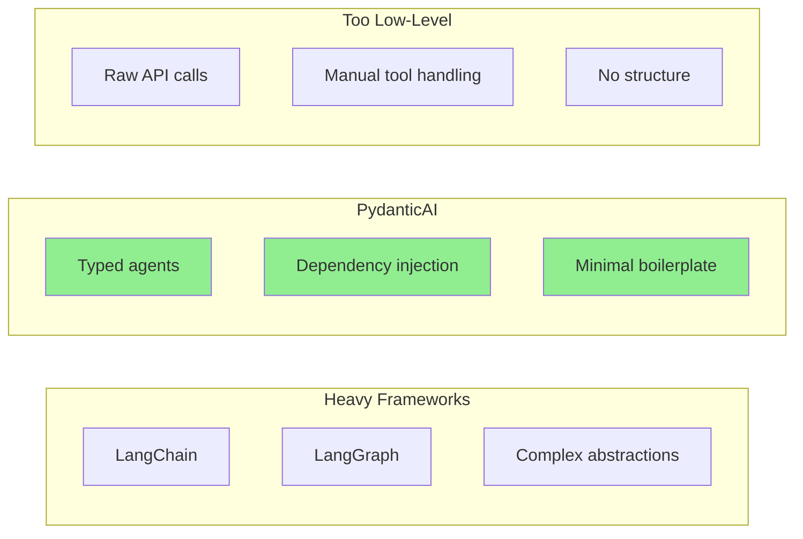
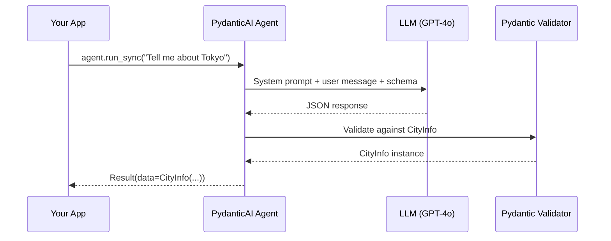
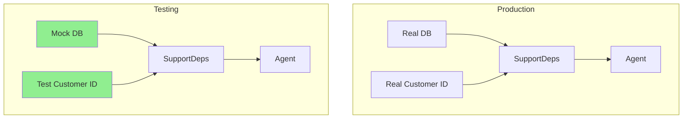
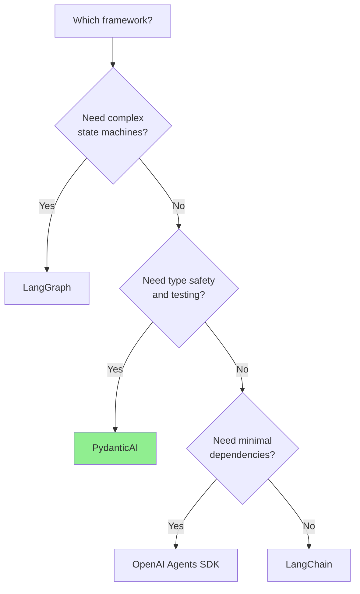
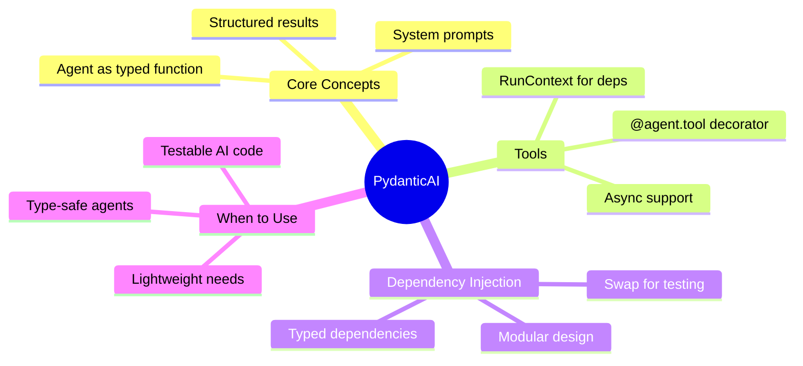

# PydanticAI -- Code-First Agents

PydanticAI is a lightweight agent framework from the Pydantic team that brings the same type-safe, developer-friendly philosophy to AI agents. Instead of complex chains and verbose abstractions, PydanticAI treats agents as typed Python functions with dependency injection -- making them easy to write, test, and reason about.

> **Coming from Software Engineering?** PydanticAI treats agents like FastAPI treats endpoints -- typed, injectable, testable. If you've used FastAPI's `Depends()` for database sessions or auth, you already understand PydanticAI's dependency injection. Agents are just functions with typed inputs, typed outputs, and injected dependencies.

---

## Why PydanticAI?



| Aspect | LangChain | PydanticAI | Raw SDK |
|--------|-----------|------------|---------|
| Boilerplate | High | Low | Lowest |
| Type safety | Weak | Strong | None |
| Testing | Hard | Easy (DI) | Manual |
| Learning curve | Steep | Gentle | Minimal |
| Structured output | Plugin-based | Native Pydantic | Manual parsing |

---

## Installation

```bash
pip install pydantic-ai
```

---

## Your First Agent

```python
# script_id: day_040_pydanticai/first_agent
from pydantic_ai import Agent

# Create a simple agent with a system prompt
agent = Agent(
    "openai:gpt-4o-mini",
    system_prompt="You are a helpful assistant that answers concisely.",
)

# Run the agent synchronously
result = agent.run_sync("What is the capital of France?")
print(result.data)  # "Paris"
```

That's it -- no chains, no runnables, no output parsers. Just a function call.

---

## Structured Results with Pydantic Models

The real power comes from typed outputs. PydanticAI validates LLM responses against your Pydantic models automatically.

```python
# script_id: day_040_pydanticai/structured_results
from pydantic import BaseModel
from pydantic_ai import Agent

class CityInfo(BaseModel):
    name: str
    country: str
    population: int
    famous_for: list[str]

# Agent that returns structured data
agent = Agent(
    "openai:gpt-4o-mini",
    result_type=CityInfo,
    system_prompt="Extract city information from the user's query.",
)

result = agent.run_sync("Tell me about Tokyo")
city = result.data  # CityInfo instance, fully validated

print(f"{city.name}, {city.country}")
print(f"Population: {city.population:,}")
print(f"Famous for: {', '.join(city.famous_for)}")
```



---

## Adding Tools with @agent.tool

Tools let your agent call Python functions to fetch data, perform calculations, or interact with external systems.

```python
# script_id: day_040_pydanticai/weather_tool
from pydantic_ai import Agent, RunContext
import httpx

agent = Agent(
    "openai:gpt-4o-mini",
    system_prompt="You help users check the weather. Use the weather tool.",
)

@agent.tool
async def get_weather(ctx: RunContext[None], city: str) -> str:
    """Get current weather for a city."""
    # In production, call a real weather API
    async with httpx.AsyncClient() as client:
        resp = await client.get(
            f"https://wttr.in/{city}?format=3"
        )
        return resp.text

# The agent can now call get_weather when it decides to.
# agent.run(...) is a coroutine, so it must be awaited inside an async function.
# Use asyncio.run() to drive it from a top-level script (or call agent.run_sync()).
import asyncio

async def main():
    result = await agent.run("What's the weather in London?")
    print(result.data)

asyncio.run(main())
```

### Multiple Tools

```python
# script_id: day_040_pydanticai/multiple_tools
from pydantic_ai import Agent, RunContext
from datetime import datetime

agent = Agent(
    "openai:gpt-4o-mini",
    system_prompt="You are a helpful assistant with access to tools.",
)

@agent.tool
def get_current_time(ctx: RunContext[None]) -> str:
    """Get the current date and time."""
    return datetime.now().isoformat()

@agent.tool
def calculate(ctx: RunContext[None], expression: str) -> str:
    """Evaluate a mathematical expression."""
    try:
        # WARNING: eval() is never fully safe even with restricted builtins.
        # Don't reach for ast.literal_eval() here — it only parses literals and
        # raises on operators like "2 + 2". For arithmetic use a math parser
        # (e.g. numexpr) or a small ast.parse-based evaluator (see Day 35).
        result = eval(expression, {"__builtins__": {}})
        return str(result)
    except Exception as e:
        return f"Error: {e}"

@agent.tool
def search_docs(ctx: RunContext[None], query: str) -> str:
    """Search internal documentation."""
    # Simulated search -- replace with real vector search
    docs = {
        "refund": "Refund policy: 30 days, original payment method.",
        "shipping": "Free shipping on orders over $50.",
        "returns": "Returns accepted within 30 days with receipt.",
    }
    for key, value in docs.items():
        if key in query.lower():
            return value
    return "No relevant documentation found."

result = agent.run_sync("What's the refund policy and what time is it?")
print(result.data)
```

---

## Dependency Injection

Dependency injection is what makes PydanticAI agents testable and modular. You define a dependency type, and the agent receives it at runtime through `RunContext`.

```python
# script_id: day_040_pydanticai/dependency_injection
from dataclasses import dataclass
from pydantic_ai import Agent, RunContext

# Define your dependencies
@dataclass
class SupportDeps:
    customer_id: int
    db_connection: object  # Your database connection
    is_premium: bool

# Agent knows it will receive SupportDeps
agent = Agent(
    "openai:gpt-4o-mini",
    deps_type=SupportDeps,
    system_prompt="You are a customer support agent.",
)

# Dynamic system prompt based on dependencies
@agent.system_prompt
def add_customer_context(ctx: RunContext[SupportDeps]) -> str:
    if ctx.deps.is_premium:
        return "This is a premium customer. Be extra helpful and offer expedited solutions."
    return "This is a standard customer. Follow normal support procedures."

# Tools can access dependencies
@agent.tool
def lookup_order(ctx: RunContext[SupportDeps], order_id: str) -> str:
    """Look up an order for the current customer."""
    # Access the injected database connection
    db = ctx.deps.db_connection
    customer_id = ctx.deps.customer_id
    # In practice: return db.query(order_id, customer_id)
    return f"Order {order_id} for customer {customer_id}: shipped, arriving tomorrow."

# Run with real dependencies
deps = SupportDeps(
    customer_id=42,
    db_connection=get_db(),  # Your real DB
    is_premium=True,
)
result = agent.run_sync("Where is my order #12345?", deps=deps)
```



---

## Testing Agents

Dependency injection makes testing straightforward -- swap real dependencies for mocks.

```python
# script_id: day_040_pydanticai/dependency_injection
import pytest
from unittest.mock import MagicMock

@pytest.fixture
def mock_deps():
    """Create mock dependencies for testing."""
    return SupportDeps(
        customer_id=1,
        db_connection=MagicMock(),
        is_premium=False,
    )

def test_standard_customer_flow(mock_deps):
    """Test that standard customers get normal responses."""
    result = agent.run_sync(
        "What's your return policy?",
        deps=mock_deps,
    )
    assert result.data  # Agent produced a response
    # Check the mock DB was not called for this query
    mock_deps.db_connection.query.assert_not_called()

def test_order_lookup(mock_deps):
    """Test that order lookup uses the database."""
    mock_deps.db_connection.query.return_value = "Order shipped"
    result = agent.run_sync(
        "Where is order #999?",
        deps=mock_deps,
    )
    assert "order" in result.data.lower()
```

---

## Conversation History and Multi-Turn

```python
# script_id: day_040_pydanticai/conversation_history
from pydantic_ai import Agent

agent = Agent(
    "openai:gpt-4o-mini",
    system_prompt="You are a math tutor. Explain step by step.",
)

# First turn
result1 = agent.run_sync("What is a derivative?")
print(result1.data)

# Continue the conversation using message_history
result2 = agent.run_sync(
    "Can you give me an example?",
    message_history=result1.all_messages(),
)
print(result2.data)

# The agent remembers the context from result1
result3 = agent.run_sync(
    "Now explain integration",
    message_history=result2.all_messages(),
)
print(result3.data)
```

---

## Framework Comparison



| Feature | PydanticAI | LangChain | LangGraph | OpenAI Agents SDK |
|---------|------------|-----------|-----------|-------------------|
| Type safety | Native | Weak | Moderate | Weak |
| Dependency injection | Built-in | None | None | None |
| Testing | Excellent | Hard | Moderate | Manual |
| Structured output | Pydantic native | Output parsers | State schema | JSON mode |
| Learning curve | Low | High | High | Low |
| Multi-model support | Yes | Yes | Yes | OpenAI only |
| State machines | No | Via LangGraph | Yes | No |
| Community size | Growing | Large | Growing | Growing |

---

## Summary



---

## Quick Reference

```python
# script_id: day_040_pydanticai/quick_reference
from pydantic_ai import Agent, RunContext
from pydantic import BaseModel

# Basic agent
agent = Agent("openai:gpt-4o-mini", system_prompt="...")

# Structured output
agent = Agent("openai:gpt-4o-mini", result_type=MyModel)

# With dependencies
agent = Agent("openai:gpt-4o-mini", deps_type=MyDeps)

# Add a tool
@agent.tool
def my_tool(ctx: RunContext[MyDeps], arg: str) -> str:
    return "result"

# Dynamic system prompt
@agent.system_prompt
def dynamic_prompt(ctx: RunContext[MyDeps]) -> str:
    return f"Customer ID: {ctx.deps.customer_id}"

# Run
result = agent.run_sync("query", deps=my_deps)
print(result.data)

# Multi-turn
result2 = agent.run_sync("follow up", message_history=result.all_messages())
```

---

## Exercises

1. **Support Bot**: Build a customer support agent with PydanticAI that uses dependency injection for a database connection and returns structured `TicketResolution(status, action, message)` responses

2. **Multi-Tool Agent**: Create an agent with at least 3 tools (calculator, dictionary lookup, date/time) and test it with mocked dependencies using pytest

3. **Framework Shootout**: Implement the same simple agent (summarize text, extract entities) in PydanticAI, LangChain, and raw OpenAI SDK -- compare lines of code, type safety, and testability

---

## What's Next?

Now that you've seen multiple frameworks, let's dive deep into **LangGraph** for building complex agent state machines!
