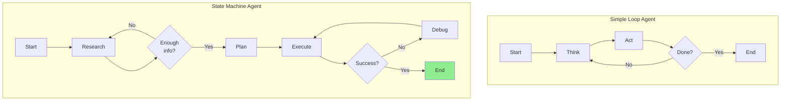
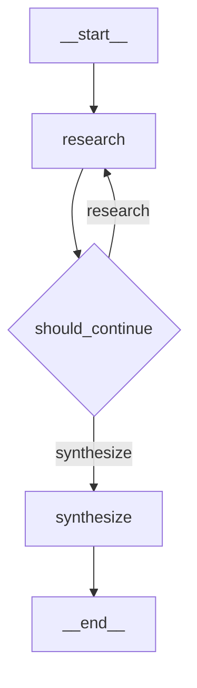
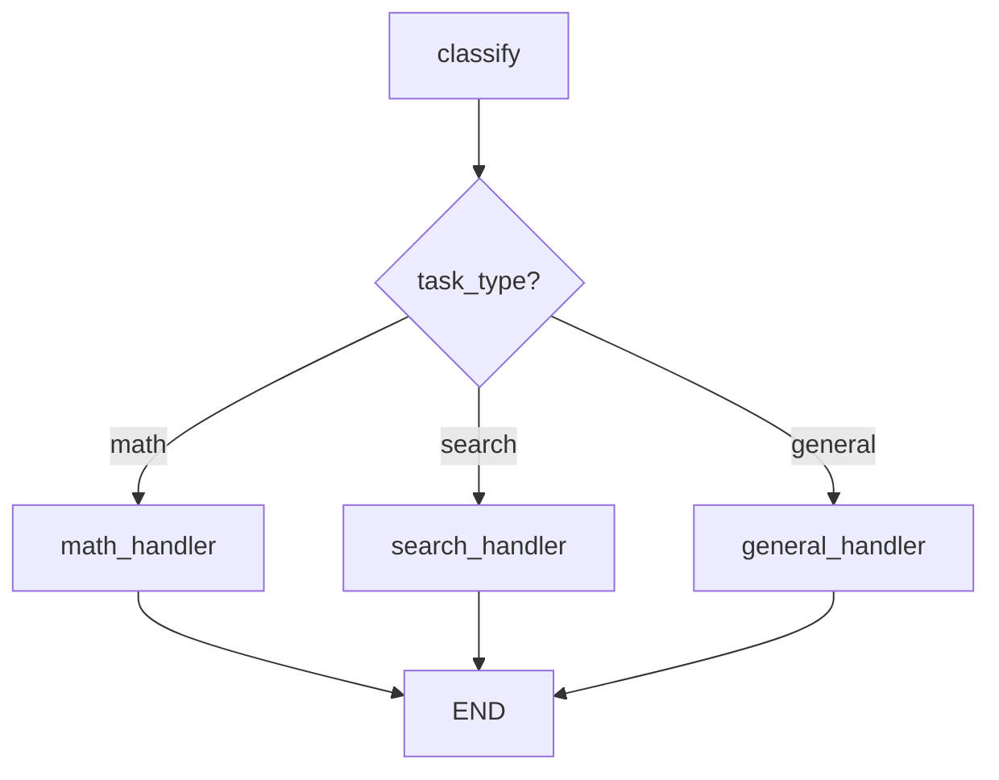
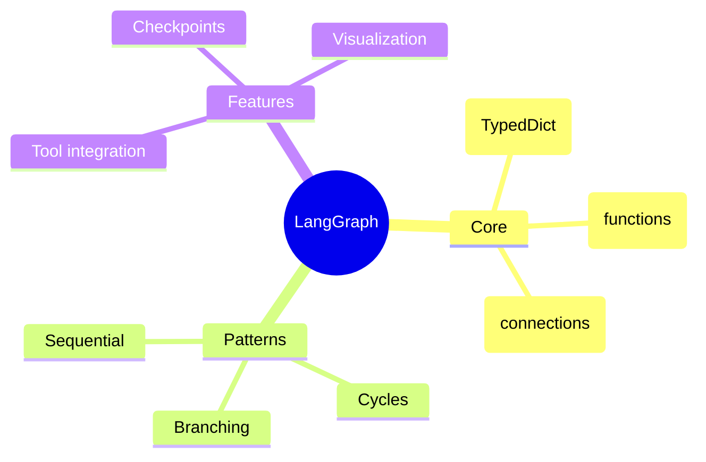

# Stateful Agents with LangGraph

You've built agents with simple loops. Now let's level up with **LangGraph** - a framework for building agents as **state machines** with explicit control flow.

> **Coming from Software Engineering?** LangGraph state machines are like Redux reducers or finite state machines in embedded systems. If you've modeled workflows as state machines (order status: pending → paid → shipped) or used XState/Redux, you already think in states and transitions — LangGraph just applies this to AI agents.

---

## Why State Machines?



State machines give you **explicit control** over agent behavior!

---

## Installing LangGraph

```bash
pip install langgraph langchain langchain-openai
```

---

## Core Concepts

### 1. State

A TypedDict that holds all information the agent needs:

```python
# script_id: day_041_state_machines/state_definition
from typing import TypedDict, Annotated
from operator import add

class AgentState(TypedDict):
    messages: list              # Conversation history
    current_step: str           # Which step we're on
    results: Annotated[list, add]  # Accumulated results
    iteration: int              # Loop counter
```

### 2. Nodes

Functions that process the state:

```python
# script_id: day_041_state_machines/node_example
def research_node(state: AgentState) -> dict:
    """Do research and update state."""
    # Process state
    result = do_research(state["messages"])
    return {"results": [result], "iteration": state["iteration"] + 1}
```

### 3. Edges

Connections between nodes (can be conditional):

```python
# script_id: day_041_state_machines/edge_example
def should_continue(state: AgentState) -> str:
    """Decide which node to go to next."""
    if state["iteration"] >= 5:
        return "end"
    elif needs_more_research(state):
        return "research"
    else:
        return "summarize"
```

---

## Building Your First Graph

```python
# script_id: day_041_state_machines/first_graph
from typing import TypedDict, Annotated
from langgraph.graph import StateGraph, END
from langchain_openai import ChatOpenAI
from langchain_core.messages import HumanMessage, AIMessage

# Define state
class ResearchState(TypedDict):
    messages: list
    research_results: list
    final_answer: str

# Initialize LLM
llm = ChatOpenAI(model="gpt-4o", temperature=0)

# Define nodes
def researcher(state: ResearchState) -> dict:
    """Research node - gathers information."""
    messages = state["messages"]

    response = llm.invoke([
        HumanMessage(content="Based on the question, what key facts should we research?"),
        *messages
    ])

    return {
        "research_results": [response.content],
        "messages": messages + [response]
    }

def synthesizer(state: ResearchState) -> dict:
    """Synthesize research into final answer."""
    research = "\n".join(state["research_results"])

    response = llm.invoke([
        HumanMessage(content=f"Based on this research:\n{research}\n\nProvide a comprehensive answer.")
    ])

    return {"final_answer": response.content}

# Define routing logic
def should_continue(state: ResearchState) -> str:
    """Decide if we need more research."""
    if len(state["research_results"]) >= 2:
        return "synthesize"
    return "research"

# Build the graph
workflow = StateGraph(ResearchState)

# Add nodes
workflow.add_node("research", researcher)
workflow.add_node("synthesize", synthesizer)

# Add edges
workflow.set_entry_point("research")
workflow.add_conditional_edges(
    "research",
    should_continue,
    {
        "research": "research",
        "synthesize": "synthesize"
    }
)
workflow.add_edge("synthesize", END)

# Compile
app = workflow.compile()

# Run it!
result = app.invoke({
    "messages": [HumanMessage(content="What is quantum computing?")],
    "research_results": [],
    "final_answer": ""
})

print(result["final_answer"])
```

---

## Visualizing Your Graph

```python
# script_id: day_041_state_machines/first_graph
# Print the graph structure
print(app.get_graph().draw_mermaid())
```

Output:


---

## Agent with Tools

```python
# script_id: day_041_state_machines/agent_with_tools
from typing import TypedDict, Annotated
from langgraph.graph import StateGraph, END
from langgraph.prebuilt import ToolNode
from langchain_openai import ChatOpenAI
from langchain_core.tools import tool

# Define tools
@tool
def search(query: str) -> str:
    """Search for information."""
    return f"Search results for: {query}"

@tool
def calculate(expression: str) -> str:
    """Calculate mathematical expression."""
    import ast, operator
    def safe_eval(node):
        if isinstance(node, ast.Constant): return node.value
        elif isinstance(node, ast.BinOp):
            ops = {ast.Add: operator.add, ast.Sub: operator.sub,
                   ast.Mult: operator.mul, ast.Div: operator.truediv}
            return ops[type(node.op)](safe_eval(node.left), safe_eval(node.right))
        elif isinstance(node, ast.UnaryOp) and isinstance(node.op, ast.USub):
            return -safe_eval(node.operand)
        raise ValueError("Unsupported expression")
    return str(safe_eval(ast.parse(expression, mode='eval').body))

tools = [search, calculate]

# State
class AgentState(TypedDict):
    messages: list

# LLM with tools
llm = ChatOpenAI(model="gpt-4o").bind_tools(tools)

# Nodes
def agent(state: AgentState) -> dict:
    """The main agent node."""
    response = llm.invoke(state["messages"])
    return {"messages": [response]}

def should_continue(state: AgentState) -> str:
    """Check if we should use tools or end."""
    last_message = state["messages"][-1]
    if hasattr(last_message, "tool_calls") and last_message.tool_calls:
        return "tools"
    return "end"

# Build graph
workflow = StateGraph(AgentState)

workflow.add_node("agent", agent)
workflow.add_node("tools", ToolNode(tools))

workflow.set_entry_point("agent")
workflow.add_conditional_edges(
    "agent",
    should_continue,
    {"tools": "tools", "end": END}
)
workflow.add_edge("tools", "agent")  # Go back to agent after tools

app = workflow.compile()

# Run
from langchain_core.messages import HumanMessage

result = app.invoke({
    "messages": [HumanMessage(content="What is 25 * 17? Also search for Python.")]
})

for msg in result["messages"]:
    print(f"{msg.type}: {msg.content[:100]}...")
```

---

## Branching Workflows

```python
# script_id: day_041_state_machines/branching_workflows
from langgraph.graph import StateGraph, END

class TaskState(TypedDict):
    task: str
    task_type: str
    result: str

def classifier(state: TaskState) -> dict:
    """Classify the task type."""
    task = state["task"].lower()
    if "calculate" in task or "math" in task:
        return {"task_type": "math"}
    elif "search" in task or "find" in task:
        return {"task_type": "search"}
    else:
        return {"task_type": "general"}

def math_handler(state: TaskState) -> dict:
    """Handle math tasks."""
    return {"result": f"Math result for: {state['task']}"}

def search_handler(state: TaskState) -> dict:
    """Handle search tasks."""
    return {"result": f"Search result for: {state['task']}"}

def general_handler(state: TaskState) -> dict:
    """Handle general tasks."""
    return {"result": f"General result for: {state['task']}"}

def route_task(state: TaskState) -> str:
    """Route based on task type."""
    return state["task_type"]

# Build branching graph
workflow = StateGraph(TaskState)

workflow.add_node("classify", classifier)
workflow.add_node("math", math_handler)
workflow.add_node("search", search_handler)
workflow.add_node("general", general_handler)

workflow.set_entry_point("classify")
workflow.add_conditional_edges(
    "classify",
    route_task,
    {
        "math": "math",
        "search": "search",
        "general": "general"
    }
)

# All handlers go to END
workflow.add_edge("math", END)
workflow.add_edge("search", END)
workflow.add_edge("general", END)

app = workflow.compile()
```



---

## Cycles and Iteration

```python
# script_id: day_041_state_machines/cycles_and_iteration
class IterativeState(TypedDict):
    content: str
    quality_score: float
    iterations: int
    max_iterations: int

def improve_content(state: IterativeState) -> dict:
    """Improve content quality."""
    # Simulate improvement
    new_score = state["quality_score"] + 0.15
    improved = f"{state['content']} [improved v{state['iterations'] + 1}]"

    return {
        "content": improved,
        "quality_score": min(new_score, 1.0),
        "iterations": state["iterations"] + 1
    }

def should_improve_more(state: IterativeState) -> str:
    """Check if we should continue improving."""
    if state["iterations"] >= state["max_iterations"]:
        return "done"
    if state["quality_score"] >= 0.9:
        return "done"
    return "improve"

workflow = StateGraph(IterativeState)

workflow.add_node("improve", improve_content)

workflow.set_entry_point("improve")
workflow.add_conditional_edges(
    "improve",
    should_improve_more,
    {
        "improve": "improve",  # Loop back
        "done": END
    }
)

app = workflow.compile()

result = app.invoke({
    "content": "Initial draft",
    "quality_score": 0.3,
    "iterations": 0,
    "max_iterations": 5
})

print(f"Final: {result['content']}")
print(f"Quality: {result['quality_score']:.2f}")
print(f"Iterations: {result['iterations']}")
```

---

## Summary



---

## Quick Reference

```python
# script_id: day_041_state_machines/quick_reference
from langgraph.graph import StateGraph, END

# 1. Define state
class MyState(TypedDict):
    data: str

# 2. Define nodes
def my_node(state: MyState) -> dict:
    return {"data": "processed"}

# 3. Build graph
graph = StateGraph(MyState)
graph.add_node("node1", my_node)
graph.set_entry_point("node1")
graph.add_edge("node1", END)

# 4. Compile and run
app = graph.compile()
result = app.invoke({"data": "input"})
```

---

## What's Next?

Now let's learn about **Memory and Persistence** - saving agent state across sessions!
