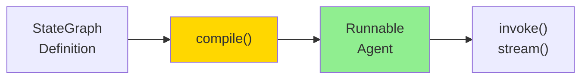
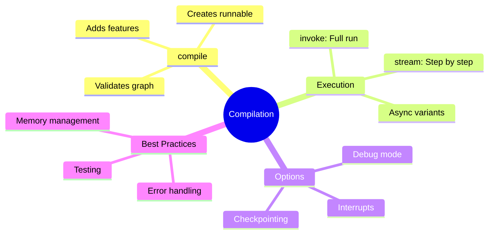

# Compiling and Running LangGraph Agents

You've defined nodes and edges. Now let's compile your graph into a runnable agent and learn how to execute it effectively.

> **Coming from Software Engineering?** Compiling a LangGraph graph is like bundling a webpack config or docker-compose build — you declare the structure, then compile it into a runnable artifact. If you've worked with declarative configs (Terraform, CloudFormation, Docker Compose), the compile-then-run pattern is familiar.

---

## The Compilation Process



Compilation:
- Validates your graph structure
- Optimizes execution paths
- Creates a runnable object

---

## Basic Compilation

```python
# script_id: day_043_compiling_graphs/basic_compilation
from langgraph.graph import StateGraph, END
from typing import TypedDict, Annotated
from operator import add

# Define state
class AgentState(TypedDict):
    messages: Annotated[list, add]
    result: str

# Define nodes
def process(state: AgentState) -> dict:
    return {"messages": ["Processed"], "result": "Done!"}

# Build graph
workflow = StateGraph(AgentState)
workflow.add_node("process", process)
workflow.set_entry_point("process")
workflow.add_edge("process", END)

# Compile!
app = workflow.compile()

# Now 'app' is a runnable agent
```

---

## Running Your Agent

### invoke() - Complete Execution

Run the entire graph and get the final result:

```python
# script_id: day_043_compiling_graphs/basic_compilation
# Invoke with initial state
result = app.invoke({
    "messages": ["Hello!"],
    "result": ""
})

print(result)
# {'messages': ['Hello!', 'Processed'], 'result': 'Done!'}
```

### stream() - Step by Step

Watch each step as it executes:

```python
# script_id: day_043_compiling_graphs/stream_execution
# Stream execution
for step in app.stream({"messages": ["Hello!"], "result": ""}):
    print(f"Step: {step}")
    print(f"  Node: {list(step.keys())[0]}")
    print(f"  Output: {step}")
    print()

# Output:
# Step: {'process': {'messages': ['Processed'], 'result': 'Done!'}}
#   Node: process
#   Output: {'process': {...}}
```

### Stream with Updates

Get detailed updates during execution:

```python
# script_id: day_043_compiling_graphs/stream_modes
# Stream mode options
for event in app.stream(
    {"messages": ["Start"], "result": ""},
    stream_mode="updates"  # Only show changes
):
    print(event)

# Or get full state at each step
for event in app.stream(
    {"messages": ["Start"], "result": ""},
    stream_mode="values"  # Full state each time
):
    print(event)
```

---

## Complete Example: Multi-Step Agent

```python
# script_id: day_043_compiling_graphs/multi_step_agent
from langgraph.graph import StateGraph, END
from typing import TypedDict, Annotated, Literal
from operator import add
from openai import OpenAI

client = OpenAI()

class AgentState(TypedDict):
    messages: Annotated[list, add]
    task: str
    plan: str
    result: str
    status: str

def understand_task(state: AgentState) -> dict:
    """Understand what the user wants."""
    task = state["task"]

    response = client.chat.completions.create(
        model="gpt-4o-mini",
        messages=[
            {"role": "system", "content": "Briefly describe what the user wants."},
            {"role": "user", "content": task}
        ]
    )

    understanding = response.choices[0].message.content
    return {
        "messages": [f"Understanding: {understanding}"],
        "status": "understood"
    }

def create_plan(state: AgentState) -> dict:
    """Create a plan to accomplish the task."""
    task = state["task"]

    response = client.chat.completions.create(
        model="gpt-4o-mini",
        messages=[
            {"role": "system", "content": "Create a brief 3-step plan."},
            {"role": "user", "content": f"Plan for: {task}"}
        ]
    )

    plan = response.choices[0].message.content
    return {
        "plan": plan,
        "messages": [f"Plan created"],
        "status": "planned"
    }

def execute_plan(state: AgentState) -> dict:
    """Execute the plan."""
    plan = state["plan"]

    response = client.chat.completions.create(
        model="gpt-4o-mini",
        messages=[
            {"role": "system", "content": "Execute this plan and provide the result."},
            {"role": "user", "content": plan}
        ]
    )

    result = response.choices[0].message.content
    return {
        "result": result,
        "messages": ["Execution complete"],
        "status": "complete"
    }

def check_result(state: AgentState) -> Literal["done", "retry"]:
    """Check if we should finish or retry."""
    if state["status"] == "complete" and state["result"]:
        return "done"
    return "retry"

# Build the graph
workflow = StateGraph(AgentState)

# Add nodes
workflow.add_node("understand", understand_task)
workflow.add_node("plan", create_plan)
workflow.add_node("execute", execute_plan)

# Set entry point
workflow.set_entry_point("understand")

# Add edges
workflow.add_edge("understand", "plan")
workflow.add_edge("plan", "execute")
workflow.add_conditional_edges(
    "execute",
    check_result,
    {"done": END, "retry": "plan"}
)

# Compile
agent = workflow.compile()

# Run!
result = agent.invoke({
    "task": "Write a haiku about programming",
    "messages": [],
    "plan": "",
    "result": "",
    "status": ""
})

print("Final Result:")
print(result["result"])
```

---

## Compilation Options

### Add Checkpointing

```python
# script_id: day_043_compiling_graphs/checkpointing
from langgraph.checkpoint.memory import MemorySaver  # or: pip install langgraph-checkpoint-sqlite

# Create a checkpointer
checkpointer = MemorySaver()

# Compile with checkpointer
app = workflow.compile(checkpointer=checkpointer)

# Run with a thread ID
config = {"configurable": {"thread_id": "user-123"}}
result = app.invoke({"messages": ["Hello"]}, config=config)

# Later, resume from checkpoint
result2 = app.invoke({"messages": ["Continue"]}, config=config)
```

### Add Interrupts (Human-in-the-Loop)

```python
# script_id: day_043_compiling_graphs/checkpointing
# Compile with interrupt points
app = workflow.compile(
    checkpointer=checkpointer,
    interrupt_before=["execute"],  # Pause before this node
    interrupt_after=["plan"]  # Or pause after this node
)

# Run until interrupt
config = {"configurable": {"thread_id": "session-1"}}
result = app.invoke({"task": "Do something"}, config=config)

# At this point, execution is paused
print("Paused! Current state:", result)

# Resume after human review
final = app.invoke(None, config=config)  # Continue from checkpoint
```

---

## Debugging Your Graph

### Visualize the Graph

```python
# script_id: day_043_compiling_graphs/visualize_graph
# Get graph structure
print(app.get_graph().draw_ascii())

# Or save as image (requires graphviz)
app.get_graph().draw_png("my_graph.png")
```

### Print Each Step

```python
# script_id: day_043_compiling_graphs/debug_stream
def debug_stream(app, initial_state):
    """Run with detailed debugging."""
    print("=" * 50)
    print("Starting execution")
    print("=" * 50)

    for i, step in enumerate(app.stream(initial_state)):
        print(f"\n--- Step {i + 1} ---")
        for node_name, output in step.items():
            print(f"Node: {node_name}")
            print(f"Output: {output}")
        print()

    print("=" * 50)
    print("Execution complete")
    print("=" * 50)

# Usage
debug_stream(agent, {"task": "Test", "messages": [], ...})
```

### Error Handling

```python
# script_id: day_043_compiling_graphs/error_handling
from langgraph.errors import GraphRecursionError

try:
    result = app.invoke(initial_state)
except GraphRecursionError:
    print("Graph exceeded maximum recursion depth!")
except Exception as e:
    print(f"Error during execution: {e}")
```

---

## Async Execution

Run graphs asynchronously:

```python
# script_id: day_043_compiling_graphs/async_execution
import asyncio

# Async invoke
async def run_async():
    result = await app.ainvoke({"messages": ["Hello"], "result": ""})
    return result

# Async stream
async def stream_async():
    async for step in app.astream({"messages": ["Hello"], "result": ""}):
        print(step)

# Run
result = asyncio.run(run_async())
```

---

## Configuration Options

```python
# script_id: day_043_compiling_graphs/config_options
# Compile with options
app = workflow.compile(
    checkpointer=checkpointer,       # Enable persistence
    interrupt_before=["node_name"],  # Human-in-the-loop
    interrupt_after=["node_name"],   # More HITL points
    debug=True                       # Enable debug mode
)

# Invoke with configuration
result = app.invoke(
    initial_state,
    config={
        "configurable": {
            "thread_id": "unique-id",  # For checkpointing
        },
        "recursion_limit": 25,  # Max graph cycles
        "tags": ["production"],  # For tracing
    }
)
```

---

## Handling Large States

For large state objects, be mindful of memory:

```python
# script_id: day_043_compiling_graphs/handling_large_states
class LargeState(TypedDict):
    messages: Annotated[list, add]
    documents: list  # Could be large!
    summary: str

def summarize_node(state: LargeState) -> dict:
    """Summarize and discard large data."""
    docs = state["documents"]
    summary = summarize(docs)

    # Return only summary, not original docs
    return {
        "summary": summary,
        "documents": []  # Clear large data
    }
```

---

## Testing Your Agent

```python
# script_id: day_043_compiling_graphs/testing_agent
import pytest

def test_agent_basic_flow():
    """Test that agent completes basic flow."""
    result = agent.invoke({
        "task": "Simple task",
        "messages": [],
        "plan": "",
        "result": "",
        "status": ""
    })

    assert result["status"] == "complete"
    assert result["result"] != ""

def test_agent_handles_empty_task():
    """Test agent with empty input."""
    result = agent.invoke({
        "task": "",
        "messages": [],
        "plan": "",
        "result": "",
        "status": ""
    })

    # Should handle gracefully
    assert "status" in result

def test_agent_streaming():
    """Test that streaming works."""
    steps = list(agent.stream({
        "task": "Test",
        "messages": [],
        "plan": "",
        "result": "",
        "status": ""
    }))

    assert len(steps) > 0
    assert "understand" in steps[0] or "plan" in steps[0]
```

---

## Summary



---

## Quick Reference

```python
# script_id: day_043_compiling_graphs/quick_reference
# Compile
app = workflow.compile()

# With checkpointing
app = workflow.compile(checkpointer=MemorySaver())

# Run complete
result = app.invoke(initial_state)

# Stream steps
for step in app.stream(initial_state):
    print(step)

# With config
result = app.invoke(state, config={"configurable": {"thread_id": "123"}})

# Async
result = await app.ainvoke(state)
```

---

## What's Next?

Now you can build complete graph agents! Next, let's explore **memory and persistence** to make your agents remember across sessions.
