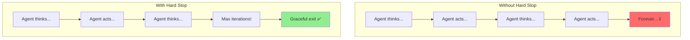
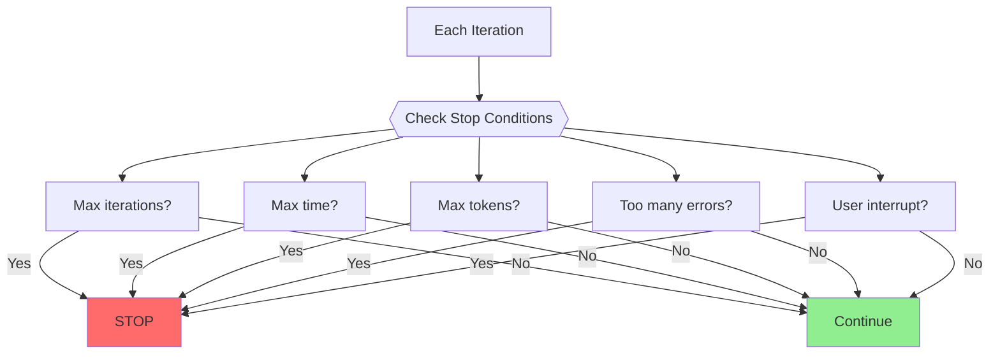
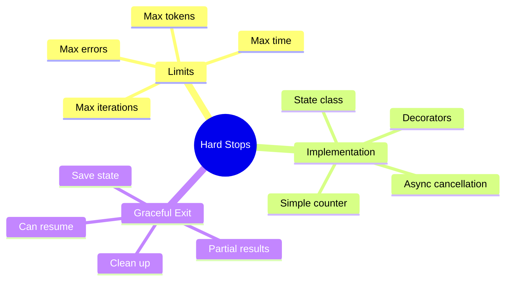

# Max Iterations — Stop Conditions & Graceful Termination

Agents can get stuck in infinite loops. This guide shows you how to implement safeguards that prevent runaway agents and ensure graceful termination.

> **Coming from Software Engineering?** Max iterations and stop conditions are like circuit breakers and timeout patterns in microservices. If you've implemented request timeouts, connection pool limits, or retry ceilings, this is the same defensive programming — preventing an agent from spinning forever is like preventing a cascading failure.

---

## Why Hard Stops Matter



Common causes of infinite loops:
- Agent keeps trying failed actions
- Circular reasoning patterns
- Waiting for impossible conditions
- Tool errors that don't resolve

---

## Basic Max Iterations

The simplest safeguard:

```python
from openai import OpenAI

client = OpenAI()

def agent_loop(task: str, max_iterations: int = 10) -> str:
    """
    Run an agent with a maximum iteration limit.

    Args:
        task: The task to complete
        max_iterations: Maximum number of iterations before stopping

    Returns:
        The final response or timeout message
    """

    messages = [
        {"role": "system", "content": "You are a helpful assistant."},
        {"role": "user", "content": task}
    ]

    for i in range(max_iterations):
        print(f"Iteration {i + 1}/{max_iterations}")

        response = client.chat.completions.create(
            model="gpt-4o-mini",
            messages=messages
        )

        message = response.choices[0].message

        # Check for completion
        if is_task_complete(message.content):
            return message.content

        messages.append({"role": "assistant", "content": message.content})
        # Add any tool results, continue loop...

    # Reached max iterations
    return f"Task incomplete after {max_iterations} iterations. Last response: {message.content}"

def is_task_complete(response: str) -> bool:
    """Check if the agent has completed its task."""
    completion_markers = ["DONE", "COMPLETE", "FINISHED", "Here is your answer"]
    return any(marker in response for marker in completion_markers)
```

---

## Iteration Tracking Class

A more structured approach:

```python
from dataclasses import dataclass
from typing import Optional
from datetime import datetime, timedelta

@dataclass
class IterationState:
    """Track iteration state and limits."""
    current: int = 0
    max_iterations: int = 10
    start_time: datetime = None
    max_duration: timedelta = None

    def __post_init__(self):
        self.start_time = datetime.now()
        if self.max_duration is None:
            self.max_duration = timedelta(minutes=5)

    def increment(self):
        """Increment iteration counter."""
        self.current += 1

    def should_stop(self) -> tuple[bool, str]:
        """
        Check if we should stop.

        Returns:
            (should_stop, reason)
        """
        # Check iteration limit
        if self.current >= self.max_iterations:
            return True, f"Max iterations ({self.max_iterations}) reached"

        # Check time limit
        elapsed = datetime.now() - self.start_time
        if elapsed > self.max_duration:
            return True, f"Max duration ({self.max_duration}) exceeded"

        return False, ""

    def remaining(self) -> int:
        """Get remaining iterations."""
        return max(0, self.max_iterations - self.current)

# Usage
state = IterationState(max_iterations=5, max_duration=timedelta(minutes=2))

while True:
    state.increment()

    should_stop, reason = state.should_stop()
    if should_stop:
        print(f"Stopping: {reason}")
        break

    print(f"Iteration {state.current}, {state.remaining()} remaining")
    # Do work...
```

---

## Multiple Stop Conditions

Combine different stopping criteria:

```python
from enum import Enum
from typing import Callable, List

class StopReason(Enum):
    NONE = "none"
    MAX_ITERATIONS = "max_iterations"
    MAX_TIME = "max_time"
    MAX_TOKENS = "max_tokens"
    TASK_COMPLETE = "task_complete"
    ERROR_THRESHOLD = "error_threshold"
    USER_INTERRUPT = "user_interrupt"

class StopConditionChecker:
    """Check multiple stop conditions."""

    def __init__(self):
        self.iterations = 0
        self.start_time = datetime.now()
        self.tokens_used = 0
        self.error_count = 0
        self.interrupted = False

        # Configurable limits
        self.max_iterations = 20
        self.max_seconds = 300
        self.max_tokens = 50000
        self.max_errors = 3

    def check(self) -> tuple[bool, StopReason]:
        """Check all stop conditions."""

        # Check iteration limit
        if self.iterations >= self.max_iterations:
            return True, StopReason.MAX_ITERATIONS

        # Check time limit
        elapsed = (datetime.now() - self.start_time).total_seconds()
        if elapsed >= self.max_seconds:
            return True, StopReason.MAX_TIME

        # Check token limit
        if self.tokens_used >= self.max_tokens:
            return True, StopReason.MAX_TOKENS

        # Check error threshold
        if self.error_count >= self.max_errors:
            return True, StopReason.ERROR_THRESHOLD

        # Check user interrupt
        if self.interrupted:
            return True, StopReason.USER_INTERRUPT

        return False, StopReason.NONE

    def record_iteration(self, tokens: int = 0, error: bool = False):
        """Record an iteration's stats."""
        self.iterations += 1
        self.tokens_used += tokens
        if error:
            self.error_count += 1

    def interrupt(self):
        """Signal an interrupt."""
        self.interrupted = True

# Usage
checker = StopConditionChecker()
checker.max_iterations = 10
checker.max_seconds = 60

while True:
    should_stop, reason = checker.check()
    if should_stop:
        print(f"Stopped: {reason.value}")
        break

    # Do work...
    tokens = do_agent_step()
    checker.record_iteration(tokens=tokens)
```



---

---

## Graceful Termination

When stopping, clean up properly:

```python
class GracefulAgent:
    """Agent with graceful termination."""

    def __init__(self, max_iterations: int = 10):
        self.max_iterations = max_iterations
        self.iteration = 0
        self.final_state = None
        self.history = []

    def run(self, task: str) -> dict:
        """Run the agent with graceful termination."""

        try:
            return self._execute(task)
        except KeyboardInterrupt:
            return self._graceful_shutdown("User interrupted")
        except Exception as e:
            return self._graceful_shutdown(f"Error: {str(e)}")

    def _execute(self, task: str) -> dict:
        """Main execution loop."""

        for self.iteration in range(1, self.max_iterations + 1):
            print(f"Step {self.iteration}/{self.max_iterations}")

            result = self._do_step(task)
            self.history.append(result)

            if result.get("complete"):
                return {
                    "status": "success",
                    "iterations": self.iteration,
                    "result": result["output"],
                    "history": self.history
                }

        # Max iterations reached
        return self._graceful_shutdown("Max iterations reached")

    def _do_step(self, task: str) -> dict:
        """Execute a single step."""
        # Your agent logic here
        return {"complete": False, "output": "..."}

    def _graceful_shutdown(self, reason: str) -> dict:
        """Handle graceful shutdown."""

        # Save current state
        self.final_state = {
            "iteration": self.iteration,
            "history_length": len(self.history)
        }

        # Generate partial result if possible
        partial_result = self._get_partial_result()

        return {
            "status": "terminated",
            "reason": reason,
            "iterations": self.iteration,
            "partial_result": partial_result,
            "history": self.history,
            "can_resume": True
        }

    def _get_partial_result(self) -> str:
        """Extract any useful partial result."""
        if self.history:
            return f"Partial progress: {len(self.history)} steps completed"
        return "No progress made"

# Usage
agent = GracefulAgent(max_iterations=5)
result = agent.run("Complete this task")

if result["status"] == "terminated":
    print(f"Agent stopped: {result['reason']}")
    print(f"Partial result: {result['partial_result']}")
```

---

## Timeout Decorator

Add timeouts to any function:

```python
import signal
from functools import wraps

class TimeoutError(Exception):
    pass

def timeout(seconds: int):
    """
    Decorator to add a timeout to a function.

    Usage:
        @timeout(30)
        def my_long_function():
            ...
    """
    def decorator(func):
        @wraps(func)
        def wrapper(*args, **kwargs):
            def handler(signum, frame):
                raise TimeoutError(f"Function timed out after {seconds} seconds")

            # Set the signal handler
            old_handler = signal.signal(signal.SIGALRM, handler)
            signal.alarm(seconds)

            try:
                result = func(*args, **kwargs)
            finally:
                signal.alarm(0)  # Disable alarm
                signal.signal(signal.SIGALRM, old_handler)  # Restore handler

            return result
        return wrapper
    return decorator

# Usage
@timeout(5)
def potentially_slow_operation():
    import time
    time.sleep(10)  # This will timeout!
    return "Done"

try:
    result = potentially_slow_operation()
except TimeoutError as e:
    print(f"Operation timed out: {e}")
```

---

## Async Agent with Cancellation

For async agents, use cancellation tokens:

```python
import asyncio
from typing import Optional

class CancellationToken:
    """Token to signal cancellation to async operations."""

    def __init__(self):
        self._cancelled = False
        self._reason: Optional[str] = None

    def cancel(self, reason: str = "Cancelled"):
        """Cancel the operation."""
        self._cancelled = True
        self._reason = reason

    @property
    def is_cancelled(self) -> bool:
        return self._cancelled

    @property
    def reason(self) -> Optional[str]:
        return self._reason

    def check(self):
        """Raise if cancelled."""
        if self._cancelled:
            raise asyncio.CancelledError(self._reason)

async def async_agent(task: str, cancel_token: CancellationToken, max_iterations: int = 10):
    """Async agent that respects cancellation."""

    for i in range(max_iterations):
        # Check for cancellation
        cancel_token.check()

        print(f"Iteration {i + 1}")

        # Simulate async work
        await asyncio.sleep(1)

        # Check again after work
        cancel_token.check()

    return "Complete"

# Usage
async def main():
    token = CancellationToken()

    # Schedule cancellation after 3 seconds
    async def cancel_after_delay():
        await asyncio.sleep(3)
        token.cancel("Timeout")

    asyncio.create_task(cancel_after_delay())

    try:
        result = await async_agent("task", token)
        print(f"Result: {result}")
    except asyncio.CancelledError as e:
        print(f"Agent cancelled: {e}")

asyncio.run(main())
```

---

## Progress Monitoring

Track and report progress:

```python
from dataclasses import dataclass
from typing import Optional, Callable

@dataclass
class Progress:
    """Track agent progress."""
    current_step: int = 0
    total_steps: int = 0
    current_action: str = ""
    percent_complete: float = 0.0
    estimated_remaining: Optional[float] = None

class MonitoredAgent:
    """Agent with progress monitoring."""

    def __init__(self, max_iterations: int = 10,
                 progress_callback: Callable[[Progress], None] = None):
        self.max_iterations = max_iterations
        self.progress_callback = progress_callback or self._default_callback
        self.progress = Progress(total_steps=max_iterations)

    def run(self, task: str) -> str:
        """Run with progress reporting."""

        for i in range(self.max_iterations):
            # Update progress
            self.progress.current_step = i + 1
            self.progress.percent_complete = (i + 1) / self.max_iterations * 100
            self.progress.current_action = f"Processing step {i + 1}"

            # Report progress
            self.progress_callback(self.progress)

            # Do actual work
            result = self._do_step()

            if result.get("complete"):
                return result["output"]

        return "Max iterations reached"

    def _do_step(self) -> dict:
        # Agent logic here
        return {"complete": False}

    def _default_callback(self, progress: Progress):
        """Default progress display."""
        bar_length = 30
        filled = int(bar_length * progress.percent_complete / 100)
        bar = "=" * filled + "-" * (bar_length - filled)
        print(f"\r[{bar}] {progress.percent_complete:.0f}% - {progress.current_action}", end="")

# Usage
def my_progress_handler(progress: Progress):
    print(f"Step {progress.current_step}/{progress.total_steps}: {progress.current_action}")

agent = MonitoredAgent(max_iterations=5, progress_callback=my_progress_handler)
result = agent.run("Task")
```

---

## Summary



---

## Quick Reference

```python
# Simple max iterations
for i in range(max_iterations):
    if task_complete:
        break
else:
    print("Max iterations reached")

# Timeout decorator
@timeout(seconds=30)
def my_function():
    ...

# Multiple conditions
if iterations >= max_iter or elapsed > max_time or errors >= max_errors:
    stop()

# Graceful shutdown
try:
    run_agent()
except (TimeoutError, KeyboardInterrupt):
    save_state()
    return partial_result
```

---

## What's Next?

Now you've built a complete agent from scratch! Next, let's explore **frameworks like LangChain and LlamaIndex** that provide these features out of the box.
