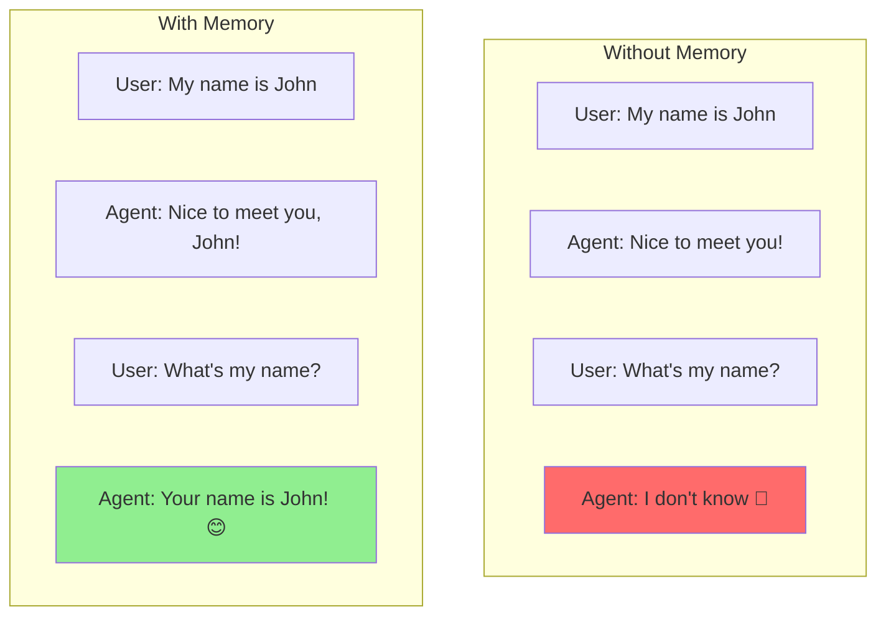
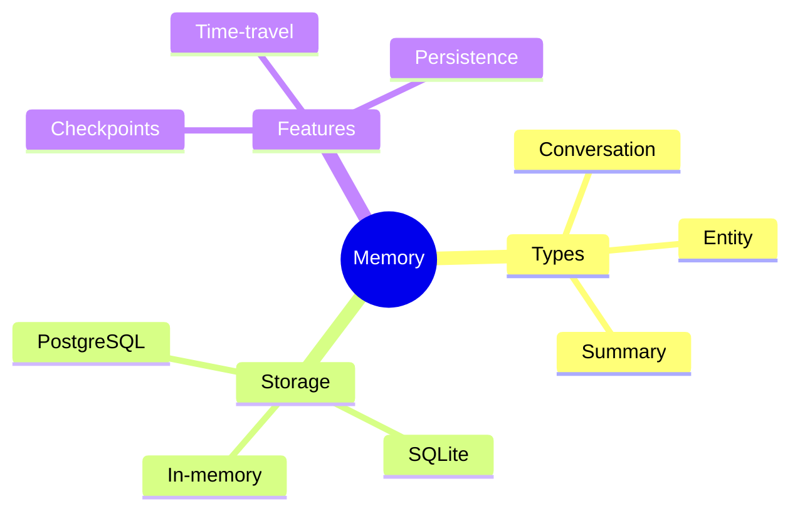

# Checkpoints & Persistence

Agents need memory! In this guide, you'll learn to save agent state, implement checkpoints, and store conversation history in databases.

> **Coming from Software Engineering?** Agent checkpoints are like database transactions and savepoints. If you've used database savepoints for rollback, Git commits for version history, or Redux DevTools for time-travel debugging, agent checkpointing is the same concept — save state so you can restore, replay, or debug later. And conversation memory is just session state you persist between requests, like a server-side session store.

---

## Why Memory Matters



Types of memory:
- **Conversation Memory**: Recent messages
- **Entity Memory**: Facts about people/things
- **Summary Memory**: Compressed history
- **Persistent storage**: Saved to a database across sessions (Part 2)

---

## Conversation Memory

### Simple In-Memory Storage

```python
# script_id: day_044_checkpoints_persistence/conversation_memory
from openai import OpenAI
from collections import deque

client = OpenAI()

class ConversationMemory:
    """Simple sliding window memory."""

    def __init__(self, max_messages: int = 20):
        self.messages = deque(maxlen=max_messages)
        self.system_prompt = "You are a helpful assistant."

    def add_user_message(self, content: str):
        self.messages.append({"role": "user", "content": content})

    def add_assistant_message(self, content: str):
        self.messages.append({"role": "assistant", "content": content})

    def get_messages(self) -> list:
        return [{"role": "system", "content": self.system_prompt}] + list(self.messages)

    def chat(self, user_input: str) -> str:
        self.add_user_message(user_input)

        response = client.chat.completions.create(
            model="gpt-4o-mini",
            messages=self.get_messages()
        )

        assistant_message = response.choices[0].message.content
        self.add_assistant_message(assistant_message)

        return assistant_message

# Usage
memory = ConversationMemory(max_messages=10)
print(memory.chat("My name is Alice"))
print(memory.chat("What's my name?"))  # Remembers!
```

### Summary Memory

For long conversations, summarize old messages:

```python
# script_id: day_044_checkpoints_persistence/summary_memory
class SummaryMemory:
    """Memory that summarizes old conversations."""

    def __init__(self, max_recent: int = 6, summarize_after: int = 10):
        self.recent_messages = []
        self.summary = ""
        self.max_recent = max_recent
        self.summarize_after = summarize_after
        self.message_count = 0

    def add_message(self, role: str, content: str):
        self.recent_messages.append({"role": role, "content": content})
        self.message_count += 1

        if self.message_count >= self.summarize_after:
            self._summarize()

    def _summarize(self):
        """Summarize old messages."""
        if len(self.recent_messages) <= self.max_recent:
            return

        # Get messages to summarize
        to_summarize = self.recent_messages[:-self.max_recent]
        self.recent_messages = self.recent_messages[-self.max_recent:]

        # Generate summary
        summary_prompt = f"""Summarize this conversation history concisely:

Previous summary: {self.summary}

New messages:
{self._format_messages(to_summarize)}

Provide a brief summary of key points and facts mentioned."""

        response = client.chat.completions.create(
            model="gpt-4o-mini",
            messages=[{"role": "user", "content": summary_prompt}],
            max_tokens=200
        )

        self.summary = response.choices[0].message.content
        self.message_count = len(self.recent_messages)

    def _format_messages(self, messages: list) -> str:
        return "\n".join([f"{m['role']}: {m['content']}" for m in messages])

    def get_context(self) -> str:
        context = ""
        if self.summary:
            context = f"Previous conversation summary:\n{self.summary}\n\n"
        context += "Recent messages:\n" + self._format_messages(self.recent_messages)
        return context
```

---

## LangGraph Checkpoints

LangGraph provides built-in checkpointing:

```python
# script_id: day_044_checkpoints_persistence/langgraph_checkpoints
from langgraph.graph import StateGraph, END
from langgraph.checkpoint.memory import MemorySaver
from typing import TypedDict, Annotated
from operator import add

# Define state
# The `Annotated[list, add]` part tells LangGraph how to combine what a node
# returns with the existing state. For `messages`, `add` means "append to the
# list" (like list.extend) instead of "replace it" — so each node adds to the
# running history. A plain field like `step_count` has no combine rule, so a
# returned value just overwrites the old one (last write wins).
class AgentState(TypedDict):
    messages: Annotated[list, add]
    step_count: int

# Create checkpointer
checkpointer = MemorySaver()  # For production, use PostgresSaver or SqliteSaver

# Build graph
def agent_node(state: AgentState) -> dict:
    # Your agent logic here
    return {
        "messages": ["Processed step"],
        "step_count": state["step_count"] + 1
    }

workflow = StateGraph(AgentState)
workflow.add_node("agent", agent_node)
workflow.set_entry_point("agent")
workflow.add_edge("agent", END)

# Compile with checkpointer
app = workflow.compile(checkpointer=checkpointer)

# Run with thread ID for persistence
# The thread_id is the key under which this conversation's state is saved and
# looked up — think of it as the session/conversation ID (one per user or per
# chat). It lives under the `configurable` key, which is how LangGraph passes
# per-run settings.
config = {"configurable": {"thread_id": "user-123"}}

# First run
result1 = app.invoke(
    {"messages": ["Hello"], "step_count": 0},
    config=config
)

# Later - resume from checkpoint!
# We don't re-send step_count — the checkpointer already has it. messages
# accumulates via its `add` reducer; step_count keeps its saved value and the
# node increments it.
result2 = app.invoke({"messages": ["Continue"]}, config=config)
# result2 will continue from where result1 left off
```

`MemorySaver` keeps checkpoints in RAM (lost on restart) — great for trying this out. For durable storage use `SqliteSaver` (`pip install langgraph-checkpoint-sqlite`) or `PostgresSaver`, covered in Part 2.

### Time-Travel Debugging

```python
# script_id: day_044_checkpoints_persistence/langgraph_checkpoints
# Get all checkpoints for a thread
thread_id = "user-123"
checkpoints = list(app.get_state_history({"configurable": {"thread_id": thread_id}}))

print(f"Found {len(checkpoints)} checkpoints")

# Get a specific checkpoint
for cp in checkpoints:
    print(f"Checkpoint: {cp.config}")
    print(f"State: {cp.values}")

# Replay from a specific checkpoint
old_config = checkpoints[2].config  # Go back to checkpoint 2
result = app.invoke({"messages": ["Retry from here"]}, config=old_config)
```

---

## Quick Recap

| Concept | What It Does | When to Use |
|---------|-------------|-------------|
| Conversation Memory | Stores recent messages in a sliding window | Every chatbot — keeps context without unbounded growth |
| Summary Memory | Compresses old messages into summaries | Long conversations where full history exceeds context window |
| LangGraph Checkpoints | Saves full graph state at each step | Agents that need to resume, retry, or debug |
| Time-Travel Debugging | Replays from any previous checkpoint | Debugging agent behavior — "what went wrong at step 3?" |

---

## Try It Yourself

1. **Build an entity memory system**: Extend `ConversationMemory` to extract and store facts about entities (people, places, topics) mentioned in conversation. Use an LLM to extract entities from each message.

2. **Implement checkpoint cleanup**: The SQLite checkpointer stores every checkpoint forever. Write a cleanup function that keeps only the last N checkpoints per thread to manage storage.

3. **Compare memory strategies**: Run the same 20-message conversation with sliding window (max 5), sliding window (max 10), and summary memory. Compare the quality of the agent's responses at message 20.

---

## Part 2: Making Checkpoints Durable

Now that you can save and restore agent state in memory, let's make it durable. Below, you'll persist checkpoints to SQLite and PostgreSQL databases — so your agents survive restarts and can serve multiple users.

---

## Database Persistence

### SQLite Storage

```python
# script_id: day_044_checkpoints_persistence/sqlite_conversation_store
import sqlite3
import json
from datetime import datetime

class ConversationStore:
    """Store conversations in SQLite."""

    def __init__(self, db_path: str = "conversations.db"):
        self.conn = sqlite3.connect(db_path)
        self._create_tables()

    def _create_tables(self):
        self.conn.execute("""
            CREATE TABLE IF NOT EXISTS conversations (
                id TEXT PRIMARY KEY,
                created_at TIMESTAMP,
                updated_at TIMESTAMP,
                metadata TEXT
            )
        """)
        self.conn.execute("""
            CREATE TABLE IF NOT EXISTS messages (
                id INTEGER PRIMARY KEY AUTOINCREMENT,
                conversation_id TEXT,
                role TEXT,
                content TEXT,
                timestamp TIMESTAMP,
                FOREIGN KEY (conversation_id) REFERENCES conversations(id)
            )
        """)
        self.conn.commit()

    def create_conversation(self, conversation_id: str, metadata: dict = None):
        now = datetime.now()
        self.conn.execute(
            "INSERT INTO conversations (id, created_at, updated_at, metadata) VALUES (?, ?, ?, ?)",
            (conversation_id, now, now, json.dumps(metadata or {}))
        )
        self.conn.commit()

    def add_message(self, conversation_id: str, role: str, content: str):
        now = datetime.now()
        self.conn.execute(
            "INSERT INTO messages (conversation_id, role, content, timestamp) VALUES (?, ?, ?, ?)",
            (conversation_id, role, content, now)
        )
        self.conn.execute(
            "UPDATE conversations SET updated_at = ? WHERE id = ?",
            (now, conversation_id)
        )
        self.conn.commit()

    def get_messages(self, conversation_id: str, limit: int = 50) -> list:
        cursor = self.conn.execute(
            "SELECT role, content FROM messages WHERE conversation_id = ? ORDER BY timestamp DESC LIMIT ?",
            (conversation_id, limit)
        )
        messages = [{"role": row[0], "content": row[1]} for row in cursor.fetchall()]
        return list(reversed(messages))

    def get_conversation(self, conversation_id: str) -> dict:
        cursor = self.conn.execute(
            "SELECT id, created_at, metadata FROM conversations WHERE id = ?",
            (conversation_id,)
        )
        row = cursor.fetchone()
        if row:
            return {
                "id": row[0],
                "created_at": row[1],
                "metadata": json.loads(row[2]),
                "messages": self.get_messages(conversation_id)
            }
        return None

# Usage
store = ConversationStore()

# Create conversation
store.create_conversation("conv-123", {"user_id": "user-456"})

# Add messages
store.add_message("conv-123", "user", "Hello!")
store.add_message("conv-123", "assistant", "Hi there!")

# Retrieve
conversation = store.get_conversation("conv-123")
print(conversation)
```

### PostgreSQL for Production

```python
# script_id: day_044_checkpoints_persistence/postgres_conversation_store
import psycopg2
from psycopg2.extras import RealDictCursor
import json

class PostgresConversationStore:
    """Production-ready PostgreSQL storage."""

    def __init__(self, connection_string: str):
        self.conn = psycopg2.connect(connection_string)
        self._create_tables()

    def _create_tables(self):
        with self.conn.cursor() as cur:
            cur.execute("""
                CREATE TABLE IF NOT EXISTS conversations (
                    id TEXT PRIMARY KEY,
                    user_id TEXT,
                    created_at TIMESTAMPTZ DEFAULT NOW(),
                    updated_at TIMESTAMPTZ DEFAULT NOW(),
                    metadata JSONB DEFAULT '{}'
                )
            """)
            cur.execute("""
                CREATE TABLE IF NOT EXISTS messages (
                    id SERIAL PRIMARY KEY,
                    conversation_id TEXT REFERENCES conversations(id),
                    role TEXT NOT NULL,
                    content TEXT NOT NULL,
                    tokens INTEGER,
                    timestamp TIMESTAMPTZ DEFAULT NOW()
                )
            """)
            cur.execute("""
                CREATE INDEX IF NOT EXISTS idx_messages_conversation
                ON messages(conversation_id, timestamp)
            """)
        self.conn.commit()

    def add_message(self, conversation_id: str, role: str, content: str, tokens: int = None):
        with self.conn.cursor() as cur:
            cur.execute("""
                INSERT INTO messages (conversation_id, role, content, tokens)
                VALUES (%s, %s, %s, %s)
            """, (conversation_id, role, content, tokens))

            cur.execute("""
                UPDATE conversations SET updated_at = NOW()
                WHERE id = %s
            """, (conversation_id,))
        self.conn.commit()

    def get_recent_messages(self, conversation_id: str, limit: int = 20) -> list:
        with self.conn.cursor(cursor_factory=RealDictCursor) as cur:
            cur.execute("""
                SELECT role, content, timestamp
                FROM messages
                WHERE conversation_id = %s
                ORDER BY timestamp DESC
                LIMIT %s
            """, (conversation_id, limit))
            return list(reversed(cur.fetchall()))
```

---

## Entity Memory

Remember facts about entities:

```python
# script_id: day_044_checkpoints_persistence/entity_memory
from openai import OpenAI
import json

client = OpenAI()

class EntityMemory:
    """Extract and remember facts about entities."""

    def __init__(self):
        self.entities = {}  # {entity_name: {fact_type: fact_value}}

    def extract_entities(self, text: str) -> dict:
        """Extract entities and facts from text."""
        prompt = f"""Extract entities and facts from this text.
Return JSON: {{"entity_name": {{"fact_type": "fact_value"}}}}

Text: {text}

Examples of entities: people, places, organizations
Examples of facts: name, age, location, role, relationship

JSON:"""

        response = client.chat.completions.create(
            model="gpt-4o-mini",
            messages=[{"role": "user", "content": prompt}],
            response_format={"type": "json_object"}
        )

        return json.loads(response.choices[0].message.content)

    def update(self, text: str):
        """Update entity memory from text."""
        new_entities = self.extract_entities(text)

        for entity, facts in new_entities.items():
            if entity not in self.entities:
                self.entities[entity] = {}
            self.entities[entity].update(facts)

    def get_context(self) -> str:
        """Get entity context for prompts."""
        if not self.entities:
            return ""

        context = "Known information:\n"
        for entity, facts in self.entities.items():
            fact_str = ", ".join([f"{k}: {v}" for k, v in facts.items()])
            context += f"- {entity}: {fact_str}\n"
        return context

# Usage
memory = EntityMemory()

memory.update("John Smith is a 35-year-old software engineer from Boston.")
memory.update("John's wife Sarah is a doctor at MGH.")

print(memory.get_context())
# Known information:
# - John Smith: age: 35, occupation: software engineer, location: Boston
# - Sarah: relationship: John's wife, occupation: doctor, workplace: MGH
```

---

## Complete Persistent Agent

```python
# script_id: day_044_checkpoints_persistence/persistent_agent
from openai import OpenAI
import sqlite3
import json
from datetime import datetime
import uuid

client = OpenAI()

class PersistentAgent:
    """Agent with full persistence capabilities."""

    def __init__(self, db_path: str = "agent.db"):
        self.conn = sqlite3.connect(db_path)
        self._setup_db()

    def _setup_db(self):
        self.conn.executescript("""
            CREATE TABLE IF NOT EXISTS sessions (
                id TEXT PRIMARY KEY,
                user_id TEXT,
                created_at TIMESTAMP,
                summary TEXT
            );

            CREATE TABLE IF NOT EXISTS messages (
                id INTEGER PRIMARY KEY AUTOINCREMENT,
                session_id TEXT,
                role TEXT,
                content TEXT,
                timestamp TIMESTAMP
            );

            CREATE TABLE IF NOT EXISTS entities (
                session_id TEXT,
                entity TEXT,
                facts TEXT,
                PRIMARY KEY (session_id, entity)
            );
        """)
        self.conn.commit()

    def create_session(self, user_id: str) -> str:
        session_id = str(uuid.uuid4())
        self.conn.execute(
            "INSERT INTO sessions (id, user_id, created_at) VALUES (?, ?, ?)",
            (session_id, user_id, datetime.now())
        )
        self.conn.commit()
        return session_id

    def chat(self, session_id: str, user_input: str) -> str:
        # Save user message
        self._save_message(session_id, "user", user_input)

        # Get context
        messages = self._get_messages(session_id)
        entities = self._get_entities(session_id)
        summary = self._get_summary(session_id)

        # Build prompt
        system_content = "You are a helpful assistant."
        if summary:
            system_content += f"\n\nPrevious conversation summary:\n{summary}"
        if entities:
            system_content += f"\n\nKnown information:\n{entities}"

        full_messages = [
            {"role": "system", "content": system_content}
        ] + messages

        # Get response
        response = client.chat.completions.create(
            model="gpt-4o-mini",
            messages=full_messages
        )

        assistant_message = response.choices[0].message.content

        # Save assistant message
        self._save_message(session_id, "assistant", assistant_message)

        # Update entities periodically
        if len(messages) % 5 == 0:
            self._update_entities(session_id, user_input)

        return assistant_message

    def _save_message(self, session_id: str, role: str, content: str):
        self.conn.execute(
            "INSERT INTO messages (session_id, role, content, timestamp) VALUES (?, ?, ?, ?)",
            (session_id, role, content, datetime.now())
        )
        self.conn.commit()

    def _get_messages(self, session_id: str, limit: int = 10) -> list:
        cursor = self.conn.execute(
            "SELECT role, content FROM messages WHERE session_id = ? ORDER BY timestamp DESC LIMIT ?",
            (session_id, limit)
        )
        return [{"role": r[0], "content": r[1]} for r in reversed(cursor.fetchall())]

    def _get_entities(self, session_id: str) -> str:
        cursor = self.conn.execute(
            "SELECT entity, facts FROM entities WHERE session_id = ?",
            (session_id,)
        )
        entities = cursor.fetchall()
        if not entities:
            return ""
        return "\n".join([f"- {e[0]}: {e[1]}" for e in entities])

    def _get_summary(self, session_id: str) -> str:
        cursor = self.conn.execute(
            "SELECT summary FROM sessions WHERE id = ?",
            (session_id,)
        )
        row = cursor.fetchone()
        return row[0] if row and row[0] else ""

    def _update_entities(self, session_id: str, text: str):
        # Stub: integrate EntityMemory.extract_entities here and store the JSON
        # in the entities table — left as Exercise 1.
        pass

# Usage
agent = PersistentAgent()

# Create session
session = agent.create_session("user-123")

# Chat (persisted automatically)
print(agent.chat(session, "Hi, I'm Alice and I work at Google"))
print(agent.chat(session, "What's my name?"))  # Remembers!

# Later - resume session
print(agent.chat(session, "Where do I work?"))  # Still remembers!
```

---

## Checkpoint

Run the LangGraph Checkpoints example: compile with `MemorySaver()`, invoke once under `config = {"configurable": {"thread_id": "user-123"}}`, then invoke a second time with the *same* config (sending only `{"messages": ["Continue"]}`). Because state is keyed by `thread_id`, the second run picks up where the first left off: `messages` grows across runs (the `add` reducer appends), and `step_count` increments to 2 (the node adds 1 to the saved value of 1). If the second run starts fresh, check that you passed the same `config` to both `invoke` calls and that the checkpointer was actually passed to `workflow.compile(checkpointer=...)`.

## Summary



---

## Quick Reference

| Task | API |
|---|---|
| In-memory checkpoints | `from langgraph.checkpoint.memory import MemorySaver` |
| SQLite checkpoints | `from langgraph.checkpoint.sqlite import SqliteSaver` |
| Compile with persistence | `app = workflow.compile(checkpointer=saver)` |
| Identify a conversation | `config = {"configurable": {"thread_id": "user-123"}}` |
| Run on a thread | `app.invoke(state, config=config)` |
| Read current state | `app.get_state(config).values` |
| List all checkpoints | `list(app.get_state_history(config))` |

---

## Exercises

1. Compile a graph with `MemorySaver`, run it under `thread_id="a"`, then resume the *same* thread with a follow-up and confirm it remembers earlier state.
2. Run a second conversation under `thread_id="b"` and verify the two threads are fully isolated.
3. Swap `MemorySaver` for `SqliteSaver`, restart the process, and prove the thread's state survived by reading it back with `get_state`.
4. After a multi-step run, call `get_state_history` and print how many checkpoints were recorded and the values at each.

<details><summary>Solutions (approaches)</summary>

1. Pass `config={"configurable": {"thread_id": "a"}}` on both calls; the second `invoke` sees the merged state from the first.
2. Same code, `thread_id="b"`; `get_state` for "a" and "b" return different values — state is keyed by thread.
3. Use `with SqliteSaver.from_conn_string("checkpoints.db") as saver:` and compile the graph inside that block; a fresh process pointing at the same file recovers the thread.
4. `for cp in app.get_state_history(config): print(cp.values)` — one checkpoint per graph step (each time the graph advances after running its node(s)), listed newest first.
</details>

---

## What's Next?

You can now persist agent state. Next, we'll use those checkpoints for **Time-Travel Debugging** — rewinding to any past state and replaying execution to understand what your agent did.
