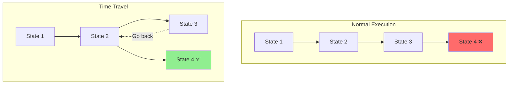
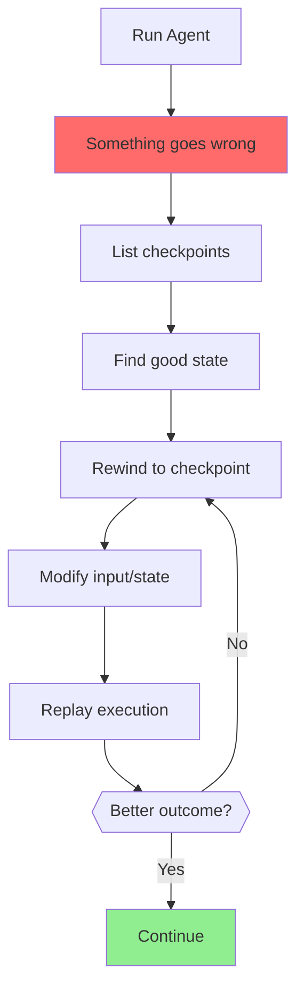
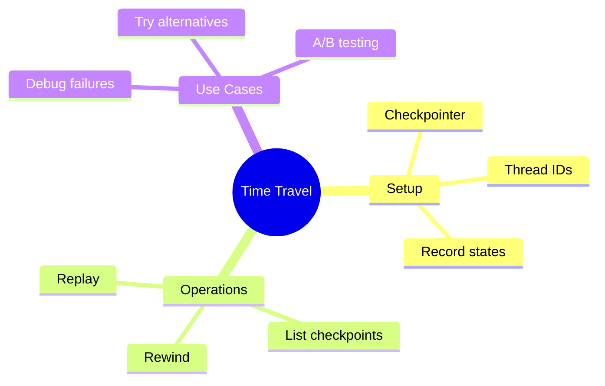

# Time-Travel Debugging in LangGraph

Made a mistake? Go back in time! Time-travel debugging lets you rewind your agent to any previous state and try a different path.

> **Coming from Software Engineering?** Time-travel debugging for agents is Redux DevTools for AI. If you've used browser DevTools to step through state changes, replay actions, or inspect snapshots, this is the same power applied to agent execution. Each checkpoint is a commit you can checkout.

---

## What is Time-Travel Debugging?



Time-travel debugging allows you to:
- View all checkpoints in a conversation
- Rewind to any previous state
- Replay from that point with different inputs
- Debug agent decisions step by step

---

## Setting Up Checkpointing

First, enable checkpointing to record states:

```python
# script_id: day_045_time_travel_debugging/checkpointing_setup
from langgraph.graph import StateGraph, END
from langgraph.checkpoint.memory import MemorySaver  # or: pip install langgraph-checkpoint-sqlite
from typing import TypedDict, Annotated
from operator import add

# Define state
class AgentState(TypedDict):
    messages: Annotated[list, add]
    step: int
    decision: str

# Create checkpointer
checkpointer = MemorySaver()  # For production, use PostgresSaver or SqliteSaver

# Define nodes
def step_one(state: AgentState) -> dict:
    return {"messages": ["Step 1 complete"], "step": 1}

def step_two(state: AgentState) -> dict:
    return {"messages": ["Step 2 complete"], "step": 2}

def step_three(state: AgentState) -> dict:
    return {"messages": ["Step 3 complete"], "step": 3}

# Build graph
workflow = StateGraph(AgentState)
workflow.add_node("step1", step_one)
workflow.add_node("step2", step_two)
workflow.add_node("step3", step_three)

workflow.set_entry_point("step1")
workflow.add_edge("step1", "step2")
workflow.add_edge("step2", "step3")
workflow.add_edge("step3", END)

# Compile WITH checkpointer
app = workflow.compile(checkpointer=checkpointer)
```

---

## Recording Checkpoints

Run your agent with a thread ID to record checkpoints:

```python
# script_id: day_045_time_travel_debugging/checkpointing_setup
# Run with thread ID
config = {"configurable": {"thread_id": "debug-session-1"}}

# This creates checkpoints at each step
result = app.invoke(
    {"messages": ["Start"], "step": 0, "decision": ""},
    config=config
)

print(f"Final state: {result}")
```

---

## Viewing All Checkpoints

List all checkpoints for a thread:

```python
# script_id: day_045_time_travel_debugging/checkpointing_setup
def list_checkpoints(checkpointer, thread_id: str):
    """List all checkpoints for a thread."""

    config = {"configurable": {"thread_id": thread_id}}
    checkpoints = list(app.get_state_history(config))

    print(f"Found {len(checkpoints)} checkpoints:")
    print("=" * 60)

    for i, checkpoint in enumerate(checkpoints):
        print(f"\nCheckpoint {i}:")
        print(f"  ID: {checkpoint.config['configurable']['checkpoint_id']}")
        print(f"  State: {checkpoint.values}")

    return checkpoints

# Usage
checkpoints = list_checkpoints(checkpointer, "debug-session-1")
```

Output:
```
Found 4 checkpoints:
============================================================

Checkpoint 0:
  ID: 1ef5a8b2-...
  State: {'messages': ['Start'], 'step': 0, 'decision': ''}

Checkpoint 1:
  ID: 1ef5a8b3-...
  State: {'messages': ['Start', 'Step 1 complete'], 'step': 1, ...}

Checkpoint 2:
  ID: 1ef5a8b4-...
  State: {'messages': [..., 'Step 2 complete'], 'step': 2, ...}

Checkpoint 3:
  ID: 1ef5a8b5-...
  State: {'messages': [..., 'Step 3 complete'], 'step': 3, ...}
```

---

## Rewinding to a Previous State

Go back to any checkpoint:

```python
# script_id: day_045_time_travel_debugging/checkpointing_setup
def rewind_to_checkpoint(app, checkpointer, thread_id: str, checkpoint_index: int):
    """Rewind to a specific checkpoint."""

    # Get all checkpoints
    config = {"configurable": {"thread_id": thread_id}}
    checkpoints = list(app.get_state_history(config))

    if checkpoint_index >= len(checkpoints):
        raise ValueError(f"Checkpoint {checkpoint_index} not found")

    # Get the checkpoint
    target_checkpoint = checkpoints[checkpoint_index]
    checkpoint_id = target_checkpoint.config["configurable"]["checkpoint_id"]

    print(f"Rewinding to checkpoint {checkpoint_index}")
    print(f"State at that point: {target_checkpoint.values}")

    # Create config to resume from this checkpoint
    resume_config = {
        "configurable": {
            "thread_id": thread_id,
            "checkpoint_id": checkpoint_id
        }
    }

    return resume_config, target_checkpoint.values

# Rewind to checkpoint 1 (after step 1)
resume_config, old_state = rewind_to_checkpoint(
    app, checkpointer, "debug-session-1", checkpoint_index=1
)
```

---

## Replaying from a Checkpoint

Resume execution from a previous state:

```python
# script_id: day_045_time_travel_debugging/checkpointing_setup
def replay_from_checkpoint(app, resume_config, new_input: dict = None):
    """Replay from a checkpoint, optionally with new input."""

    if new_input:
        # Resume with modified state
        result = app.invoke(new_input, config=resume_config)
    else:
        # Just continue from checkpoint
        result = app.invoke(None, config=resume_config)

    return result

# Replay from checkpoint 1 with different input
new_result = replay_from_checkpoint(
    app,
    resume_config,
    new_input={"messages": ["Trying different approach"], "step": 1, "decision": "option_b"}
)

print(f"New result: {new_result}")
```

---

## Complete Time-Travel Example

```python
# script_id: day_045_time_travel_debugging/complete_time_travel_example
from langgraph.graph import StateGraph, END
from langgraph.checkpoint.memory import MemorySaver  # or: pip install langgraph-checkpoint-sqlite
from typing import TypedDict, Annotated, Literal
from operator import add

class DebugState(TypedDict):
    messages: Annotated[list, add]
    choice: str
    outcome: str

def make_choice(state: DebugState) -> dict:
    """Make a choice that affects the outcome."""
    choice = state.get("choice", "A")
    return {"messages": [f"Chose option {choice}"], "choice": choice}

def process_choice(state: DebugState) -> dict:
    """Process the choice."""
    choice = state["choice"]

    if choice == "A":
        outcome = "Result A - maybe not what we wanted"
    elif choice == "B":
        outcome = "Result B - better!"
    else:
        outcome = "Unknown choice"

    return {"messages": [f"Outcome: {outcome}"], "outcome": outcome}

# Build graph
workflow = StateGraph(DebugState)
workflow.add_node("choose", make_choice)
workflow.add_node("process", process_choice)

workflow.set_entry_point("choose")
workflow.add_edge("choose", "process")
workflow.add_edge("process", END)

# Compile with checkpointing
checkpointer = MemorySaver()
app = workflow.compile(checkpointer=checkpointer)

# First run - choose A
config = {"configurable": {"thread_id": "experiment-1"}}
result1 = app.invoke(
    {"messages": ["Starting"], "choice": "A", "outcome": ""},
    config=config
)
print(f"First run: {result1['outcome']}")
# Output: "Result A - maybe not what we wanted"

# Oops! Let's go back and try B instead
# Get checkpoints
checkpoints = list(app.get_state_history(config))
print(f"We have {len(checkpoints)} checkpoints")

# Rewind to before the choice was processed (checkpoint 1)
resume_config = {
    "configurable": {
        "thread_id": "experiment-1",
        "checkpoint_id": checkpoints[1].config["configurable"]["checkpoint_id"]
    }
}

# Replay with choice B
result2 = app.invoke(
    {"messages": ["Retrying"], "choice": "B", "outcome": ""},
    config=resume_config
)
print(f"After time travel: {result2['outcome']}")
# Output: "Result B - better!"
```

---

## Debugging Workflow



---

## Interactive Debugger

Build an interactive debugging session:

```python
# script_id: day_045_time_travel_debugging/checkpointing_setup
class TimeTraceDebugger:
    """Interactive time-travel debugger."""

    def __init__(self, app, checkpointer, thread_id: str):
        self.app = app
        self.checkpointer = checkpointer
        self.thread_id = thread_id
        self.checkpoints = []
        self.current_index = 0

    def refresh_checkpoints(self):
        """Reload checkpoints from storage."""
        config = {"configurable": {"thread_id": self.thread_id}}
        self.checkpoints = list(self.app.get_state_history(config))
        self.current_index = len(self.checkpoints) - 1

    def show_checkpoints(self):
        """Display all checkpoints."""
        self.refresh_checkpoints()

        print(f"\n{'='*60}")
        print(f"Thread: {self.thread_id}")
        print(f"Checkpoints: {len(self.checkpoints)}")
        print(f"{'='*60}")

        for i, cp in enumerate(self.checkpoints):
            marker = " <-- current" if i == self.current_index else ""
            print(f"\n[{i}]{marker}")
            print(f"  Messages: {cp.values.get('messages', [])[-2:]}")  # Last 2

    def goto(self, index: int):
        """Move to a specific checkpoint."""
        if 0 <= index < len(self.checkpoints):
            self.current_index = index
            print(f"Moved to checkpoint {index}")
            print(f"State: {self.checkpoints[index].values}")
        else:
            print(f"Invalid index. Range: 0-{len(self.checkpoints)-1}")

    def replay(self, new_state: dict = None):
        """Replay from current checkpoint."""
        cp = self.checkpoints[self.current_index]
        config = {
            "configurable": {
                "thread_id": self.thread_id,
                "checkpoint_id": cp.config["configurable"]["checkpoint_id"]
            }
        }

        result = self.app.invoke(new_state, config=config)
        self.refresh_checkpoints()
        return result

    def step_back(self):
        """Go back one checkpoint."""
        if self.current_index > 0:
            self.current_index -= 1
            print(f"Stepped back to checkpoint {self.current_index}")

    def step_forward(self):
        """Go forward one checkpoint."""
        if self.current_index < len(self.checkpoints) - 1:
            self.current_index += 1
            print(f"Stepped forward to checkpoint {self.current_index}")

# Usage
debugger = TimeTraceDebugger(app, checkpointer, "experiment-1")

# Show all checkpoints
debugger.show_checkpoints()

# Go back two steps
debugger.step_back()
debugger.step_back()

# Try different input
result = debugger.replay({"choice": "B"})
```

---

## Best Practices

### 1. Use Meaningful Thread IDs

```python
# script_id: day_045_time_travel_debugging/meaningful_thread_ids
# Good: Descriptive thread IDs
config = {"configurable": {"thread_id": f"user-{user_id}-task-{task_id}"}}

# Bad: Random or unclear
config = {"configurable": {"thread_id": "abc123"}}
```

### 2. Clean Up Old Checkpoints

```python
# script_id: day_045_time_travel_debugging/checkpointing_setup
def count_old_checkpoints(thread_id: str, keep_last: int = 10):
    """Inspect how many checkpoints exceed the retention window.

    NOTE: `MemorySaver` keeps everything in memory and does NOT expose a public
    `delete()` method — `checkpointer.delete(...)` would raise AttributeError.
    Checkpoint pruning is only available on persistent savers (SqliteSaver /
    PostgresSaver), and the exact method name varies by LangGraph version
    (e.g. `delete_thread(thread_id)`), so check your saver's API before relying
    on it. For in-memory runs, simply start a new thread_id to drop old state.
    """
    config = {"configurable": {"thread_id": thread_id}}
    checkpoints = list(app.get_state_history(config))

    excess = max(0, len(checkpoints) - keep_last)
    print(f"{excess} checkpoints exceed the keep_last={keep_last} window")
    # On a persistent saver you'd prune here, e.g.:
    #   checkpointer.delete_thread(thread_id)   # API varies; MemorySaver has none
    return excess
```

### 3. Log Checkpoint Events

```python
# script_id: day_045_time_travel_debugging/log_checkpoint
def log_checkpoint(state, checkpoint_id):
    """Log checkpoint for debugging."""
    import logging
    logging.info(f"Checkpoint {checkpoint_id}: step={state.get('step')}, status={state.get('status')}")
```

---

## Checkpoint

Run the Complete Time-Travel Example: invoke once with `choice="A"` (you'll get "Result A"), then rewind to `checkpoints[1]` and re-invoke with `choice="B"`. The second result should be "Result B - better!" — proof you replayed from a past checkpoint down a different branch. If the second run still says "Result A", your `resume_config` isn't carrying the `checkpoint_id` (check the `checkpoints[1].config["configurable"]["checkpoint_id"]` path), so it ran fresh instead of resuming.

## Summary



---

## Quick Reference

```python
# script_id: day_045_time_travel_debugging/quick_reference
# Setup checkpointing
checkpointer = MemorySaver()
app = workflow.compile(checkpointer=checkpointer)

# Run with thread ID
config = {"configurable": {"thread_id": "my-thread"}}
result = app.invoke(state, config=config)

# List checkpoints
checkpoints = list(app.get_state_history(config))

# Rewind and replay
resume_config = {
    "configurable": {
        "thread_id": "my-thread",
        "checkpoint_id": checkpoints[2].config["configurable"]["checkpoint_id"]
    }
}
new_result = app.invoke(new_state, config=resume_config)
```

---

## Exercises

1. Run a multi-step graph under a fixed `thread_id`, then list its checkpoints with `get_state_history` and print the `checkpoint_id` and key state fields for each.
2. Rewind to an earlier checkpoint and re-run from there, confirming the result differs from the original run when you change an input.
3. Use `update_state` to edit a value at a past checkpoint (an "alternate timeline"), then continue execution and observe the branch.
4. Build a tiny "A/B" experiment: replay from the same checkpoint twice with two different inputs and compare the two outcomes.

<details><summary>Solutions (approaches)</summary>

1. `history = list(app.get_state_history(config)); for cp in history: print(cp.config["configurable"]["checkpoint_id"], cp.values)`.
2. Build a `resume_config` that includes the target `checkpoint_id`, then `app.invoke(new_state, config=resume_config)`.
3. `app.update_state(target_config, {"field": new_value})` writes a fork point; the next `invoke(None, config)` continues from it.
4. Capture `cp = history[k].config`, then call `invoke` twice with inputs X and Y both resuming from `cp`; diff the returned states.
</details>

---

## What's Next?

Now let's learn how to **store conversation threads in databases** for long-term persistence!
