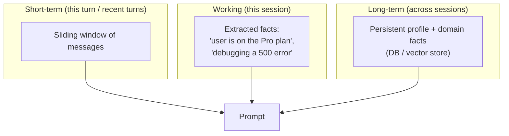
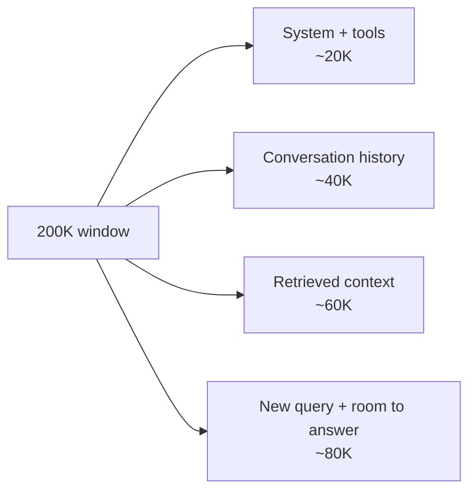
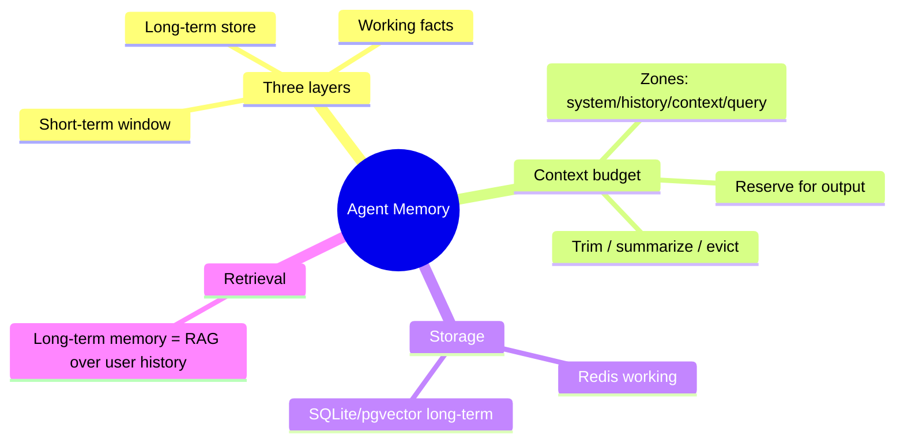

# Agent Memory & Context Budgeting

An agent with no memory answers every turn like it's the first. An agent that dumps *everything* into the prompt runs out of context window — and pays for the privilege. Real agents sit in between: they keep the right information at the right tier, and they spend their token budget deliberately. This lesson is about both.

> **Coming from Software Engineering?** Agent memory is a **storage hierarchy** — short-term memory is CPU registers (fast, tiny, this turn), working memory is RAM (this session's facts), long-term memory is disk (survives restarts). And the context window is a **fixed-size buffer you allocate** like heap memory: every token you spend on history is a token you can't spend on the new question, so you budget the zones and evict when you're near the limit.

---

## The Three Layers of Memory

So far you've used one kind of memory: the recent conversation turns (Day 36). Production agents distinguish three:



- **Short-term** — the last few turns, verbatim. Cheap, always included.
- **Working** — durable-for-the-session facts the agent extracted ("the user's name is Alice", "they're on the Enterprise plan"). Survives window trimming.
- **Long-term** — facts that outlive the session: a user profile, past preferences, domain knowledge. Lives in a database or vector store (Day 44 persistence; Day 22 pgvector) and is *retrieved* into the prompt when relevant.

```python
# script_id: day_046_agent_memory/layered_memory
from collections import deque
from dataclasses import dataclass, field

@dataclass
class AgentMemory:
    """Three-tier memory for an agent."""
    # Short-term: recent turns, bounded so it can't grow forever
    short_term: deque = field(default_factory=lambda: deque(maxlen=10))
    # Working: facts that should survive short-term trimming, this session
    working: dict = field(default_factory=dict)
    # Long-term: a handle to durable storage (DB/vector store); stubbed here
    long_term_store: dict = field(default_factory=dict)

    def add_turn(self, role: str, content: str):
        self.short_term.append({"role": role, "content": content})

    def remember_fact(self, key: str, value: str):
        """Promote something important to working memory so trimming won't lose it."""
        self.working[key] = value

    def persist(self, user_id: str):
        """Flush working memory to long-term storage (a real DB in production)."""
        self.long_term_store.setdefault(user_id, {}).update(self.working)

    def load(self, user_id: str):
        """Rehydrate working memory from long-term storage at session start."""
        self.working.update(self.long_term_store.get(user_id, {}))


mem = AgentMemory()
mem.load("user_42")                       # bring back what we knew about this user
mem.add_turn("user", "I'm on the Pro plan and hitting a rate limit.")
mem.remember_fact("plan", "Pro")          # survives even after 10+ more turns
mem.persist("user_42")                    # available next session
print(mem.working)                        # {'plan': 'Pro'}
```

The key move is `remember_fact`: short-term memory is a fixed-size `deque` that *drops old turns*, so anything that must outlast the window gets promoted to working memory instead.

---

## Context Budgeting: The Window Is a Fixed Buffer

A 200K-token window sounds infinite until you fill it with a long conversation, a big system prompt, ten tool definitions, and a pile of retrieved chunks — then the model truncates or you get billed for tokens you didn't need. Treat the window like a memory allocator: give each zone a budget.



```python
# script_id: day_046_agent_memory/context_budget
# pip install tiktoken   (OpenAI's tokenizer; for Claude use client.messages.count_tokens)
import tiktoken

enc = tiktoken.encoding_for_model("gpt-4o")

def count(text: str) -> int:
    return len(enc.encode(text))

class ContextBudget:
    """Allocate a token window across zones and detect overflow."""
    def __init__(self, total: int, reserve_for_output: int):
        self.total = total
        self.reserve = reserve_for_output          # leave room to actually answer
        self.available = total - reserve_for_output

    def fits(self, system: str, history: list[dict], retrieved: str, query: str) -> bool:
        used = (count(system)
                + sum(count(m["content"]) for m in history)
                + count(retrieved)
                + count(query))
        return used <= self.available

    def trim_history(self, history: list[dict], system: str, retrieved: str, query: str) -> list[dict]:
        """Drop oldest turns until everything fits. Returns the kept turns."""
        fixed = count(system) + count(retrieved) + count(query)
        budget = self.available - fixed
        kept: list[dict] = []
        running = 0
        for msg in reversed(history):              # keep the most recent first
            cost = count(msg["content"])
            if running + cost > budget:
                break
            kept.append(msg)
            running += cost
        return list(reversed(kept))


budget = ContextBudget(total=200_000, reserve_for_output=8_000)
history = [{"role": "user", "content": "..."} for _ in range(50)]
kept = budget.trim_history(history, system="You are...", retrieved="docs...", query="next?")
print(f"kept {len(kept)} of {len(history)} turns")
```

When you near the limit, you have three moves, cheapest first: **drop** the oldest turns (above), **summarize** them into one compact note, or **evict** working-memory facts you no longer need.

> **Common mistake:** forgetting to reserve tokens for the *output*. If you fill the whole window with input, the model has no room to answer and you get a truncated or empty completion. Always hold back `max_tokens` worth of space.

---

## Summarizing History Instead of Dropping It

Dropping old turns loses information. For long sessions, periodically compress them with a cheap model call — turning 20 turns into a two-sentence running summary that rides in working memory.

```python
# script_id: day_046_agent_memory/summarize_history
from openai import OpenAI
client = OpenAI()

def summarize_old_turns(turns: list[dict]) -> str:
    """Compress a batch of old turns into a short factual summary."""
    transcript = "\n".join(f"{m['role']}: {m['content']}" for m in turns)
    resp = client.chat.completions.create(
        model="gpt-4o-mini",                       # cheap model is fine for summarizing
        messages=[
            {"role": "system", "content": "Summarize this conversation in 2-3 sentences, "
                                           "preserving any facts, decisions, or user preferences."},
            {"role": "user", "content": transcript},
        ],
    )
    return resp.choices[0].message.content

# Strategy: every N turns, summarize the oldest half and keep the summary as one
# 'system' note, so the running context stays small without losing the thread.
```

This is the same idea LangGraph offers as built-in summary/compaction (Day 44) — here you can see the mechanism underneath.

---

## Where Memory Lives in Production

| Tier | Typical store | Why |
|---|---|---|
| Short-term | In-process (the message list) | Lives and dies with the request/session |
| Working | **Redis** | Sub-millisecond reads, TTL eviction, shared across workers |
| Long-term | **SQLite** (dev) / **Postgres + pgvector** (prod) | Durable; vector store lets you *retrieve* relevant memories by similarity |

```python
# script_id: day_046_agent_memory/redis_working_memory
# Working memory in Redis — fast, shared across processes, expires on its own.
import json
import redis

r = redis.Redis(decode_responses=True)

def save_working(session_id: str, facts: dict, ttl_seconds: int = 3600):
    r.set(f"mem:{session_id}", json.dumps(facts), ex=ttl_seconds)

def load_working(session_id: str) -> dict:
    raw = r.get(f"mem:{session_id}")
    return json.loads(raw) if raw else {}
```

For durable, *retrievable* long-term memory, store each memory as an embedding (Day 22) and pull back the few most relevant to the current query — long-term memory and RAG are the same retrieval mechanism pointed at the user's own history.

---

## Checkpoint

Run the `ContextBudget` example, then bump `history` to 500 turns and confirm `trim_history` still returns only as many recent turns as fit the budget (not all 500). Then drop `reserve_for_output` to `0` and observe that more turns are kept — proving the reserve is what protects room for the answer.

---

## Summary



---

## Quick Reference

| Concept | What it is | SWE analogy |
|---|---|---|
| Short-term memory | Recent turns (bounded deque) | CPU registers |
| Working memory | Session facts that survive trimming | RAM |
| Long-term memory | Persistent profile/domain facts | Disk |
| Context budget | Token allocation across zones | Heap allocation |
| Output reserve | Tokens held back to answer in | Don't fill the buffer to the brim |
| Summarize-vs-drop | Compress old turns instead of losing them | Lossy compression vs eviction |

---

## Exercises

1. Extend `AgentMemory` with an `extract_facts()` method that uses an LLM to pull durable facts (name, plan, current goal) from a turn and store them in working memory automatically.
2. Modify `trim_history` to call `summarize_old_turns` on the turns it would otherwise drop, and prepend the summary as a single `system` message.
3. Add a `relevant_long_term(query)` method that embeds the query (Day 21) and returns the top-3 most similar stored memories, so only pertinent long-term facts enter the prompt.

<details><summary>Solutions (approaches)</summary>

1. One `gpt-4o-mini` call per turn with a strict instruction ("return JSON of any durable facts, else `{}`"); merge the result into `self.working`. Cheap model, structured output (Day 29).
2. In `trim_history`, split into `kept` and `dropped`; if `dropped` is non-empty, summarize it and inject `{"role": "system", "content": summary}` at the front of `kept`.
3. Store each memory as `{text, embedding}`; on query, embed it and rank by cosine similarity (Day 20), returning the top-3 texts — exactly the RAG retrieval step, scoped to one user's memories.

</details>

---

## What's Next?

Next up is **Day 47 — Debugging AI Agents**: structured logging, state inspection, and the common failure modes (infinite loops, hallucinated tool calls, context overflow) — including what happens when the memory and budgeting from this lesson go wrong.
