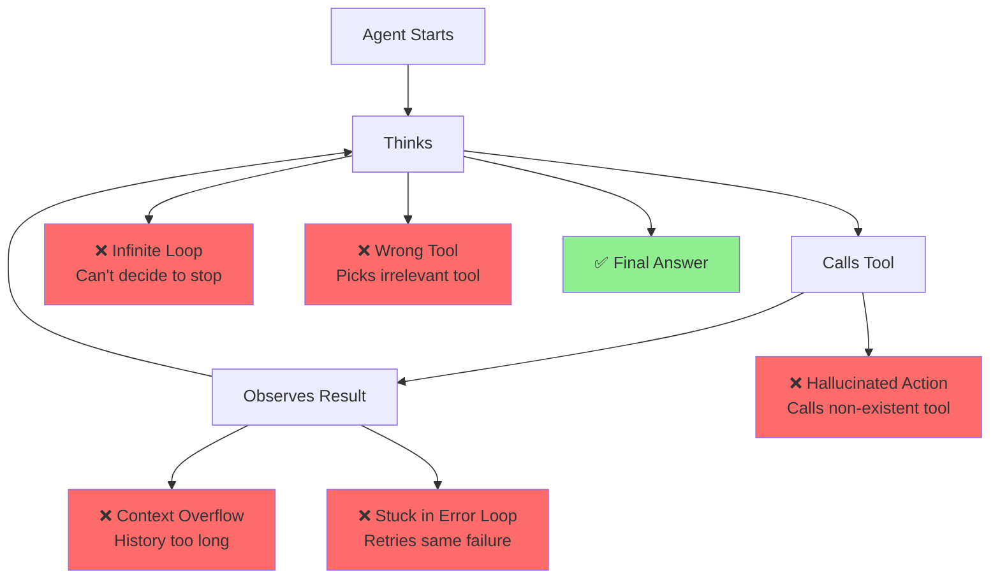
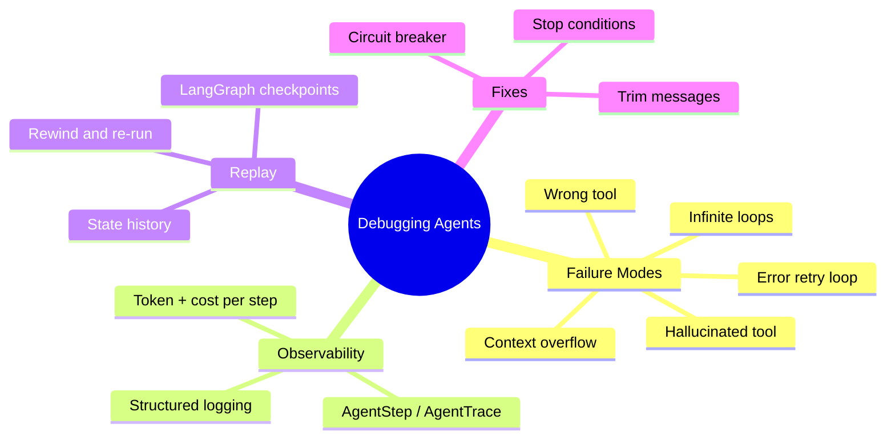

# Debugging AI Agents

Your agent ran. It made 47 tool calls. It spent $4.20. It did not answer the question. The loop exited with "I was unable to complete the task." You have no idea what happened.

> **Coming from Software Engineering?** Debugging agents is like debugging distributed systems — you can't step through with a breakpoint because the "logic" lives across multiple LLM calls with non-deterministic outputs. Your best tools are structured logging (trace every decision), replay (save full conversation state and re-run), and trajectory analysis (reviewing the sequence of actions like you'd review a distributed trace in Jaeger or Datadog). If you've debugged race conditions or eventual consistency bugs, you have the right patience for this.

Welcome to agent debugging — one of the most frustrating and important skills in AI engineering. Traditional debuggers do not help you here. You need different tools, different thinking, and a systematic approach.

---

## The Failure Modes You Will Encounter



### The Most Common Failure Modes

**1. Infinite loops** — The agent keeps calling tools but never commits to a final answer. Often caused by: unclear stopping conditions in the system prompt, tool results that never satisfy the model, or a model that second-guesses itself.

**2. Wrong tool selection** — The agent picks a tool that does not match the subtask. Usually a prompt problem: tool descriptions are ambiguous or overlap.

**3. Hallucinated actions** — The model tries to call a tool that does not exist, or passes arguments that do not match the schema. Often happens when the tool list changes but the system prompt is stale.

**4. Context overflow** — After many iterations, the conversation history exceeds the context window. The model gets confused, repetitive, or starts ignoring earlier instructions.

**5. Error retry loops** — A tool returns an error. The agent retries. Same error. Retries again. 20 times. You owe the API $3.

---

## The First Thing to Do: Add Structured Logging

You cannot debug what you cannot see. Add logging to your agent loop before you do anything else.

```python
# script_id: day_047_debugging_ai_agents/traceable_agent_debug
import json
import logging
import time
from dataclasses import dataclass, field
from typing import Any

logging.basicConfig(
    level=logging.INFO,
    format='%(asctime)s %(levelname)s %(name)s %(message)s'
)
logger = logging.getLogger("agent")
# For production observability, consider `structlog` which provides structured
# JSON logging out of the box — easier to parse and query than plain text logs.


@dataclass
class AgentStep:
    """A single step in the agent execution."""
    iteration: int
    thought: str | None
    tool_name: str | None
    tool_input: dict | None
    tool_output: Any | None
    error: str | None
    timestamp: float = field(default_factory=time.time)
    token_count: int = 0


@dataclass
class AgentTrace:
    """Complete execution trace for an agent run."""
    task: str
    steps: list[AgentStep] = field(default_factory=list)
    final_answer: str | None = None
    total_tokens: int = 0
    start_time: float = field(default_factory=time.time)

    def add_step(self, step: AgentStep):
        self.steps.append(step)
        logger.info(
            "agent_step | iteration=%d tool=%s error=%s",
            step.iteration,
            step.tool_name,
            step.error is not None,
        )

    def duration_seconds(self) -> float:
        return time.time() - self.start_time

    def to_dict(self) -> dict:
        return {
            "task": self.task,
            "total_steps": len(self.steps),
            "total_tokens": self.total_tokens,
            "duration_seconds": self.duration_seconds(),
            "final_answer": self.final_answer,
            "steps": [
                {
                    "iteration": s.iteration,
                    "tool": s.tool_name,
                    "input": s.tool_input,
                    "output": str(s.tool_output)[:200] if s.tool_output else None,
                    "error": s.error,
                }
                for s in self.steps
            ],
        }
```

---

## Building a Traceable Agent

Here is a ReAct agent with full tracing built in:

```python
# script_id: day_047_debugging_ai_agents/traceable_agent_debug
import json
from openai import OpenAI

client = OpenAI()


class TraceableAgent:
    """ReAct agent with full execution tracing."""

    def __init__(self, tools: dict, max_iterations: int = 10):
        self.tools = tools
        self.max_iterations = max_iterations

    def run(self, task: str) -> AgentTrace:
        trace = AgentTrace(task=task)
        messages = self._build_initial_messages(task)

        logger.info("Agent starting: %s", task[:100])

        for i in range(self.max_iterations):
            response = client.chat.completions.create(
                model="gpt-4o",
                messages=messages,
                tools=self._get_tool_schemas(),
            )

            message = response.choices[0].message
            trace.total_tokens += response.usage.total_tokens
            messages.append(message)

            # No tool calls = final answer
            if not message.tool_calls:
                trace.final_answer = message.content
                logger.info("Agent finished in %d iterations", i + 1)
                break

            for tool_call in message.tool_calls:
                tool_name = tool_call.function.name
                tool_input = json.loads(tool_call.function.arguments)

                step = AgentStep(
                    iteration=i,
                    thought=message.content,
                    tool_name=tool_name,
                    tool_input=tool_input,
                    tool_output=None,
                    error=None,
                )

                try:
                    if tool_name not in self.tools:
                        raise ValueError(
                            f"Unknown tool: {tool_name}. "
                            f"Available: {list(self.tools.keys())}"
                        )
                    result = self.tools[tool_name](**tool_input)
                    step.tool_output = result
                    logger.info(
                        "Tool: %s(%s) → %s",
                        tool_name,
                        json.dumps(tool_input)[:80],
                        str(result)[:80],
                    )

                except Exception as e:
                    step.error = str(e)
                    result = f"Error: {e}"
                    logger.error("Tool error %s: %s", tool_name, e)

                trace.add_step(step)

                messages.append({
                    "role": "tool",
                    "tool_call_id": tool_call.id,
                    "content": str(result),
                })

        else:
            logger.warning("Agent hit max iterations (%d)", self.max_iterations)

        logger.info(
            "agent_complete | steps=%d tokens=%d duration=%.1fs success=%s",
            len(trace.steps),
            trace.total_tokens,
            trace.duration_seconds(),
            trace.final_answer is not None,
        )
        return trace

    def _build_initial_messages(self, task: str) -> list[dict]:
        return [
            {
                "role": "system",
                "content": (
                    "You are a helpful assistant with access to tools. "
                    "Use tools to gather information, then provide a final answer. "
                    "When you have enough information, stop calling tools and give your answer. "
                    "Do NOT keep searching after you have a good answer."
                ),
            },
            {"role": "user", "content": task},
        ]

    def _get_tool_schemas(self) -> list[dict]:
        return [
            {
                "type": "function",
                "function": {
                    "name": name,
                    "description": func.__doc__ or "",
                    "parameters": {"type": "object", "properties": {}},
                },
            }
            for name, func in self.tools.items()
        ]
```

---

## Debugging LangGraph State Machines

LangGraph gives you visibility into state at each node — but you have to ask for it.

```python
# script_id: day_047_debugging_ai_agents/langgraph_debugging
from langgraph.graph import StateGraph, END
from langgraph.checkpoint.memory import MemorySaver
from typing import TypedDict, Annotated
import operator


class AgentState(TypedDict):
    messages: Annotated[list, operator.add]
    tool_calls_made: int
    errors: list[str]


def build_debuggable_graph():
    """Build a LangGraph graph with checkpointing enabled."""
    checkpointer = MemorySaver()

    graph = StateGraph(AgentState)
    # ... add your nodes and edges here ...

    # Compile WITH checkpointer — this is what enables step replay
    app = graph.compile(checkpointer=checkpointer)
    return app


def inspect_execution(app, thread_id: str):
    """Inspect execution history step by step."""
    config = {"configurable": {"thread_id": thread_id}}

    history = list(app.get_state_history(config))
    print(f"Total checkpoints: {len(history)}")

    for i, checkpoint in enumerate(reversed(history)):
        state = checkpoint.values
        messages = state.get("messages", [])
        tool_calls = state.get("tool_calls_made", 0)

        print(f"\nStep {i}: {len(messages)} messages, {tool_calls} tool calls")

        if messages:
            last = messages[-1]
            role = getattr(last, "type", "unknown")
            content = str(getattr(last, "content", ""))[:100]
            print(f"  Last ({role}): {content}")


# Time travel: rewind to a specific checkpoint and re-run from there
def rewind_and_replay(app, thread_id: str, steps_back: int = 2):
    """Rewind execution by N steps and replay from that point."""
    config = {"configurable": {"thread_id": thread_id}}
    history = list(app.get_state_history(config))

    if steps_back >= len(history):
        print("Not enough history to rewind that far")
        return

    # Get the checkpoint we want to rewind to
    target_checkpoint = list(reversed(history))[steps_back]
    target_config = target_checkpoint.config

    print(f"Rewinding {steps_back} steps...")

    # Update state to that checkpoint and continue
    app.update_state(target_config, target_checkpoint.values)

    # Invoke from that point
    result = app.invoke(None, target_config)
    return result
```

---

## The Debugging Checklist

When your agent does something weird, go through this checklist:

```python
# script_id: day_047_debugging_ai_agents/traceable_agent_debug
from collections import Counter


def agent_debugging_checklist(trace: AgentTrace) -> list[str]:
    """Automated checks on an agent trace."""
    issues = []

    # 1. Did it hit max iterations?
    if trace.final_answer is None:
        issues.append("CRITICAL: Agent hit max iterations without final answer")

    # 2. Were there errors?
    errors = [s for s in trace.steps if s.error]
    if errors:
        issues.append(f"ERRORS: {len(errors)} tool calls failed")
        for e in errors[:3]:
            issues.append(f"  - {e.tool_name}: {e.error}")

    # 3. Same tool called repeatedly with same input?
    tool_inputs = [
        (s.tool_name, json.dumps(s.tool_input or {}, sort_keys=True))
        for s in trace.steps
        if s.tool_name
    ]
    duplicates = {k: v for k, v in Counter(tool_inputs).items() if v > 2}
    if duplicates:
        issues.append(f"LOOP DETECTED: Repeated tool calls: {list(duplicates.keys())[:3]}")

    # 4. Did token count explode?
    if trace.total_tokens > 50_000:
        issues.append(f"TOKEN EXPLOSION: {trace.total_tokens:,} tokens used")

    # 5. Too many steps?
    if len(trace.steps) > 15:
        issues.append(f"TOO MANY STEPS: {len(trace.steps)} steps")

    # 6. Hallucinated tool names?
    hallucination_signals = ["unknown tool", "not found", "does not exist"]
    for s in trace.steps:
        if s.error and any(k in s.error.lower() for k in hallucination_signals):
            issues.append(f"HALLUCINATED TOOL: '{s.tool_name}'")

    return issues if issues else ["No obvious issues detected"]
```

---

## Common Mistakes and Fixes

### Mistake 1: Infinite Loop — Missing Stop Condition

```python
# script_id: day_047_debugging_ai_agents/stop_condition_fix
# PROBLEM: no stopping condition
bad_system_prompt = "You have access to web_search. Use it to research topics."

# FIX: explicit stopping condition
good_system_prompt = """You have access to web_search. Use it to research topics.

IMPORTANT: After 2-3 searches you have enough information. Stop searching and
give your final answer. Do NOT keep looking for more information once you have
a reasonable answer."""
```

### Mistake 2: Error Retry Loop — No Circuit Breaker

```python
# script_id: day_047_debugging_ai_agents/circuit_breaker
# PROBLEM: agent retries failed tool indefinitely
def bad_execute(tool_name, tool_input):
    try:
        return tools[tool_name](**tool_input)
    except Exception as e:
        return f"Error: {e}"  # LLM will just try again


# FIX: track per-tool error count
class CircuitBreakerAgent:
    def __init__(self, max_tool_errors: int = 3):
        self.max_tool_errors = max_tool_errors
        self._error_count: dict[str, int] = {}

    def execute_tool(self, tool_name: str, tool_input: dict) -> str:
        count = self._error_count.get(tool_name, 0)

        if count >= self.max_tool_errors:
            return (
                f"Tool '{tool_name}' has failed {self.max_tool_errors} times. "
                "Please proceed without it or try a different approach."
            )

        try:
            return str(tools[tool_name](**tool_input))
        except Exception as e:
            self._error_count[tool_name] = count + 1
            return f"Error ({count + 1}/{self.max_tool_errors}): {e}"
```

### Mistake 3: Context Overflow — Unbounded History

```python
# script_id: day_047_debugging_ai_agents/traceable_agent_debug
import tiktoken


def trim_messages(
    messages: list[dict],
    max_tokens: int = 100_000,
    model: str = "gpt-4o",
) -> list[dict]:
    """Keep system messages + most recent messages within token budget."""
    enc = tiktoken.encoding_for_model(model)

    system_msgs = [m for m in messages if m.get("role") == "system"]
    other_msgs = [m for m in messages if m.get("role") != "system"]

    system_tokens = sum(
        len(enc.encode(m.get("content", "") or "")) for m in system_msgs
    )
    budget = max_tokens - system_tokens - 1000  # Reserve for next response

    selected = []
    used = 0
    for message in reversed(other_msgs):
        content = message.get("content", "") or ""
        msg_tokens = len(enc.encode(content))
        if used + msg_tokens > budget:
            break
        selected.insert(0, message)
        used += msg_tokens

    trimmed = len(other_msgs) - len(selected)
    if trimmed > 0:
        logger.warning("Trimmed %d messages from context (budget: %d tokens)", trimmed, max_tokens)

    return system_msgs + selected
```

---

## Pretty-Printing Traces

```python
# script_id: day_047_debugging_ai_agents/traceable_agent_debug
def print_trace(trace: AgentTrace):
    """Pretty-print an agent execution trace for debugging."""
    print(f"\n{'='*60}")
    print(f"TASK: {trace.task}")
    print(f"Duration: {trace.duration_seconds():.1f}s | Tokens: {trace.total_tokens:,}")
    print(f"{'='*60}")

    for i, step in enumerate(trace.steps):
        status = "❌" if step.error else "✅"
        print(f"\nStep {i+1} {status}")
        if step.thought:
            print(f"  Thought: {step.thought[:150]}")
        if step.tool_name:
            print(f"  Tool: {step.tool_name}")
            if step.tool_input:
                print(f"  Input: {json.dumps(step.tool_input)[:100]}")
            if step.error:
                print(f"  ERROR: {step.error}")
            elif step.tool_output:
                print(f"  Output: {str(step.tool_output)[:100]}")

    print(f"\n{'='*60}")
    if trace.final_answer:
        print(f"FINAL ANSWER: {trace.final_answer[:300]}")
    else:
        print("FAILED: No final answer produced")
    print(f"{'='*60}\n")
```

---

## SWE to AI Engineering Bridge

| Software Debugging | Agent Debugging |
|---|---|
| Stack trace | Agent execution trace |
| Breakpoints | LangGraph checkpoints / step inspection |
| Log statements | Structured `AgentStep` logging |
| Unit test for a function | Test a single tool call in isolation |
| Infinite loop detection | Max iterations + repeated-call detection |
| Memory leak | Context overflow / unbounded history |
| Exception handling | Tool error capture + graceful degradation |
| Profiler | Token count and cost per step |

---

## Key Takeaways

1. **Add tracing before you need it** — retrofitting observability is painful
2. **The most common failure is hitting max iterations** — always check this first
3. **Repeated tool calls with same input = stuck loop** — detect and break it
4. **Context overflow is silent** — the model just gets confused; trim proactively
5. **LangGraph checkpoints let you replay execution** — use them for complex debugging
6. **Log every tool call** — input, output, error, and token count

---

## Checkpoint

Feed `agent_debugging_checklist` a hand-built `AgentTrace` whose `steps` contain the *same* `(tool_name, tool_input)` three times. The returned list should include a `"LOOP DETECTED"` line — the `Counter`-based check fires when an identical call repeats more than twice. Then run a clean trace through `print_trace(...)` and confirm each step shows ✅/❌ with its tool and output. If "LOOP DETECTED" never appears, make sure your duplicate steps serialize to identical `json.dumps(..., sort_keys=True)` strings (same keys, same values).

## Summary



---

## Quick Reference

| Symptom | Detection | Fix |
|---|---|---|
| Never finishes | `final_answer is None` after loop | Explicit stop condition in system prompt |
| Repeats same call | `Counter` of `(tool, input)` > 2 | Block duplicate; nudge the model |
| Calls missing tool | error contains "unknown tool" | Keep tool list and prompt in sync |
| Context overflow | message tokens near window | `trim_messages(...)` to a budget |
| Error retry loop | per-tool error count rising | Circuit breaker after N failures |
| "What happened?" | `app.get_state_history(config)` | Inspect / rewind each checkpoint |

---

## Exercises

1. Add `AgentTrace` and `TraceableAgent` to your Day 48 capstone and print a trace for each run.
2. Write a test that triggers the "repeated tool call" detection in `agent_debugging_checklist`.
3. Implement `trim_messages` and verify it stays under 100K tokens after 200 simulated iterations.
4. Use LangGraph's state history to replay an execution step-by-step and print state at each checkpoint.

<details><summary>Solutions (approaches)</summary>

1. Wrap each call in an `AgentStep`, append to `trace`, and call `print_trace(trace)` at the end — both helpers are defined in this lesson.
2. Feed `agent_debugging_checklist` a hand-built `AgentTrace` whose `steps` contain three identical `(tool_name, tool_input)` entries; assert "LOOP DETECTED" appears.
3. Build 200 fake messages, run `trim_messages(messages, max_tokens=100_000)`, and assert the re-encoded total is under budget.
4. `for cp in app.get_state_history(config): print(cp.values)` — newest first; reverse it to read forward.
</details>

---

## What's Next?

Capstone — **Autonomous Research Agent**, where you'll build a full multi-step agent with the tracing and debugging infrastructure from today.
