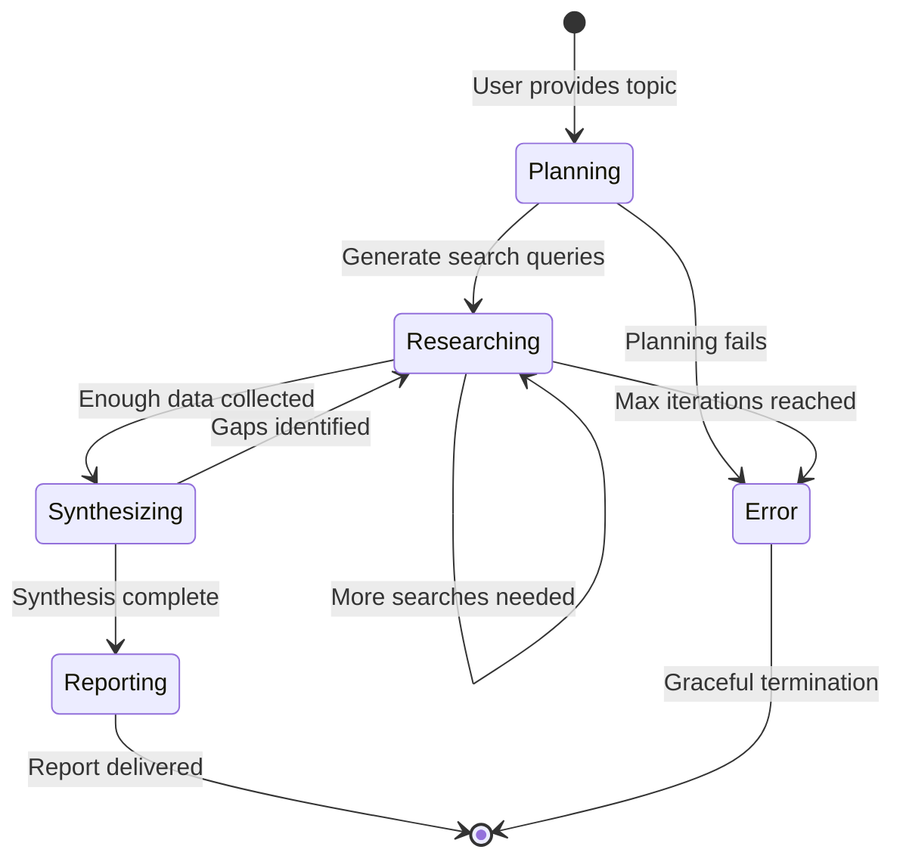
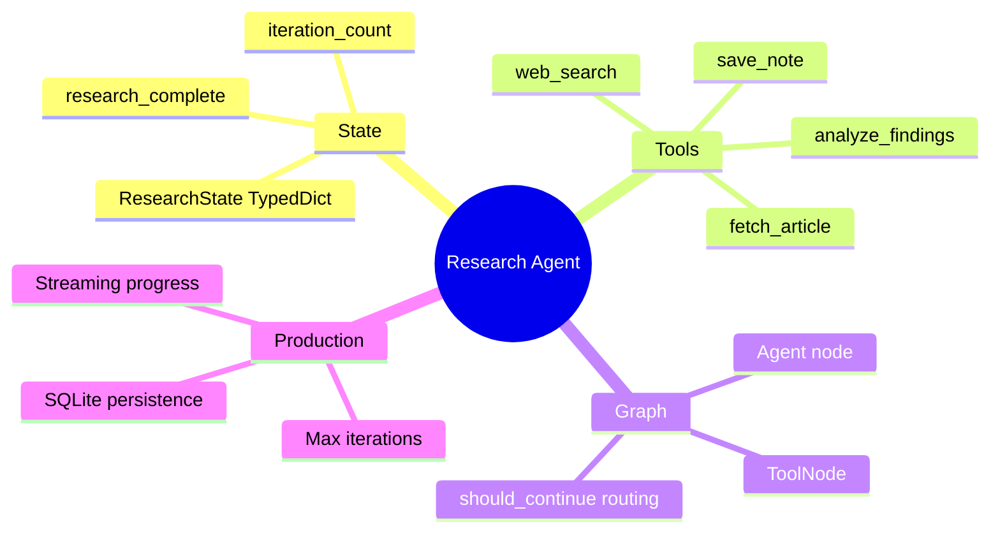

# Capstone — Build an Autonomous Research Agent

You've been building up to this. You know how to call LLM APIs, extract structured data, build RAG systems, define tools, and wire up ReAct loops with LangGraph. Today you put all of it together into something that genuinely surprises you when you run it: an autonomous research agent.

> **Coming from Software Engineering?** This capstone is architecturally a workflow orchestrator — like a CI/CD pipeline or an Airflow DAG, but where each step's output determines the next step dynamically. You're building a state machine with conditional branching, external API calls, data aggregation, and a final render step. If you've built job schedulers, pipeline runners, or even complex CLI tools that shell out to multiple services, you'll recognize the patterns immediately.

> **Portfolio thread (3 of 5).** This agent reuses the extraction (**Day 18**) and retrieval (**Day 34**) capstones as tools, and is itself the kind of specialist the **Day 73** multi-agent pipeline coordinates. Capstone #3 of the five-project system deployed on Day 97 and presented on Day 99.

You give it a topic. It searches for information, synthesizes what it finds, asks follow-up questions, searches again, and produces a structured research report — without you doing anything after the first prompt.

This is the moment where AI engineering stops feeling like plumbing and starts feeling like building something alive.

---

## What You're Building

An autonomous research agent that:
1. Takes a research topic from the user
2. Plans a research strategy (what to search for, in what order)
3. Executes web searches and document lookups via tools
4. Synthesizes findings incrementally
5. Identifies gaps and searches for more information
6. Produces a structured final report
7. Persists conversation history to a database
8. Gracefully handles max iterations to prevent runaway costs



---

## Project Structure

```
research_agent/
├── agent.py          # LangGraph state machine
├── tools.py          # Search, lookup, and analysis tools
├── persistence.py    # SQLite conversation history
├── reporter.py       # Report formatting
├── main.py           # Entry point
└── requirements.txt
```

---

## Step 1: State Definition

LangGraph is a state machine. Everything the agent knows lives in the state. Define it clearly upfront.

```python
# script_id: day_048_capstone_autonomous_research_agent/research_agent
# state.py
from typing import TypedDict, Optional, Annotated
from langgraph.graph.message import add_messages


class ResearchState(TypedDict):
    """The complete state of the research agent."""
    # The research topic
    topic: str

    # Conversation messages (managed by LangGraph). Findings are tracked here in
    # the message history (tool-result messages), not in a separate field.
    messages: Annotated[list, add_messages]

    # Control flow
    iteration_count: int
    max_iterations: int
    research_complete: bool

    # Output
    final_report: Optional[str]
    session_id: str
```

The `add_messages` annotation tells LangGraph to APPEND new messages to this list instead of replacing it — that is why each node returns `{"messages": [response]}` and the conversation grows across iterations (Days 41-42 covered these state reducers).

---

## Step 2: Tools

The agent needs tools to actually do research. We'll mock the web search (swap in a real API like Tavily or SerpAPI for production):

```python
# script_id: day_048_capstone_autonomous_research_agent/research_agent
# tools.py
import json
import random
from datetime import datetime
from langchain_core.tools import tool


@tool
def web_search(query: str, num_results: int = 5) -> str:
    """
    Search the web for information on a topic.
    Returns a JSON list of results with title, url, and snippet.
    
    Args:
        query: The search query
        num_results: Number of results to return (1-10)
    """
    # In production: replace with Tavily, SerpAPI, or Brave Search API
    # from tavily import TavilyClient
    # client = TavilyClient(api_key=os.environ["TAVILY_API_KEY"])
    # results = client.search(query, max_results=num_results)

    # Mock implementation for development
    mock_results = [
        {
            "title": f"Research Result: {query}",
            "url": f"https://example.com/article-{i}",
            "snippet": f"This article discusses {query} in depth, covering key aspects including implementation details, best practices, and real-world applications. Published {datetime.now().strftime('%B %Y')}.",
            "published_date": datetime.now().isoformat(),
        }
        for i in range(min(num_results, 5))
    ]

    return json.dumps(mock_results, indent=2)


@tool
def fetch_article(url: str) -> str:
    """
    Fetch and extract the full text of an article from a URL.
    Use this when a search snippet is not detailed enough.
    
    Args:
        url: The URL of the article to fetch
    """
    # In production: use requests + BeautifulSoup or a content extraction API
    # import requests
    # from bs4 import BeautifulSoup
    # response = requests.get(url, timeout=10)
    # soup = BeautifulSoup(response.content, 'html.parser')
    # return soup.get_text(separator='\n', strip=True)[:5000]

    return f"[Mock article content for {url}]\n\nThis is detailed content about the topic. It covers background, current state, key challenges, and future directions. The article cites several studies and expert opinions."


@tool
def analyze_findings(findings_json: str) -> str:
    """
    Analyze a collection of research findings to identify:
    - Key themes
    - Consensus points
    - Contradictions
    - Information gaps
    
    Args:
        findings_json: JSON string of findings list
    """
    findings = json.loads(findings_json)
    return json.dumps({
        "finding_count": len(findings),
        "key_themes": ["theme 1", "theme 2"],  # LLM will derive real themes
        "has_contradictions": False,
        "suggested_gaps": ["Consider researching X", "More data needed on Y"],
    })


@tool
def save_note(note: str, category: str = "general") -> str:
    """
    Save an important note or finding for inclusion in the final report.
    Use this to bookmark key insights as you research.
    
    Args:
        note: The note to save
        category: Category label (e.g., 'key_finding', 'statistic', 'quote')
    """
    # In a real system, persist this to a database
    timestamp = datetime.now().isoformat()
    return f"Note saved at {timestamp}: [{category}] {note[:100]}..."


RESEARCH_TOOLS = [web_search, fetch_article, analyze_findings, save_note]
```

---

## Step 3: The LangGraph Agent

```python
# script_id: day_048_capstone_autonomous_research_agent/research_agent
# agent.py
import json
import os
from typing import Literal
from langgraph.graph import StateGraph, END
from langgraph.prebuilt import ToolNode
from langchain_openai import ChatOpenAI
from langchain_core.messages import SystemMessage, HumanMessage, AIMessage

from state import ResearchState
from tools import RESEARCH_TOOLS

llm = ChatOpenAI(model="gpt-4o-mini", temperature=0.3)  # low = more consistent/factual; research favors reliability over creativity (see Day 4)
llm_with_tools = llm.bind_tools(RESEARCH_TOOLS)

RESEARCH_SYSTEM_PROMPT = """You are an expert research agent. Your job is to thoroughly research a topic and produce a comprehensive report.

Research Strategy:
1. Start by planning 3-5 specific search queries that will cover the topic from different angles
2. Execute searches and analyze the results carefully
3. Identify gaps in your knowledge and search for more specific information
4. Synthesize findings into coherent insights
5. When you have sufficient information (typically 5-10 searches), produce a final report

Report Structure:
- Executive Summary (2-3 sentences)
- Background & Context
- Key Findings (bullet points)
- Analysis & Implications
- Open Questions / Areas for Further Research
- Sources Consulted

Important:
- Use tools actively — don't try to answer from memory
- Track what you've searched and avoid redundant queries
- When you have enough information, signal completion by including "RESEARCH_COMPLETE" in your response
- Stay focused on the topic — don't go down rabbit holes"""


def should_continue(state: ResearchState) -> Literal["tools", "end"]:
    """Routing logic: continue with tools or end?"""
    messages = state["messages"]
    last_message = messages[-1]

    # Check max iterations
    if state["iteration_count"] >= state["max_iterations"]:
        return "end"

    # Check if research is marked complete
    if state.get("research_complete"):
        return "end"

    # Check if the last message has tool calls
    if hasattr(last_message, "tool_calls") and last_message.tool_calls:
        return "tools"

    # Check if the assistant signaled completion
    if isinstance(last_message, AIMessage) and "RESEARCH_COMPLETE" in (last_message.content or ""):
        return "end"

    # Plain assistant reply with no tool calls and no COMPLETE signal -> the agent is done; route to the reporter.
    return "end"


def research_node(state: ResearchState) -> dict:
    """Main agent node: think, plan, and decide what tools to call."""
    iteration = state.get("iteration_count", 0)

    # Build context message about current progress
    progress_context = f"""
Current research progress:
- Topic: {state['topic']}
- Iteration: {iteration + 1}/{state['max_iterations']}
- Searches completed: {sum(1 for m in state["messages"] if getattr(m, "type", None) == "tool")}

{'IMPORTANT: You are running low on iterations. If you have enough information, produce the final report now.' if iteration >= state['max_iterations'] - 3 else ''}
"""

    messages = [
        SystemMessage(content=RESEARCH_SYSTEM_PROMPT + "\n\n" + progress_context),
        *state["messages"],
    ]

    response = llm_with_tools.invoke(messages)

    # Check if research is complete
    research_complete = "RESEARCH_COMPLETE" in (response.content or "")

    return {
        "messages": [response],
        "iteration_count": iteration + 1,
        "research_complete": research_complete,
    }


def report_node(state: ResearchState) -> dict:
    """Generate the final structured report."""
    all_tool_results = []
    for msg in state["messages"]:
        if hasattr(msg, "type") and msg.type == "tool":
            all_tool_results.append(msg.content)

    report_prompt = f"""Based on all the research conducted, produce a final comprehensive report on: {state['topic']}

Research findings collected:
{chr(10).join(all_tool_results[:10])}  

Format the report with clear sections:
1. Executive Summary
2. Background & Context  
3. Key Findings
4. Analysis & Implications
5. Open Questions
6. Sources Consulted

Be thorough but concise. This is the deliverable."""

    response = llm.invoke([
        SystemMessage(content="You are an expert research analyst producing a final report."),
        HumanMessage(content=report_prompt),
    ])

    return {
        "messages": [response],
        "final_report": response.content,
    }


def build_graph():
    """Assemble the LangGraph state machine."""
    graph = StateGraph(ResearchState)

    # Add nodes
    graph.add_node("researcher", research_node)
    graph.add_node("tools", ToolNode(RESEARCH_TOOLS))
    graph.add_node("reporter", report_node)

    # Set entry point
    graph.set_entry_point("researcher")

    # Conditional routing from researcher
    graph.add_conditional_edges(
        "researcher",
        should_continue,
        {
            "tools": "tools",
            "end": "reporter",
        },
    )

    # After tools, always go back to researcher
    graph.add_edge("tools", "researcher")

    # Reporter is the final node
    graph.add_edge("reporter", END)

    return graph.compile()
```

---

## Step 4: Persistence

Research sessions should survive crashes and be resumable:

```python
# script_id: day_048_capstone_autonomous_research_agent/research_agent
# persistence.py
import sqlite3
import json
from datetime import datetime
from pathlib import Path

DB_PATH = Path("./research_sessions.db")


def init_db():
    """Initialize the SQLite database."""
    conn = sqlite3.connect(DB_PATH)
    conn.execute("""
        CREATE TABLE IF NOT EXISTS sessions (
            session_id TEXT PRIMARY KEY,
            topic TEXT NOT NULL,
            status TEXT DEFAULT 'in_progress',
            created_at TEXT,
            updated_at TEXT,
            final_report TEXT,
            iteration_count INTEGER DEFAULT 0,
            metadata TEXT DEFAULT '{}'
        )
    """)
    conn.execute("""
        CREATE TABLE IF NOT EXISTS messages (
            id INTEGER PRIMARY KEY AUTOINCREMENT,
            session_id TEXT NOT NULL,
            role TEXT NOT NULL,
            content TEXT,
            tool_calls TEXT,
            created_at TEXT,
            FOREIGN KEY (session_id) REFERENCES sessions(session_id)
        )
    """)
    conn.commit()
    conn.close()


def save_session(session_id: str, topic: str, status: str = "in_progress",
                 final_report: str = None, iteration_count: int = 0):
    """Save or update a research session."""
    conn = sqlite3.connect(DB_PATH)
    now = datetime.now().isoformat()
    conn.execute("""
        INSERT INTO sessions (session_id, topic, status, created_at, updated_at, final_report, iteration_count)
        VALUES (?, ?, ?, ?, ?, ?, ?)
        ON CONFLICT(session_id) DO UPDATE SET
            status=excluded.status,
            updated_at=excluded.updated_at,
            final_report=excluded.final_report,
            iteration_count=excluded.iteration_count
    """, (session_id, topic, status, now, now, final_report, iteration_count))
    conn.commit()
    conn.close()


def load_session(session_id: str) -> dict | None:
    """Load a research session by ID."""
    conn = sqlite3.connect(DB_PATH)
    row = conn.execute(
        "SELECT * FROM sessions WHERE session_id = ?", (session_id,)
    ).fetchone()
    conn.close()

    if not row:
        return None

    columns = ["session_id", "topic", "status", "created_at", "updated_at",
               "final_report", "iteration_count", "metadata"]
    return dict(zip(columns, row))


def list_sessions() -> list:
    """List all research sessions."""
    conn = sqlite3.connect(DB_PATH)
    rows = conn.execute(
        "SELECT session_id, topic, status, created_at, iteration_count FROM sessions ORDER BY created_at DESC"
    ).fetchall()
    conn.close()
    return [{"session_id": r[0], "topic": r[1], "status": r[2], "created_at": r[3], "iterations": r[4]} for r in rows]
```

---

## Step 5: Main Entry Point

```python
# script_id: day_048_capstone_autonomous_research_agent/research_agent
# main.py
import uuid
from langchain_core.messages import HumanMessage
from agent import build_graph
from persistence import init_db, save_session, list_sessions
from state import ResearchState

init_db()


def run_research(topic: str, max_iterations: int = 15) -> str:
    """
    Run a full research session on a topic.
    Returns the final report as a string.
    """
    session_id = str(uuid.uuid4())[:8]
    print(f"\nStarting research session {session_id}")
    print(f"Topic: {topic}")
    print(f"Max iterations: {max_iterations}")
    print("-" * 60)

    graph = build_graph()

    initial_state: ResearchState = {
        "topic": topic,
        "messages": [HumanMessage(content=f"Please research this topic thoroughly: {topic}")],
        "iteration_count": 0,
        "max_iterations": max_iterations,
        "research_complete": False,
        "final_report": None,
        "session_id": session_id,
    }

    # Save initial session
    save_session(session_id, topic, status="in_progress")

    # Run the graph with streaming to see progress
    final_state = None
    # Use `stream_mode="debug"` during development for detailed execution traces
    # showing every node entry/exit and state change.
    for event in graph.stream(initial_state, stream_mode="values"):
        final_state = event
        iteration = event.get("iteration_count", 0)
        last_message = event["messages"][-1] if event["messages"] else None

        if last_message and hasattr(last_message, "tool_calls") and last_message.tool_calls:
            for tc in last_message.tool_calls:
                print(f"  [Iteration {iteration}] Tool: {tc['name']}({list(tc['args'].keys())})")

    # Save completed session
    report = final_state.get("final_report", "No report generated")
    save_session(
        session_id,
        topic,
        status="completed",
        final_report=report,
        iteration_count=final_state.get("iteration_count", 0),
    )

    print(f"\nSession {session_id} complete after {final_state.get('iteration_count', 0)} iterations.")
    return report


if __name__ == "__main__":
    # Example research topics
    topics = [
        "The current state of AI agent frameworks in 2025",
        "Best practices for RAG system evaluation",
    ]

    report = run_research(topics[0], max_iterations=12)

    print("\n" + "=" * 60)
    print("FINAL REPORT")
    print("=" * 60)
    print(report)

    print("\n" + "=" * 60)
    print("ALL SESSIONS")
    print("=" * 60)
    for session in list_sessions():
        print(f"  {session['session_id']}: {session['topic'][:50]}... ({session['status']}, {session['iterations']} iterations)")
```

---

## Running the Agent

```bash
# requirements.txt
openai>=1.30.0
langchain>=0.3
langchain-openai>=0.2
langgraph>=0.3
```

```bash
pip install -r requirements.txt
export OPENAI_API_KEY="sk-..."

python main.py
```

You'll see something like:
```
Starting research session a3f9b2c1
Topic: The current state of AI agent frameworks in 2025
Max iterations: 12
------------------------------------------------------------
  [Iteration 1] Tool: web_search(['query'])
  [Iteration 2] Tool: web_search(['query'])
  [Iteration 3] Tool: fetch_article(['url'])
  [Iteration 4] Tool: save_note(['note', 'category'])
  ...
  [Iteration 9] Tool: analyze_findings(['findings_json'])

Session a3f9b2c1 complete after 11 iterations.

============================================================
FINAL REPORT
============================================================
Executive Summary
...
```

---

## Design Decisions Worth Knowing

**Why max iterations?**
Without a hard limit, an agent can loop forever, burning money and never finishing. Always bound your agents. In production, you'd also add a cost budget: "stop if total tokens exceed X."

**Why the `RESEARCH_COMPLETE` signal?**
This is a lightweight protocol for the agent to signal it's done without requiring a structured output. An alternative is to make the final node a structured output call that forces the agent to either produce a report or explain why it can't.

**Why SQLite over PostgreSQL?**
SQLite is zero-config and perfect for development and single-instance production. For a multi-user system, swap to PostgreSQL. The persistence layer is isolated — you can swap the database without touching the agent logic.

**Why stream the graph?**
Because research takes time. Users need to see progress. In a web app, you'd stream these events over a WebSocket or SSE connection to show a live activity feed.

**Why LangGraph over custom code?**
LangGraph gives you state management, streaming, and checkpointing for free. You could build the ReAct loop yourself, but you'd be rebuilding features LangGraph already has. Use it.

---

## What You Built

A production-pattern autonomous research agent with:
- LangGraph state machine for reliable agent orchestration
- Multi-tool research capability (search, fetch, analyze, note)
- Configurable iteration limits to prevent runaway execution
- SQLite persistence for session history
- Streaming execution for real-time progress feedback
- Clean separation of concerns (state, tools, agent, persistence)

**For your portfolio:**

*"I built an autonomous research agent using LangGraph that takes a topic, executes a multi-step research plan using web search and document tools, and produces a structured report. It includes configurable iteration limits, SQLite session persistence, and streaming progress output. The architecture follows the LangGraph state machine pattern used in production agent systems."*

---

## Checkpoint

Run `python main.py` with `OPENAI_API_KEY` set. You should see a session ID, then a stream of `[Iteration N] Tool: web_search(...)` / `fetch_article(...)` lines as the agent works, and finally `Session ... complete after N iterations` followed by a structured FINAL REPORT — with `N` strictly less than your `max_iterations`. If it stops exactly at `max_iterations` every time without producing a report, the agent never emitted the `RESEARCH_COMPLETE` signal; loosen the prompt or check that `should_continue` routes to `"end"` (the reporter) on that signal rather than looping back to `tools`.

## Summary



---

## Quick Reference

| Piece | API / pattern |
|---|---|
| Define tools | `@tool` on a typed function with a docstring |
| Collect tools | `RESEARCH_TOOLS = [web_search, fetch_article, ...]` |
| Bind to model | `llm.bind_tools(RESEARCH_TOOLS)` |
| Run tools | `from langgraph.prebuilt import ToolNode` |
| Route loop | conditional edge on `should_continue` → `"tools"` or `"end"` |
| Stop signal | `"RESEARCH_COMPLETE"` in the reply, or `iteration_count >= max` |
| Persist sessions | hand-rolled SQLite sessions/messages tables (`persistence.py`) |
| Watch progress | `for event in app.stream(state, config): ...` |

---

## Exercises

1. Swap the mocked `web_search` for a real API (Tavily, SerpAPI, or Brave) behind the same `@tool` signature so the rest of the graph is untouched.
2. Add a hard cost budget: track cumulative tokens and force the `should_continue` router to `"end"` once you cross a threshold.
3. Add a fifth tool — e.g. `summarize_source(url)` — bind it, and confirm the agent chooses it when a fetched article is long.
4. Replace the `RESEARCH_COMPLETE` string signal with a structured final node that returns a validated report object (or explains why it can't).

<details><summary>Solutions (approaches)</summary>

1. Keep `def web_search(query, num_results=5) -> str:` identical; inside, call the provider client and `json.dumps` the results. The `@tool` schema and graph stay the same.
2. Accumulate `response.usage`/token counts in state; in `should_continue`, `if state["tokens"] > BUDGET: return "end"`.
3. Define it with `@tool`, append to `RESEARCH_TOOLS`, re-`bind_tools` — `ToolNode` dispatches by name automatically.
4. Add a terminal node that calls the LLM with a Pydantic schema (structured output) and returns the parsed report; route to it instead of matching a string.
</details>

---

## What's Next?

Tomorrow is Day 49 — the career checkpoint. We're pausing the technical content for a day to take stock of what you've built, map it to job requirements, and talk about what to put on your resume right now.

It's worth the pause. See you there.

---

*Next up: Career Checkpoint — Mid-Journey Review*
