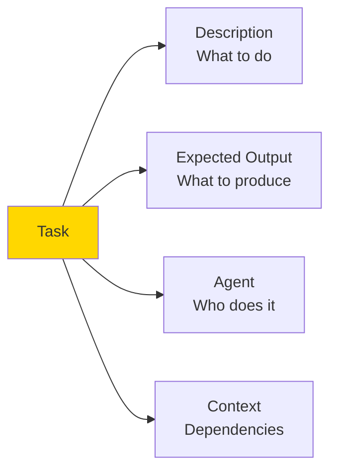
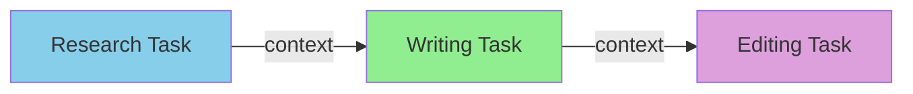
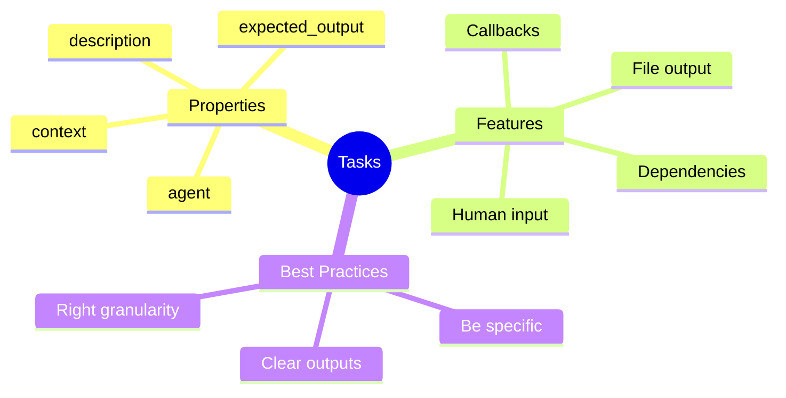

# Defining Tasks in CrewAI

Tasks are the work assignments in CrewAI. Each task has a description, expected output, and an assigned agent. This guide shows you how to create effective tasks.

> **Coming from Software Engineering?** CrewAI tasks are like Jira tickets for AI agents — a description of what to do, acceptance criteria (expected output), an assignee (agent), and dependencies (context from other tasks). If you've ever written a good user story with clear acceptance criteria, you already know how to define effective CrewAI tasks. The skill of writing unambiguous specifications transfers directly.

---

## What is a Task?



A task defines:
- **What** needs to be done
- **Who** should do it
- **What** the output should look like
- **Dependencies** on other tasks

---

## Basic Task Creation

```python
from crewai import Agent, Task

# First, create an agent
researcher = Agent(
    role="Research Analyst",
    goal="Find accurate, up-to-date information",
    backstory="You are an expert researcher with years of experience."
)

# Create a task for this agent
research_task = Task(
    description="""Research the current state of electric vehicles in 2024.
    Focus on:
    - Market leaders and their market share
    - Latest technological advancements
    - Price trends
    - Consumer adoption rates

    Provide detailed, factual information with sources where possible.""",

    expected_output="""A comprehensive research report containing:
    - Executive summary
    - Market analysis
    - Technology overview
    - Key statistics
    - Future outlook""",

    agent=researcher
)
```

---

## Task Properties

### Required Properties

```python
task = Task(
    # What the agent should do (required)
    description="Detailed instructions for the task...",

    # What the output should look like (required)
    expected_output="Description of desired output format...",

    # Which agent handles this (required)
    agent=my_agent
)
```

### Optional Properties

```python
task = Task(
    description="...",
    expected_output="...",
    agent=my_agent,

    # Dependencies - tasks that must complete first
    context=[previous_task1, previous_task2],

    # Output file - save result to file
    output_file="output/research_report.md",

    # Async execution - run in parallel
    async_execution=True,

    # Human input - require human approval
    human_input=True,

    # Callback - function to run after completion
    callback=my_callback_function
)
```

---

## Task Dependencies with Context

Chain tasks together using context:

```python
from crewai import Agent, Task, Crew, Process

# Agents
researcher = Agent(role="Researcher", goal="Research topics", backstory="Expert researcher")
writer = Agent(role="Writer", goal="Write content", backstory="Expert writer")
editor = Agent(role="Editor", goal="Edit content", backstory="Expert editor")

# Task 1: Research (no dependencies)
research_task = Task(
    description="Research artificial intelligence trends in 2024",
    expected_output="Detailed research notes with key findings",
    agent=researcher
)

# Task 2: Write (depends on research)
writing_task = Task(
    description="Write a blog post based on the research provided",
    expected_output="A 1000-word blog post",
    agent=writer,
    context=[research_task]  # Gets output from research_task
)

# Task 3: Edit (depends on writing)
editing_task = Task(
    description="Edit the blog post for clarity and grammar",
    expected_output="A polished, publication-ready blog post",
    agent=editor,
    context=[writing_task]  # Gets output from writing_task
)

# The crew will execute in order based on dependencies
crew = Crew(
    agents=[researcher, writer, editor],
    tasks=[research_task, writing_task, editing_task],
    process=Process.sequential
)
```



---

## Multiple Context Sources

A task can receive context from multiple previous tasks:

```python
# Research from multiple angles
market_research = Task(
    description="Research market trends",
    expected_output="Market analysis report",
    agent=market_researcher
)

tech_research = Task(
    description="Research technology developments",
    expected_output="Technology analysis report",
    agent=tech_researcher
)

competitor_research = Task(
    description="Research competitor activities",
    expected_output="Competitor analysis report",
    agent=competitor_researcher
)

# Synthesis task receives all three
synthesis_task = Task(
    description="""Synthesize all research into a comprehensive report.
    Combine insights from market, technology, and competitor analyses.""",
    expected_output="Unified strategic report",
    agent=strategist,
    context=[market_research, tech_research, competitor_research]  # All three!
)
```

---

## Task Output Types

### Text Output (Default)

```python
task = Task(
    description="Write a summary",
    expected_output="A 200-word summary",
    agent=writer
)
# Output is a string
```

### File Output

```python
task = Task(
    description="Generate a report",
    expected_output="Detailed report in markdown format",
    agent=analyst,
    output_file="reports/analysis.md"  # Saved to file
)
```

### Structured Output with Pydantic

```python
from pydantic import BaseModel
from typing import List

class ResearchReport(BaseModel):
    title: str
    summary: str
    key_findings: List[str]
    recommendations: List[str]

task = Task(
    description="Research and report on AI trends",
    expected_output="Structured research report",
    agent=researcher,
    output_pydantic=ResearchReport  # Structured output!
)

# Access result
result = task.output
print(result.title)  # Typed access
print(result.key_findings)

# > **Note:** CrewAI 0.70+ may have changed this API. Check the [CrewAI docs](https://docs.crewai.com) for the latest syntax.
```

---

## Writing Effective Task Descriptions

### Be Specific

```python
# Bad: Vague
task = Task(
    description="Research AI",
    expected_output="Report",
    agent=researcher
)

# Good: Specific
task = Task(
    description="""Research artificial intelligence applications in healthcare.

    Focus areas:
    1. Diagnostic imaging (X-rays, MRIs, CT scans)
    2. Drug discovery and development
    3. Patient monitoring systems
    4. Administrative automation

    For each area, identify:
    - Current state of adoption
    - Key players and products
    - Success stories and case studies
    - Challenges and limitations

    Use recent sources (2023-2024) and cite them.""",

    expected_output="""A structured research report with:
    - Executive summary (100 words)
    - Section for each focus area (300 words each)
    - Data tables where applicable
    - List of sources""",

    agent=researcher
)
```

### Include Success Criteria

```python
task = Task(
    description="""Write product descriptions for our new laptop.

    Requirements:
    - Length: 150-200 words
    - Tone: Professional but approachable
    - Include: Key specs, benefits, use cases
    - Target audience: Business professionals

    Success criteria:
    - All technical specs mentioned
    - At least 3 unique benefits highlighted
    - Clear call-to-action included
    - No jargon that average user won't understand""",

    expected_output="Product description meeting all criteria above",
    agent=copywriter
)
```

---

## Human Input Tasks

Require human approval before proceeding:

```python
critical_task = Task(
    description="Draft an email to all customers about the service outage",
    expected_output="Professional apology email",
    agent=communications_agent,
    human_input=True  # Pauses for human review
)

# When executed, crew will pause and show output for approval
```

---

## Callback Functions

Run custom code when a task completes:

```python
def on_task_complete(output):
    """Called when task finishes."""
    print(f"Task completed!")
    print(f"Output length: {len(output)} characters")
    # Log to database, send notification, etc.

def validate_output(output):
    """Validate and potentially modify output."""
    if len(output) < 100:
        raise ValueError("Output too short!")
    return output

task = Task(
    description="Generate a detailed report",
    expected_output="Comprehensive report",
    agent=analyst,
    callback=on_task_complete
)
```

---

## Task Templates

Create reusable task templates:

```python
def create_research_task(topic: str, agent: Agent) -> Task:
    """Template for research tasks."""
    return Task(
        description=f"""Conduct thorough research on: {topic}

        Research should include:
        - Current state and trends
        - Key players and stakeholders
        - Recent developments (last 12 months)
        - Future outlook

        Use reliable sources and cite them.""",

        expected_output=f"Comprehensive research report on {topic}",
        agent=agent
    )

def create_writing_task(topic: str, word_count: int, agent: Agent, context: list = None) -> Task:
    """Template for writing tasks."""
    return Task(
        description=f"""Write engaging content about: {topic}

        Requirements:
        - Word count: approximately {word_count} words
        - Tone: Professional and engaging
        - Include introduction, body, and conclusion
        - Use subheadings for readability""",

        expected_output=f"A {word_count}-word article about {topic}",
        agent=agent,
        context=context or []
    )

# Usage
research = create_research_task("renewable energy", researcher)
article = create_writing_task("renewable energy trends", 1000, writer, [research])
```

---

## Best Practices

### 1. Clear Expected Output

```python
# Bad
expected_output="A report"

# Good
expected_output="""A structured report containing:
- Executive summary (2-3 sentences)
- Key findings (bullet points)
- Detailed analysis (3-4 paragraphs)
- Recommendations (numbered list)
- Appendix with data sources"""
```

### 2. Appropriate Task Granularity

```python
# Bad: Too big
task = Task(
    description="Research, write, edit, and publish an article"
)

# Good: Broken into appropriate pieces
research_task = Task(description="Research the topic...")
writing_task = Task(description="Write the first draft...", context=[research_task])
editing_task = Task(description="Edit and polish...", context=[writing_task])
```

### 3. Match Tasks to Agent Strengths

```python
# Good: Task matches agent's role
researcher = Agent(role="Research Specialist", ...)
research_task = Task(description="Research market trends", agent=researcher)

# Bad: Mismatched
researcher = Agent(role="Research Specialist", ...)
coding_task = Task(description="Write Python code", agent=researcher)
```

---

## Summary



---

## Quick Reference

```python
# Basic task
task = Task(
    description="What to do",
    expected_output="What to produce",
    agent=my_agent
)

# With dependencies
task = Task(
    description="...",
    expected_output="...",
    agent=my_agent,
    context=[task1, task2]
)

# With output file
task = Task(
    description="...",
    expected_output="...",
    agent=my_agent,
    output_file="output.md"
)

# With human approval
task = Task(
    description="...",
    expected_output="...",
    agent=my_agent,
    human_input=True
)
```

---

## What's Next?

Now let's learn about **Sequential and Parallel Processes** - controlling how tasks execute in CrewAI!
