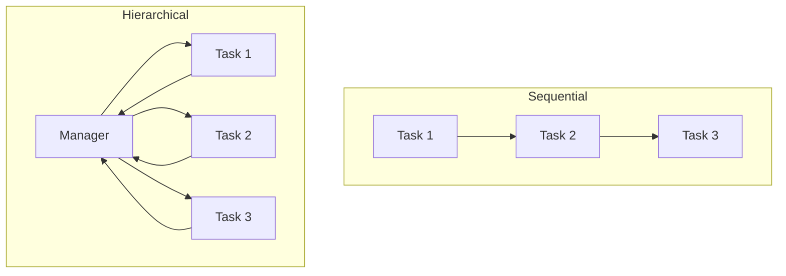
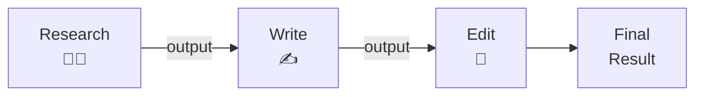
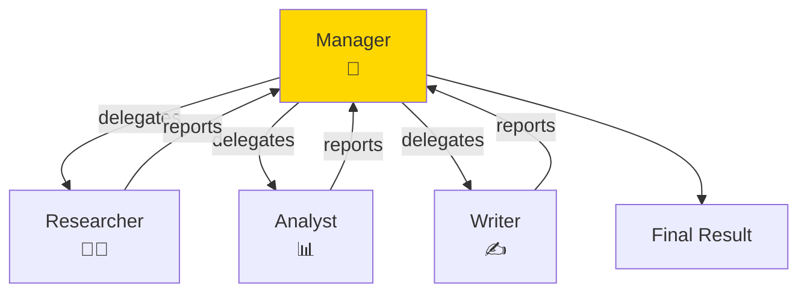
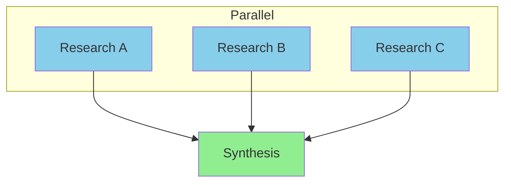
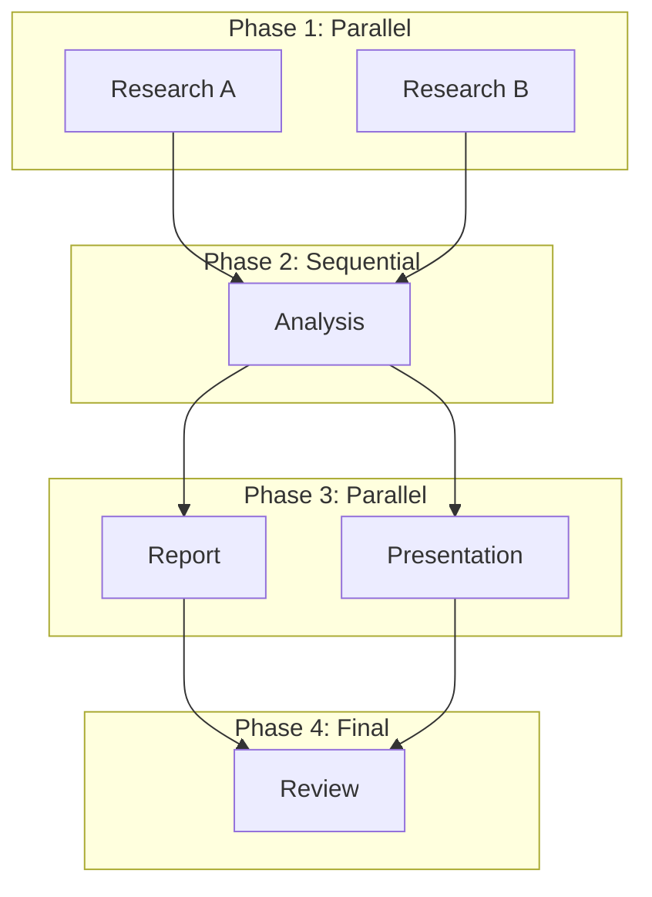
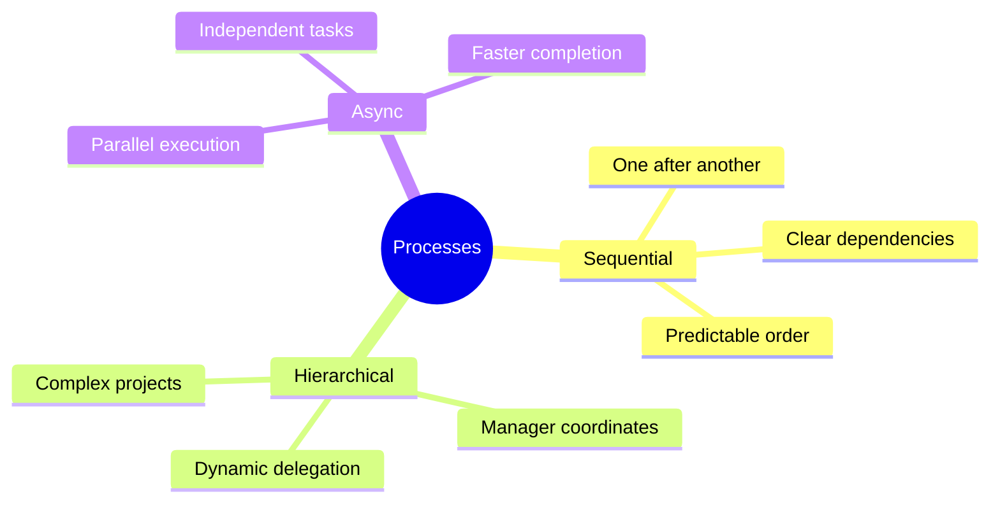

# Sequential and Parallel Processes in CrewAI

How do your tasks execute? CrewAI supports different process types: sequential (one after another) and hierarchical (manager delegates). This guide shows you how to control task execution flow.

> **Coming from Software Engineering?** Sequential vs. parallel execution is the same tradeoff you face with any pipeline: sequential is simpler to debug and guarantees ordering, parallel is faster but requires coordination. Think of it like synchronous vs. async request handling, or a Makefile with vs. without `-j` flag. The DAG dependency concepts from build systems (Make, Bazel, Gradle) apply directly here.

---

## Process Types Overview



| Process | When to Use |
|---------|-------------|
| Sequential | Tasks depend on each other |
| Hierarchical | Manager coordinates workers |

---

## Sequential Process

Tasks execute one after another, in order:

```python
from crewai import Agent, Task, Crew, Process

# Create agents
researcher = Agent(
    role="Researcher",
    goal="Find accurate information",
    backstory="Expert researcher"
)

writer = Agent(
    role="Writer",
    goal="Create engaging content",
    backstory="Professional writer"
)

editor = Agent(
    role="Editor",
    goal="Polish content",
    backstory="Meticulous editor"
)

# Create tasks (order matters!)
task1 = Task(
    description="Research AI trends",
    expected_output="Research notes",
    agent=researcher
)

task2 = Task(
    description="Write article based on research",
    expected_output="Draft article",
    agent=writer,
    context=[task1]  # Uses task1 output
)

task3 = Task(
    description="Edit and polish the article",
    expected_output="Final article",
    agent=editor,
    context=[task2]  # Uses task2 output
)

# Create crew with sequential process
crew = Crew(
    agents=[researcher, writer, editor],
    tasks=[task1, task2, task3],
    process=Process.sequential,  # One after another
    verbose=True
)

# Run
result = crew.kickoff()
print(result)
```



---

## Hierarchical Process

A manager agent coordinates worker agents:

```python
from crewai import Agent, Task, Crew, Process

# Create worker agents
researcher = Agent(
    role="Research Specialist",
    goal="Gather comprehensive information",
    backstory="Expert at finding and synthesizing information"
)

analyst = Agent(
    role="Data Analyst",
    goal="Analyze data and find insights",
    backstory="Skilled at interpreting complex data"
)

writer = Agent(
    role="Content Writer",
    goal="Create clear, engaging content",
    backstory="Experienced technical writer"
)

# Create manager agent
manager = Agent(
    role="Project Manager",
    goal="Coordinate the team to deliver excellent results",
    backstory="""You are an experienced project manager who excels at
    delegating tasks, coordinating team members, and ensuring quality output.
    You decide which team member should handle each part of the project.""",
    allow_delegation=True  # Manager can delegate!
)

# Create tasks (manager will assign these)
research_task = Task(
    description="Research the topic of machine learning in healthcare",
    expected_output="Comprehensive research findings"
)

analysis_task = Task(
    description="Analyze the research and identify key trends",
    expected_output="Analysis report with insights"
)

writing_task = Task(
    description="Write a report combining research and analysis",
    expected_output="Final comprehensive report"
)

# Create hierarchical crew
crew = Crew(
    agents=[researcher, analyst, writer],
    tasks=[research_task, analysis_task, writing_task],
    process=Process.hierarchical,  # Manager coordinates
    manager_agent=manager,  # Specify the manager
    verbose=True
)

# Run - manager will delegate and coordinate
result = crew.kickoff()
```



---

## Using Manager LLM

Instead of a manager agent, use an LLM directly:

```python
from crewai import Crew, Process

crew = Crew(
    agents=[researcher, analyst, writer],
    tasks=[research_task, analysis_task, writing_task],
    process=Process.hierarchical,
    manager_llm="gpt-4o",  # Use LLM as manager instead of agent
    verbose=True
)
```

> **Note:** CrewAI 0.70+ may have changed this API. The `manager_llm` parameter may now require a model object (e.g., `ChatOpenAI(model="gpt-4o")`) rather than a plain string. Check the [CrewAI docs](https://docs.crewai.com) for the latest syntax.

---

## Async Task Execution

Run independent tasks in parallel:

```python
from crewai import Task

# These tasks don't depend on each other - can run in parallel
task1 = Task(
    description="Research topic A",
    expected_output="Research on A",
    agent=researcher,
    async_execution=True  # Run async
)

task2 = Task(
    description="Research topic B",
    expected_output="Research on B",
    agent=researcher,
    async_execution=True  # Run async
)

task3 = Task(
    description="Research topic C",
    expected_output="Research on C",
    agent=researcher,
    async_execution=True  # Run async
)

# This task waits for all async tasks
synthesis_task = Task(
    description="Combine all research into final report",
    expected_output="Combined report",
    agent=writer,
    context=[task1, task2, task3],  # Waits for all three
    async_execution=False  # Runs after async tasks complete
)

crew = Crew(
    agents=[researcher, writer],
    tasks=[task1, task2, task3, synthesis_task],
    process=Process.sequential
)
```



---

## Choosing the Right Process

### Use Sequential When:

```python
# Tasks have clear dependencies
# Each task needs the previous task's output
# Order matters

crew = Crew(
    agents=[...],
    tasks=[step1, step2, step3],  # Must run in order
    process=Process.sequential
)
```

**Good for:**
- Content pipelines (research → write → edit)
- Data processing (extract → transform → load)
- Review workflows (draft → review → approve)

### Use Hierarchical When:

```python
# Tasks can be delegated flexibly
# Manager can decide the best approach
# Complex coordination needed

crew = Crew(
    agents=[...],
    tasks=[...],
    process=Process.hierarchical,
    manager_agent=manager
)
```

**Good for:**
- Complex projects with many agents
- When task assignment should be dynamic
- When coordination logic is complex

---

## Mixing Approaches

Combine sequential and async for optimal flow:

```python
# Phase 1: Parallel research
research_a = Task(description="Research A", agent=researcher1, async_execution=True)
research_b = Task(description="Research B", agent=researcher2, async_execution=True)

# Phase 2: Sequential processing (waits for research)
analysis = Task(
    description="Analyze all research",
    agent=analyst,
    context=[research_a, research_b],
    async_execution=False
)

# Phase 3: Parallel outputs
report = Task(
    description="Write report",
    agent=writer,
    context=[analysis],
    async_execution=True
)

presentation = Task(
    description="Create presentation",
    agent=designer,
    context=[analysis],
    async_execution=True
)

# Phase 4: Final review (waits for outputs)
final_review = Task(
    description="Review all outputs",
    agent=editor,
    context=[report, presentation],
    async_execution=False
)
```



---

## Execution Control

### Max Iterations

```python
crew = Crew(
    agents=[...],
    tasks=[...],
    process=Process.sequential,
    max_rpm=10,  # Rate limit: max 10 requests per minute
    verbose=True
)
```

### Memory and Caching

```python
crew = Crew(
    agents=[...],
    tasks=[...],
    process=Process.sequential,
    memory=True,  # Enable memory between tasks
    cache=True,   # Cache LLM responses
    verbose=True
)
```

### Custom Execution

```python
# Kickoff with inputs
result = crew.kickoff(inputs={
    "topic": "Artificial Intelligence",
    "audience": "Business executives"
})

# Tasks can use these inputs in their descriptions
task = Task(
    description="Research {topic} for {audience}",  # Variables replaced
    expected_output="Research report",
    agent=researcher
)
```

---

## Error Handling

```python
from crewai import Crew

crew = Crew(
    agents=[researcher, writer],
    tasks=[research_task, writing_task],
    process=Process.sequential,
    verbose=True
)

try:
    result = crew.kickoff()
except Exception as e:
    print(f"Crew execution failed: {e}")
    # Handle error - maybe retry or use fallback
```

---

## Monitoring Execution

```python
# Verbose mode shows each step
crew = Crew(
    agents=[...],
    tasks=[...],
    verbose=True  # See what's happening
)

# Or verbose level 2 for more detail
# > **Note:** CrewAI 0.70+ changed verbose to accept True/False only, not integer levels. Check the [CrewAI docs](https://docs.crewai.com) for the latest syntax.
crew = Crew(
    agents=[...],
    tasks=[...],
    verbose=2
)
```

---

## Summary



---

## Quick Reference

```python
# Sequential process
crew = Crew(
    agents=[a1, a2, a3],
    tasks=[t1, t2, t3],
    process=Process.sequential
)

# Hierarchical process
crew = Crew(
    agents=[a1, a2, a3],
    tasks=[t1, t2, t3],
    process=Process.hierarchical,
    manager_agent=manager
)

# Async tasks
task = Task(
    description="...",
    async_execution=True
)

# Run with inputs
result = crew.kickoff(inputs={"topic": "AI"})
```

---

## What's Next?

Now let's explore **AG2 (formerly Microsoft AutoGen)** - another powerful framework for multi-agent conversations!
