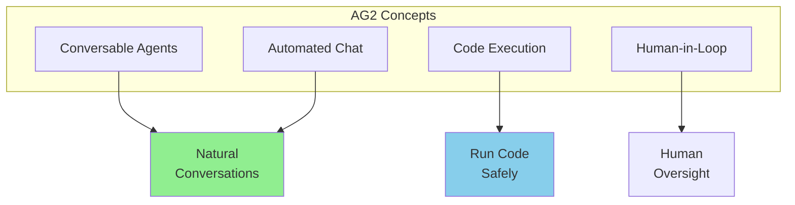
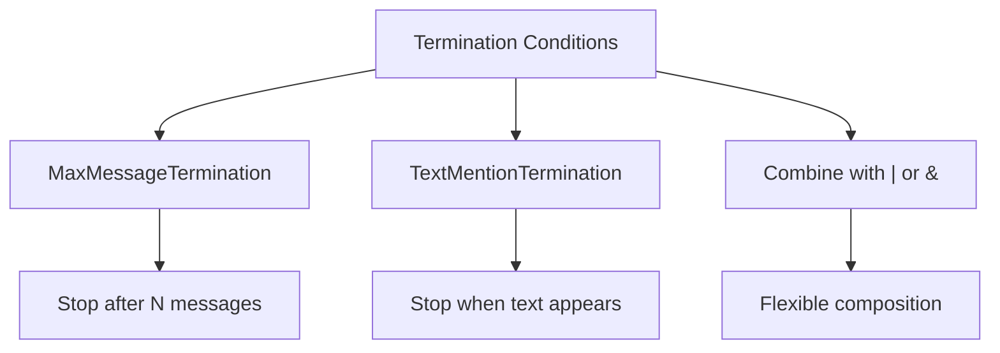
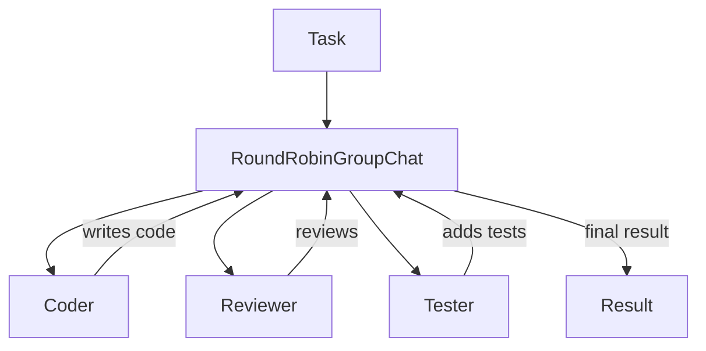
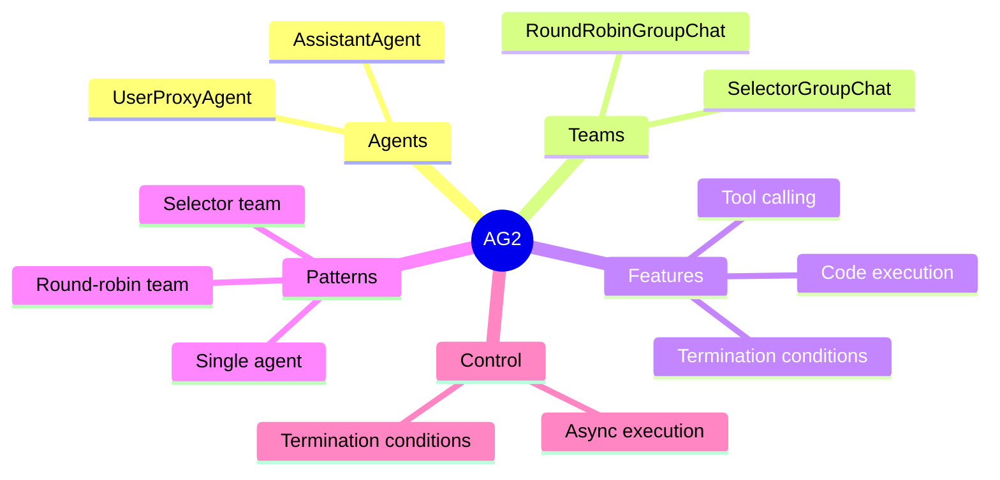

# Code-Execution Frameworks: AG2 (formerly Microsoft AutoGen)

> **Naming Note:** Microsoft's AutoGen framework was forked and continued as **AG2** (AutoGen 0.4+). This course uses the AG2 packages (`autogen-agentchat`, `autogen-ext`). If you see references to "AutoGen" in other resources, they may refer to the older 0.2.x API which is incompatible.

AG2 (the community-driven rewrite of AutoGen) is a framework for building **conversational AI agents** that can write and execute code. It excels at programming tasks and collaborative problem-solving.

> **Coming from Software Engineering?** AG2's agent conversations work like inter-process communication (IPC) — agents send messages back and forth in a structured protocol, each processing the other's output. If you've built chatbot systems, pub/sub architectures, or even actors (Akka, Erlang), the communication model will be familiar. The key difference: the "processing logic" inside each agent is an LLM call rather than deterministic code.

---

## What is AG2?



Key features:
- **Conversational agents** that chat naturally
- **Built-in code execution** with sandboxing
- **Flexible human involvement**
- **Multi-agent orchestration**

---

## Installation

```bash
pip install autogen-agentchat autogen-ext
```

---

## Core Concepts

### 1. AssistantAgent

The AI agent that generates responses and code:

```python
from autogen_agentchat.agents import AssistantAgent
from autogen_ext.models.openai import OpenAIChatCompletionClient

model_client = OpenAIChatCompletionClient(model="gpt-4o")

assistant = AssistantAgent(
    name="assistant",
    model_client=model_client,
    system_message="""You are a helpful AI assistant.
    When asked to write code, provide complete, working solutions.
    Explain your reasoning clearly."""
)
```

### 2. UserProxyAgent

Represents the user and can execute code:

```python
from autogen_agentchat.agents import UserProxyAgent

user_proxy = UserProxyAgent(
    name="user_proxy",
)
```

### 3. Running a Task

```python
import asyncio

# Run a single agent task
result = asyncio.run(assistant.run(task="Write a Python function to calculate fibonacci numbers"))
print(result.messages)
```

---

## Termination Conditions

AG2 uses explicit termination condition objects instead of lambda callbacks:



```python
from autogen_agentchat.conditions import MaxMessageTermination, TextMentionTermination

# Stop after 10 messages
max_termination = MaxMessageTermination(max_messages=10)

# Stop when "TERMINATE" appears
text_termination = TextMentionTermination("TERMINATE")

# Combine: stop when either condition is met
termination = max_termination | text_termination
```

---

## Code Execution

AG2 can execute generated code safely:

```python
from autogen_agentchat.agents import AssistantAgent
from autogen_ext.models.openai import OpenAIChatCompletionClient
from autogen_agentchat.conditions import TextMentionTermination, MaxMessageTermination
from autogen_agentchat.teams import RoundRobinGroupChat
import asyncio

model_client = OpenAIChatCompletionClient(model="gpt-4o")

assistant = AssistantAgent(
    name="assistant",
    model_client=model_client,
    system_message="""You are a helpful AI assistant.
    Write complete, working Python code.
    When done, say TERMINATE."""
)

termination = TextMentionTermination("TERMINATE") | MaxMessageTermination(max_messages=10)
team = RoundRobinGroupChat(
    participants=[assistant],
    termination_condition=termination,
)

# The assistant writes code and the team orchestrates the conversation
result = asyncio.run(team.run(task="""Create a Python script that:
    1. Generates 100 random numbers
    2. Calculates mean and standard deviation
    3. Creates a histogram and saves it as 'histogram.png'
    """))

for msg in result.messages:
    print(msg.content)
```

---

## Multi-Agent Conversations

### Team-Based Chat (replaces GroupChat)

```python
from autogen_agentchat.agents import AssistantAgent
from autogen_agentchat.teams import RoundRobinGroupChat
from autogen_agentchat.conditions import TextMentionTermination, MaxMessageTermination
from autogen_ext.models.openai import OpenAIChatCompletionClient
import asyncio

model_client = OpenAIChatCompletionClient(model="gpt-4o")

# Define agents
coder = AssistantAgent(
    name="coder",
    model_client=model_client,
    system_message="You are a Python developer. Write clean, efficient code."
)

reviewer = AssistantAgent(
    name="reviewer",
    model_client=model_client,
    system_message="You are a code reviewer. Review code for bugs and improvements."
)

tester = AssistantAgent(
    name="tester",
    model_client=model_client,
    system_message="You are a QA engineer. Write tests for the code."
)

# Create a team (replaces GroupChat + GroupChatManager)
termination = MaxMessageTermination(max_messages=20)
team = RoundRobinGroupChat(
    participants=[coder, reviewer, tester],
    termination_condition=termination,
)

# Start the group conversation
result = asyncio.run(team.run(task="Create a function to validate email addresses with tests"))
```



### SelectorGroupChat (LLM-Based Speaker Selection)

```python
from autogen_agentchat.teams import SelectorGroupChat

# SelectorGroupChat uses an LLM to pick the next speaker dynamically
team = SelectorGroupChat(
    participants=[coder, reviewer, tester],
    model_client=model_client,
    termination_condition=MaxMessageTermination(max_messages=20),
)

result = asyncio.run(team.run(task="Create a function to validate email addresses with tests"))
```

---

## Tool Calling

Register tools that agents can use:

```python
from autogen_agentchat.agents import AssistantAgent
from autogen_ext.models.openai import OpenAIChatCompletionClient
import asyncio

# Define tool functions
def get_weather(city: str) -> str:
    """Get weather for a city."""
    return f"Weather in {city}: 72°F, Sunny"

def search_web(query: str) -> str:
    """Search the web."""
    return f"Search results for '{query}': [relevant results]"

model_client = OpenAIChatCompletionClient(model="gpt-4o")

# In AG2, tools are passed directly to the agent
assistant = AssistantAgent(
    name="assistant",
    model_client=model_client,
    tools=[get_weather, search_web],
    system_message="You are a helpful assistant. Use the available tools to answer questions."
)

result = asyncio.run(assistant.run(task="What's the weather in Tokyo?"))
print(result.messages)
```

---

## Conversation Patterns

### Single Agent Task

```python
# Run a single agent
result = asyncio.run(assistant.run(task="Hello!"))
```

### Sequential Teams

```python
# Chain of team runs
import asyncio

async def sequential_workflow():
    # First team run
    result1 = await research_team.run(task="Research topic X")

    # Second team run using first result
    summary = result1.messages[-1].content
    result2 = await writing_team.run(task=f"Write about this: {summary}")

    return result2

result = asyncio.run(sequential_workflow())
```

---

## Complete Example: Coding Assistant

```python
from autogen_agentchat.agents import AssistantAgent
from autogen_agentchat.teams import RoundRobinGroupChat
from autogen_agentchat.conditions import TextMentionTermination, MaxMessageTermination
from autogen_ext.models.openai import OpenAIChatCompletionClient
import asyncio

model_client = OpenAIChatCompletionClient(model="gpt-4o")

# Create coding assistant
coder = AssistantAgent(
    name="coder",
    model_client=model_client,
    system_message="""You are a senior Python developer.
    When writing code:
    1. Include detailed comments
    2. Handle edge cases
    3. Write clean, readable code
    4. Suggest improvements

    After completing code, say TERMINATE."""
)

# Create a team with termination
termination = TextMentionTermination("TERMINATE") | MaxMessageTermination(max_messages=10)
team = RoundRobinGroupChat(
    participants=[coder],
    termination_condition=termination,
)

# Run the coding task
result = asyncio.run(team.run(task="""Create a Python class for a simple todo list that:
    1. Can add tasks with priority (1-5)
    2. Can mark tasks as complete
    3. Can list tasks sorted by priority
    4. Can save/load from JSON file

    Include example usage at the end.
    """))

for msg in result.messages:
    print(msg.content)
```

---

## Summary



---

## Quick Reference

```python
from autogen_agentchat.agents import AssistantAgent
from autogen_agentchat.teams import RoundRobinGroupChat
from autogen_agentchat.conditions import MaxMessageTermination, TextMentionTermination
from autogen_ext.models.openai import OpenAIChatCompletionClient
import asyncio

# Model client (replaces config_list)
model_client = OpenAIChatCompletionClient(model="gpt-4o")

# Basic setup
assistant = AssistantAgent(name="assistant", model_client=model_client)

# Run single agent
result = asyncio.run(assistant.run(task="Your task here"))

# Team chat (replaces GroupChat + GroupChatManager)
termination = MaxMessageTermination(max_messages=10)
team = RoundRobinGroupChat(
    participants=[agent1, agent2],
    termination_condition=termination,
)
result = asyncio.run(team.run(task="Task for the team"))
```

---

## What's Next?

Now let's learn about **Human-in-the-Loop (HITL)** - keeping humans in control of agent decisions!
