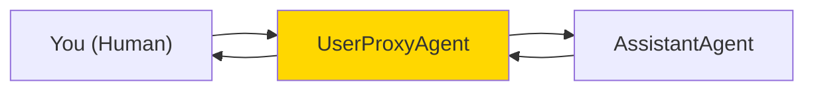
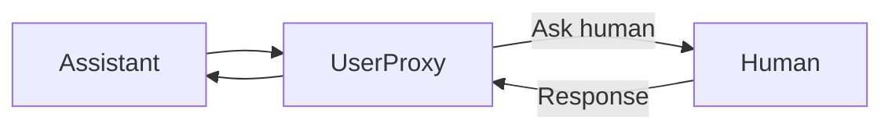
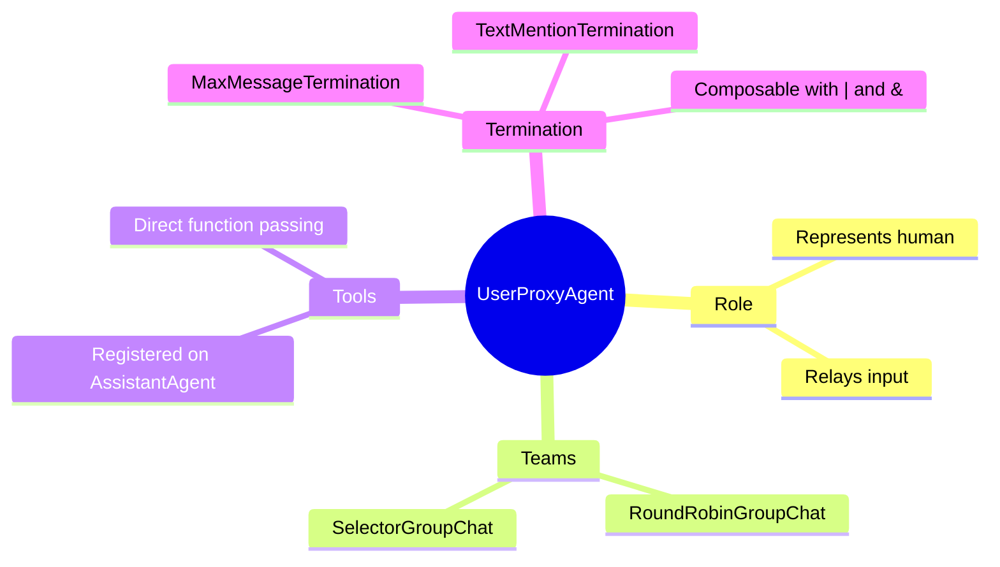

# User Proxy Agents in AG2

The UserProxyAgent is your representative in the conversation - it can execute code, ask for your input, and interact with AI agents on your behalf.

> **Coming from Software Engineering?** A UserProxyAgent is literally the proxy pattern from GoF design patterns — it stands in for you (the real subject) and forwards requests. It's like an API gateway that can either auto-respond (execute code, return cached results) or escalate to the human (you) when it hits something it can't handle. If you've built webhook receivers or Slack bots that sometimes need human approval, you've built a simpler version of this.

---

## What is a UserProxyAgent?



The UserProxyAgent:
- Represents you in the conversation
- Can execute code that AI writes
- Can ask for your input
- Can automatically reply or wait for you

---

## Basic UserProxyAgent

```python
from autogen_agentchat.agents import AssistantAgent, UserProxyAgent
from autogen_agentchat.teams import RoundRobinGroupChat
from autogen_agentchat.conditions import MaxMessageTermination, TextMentionTermination
from autogen_ext.models.openai import OpenAIChatCompletionClient
import asyncio

model_client = OpenAIChatCompletionClient(model="gpt-4o")

# Create assistant
assistant = AssistantAgent(
    name="assistant",
    model_client=model_client,
)

# Create user proxy (represents the human in the conversation)
user_proxy = UserProxyAgent(
    name="user_proxy",
)

# Create a team and run the task
termination = TextMentionTermination("TERMINATE") | MaxMessageTermination(max_messages=10)
team = RoundRobinGroupChat(
    participants=[user_proxy, assistant],
    termination_condition=termination,
)

result = asyncio.run(team.run(task="Write a Python function to check if a number is prime"))
```

---

## Human Input in AG2

In AG2, UserProxyAgent prompts the human for input during team runs. The agent participates in the team conversation and relays human messages to other agents.



```python
from autogen_agentchat.agents import UserProxyAgent

# UserProxyAgent will prompt the human via stdin during the run
user_proxy = UserProxyAgent(
    name="user",
)
```

---

## Termination Conditions

In AG2, termination is handled by condition objects rather than per-agent config:

```python
from autogen_agentchat.conditions import (
    MaxMessageTermination,
    TextMentionTermination,
)

# Stop after a fixed number of messages
max_msg = MaxMessageTermination(max_messages=10)

# Stop when "DONE" appears in a message
text_stop = TextMentionTermination("DONE")

# Combine conditions (either triggers termination)
termination = max_msg | text_stop
```

---

## Tool Calling with UserProxy

In AG2, tools are registered directly on the AssistantAgent rather than through a function map:

```python
from autogen_agentchat.agents import AssistantAgent
from autogen_ext.models.openai import OpenAIChatCompletionClient
import asyncio

# Define functions
def get_weather(city: str) -> str:
    """Get weather for a city."""
    return f"Weather in {city}: 72°F, sunny"

def calculate(expression: str) -> str:
    """Calculate a math expression safely (no eval!)."""
    import ast, operator
    try:
        def safe_eval(node):
            if isinstance(node, ast.Constant): return node.value
            elif isinstance(node, ast.BinOp):
                ops = {ast.Add: operator.add, ast.Sub: operator.sub,
                       ast.Mult: operator.mul, ast.Div: operator.truediv}
                return ops[type(node.op)](safe_eval(node.left), safe_eval(node.right))
            elif isinstance(node, ast.UnaryOp) and isinstance(node.op, ast.USub):
                return -safe_eval(node.operand)
            raise ValueError("Unsupported expression")
        return str(safe_eval(ast.parse(expression, mode='eval').body))
    except Exception:
        return "Error in calculation"

model_client = OpenAIChatCompletionClient(model="gpt-4o")

# Create assistant with tools registered directly
assistant = AssistantAgent(
    name="assistant",
    model_client=model_client,
    tools=[get_weather, calculate],
    system_message="You are a helpful assistant. Use tools to answer questions."
)

# Now the assistant can call these tools directly
result = asyncio.run(assistant.run(
    task="What's the weather in Tokyo and what's 15% of 230?"
))
print(result.messages)
```

---

## Complete Example: Interactive Coding Assistant

```python
from autogen_agentchat.agents import AssistantAgent, UserProxyAgent
from autogen_agentchat.teams import RoundRobinGroupChat
from autogen_agentchat.conditions import TextMentionTermination, MaxMessageTermination
from autogen_ext.models.openai import OpenAIChatCompletionClient
import asyncio

model_client = OpenAIChatCompletionClient(model="gpt-4o")

# Create coding assistant
coder = AssistantAgent(
    name="coder",
    model_client=model_client,
    system_message="""You are a helpful coding assistant.
    Write clean, well-commented Python code.
    Always explain your code.
    When you're done, say 'TERMINATE'."""
)

# Create user proxy for human interaction
user = UserProxyAgent(
    name="user",
)

# Create a team with termination conditions
termination = TextMentionTermination("TERMINATE") | MaxMessageTermination(max_messages=10)
team = RoundRobinGroupChat(
    participants=[user, coder],
    termination_condition=termination,
)

# Interactive session
print("Starting coding session. The assistant will write and execute code.")
print("You'll be asked for input during the conversation.")
print("-" * 50)

result = asyncio.run(team.run(task="""Create a Python script that:
    1. Generates 50 random numbers between 1 and 100
    2. Calculates mean, median, and standard deviation
    3. Creates a histogram and saves it as 'histogram.png'
    4. Prints a summary of the statistics"""))
```

---

## Multiple Agents in Teams

Different agents for different roles:

```python
from autogen_agentchat.agents import AssistantAgent, UserProxyAgent
from autogen_agentchat.teams import SelectorGroupChat
from autogen_agentchat.conditions import MaxMessageTermination
from autogen_ext.models.openai import OpenAIChatCompletionClient
import asyncio

model_client = OpenAIChatCompletionClient(model="gpt-4o")

# Technical agent
tech_agent = AssistantAgent(
    name="tech_agent",
    model_client=model_client,
    system_message="You are a technical expert. Write and explain code."
)

# Review agent
review_agent = AssistantAgent(
    name="reviewer",
    model_client=model_client,
    system_message="You are a code reviewer. Review code for quality and correctness."
)

# Human proxy for approval
human = UserProxyAgent(
    name="admin",
)

# SelectorGroupChat lets the LLM choose who speaks next
termination = MaxMessageTermination(max_messages=15)
team = SelectorGroupChat(
    participants=[human, tech_agent, review_agent],
    model_client=model_client,
    termination_condition=termination,
)

result = asyncio.run(team.run(task="Build a REST API endpoint for user registration"))
```

---

## Summary



---

## Quick Reference

```python
from autogen_agentchat.agents import AssistantAgent, UserProxyAgent
from autogen_agentchat.teams import RoundRobinGroupChat
from autogen_agentchat.conditions import MaxMessageTermination, TextMentionTermination
from autogen_ext.models.openai import OpenAIChatCompletionClient
import asyncio

model_client = OpenAIChatCompletionClient(model="gpt-4o")

# Basic user proxy
user = UserProxyAgent(name="user")

# Assistant with tools
assistant = AssistantAgent(
    name="assistant",
    model_client=model_client,
    tools=[my_tool_function],
)

# Team with termination
termination = TextMentionTermination("DONE") | MaxMessageTermination(max_messages=10)
team = RoundRobinGroupChat(
    participants=[user, assistant],
    termination_condition=termination,
)
result = asyncio.run(team.run(task="Your task here"))
```

---

## What's Next?

Now let's learn about **Code Execution Environments** - setting up safe places for agents to run code!
