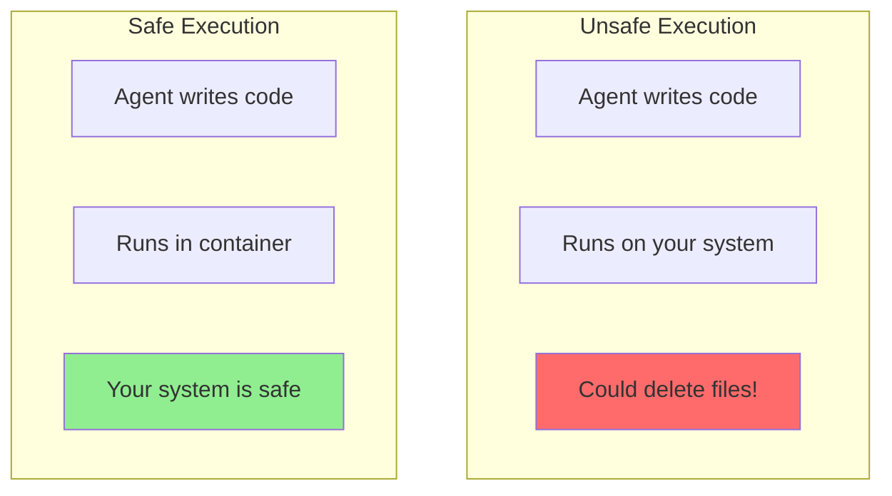
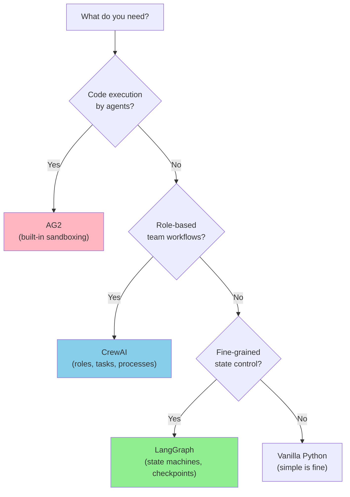
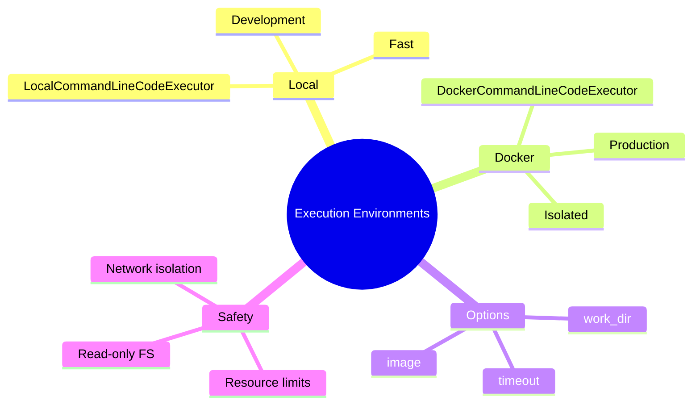

# Code Execution Environments in AG2

When agents write code, they need somewhere safe to run it. This guide shows you how to set up local and containerized execution environments.

> **Coming from Software Engineering?** This is sandboxing — the same concept behind Docker containers, chroot jails, and CI runners. You never run untrusted code on the host machine. If you've set up GitHub Actions runners, Jenkins agents in Docker, or any kind of sandbox for user-submitted code (like a coding challenge platform), you already understand the security model. The new wrinkle: the "untrusted code" is written by an LLM, which makes it even less predictable than user input.

---

## Why Execution Environments Matter



Risks of uncontrolled execution:
- File system damage
- Resource exhaustion
- Network abuse
- Security vulnerabilities

### Choosing a Framework

After seeing LangGraph (Phase 3), CrewAI, and AG2, you may wonder which to pick:



| Framework | Strength | Weakness | Use When |
|-----------|----------|----------|----------|
| **LangGraph** | State control, debugging, persistence | Steeper learning curve | Complex workflows needing checkpoints |
| **CrewAI** | Quick multi-agent setup, role definitions | Less flexible routing | Team-based tasks with clear roles |
| **AG2** | Code execution, conversation patterns | API churn, less control | Agents that write and run code |
| **Vanilla Python** | Full control, no dependencies | More boilerplate | Simple agents, learning, production |

---

## AG2 Code Executors

AG2 provides dedicated code executor classes instead of embedding execution config in the agent. The two main executors are `LocalCommandLineCodeExecutor` and `DockerCommandLineCodeExecutor`.

### Local Execution (Development)

For development and trusted code:

```python
from autogen_ext.code_executors.local import LocalCommandLineCodeExecutor

# Create a local executor with a working directory and timeout
executor = LocalCommandLineCodeExecutor(
    work_dir="workspace",
    timeout=60,  # Max 60 seconds per execution
)
```

### Using an Executor with an Agent

```python
from autogen_agentchat.agents import AssistantAgent
from autogen_ext.models.openai import OpenAIChatCompletionClient
from autogen_ext.code_executors.local import LocalCommandLineCodeExecutor
import asyncio

model_client = OpenAIChatCompletionClient(model="gpt-4o")

executor = LocalCommandLineCodeExecutor(work_dir="workspace")

# The AssistantAgent can be given a code executor
coding_agent = AssistantAgent(
    name="coder",
    model_client=model_client,
    system_message="You are a Python expert. Write code and explain it.",
)

result = asyncio.run(coding_agent.run(
    task="Write a script that creates a CSV file with sample data"
))
```

### Work Directory Setup

```python
import os

# Create dedicated workspace
workspace = "agent_workspace"
os.makedirs(workspace, exist_ok=True)

executor = LocalCommandLineCodeExecutor(work_dir=workspace)

# Files created by agent will be in ./agent_workspace/
```

---

## Docker Execution (Production)

Isolated container for safety:

```python
from autogen_ext.code_executors.docker import DockerCommandLineCodeExecutor

# Docker-based execution
executor = DockerCommandLineCodeExecutor(
    image="python:3.10-slim",
    work_dir="workspace",
    timeout=120,
)
```

### Custom Docker Image

Create a Dockerfile for your needs:

```dockerfile
# Dockerfile.ag2
FROM python:3.10-slim

# Install common packages
RUN pip install --no-cache-dir \
    numpy \
    pandas \
    matplotlib \
    requests \
    scikit-learn

# Create non-root user
RUN useradd -m -s /bin/bash agent
USER agent

WORKDIR /workspace
```

Build and use:

```bash
docker build -t ag2-executor:latest -f Dockerfile.ag2 .
```

```python
executor = DockerCommandLineCodeExecutor(
    image="ag2-executor:latest",
    work_dir="workspace",
)
```

---

## Execution Configuration Options

```python
from autogen_ext.code_executors.local import LocalCommandLineCodeExecutor
from autogen_ext.code_executors.docker import DockerCommandLineCodeExecutor

# Local executor with timeout
local_executor = LocalCommandLineCodeExecutor(
    work_dir="workspace",
    timeout=60,  # Seconds before timeout
)

# Docker executor with full options
docker_executor = DockerCommandLineCodeExecutor(
    image="python:3.10-slim",
    work_dir="workspace",
    timeout=60,
)
```

---

## Handling Execution Results

```python
from autogen_agentchat.agents import AssistantAgent
from autogen_agentchat.teams import RoundRobinGroupChat
from autogen_agentchat.conditions import TextMentionTermination, MaxMessageTermination
from autogen_ext.models.openai import OpenAIChatCompletionClient
import asyncio

model_client = OpenAIChatCompletionClient(model="gpt-4o")

assistant = AssistantAgent(
    name="coder",
    model_client=model_client,
    system_message="You are a Python expert. Write code and explain it. Say TERMINATE when done."
)

termination = TextMentionTermination("TERMINATE") | MaxMessageTermination(max_messages=10)
team = RoundRobinGroupChat(
    participants=[assistant],
    termination_condition=termination,
)

# The conversation handles execution results automatically
# Assistant sees:
# - Code execution output
# - Error messages
# - File creation confirmations

result = asyncio.run(team.run(
    task="Write a script that creates a CSV file with sample data"
))

# Check workspace for created files
import os
print("Created files:", os.listdir("workspace"))
```

---

## Language Support

AG2 can execute multiple languages via different Docker images:

```python
from autogen_ext.code_executors.docker import DockerCommandLineCodeExecutor

# Python (default)
python_executor = DockerCommandLineCodeExecutor(
    image="python:3.10",
    work_dir="workspace",
)

# Multiple languages with appropriate image
multi_executor = DockerCommandLineCodeExecutor(
    image="jupyter/datascience-notebook",  # Python, R, Julia
    work_dir="workspace",
)
```

---

## Persistent State Between Executions

Files persist within a workspace:

```python
from autogen_agentchat.agents import AssistantAgent
from autogen_agentchat.teams import RoundRobinGroupChat
from autogen_agentchat.conditions import TextMentionTermination, MaxMessageTermination
from autogen_ext.models.openai import OpenAIChatCompletionClient
import asyncio

model_client = OpenAIChatCompletionClient(model="gpt-4o")

assistant = AssistantAgent(
    name="assistant",
    model_client=model_client,
    system_message="You are a helpful coding assistant. Say TERMINATE when done."
)

termination = TextMentionTermination("TERMINATE") | MaxMessageTermination(max_messages=5)

# First run - create file
team = RoundRobinGroupChat(participants=[assistant], termination_condition=termination)
asyncio.run(team.run(task="Create a file called 'data.txt' with the text 'Hello World'"))

# Second run - read file (file persists in the workspace!)
team2 = RoundRobinGroupChat(participants=[assistant], termination_condition=termination)
asyncio.run(team2.run(task="Read the contents of 'data.txt' and print them"))
```

---

## Error Handling in Execution

```python
from autogen_agentchat.agents import AssistantAgent
from autogen_agentchat.teams import RoundRobinGroupChat
from autogen_agentchat.conditions import TextMentionTermination, MaxMessageTermination
from autogen_ext.models.openai import OpenAIChatCompletionClient
import asyncio

model_client = OpenAIChatCompletionClient(model="gpt-4o")

assistant = AssistantAgent(
    name="coder",
    model_client=model_client,
    system_message="""You are a Python coder.
    If code fails, analyze the error and fix it.
    Try up to 3 times to fix errors before giving up.
    Say TERMINATE when done."""
)

termination = TextMentionTermination("TERMINATE") | MaxMessageTermination(max_messages=12)
team = RoundRobinGroupChat(
    participants=[assistant],
    termination_condition=termination,
)

# If code errors, assistant sees the error and can retry
result = asyncio.run(team.run(
    task="Write code to connect to a database (it might fail, handle errors)"
))
```

---

## Resource Limits with Docker

Control CPU, memory, and more:

```python
from autogen_ext.code_executors.docker import DockerCommandLineCodeExecutor

executor = DockerCommandLineCodeExecutor(
    image="python:3.10-slim",
    work_dir="workspace",
    timeout=60,
)

# For more control, use a docker-compose setup or custom executor
```

### Using Docker Compose

```yaml
# docker-compose.yml
version: '3.8'
services:
  executor:
    image: python:3.10-slim
    volumes:
      - ./workspace:/workspace
    working_dir: /workspace
    mem_limit: 512m
    cpus: 1.0
    network_mode: none  # No network access
    read_only: true
    tmpfs:
      - /tmp:size=50M
```

---

## Custom Executor

Build your own execution environment:

```python
import subprocess
import tempfile
import os

class CustomExecutor:
    """Custom code executor with specific requirements."""

    def __init__(self, work_dir: str, timeout: int = 60):
        self.work_dir = work_dir
        self.timeout = timeout
        os.makedirs(work_dir, exist_ok=True)

    def execute(self, code: str, language: str = "python") -> dict:
        """Execute code and return results."""

        # Write code to temp file
        suffix = ".py" if language == "python" else ".sh"
        with tempfile.NamedTemporaryFile(
            mode='w',
            suffix=suffix,
            dir=self.work_dir,
            delete=False
        ) as f:
            f.write(code)
            code_file = f.name

        try:
            # Execute with timeout
            if language == "python":
                cmd = ["python", code_file]
            else:
                cmd = ["bash", code_file]

            result = subprocess.run(
                cmd,
                capture_output=True,
                text=True,
                timeout=self.timeout,
                cwd=self.work_dir
            )

            return {
                "success": result.returncode == 0,
                "stdout": result.stdout,
                "stderr": result.stderr,
                "return_code": result.returncode
            }

        except subprocess.TimeoutExpired:
            return {
                "success": False,
                "error": f"Execution timed out after {self.timeout}s"
            }
        finally:
            os.unlink(code_file)

# Usage
executor = CustomExecutor("my_workspace", timeout=30)
result = executor.execute("""
print("Hello from custom executor!")
print(2 + 2)
""")
print(result)
```

---

## Security Best Practices

### 1. Always Use Docker in Production

```python
from autogen_ext.code_executors.local import LocalCommandLineCodeExecutor
from autogen_ext.code_executors.docker import DockerCommandLineCodeExecutor

# Development only
dev_executor = LocalCommandLineCodeExecutor(work_dir="workspace")

# Production
prod_executor = DockerCommandLineCodeExecutor(
    image="python:3.10-slim",
    work_dir="workspace",
)
```

### 2. Limit Resources

```python
executor = DockerCommandLineCodeExecutor(
    image="python:3.10-slim",
    work_dir="workspace",
    timeout=60,  # Prevent infinite loops
)
```

### 3. Isolate Network

```python
# Docker run with no network
# docker run --network none ...
```

### 4. Read-Only File System

```python
# Mount as read-only where possible
# docker run --read-only ...
```

---

## Summary



---

## Quick Reference

```python
from autogen_ext.code_executors.local import LocalCommandLineCodeExecutor
from autogen_ext.code_executors.docker import DockerCommandLineCodeExecutor

# Local execution
local_executor = LocalCommandLineCodeExecutor(
    work_dir="workspace",
    timeout=60,
)

# Docker execution
docker_executor = DockerCommandLineCodeExecutor(
    image="python:3.10-slim",
    work_dir="workspace",
    timeout=60,
)
```

---

## What's Next?

Now let's explore **Human-in-the-Loop (HITL)** patterns - keeping humans in control of agent decisions!
