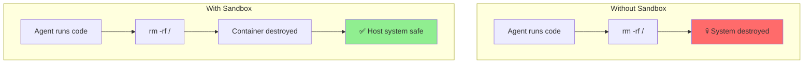
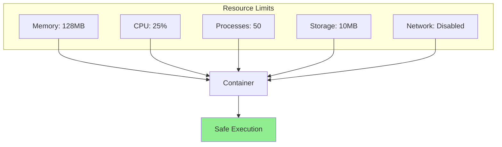

# Safe Sandboxing: Docker & API Key Security

When agents execute code, they need a safe environment. In this guide, you'll learn to sandbox agent execution with Docker and protect your API keys from exposure.

> **Coming from Software Engineering?** You already know Docker — this is using it the same way CI/CD systems do: spin up an isolated container, run untrusted code inside it, capture the output, tear it down. The difference is the "untrusted code" is generated by an LLM at runtime rather than written by a developer. Your Docker, resource limiting, and security hardening skills transfer completely.

---

## Why Sandboxing Matters



Risks of unsandboxed code execution:
- **File system access** - Delete or modify important files
- **Network access** - Make unauthorized requests
- **Resource exhaustion** - Infinite loops, memory bombs
- **Data exfiltration** - Steal sensitive information
- **Privilege escalation** - Gain system access

---

## Docker Basics for Sandboxing

Docker creates isolated containers that protect your host system:

```bash
# Install Docker (if not installed)
# macOS: brew install docker
# Ubuntu: apt install docker.io
# Windows: Download Docker Desktop

# Verify installation
docker --version
```

### Your First Sandbox

```python
import docker
import tempfile
import os

def run_code_in_sandbox(code: str, timeout: int = 30) -> dict:
    """
    Run Python code safely in a Docker container.

    Args:
        code: Python code to execute
        timeout: Maximum execution time in seconds

    Returns:
        dict with stdout, stderr, and exit code
    """

    # Initialize Docker client
    client = docker.from_env()

    # Create temp file with the code
    with tempfile.NamedTemporaryFile(mode='w', suffix='.py', delete=False) as f:
        f.write(code)
        code_file = f.name

    try:
        # Run in container
        result = client.containers.run(
            image="python:3.11-slim",
            command=f"python /code/script.py",
            volumes={
                os.path.dirname(code_file): {'bind': '/code', 'mode': 'ro'}
            },
            working_dir="/code",
            remove=True,  # Auto-remove container after execution
            timeout=timeout,
            mem_limit="256m",  # Limit memory
            network_disabled=True,  # No network access
            read_only=True,  # Read-only filesystem
        )

        return {
            "stdout": result.decode('utf-8'),
            "stderr": "",
            "exit_code": 0
        }

    except docker.errors.ContainerError as e:
        return {
            "stdout": "",
            "stderr": e.stderr.decode('utf-8') if e.stderr else str(e),
            "exit_code": e.exit_status
        }
    except docker.errors.APIError as e:
        return {
            "stdout": "",
            "stderr": str(e),
            "exit_code": -1
        }
    finally:
        os.unlink(code_file)

# Example usage
code = """
print("Hello from sandbox!")
print(2 + 2)
"""

result = run_code_in_sandbox(code)
print(f"Output: {result['stdout']}")
print(f"Exit code: {result['exit_code']}")
```

---

## Building a Secure Sandbox Image

Create a custom Docker image with security restrictions:

```dockerfile
# Dockerfile.sandbox
FROM python:3.11-slim

# Create non-root user
RUN useradd -m -s /bin/bash sandbox

# Install common packages
RUN pip install --no-cache-dir \
    numpy \
    pandas \
    matplotlib \
    requests

# Remove dangerous packages
RUN pip uninstall -y pip setuptools wheel

# Set working directory
WORKDIR /sandbox

# Switch to non-root user
USER sandbox

# Default command
CMD ["python"]
```

Build and use the image:

```bash
docker build -t sandbox:latest -f Dockerfile.sandbox .
```

```python
def run_in_secure_sandbox(code: str, timeout: int = 30) -> dict:
    """Run code in a custom secure sandbox."""

    client = docker.from_env()

    # Write code to temp file
    with tempfile.NamedTemporaryFile(mode='w', suffix='.py', delete=False) as f:
        f.write(code)
        code_file = f.name

    try:
        container = client.containers.run(
            image="sandbox:latest",  # Our custom image
            command=f"python /sandbox/script.py",
            volumes={
                os.path.dirname(code_file): {'bind': '/sandbox', 'mode': 'ro'}
            },
            detach=True,
            mem_limit="512m",
            memswap_limit="512m",  # No swap
            cpu_period=100000,
            cpu_quota=50000,  # 50% of one CPU
            network_disabled=True,
            read_only=True,
            security_opt=["no-new-privileges"],
            cap_drop=["ALL"],  # Drop all capabilities
        )

        # Wait for completion with timeout
        result = container.wait(timeout=timeout)
        logs = container.logs()

        container.remove()

        return {
            "stdout": logs.decode('utf-8'),
            "exit_code": result['StatusCode']
        }

    except Exception as e:
        return {"error": str(e)}
    finally:
        os.unlink(code_file)
```

---

## Container Resource Limits

Prevent resource exhaustion attacks:

```python
def create_limited_container(code: str) -> dict:
    """Create container with strict resource limits."""

    client = docker.from_env()

    container_config = {
        "image": "python:3.11-slim",
        "command": ["python", "-c", code],

        # Memory limits
        "mem_limit": "128m",       # Max 128MB RAM
        "memswap_limit": "128m",   # No swap

        # CPU limits
        "cpu_period": 100000,
        "cpu_quota": 25000,        # 25% of one CPU
        "cpu_shares": 256,         # Low priority

        # Process limits
        "pids_limit": 50,          # Max 50 processes

        # Storage limits
        "read_only": True,
        "tmpfs": {"/tmp": "size=10m"},  # 10MB temp space

        # Network
        "network_disabled": True,

        # Security
        "security_opt": ["no-new-privileges"],
        "cap_drop": ["ALL"],

        # Auto cleanup
        "remove": True,
    }

    try:
        result = client.containers.run(**container_config)
        return {"output": result.decode('utf-8')}
    except docker.errors.ContainerError as e:
        return {"error": str(e)}
```



---

## Input/Output Handling

Safely pass data to and from sandboxed code:

```python
import json
import base64

class SandboxIO:
    """Handle input/output with sandboxed code."""

    def __init__(self):
        self.client = docker.from_env()

    def run_with_data(self, code: str, input_data: dict) -> dict:
        """
        Run code with input data and capture structured output.

        Args:
            code: Python code to execute
            input_data: Data to pass to the code

        Returns:
            Output data from the code
        """

        # Wrap code to handle I/O
        wrapped_code = f'''
import json
import sys

# Input data (passed from host)
INPUT_DATA = {json.dumps(input_data)}

# User code
{code}

# Capture output if 'result' variable exists
if 'result' in dir():
    print("__OUTPUT_START__")
    print(json.dumps(result))
    print("__OUTPUT_END__")
'''

        result = self._execute(wrapped_code)

        # Parse output
        if "__OUTPUT_START__" in result.get("stdout", ""):
            output_section = result["stdout"].split("__OUTPUT_START__")[1]
            output_section = output_section.split("__OUTPUT_END__")[0].strip()
            try:
                result["data"] = json.loads(output_section)
            except json.JSONDecodeError:
                result["data"] = None

        return result

    def _execute(self, code: str) -> dict:
        """Execute code in container."""

        with tempfile.NamedTemporaryFile(mode='w', suffix='.py', delete=False) as f:
            f.write(code)
            code_path = f.name

        try:
            output = self.client.containers.run(
                image="python:3.11-slim",
                command=["python", "/code/script.py"],
                volumes={os.path.dirname(code_path): {'bind': '/code', 'mode': 'ro'}},
                remove=True,
                network_disabled=True,
                mem_limit="128m"
            )
            return {"stdout": output.decode('utf-8'), "exit_code": 0}
        except docker.errors.ContainerError as e:
            return {"stderr": str(e), "exit_code": e.exit_status}
        finally:
            os.unlink(code_path)

# Example usage
sandbox = SandboxIO()

code = """
# Access input data
numbers = INPUT_DATA['numbers']

# Process
result = {
    'sum': sum(numbers),
    'average': sum(numbers) / len(numbers),
    'count': len(numbers)
}
"""

output = sandbox.run_with_data(code, {"numbers": [1, 2, 3, 4, 5]})
print(f"Result: {output.get('data')}")
# Result: {'sum': 15, 'average': 3.0, 'count': 5}
```

---
