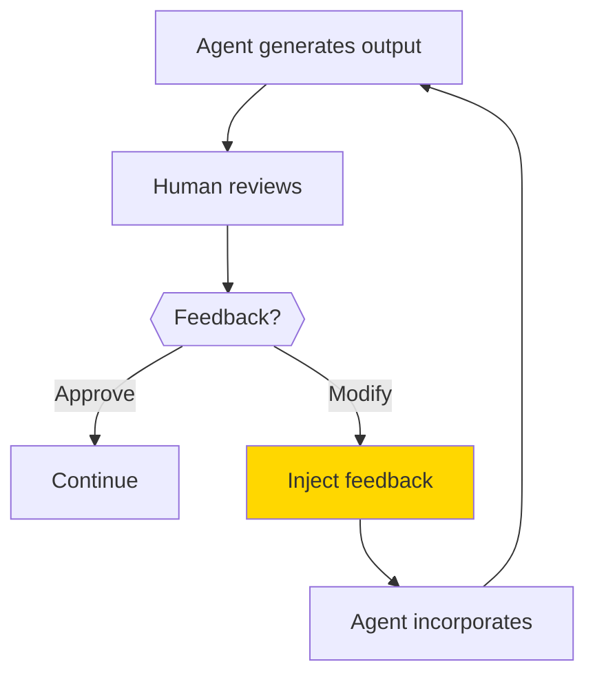
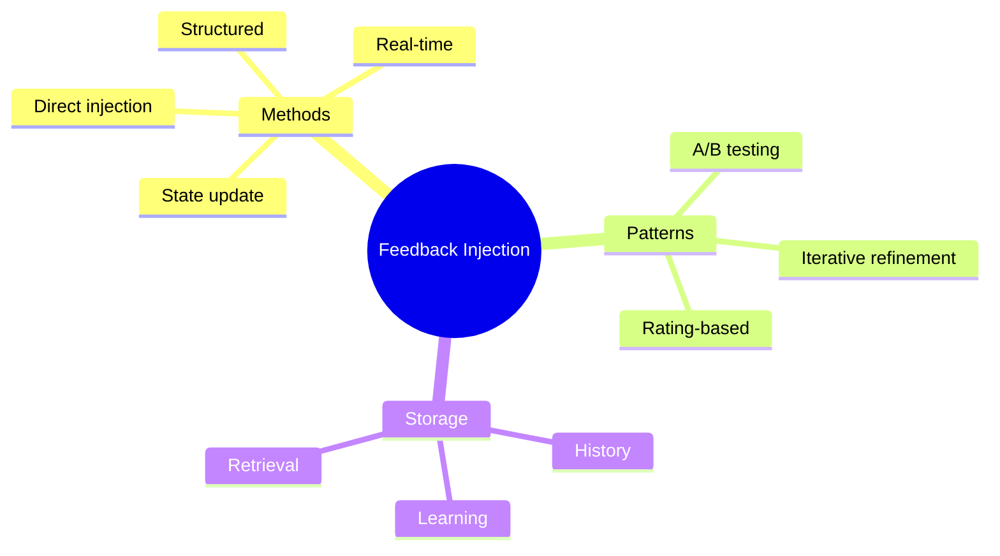

# Injecting Human Feedback into Agent State

When humans review agent work, their feedback needs to reach the agent. This guide shows you how to inject feedback back into the agent's state for improved results.

> **Coming from Software Engineering?** Feedback injection is like hot-reloading configuration in a running service. Instead of restarting the agent (re-running from scratch), you modify its state mid-execution — similar to updating a feature flag, injecting a config change via a control plane API, or pushing a code review comment that the author incorporates. The challenge is the same: how do you change behavior without corrupting existing state?

---

## The Feedback Loop



Feedback injection enables:
- Corrections to agent behavior
- Additional context
- Preference updates
- Course corrections

---

## Basic Feedback Injection

```python
from openai import OpenAI

client = OpenAI()

class FeedbackableAgent:
    """Agent that can receive and incorporate feedback."""

    def __init__(self):
        self.messages = []
        self.feedback_history = []

    def generate(self, task: str) -> str:
        """Generate output for a task."""

        # Build messages with any previous feedback
        system_content = "You are a helpful assistant."
        if self.feedback_history:
            recent_feedback = self.feedback_history[-3:]  # Last 3 feedbacks
            feedback_context = "\n".join([
                f"- {fb['feedback']}" for fb in recent_feedback
            ])
            system_content += f"\n\nPrevious feedback to incorporate:\n{feedback_context}"

        self.messages = [
            {"role": "system", "content": system_content},
            {"role": "user", "content": task}
        ]

        response = client.chat.completions.create(
            model="gpt-4o",
            messages=self.messages
        )

        return response.choices[0].message.content

    def inject_feedback(self, feedback: str, context: dict = None):
        """Inject human feedback into the agent's state."""

        self.feedback_history.append({
            "feedback": feedback,
            "context": context or {},
            "timestamp": datetime.now().isoformat()
        })

        print(f"Feedback injected: {feedback}")

    def regenerate_with_feedback(self, original_task: str, feedback: str) -> str:
        """Regenerate output incorporating specific feedback."""

        self.inject_feedback(feedback)

        enhanced_task = f"""{original_task}

Please incorporate this feedback from the reviewer:
{feedback}"""

        return self.generate(enhanced_task)

# Usage
from datetime import datetime

agent = FeedbackableAgent()

# First attempt
task = "Write a product description for a smartphone"
result1 = agent.generate(task)
print("First draft:", result1[:200])

# Human provides feedback
agent.inject_feedback("Make it more casual and fun, less corporate")

# Regenerate with feedback
result2 = agent.regenerate_with_feedback(task, "Add more emoji and excitement")
print("\nRevised:", result2[:200])
```

---

## LangGraph Feedback Injection

Inject feedback into graph state:

```python
from langgraph.graph import StateGraph, END
from langgraph.checkpoint.sqlite import SqliteSaver
from typing import TypedDict, Annotated, List
from operator import add

class AgentState(TypedDict):
    task: str
    output: str
    feedback: List[str]  # Accumulated feedback
    revision_count: int
    messages: Annotated[List, add]

def generate_output(state: AgentState) -> dict:
    """Generate output, considering any feedback."""

    task = state["task"]
    feedback_list = state.get("feedback", [])
    revision = state.get("revision_count", 0)

    # Build prompt with feedback
    prompt = f"Task: {task}"
    if feedback_list:
        prompt += f"\n\nFeedback to incorporate:\n"
        prompt += "\n".join([f"- {fb}" for fb in feedback_list])
        prompt += f"\n\nThis is revision #{revision + 1}. Address all feedback."

    # Generate (simplified - use actual LLM)
    output = f"Generated output for: {task}"
    if feedback_list:
        output += f" [incorporating {len(feedback_list)} feedback items]"

    return {
        "output": output,
        "revision_count": revision + 1,
        "messages": [f"Generated revision {revision + 1}"]
    }

def check_approval(state: AgentState) -> str:
    """Route based on approval status."""
    # This will be called after human review
    if state.get("approved", False):
        return "complete"
    return "revise"

# Build graph
workflow = StateGraph(AgentState)

workflow.add_node("generate", generate_output)
workflow.set_entry_point("generate")

workflow.add_conditional_edges(
    "generate",
    check_approval,
    {"complete": END, "revise": "generate"}
)

# Compile with checkpoint for feedback injection
checkpointer = SqliteSaver.from_conn_string("feedback.db")
app = workflow.compile(
    checkpointer=checkpointer,
    interrupt_after=["generate"]  # Pause after generation for feedback
)

# Run and inject feedback
config = {"configurable": {"thread_id": "feedback-session-1"}}

# First generation
result = app.invoke(
    {"task": "Write a blog post", "output": "", "feedback": [], "revision_count": 0, "messages": []},
    config=config
)

print(f"Output: {result['output']}")
print()

# Human reviews and provides feedback
feedback = input("Enter feedback (or 'approve' to finish): ")

if feedback.lower() != "approve":
    # Inject feedback and continue
    result = app.invoke(
        {"feedback": [feedback], "approved": False},
        config=config
    )
    print(f"Revised output: {result['output']}")
else:
    # Approve and finish
    result = app.invoke(
        {"approved": True},
        config=config
    )
    print("Approved!")
```

---

## Structured Feedback

Use structured feedback for better incorporation:

```python
from pydantic import BaseModel
from typing import List, Optional
from enum import Enum

class FeedbackType(Enum):
    CORRECTION = "correction"
    ADDITION = "addition"
    DELETION = "deletion"
    STYLE = "style"
    TONE = "tone"

class StructuredFeedback(BaseModel):
    """Structured feedback for better processing."""
    type: FeedbackType
    target: str  # What to change
    suggestion: str  # How to change it
    priority: int = 1  # 1=low, 2=medium, 3=high
    reason: Optional[str] = None

def inject_structured_feedback(
    state: dict,
    feedbacks: List[StructuredFeedback]
) -> dict:
    """Inject structured feedback into state."""

    # Sort by priority
    sorted_feedback = sorted(feedbacks, key=lambda x: x.priority, reverse=True)

    # Format for agent
    feedback_instructions = []
    for fb in sorted_feedback:
        instruction = f"[{fb.type.value.upper()}] "
        instruction += f"Change '{fb.target}' → {fb.suggestion}"
        if fb.reason:
            instruction += f" (Reason: {fb.reason})"
        feedback_instructions.append(instruction)

    state["structured_feedback"] = feedback_instructions
    return state

# Usage
feedbacks = [
    StructuredFeedback(
        type=FeedbackType.TONE,
        target="overall tone",
        suggestion="make it more friendly and casual",
        priority=3
    ),
    StructuredFeedback(
        type=FeedbackType.ADDITION,
        target="introduction",
        suggestion="add a hook question",
        priority=2
    ),
    StructuredFeedback(
        type=FeedbackType.CORRECTION,
        target="the statistic about 50%",
        suggestion="update to 65% based on new data",
        priority=3,
        reason="Data was outdated"
    )
]

state = {"output": "current output..."}
state = inject_structured_feedback(state, feedbacks)
print(state["structured_feedback"])
```

---

## Real-Time Feedback During Execution

Allow feedback injection during agent execution:

```python
import threading
import queue

class InteractiveAgent:
    """Agent that accepts real-time feedback."""

    def __init__(self):
        self.feedback_queue = queue.Queue()
        self.running = False

    def start_feedback_listener(self):
        """Start listening for feedback in background."""
        def listener():
            while self.running:
                try:
                    feedback = input()  # Or use other input method
                    self.feedback_queue.put(feedback)
                except:
                    pass

        self.running = True
        thread = threading.Thread(target=listener, daemon=True)
        thread.start()

    def check_for_feedback(self) -> list:
        """Check if any feedback has been provided."""
        feedbacks = []
        while not self.feedback_queue.empty():
            try:
                feedbacks.append(self.feedback_queue.get_nowait())
            except queue.Empty:
                break
        return feedbacks

    def run_with_feedback(self, task: str, max_steps: int = 5):
        """Run agent while accepting real-time feedback."""

        print("Agent running. Type feedback anytime...")
        self.start_feedback_listener()

        for step in range(max_steps):
            print(f"\n--- Step {step + 1} ---")

            # Check for any pending feedback
            feedbacks = self.check_for_feedback()
            if feedbacks:
                print(f"Incorporating feedback: {feedbacks}")
                # Modify behavior based on feedback

            # Execute step
            self._execute_step(task, feedbacks)

        self.running = False

    def _execute_step(self, task: str, feedbacks: list):
        """Execute one step of the agent."""
        print(f"Processing: {task}")
        if feedbacks:
            print(f"With feedback: {feedbacks}")
```

---

## Feedback Patterns

### 1. Iterative Refinement

```python
def iterative_refinement(agent, task: str, max_iterations: int = 3):
    """Refine output through multiple feedback rounds."""

    output = agent.generate(task)

    for i in range(max_iterations):
        print(f"\n=== Iteration {i + 1} ===")
        print(f"Current output:\n{output[:500]}...")

        feedback = input("\nFeedback (or 'done' to finish): ")

        if feedback.lower() == "done":
            break

        output = agent.regenerate_with_feedback(task, feedback)

    return output
```

### 2. A/B Feedback

```python
def ab_feedback(agent, task: str):
    """Generate two options and get preference feedback."""

    # Generate two versions
    version_a = agent.generate(task + " (Style: formal)")
    version_b = agent.generate(task + " (Style: casual)")

    print("Version A:\n", version_a[:300])
    print("\nVersion B:\n", version_b[:300])

    choice = input("\nPrefer A or B? ")

    if choice.upper() == "A":
        agent.inject_feedback("User prefers formal style")
        return version_a
    else:
        agent.inject_feedback("User prefers casual style")
        return version_b
```

### 3. Rating-Based Feedback

```python
def rating_feedback(agent, output: str):
    """Collect rating-based feedback."""

    criteria = ["accuracy", "clarity", "completeness", "tone"]
    ratings = {}

    print("Please rate each aspect (1-5):")
    for criterion in criteria:
        rating = input(f"  {criterion}: ")
        ratings[criterion] = int(rating)

    # Find lowest-rated aspects
    low_rated = [c for c, r in ratings.items() if r < 3]

    if low_rated:
        feedback = f"Improve these aspects: {', '.join(low_rated)}"
        agent.inject_feedback(feedback)

    return ratings
```

---

## Feedback Storage and Learning

Store feedback for long-term learning:

```python
import json
from datetime import datetime
from pathlib import Path

class FeedbackStore:
    """Store and retrieve feedback history."""

    def __init__(self, filepath: str = "feedback_history.json"):
        self.filepath = Path(filepath)
        self.history = self._load()

    def _load(self) -> list:
        if self.filepath.exists():
            return json.loads(self.filepath.read_text())
        return []

    def save(self):
        self.filepath.write_text(json.dumps(self.history, indent=2))

    def add(self, task: str, output: str, feedback: str, metadata: dict = None):
        """Add feedback entry."""
        entry = {
            "timestamp": datetime.now().isoformat(),
            "task": task,
            "output": output[:500],  # Truncate
            "feedback": feedback,
            "metadata": metadata or {}
        }
        self.history.append(entry)
        self.save()

    def get_relevant_feedback(self, task: str, limit: int = 5) -> list:
        """Get feedback relevant to a task."""
        # Simple keyword matching (use embeddings for better results)
        task_words = set(task.lower().split())

        scored = []
        for entry in self.history:
            entry_words = set(entry["task"].lower().split())
            overlap = len(task_words & entry_words)
            if overlap > 0:
                scored.append((overlap, entry))

        scored.sort(reverse=True)
        return [entry for _, entry in scored[:limit]]

# Usage
store = FeedbackStore()

# Store feedback
store.add(
    task="Write a product description",
    output="Our product is great...",
    feedback="Too generic, add specific features"
)

# Later, get relevant feedback
relevant = store.get_relevant_feedback("Write a product description for headphones")
print(f"Found {len(relevant)} relevant feedback entries")
```

---

## Summary



---

## Quick Reference

```python
# Basic injection
agent.inject_feedback("Make it shorter")
output = agent.regenerate_with_feedback(task, feedback)

# LangGraph injection
result = app.invoke({"feedback": ["new feedback"]}, config)

# Structured feedback
feedback = StructuredFeedback(
    type=FeedbackType.CORRECTION,
    target="paragraph 2",
    suggestion="fix the statistics"
)

# Store for learning
store.add(task, output, feedback)
```

---

## What's Next?

You've mastered HITL patterns! Next month, we'll explore **Evaluation & Observability** - measuring and monitoring agent performance!
