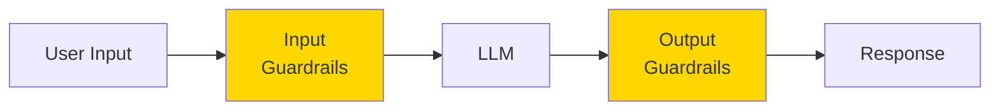
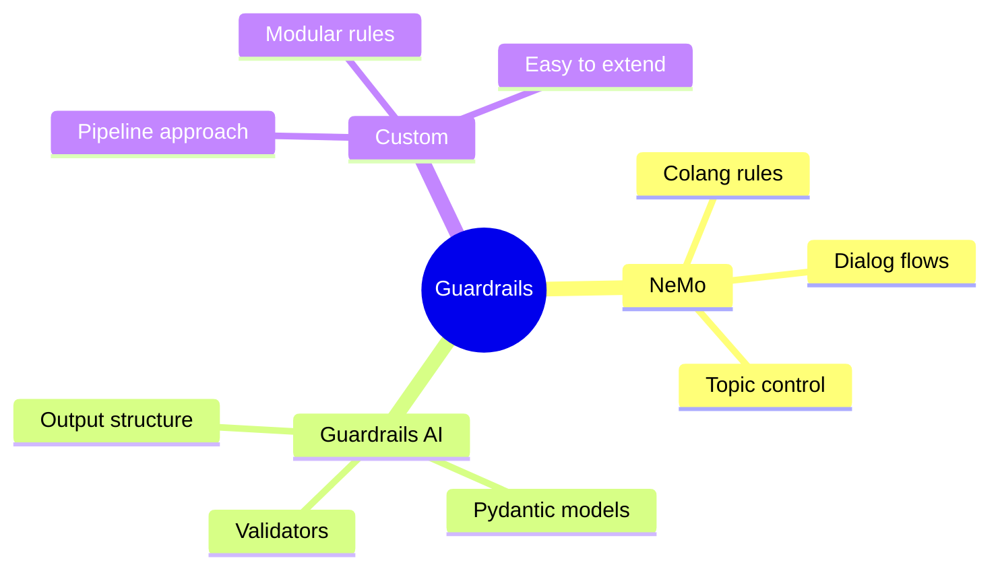

# NeMo Guardrails & Guardrails AI

Frameworks like NeMo Guardrails and Guardrails AI provide structured approaches to keeping AI systems safe and on-topic.

> **Coming from Software Engineering?** Guardrails are middleware — just like Express middleware validates requests before they hit your route handler, guardrails validate inputs and outputs before they reach the LLM or the user. If you've written request validation middleware (checking auth tokens, sanitizing input, rate limiting), you've built a simpler version of this. NeMo Guardrails adds a declarative config layer on top, similar to how WAF rules or API gateway policies work.

---

## What are Guardrails?



Guardrails provide:
- **Topic control**: Keep conversations on-topic
- **Safety filters**: Block harmful content
- **Format validation**: Ensure structured outputs
- **Action control**: Limit what agents can do

---

## NeMo Guardrails

NVIDIA's NeMo Guardrails uses a dialog-flow approach:

### Installation

```bash
pip install nemoguardrails
```

### Basic Configuration

Create a `config.yml`:

```yaml
# config.yml
models:
  - type: main
    engine: openai
    model: gpt-4o-mini

rails:
  input:
    flows:
      - check user message for harmful content
  output:
    flows:
      - check response for harmful content
```

### Defining Rails (Colang)

Create guardrails using Colang language:

```colang
# rails.co

# Define what topics are allowed
define user ask about programming
  "How do I write Python code?"
  "What is a function?"
  "Help me with JavaScript"

define user ask about harmful content
  "How do I hack..."
  "Tell me how to make..."

define bot refuse harmful request
  "I'm sorry, but I can't help with that request. Let me know if there's something else I can assist with."

define bot answer programming question
  "I'd be happy to help with your programming question!"

# Define conversation flows
define flow handle harmful request
  user ask about harmful content
  bot refuse harmful request

define flow handle programming
  user ask about programming
  bot answer programming question
```

### Using NeMo Guardrails

```python
from nemoguardrails import RailsConfig, LLMRails

# Load configuration
config = RailsConfig.from_path("./config")
rails = LLMRails(config)

# Generate with guardrails
async def safe_generate(message: str) -> str:
    response = await rails.generate_async(
        messages=[{"role": "user", "content": message}]
    )
    return response["content"]

# Usage
import asyncio

# Safe request
result = asyncio.run(safe_generate("How do I write a Python function?"))
print(result)

# Blocked request
result = asyncio.run(safe_generate("How do I hack into a system?"))
print(result)  # "I'm sorry, but I can't help with that request."
```

---

## Guardrails AI

Guardrails AI focuses on output validation and structured outputs:

### Installation

```bash
pip install guardrails-ai
```

### Basic Usage

```python
from guardrails import Guard
from guardrails.validators import (
    ValidLength,
    ToxicLanguage,
    PIIFilter,
    ReadingLevel
)

# Create a guard with validators
guard = Guard().use_many(
    ValidLength(min=10, max=500),
    ToxicLanguage(on_fail="fix"),
    PIIFilter(on_fail="fix")
)

# Validate output
result = guard.validate("This is a safe response about Python programming.")
print(f"Valid: {result.validation_passed}")
print(f"Output: {result.validated_output}")
```

### Structured Output Validation

```python
from guardrails import Guard
from pydantic import BaseModel, Field
from typing import List

class ProductInfo(BaseModel):
    name: str = Field(description="Product name")
    price: float = Field(ge=0, description="Price in dollars")
    features: List[str] = Field(min_items=1, description="Product features")

# Create guard from Pydantic model
guard = Guard.from_pydantic(ProductInfo)

# Validate LLM output
raw_output = """
{
    "name": "Widget Pro",
    "price": 29.99,
    "features": ["Durable", "Lightweight", "Easy to use"]
}
"""

result = guard.validate(raw_output)
if result.validation_passed:
    product = result.validated_output
    print(f"Product: {product['name']}")
```

### Custom Validators

```python
from guardrails.validators import Validator, register_validator
from typing import Any, Dict

@register_validator("no-competitor-mention", data_type="string")
class NoCompetitorMention(Validator):
    """Block mentions of competitor names."""

    def __init__(self, competitors: List[str], on_fail: str = "fix"):
        super().__init__(on_fail=on_fail)
        self.competitors = [c.lower() for c in competitors]

    def validate(self, value: Any, metadata: Dict) -> Any:
        lower_value = value.lower()

        for competitor in self.competitors:
            if competitor in lower_value:
                raise ValueError(f"Competitor '{competitor}' mentioned in output")

        return value

    def fix(self, value: Any, metadata: Dict) -> Any:
        result = value
        for competitor in self.competitors:
            result = result.replace(competitor, "[competitor]")
            result = result.replace(competitor.title(), "[Competitor]")
        return result

# Usage
guard = Guard().use(
    NoCompetitorMention(competitors=["microsoft", "google", "amazon"], on_fail="fix")
)

result = guard.validate("Our product is better than Microsoft's solution")
print(result.validated_output)  # "Our product is better than [Competitor]'s solution"
```

---

## Building Custom Guardrails

Create your own guardrail system:

```python
from dataclasses import dataclass
from typing import List, Callable, Optional
from enum import Enum

class GuardrailAction(Enum):
    ALLOW = "allow"
    BLOCK = "block"
    MODIFY = "modify"

@dataclass
class GuardrailResult:
    action: GuardrailAction
    output: str
    triggered_rules: List[str]
    original: str

class Guardrail:
    """Base class for guardrails."""

    def __init__(self, name: str):
        self.name = name

    def check(self, text: str) -> tuple[bool, str]:
        """Check if text passes the guardrail.

        Returns:
            (passed, modified_text_or_message)
        """
        raise NotImplementedError

class TopicGuardrail(Guardrail):
    """Keep conversation on allowed topics."""

    def __init__(self, allowed_topics: List[str], blocked_topics: List[str]):
        super().__init__("topic_control")
        self.allowed_topics = allowed_topics
        self.blocked_topics = blocked_topics

    def check(self, text: str) -> tuple[bool, str]:
        lower_text = text.lower()

        for topic in self.blocked_topics:
            if topic.lower() in lower_text:
                return False, f"Topic '{topic}' is not allowed"

        return True, text

class LengthGuardrail(Guardrail):
    """Control response length."""

    def __init__(self, max_length: int):
        super().__init__("length_control")
        self.max_length = max_length

    def check(self, text: str) -> tuple[bool, str]:
        if len(text) > self.max_length:
            return True, text[:self.max_length] + "..."
        return True, text

class ToxicityGuardrail(Guardrail):
    """Filter toxic content."""

    def __init__(self, toxic_words: List[str]):
        super().__init__("toxicity_filter")
        self.toxic_words = [w.lower() for w in toxic_words]

    def check(self, text: str) -> tuple[bool, str]:
        lower_text = text.lower()
        for word in self.toxic_words:
            if word in lower_text:
                return False, "Content flagged as potentially toxic"
        return True, text

class GuardrailPipeline:
    """Pipeline of guardrails."""

    def __init__(self):
        self.guardrails: List[Guardrail] = []

    def add(self, guardrail: Guardrail) -> "GuardrailPipeline":
        self.guardrails.append(guardrail)
        return self

    def process(self, text: str) -> GuardrailResult:
        """Process text through all guardrails."""

        current_text = text
        triggered = []

        for guardrail in self.guardrails:
            passed, result = guardrail.check(current_text)

            if not passed:
                return GuardrailResult(
                    action=GuardrailAction.BLOCK,
                    output=result,
                    triggered_rules=[guardrail.name],
                    original=text
                )

            if result != current_text:
                triggered.append(guardrail.name)
                current_text = result

        if triggered:
            return GuardrailResult(
                action=GuardrailAction.MODIFY,
                output=current_text,
                triggered_rules=triggered,
                original=text
            )

        return GuardrailResult(
            action=GuardrailAction.ALLOW,
            output=current_text,
            triggered_rules=[],
            original=text
        )

# Build pipeline
pipeline = GuardrailPipeline()
pipeline.add(TopicGuardrail(
    allowed_topics=["programming", "technology"],
    blocked_topics=["politics", "religion"]
))
pipeline.add(LengthGuardrail(max_length=500))
pipeline.add(ToxicityGuardrail(toxic_words=["hate", "violence"]))

# Process text
result = pipeline.process("Here's how to write Python code...")
print(f"Action: {result.action.value}")
print(f"Output: {result.output[:100]}...")
```

---

## Combining with Agents

```python
from openai import OpenAI

class GuardedAgent:
    """Agent with guardrails on input and output."""

    def __init__(self):
        self.client = OpenAI()
        self.input_guardrails = GuardrailPipeline()
        self.output_guardrails = GuardrailPipeline()

        # Setup input guardrails
        self.input_guardrails.add(TopicGuardrail(
            allowed_topics=["help", "question", "code"],
            blocked_topics=["hack", "illegal", "harm"]
        ))

        # Setup output guardrails
        self.output_guardrails.add(LengthGuardrail(max_length=1000))
        self.output_guardrails.add(ToxicityGuardrail(toxic_words=["dangerous"]))

    def generate(self, user_input: str) -> str:
        """Generate guarded response."""

        # Check input
        input_result = self.input_guardrails.process(user_input)
        if input_result.action == GuardrailAction.BLOCK:
            return f"I can't help with that: {input_result.output}"

        # Generate response
        response = self.client.chat.completions.create(
            model="gpt-4o-mini",
            messages=[{"role": "user", "content": input_result.output}]
        )
        raw_output = response.choices[0].message.content

        # Check output
        output_result = self.output_guardrails.process(raw_output)
        if output_result.action == GuardrailAction.BLOCK:
            return "I apologize, but I couldn't generate an appropriate response."

        return output_result.output

# Usage
agent = GuardedAgent()
print(agent.generate("How do I write a Python function?"))
```

---

## Summary



---

## Quick Reference

```python
# NeMo Guardrails
rails = LLMRails(config)
response = await rails.generate_async(messages=[...])

# Guardrails AI
guard = Guard().use(ValidLength(), ToxicLanguage())
result = guard.validate(text)

# Custom pipeline
pipeline = GuardrailPipeline()
pipeline.add(MyGuardrail())
result = pipeline.process(text)
```

---

## What's Next?

Now let's learn about **Safe Sandboxing** - containerizing agent code execution for security!
