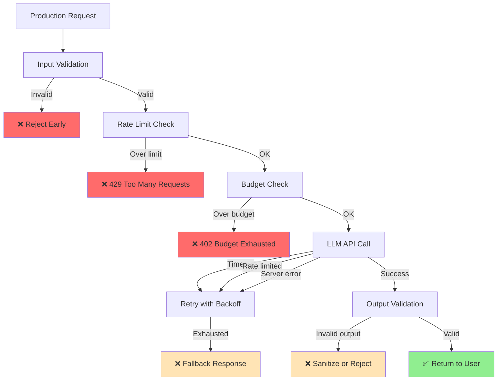

# Day 82: Production Hardening for AI Systems

You have an AI agent that works in development. It handles the happy path, it gives good answers, your demo goes perfectly. Then you deploy it.

> **Coming from Software Engineering?** This is your home turf. Production hardening for AI systems uses every technique you already know: rate limiting, circuit breakers, graceful degradation, health checks, timeout handling, input validation, and error recovery. The AI-specific additions are token budget enforcement, model fallback chains (like database read replicas), and content safety filters. If you've hardened a production API to handle 10k QPS, you'll apply 90% of the same playbook here.

Within 24 hours: an LLM API returns a 503. A user sends a 10,000 word message. The context window fills up. Someone asks it to generate malicious content. A single user makes 500 requests in a minute. Your $50/day budget evaporates by noon.

Production hardening is the gap between "it works on my machine" and "it works for 10,000 users at 3am." This is where software engineering discipline meets AI engineering reality.

---

## The Production Failure Map



Every node in that diagram is a failure mode. Let's handle each one.

---

## Pattern 1: Retry with Exponential Backoff

The LLM API will fail. Rate limits, transient server errors, timeouts — they all happen. Retry intelligently.

```python
import asyncio
import random
import logging
from functools import wraps
from openai import OpenAI, RateLimitError, APIStatusError, APIConnectionError

logger = logging.getLogger(__name__)


def retry_with_backoff(
    max_retries: int = 3,
    base_delay: float = 1.0,
    max_delay: float = 60.0,
    retryable_exceptions: tuple = (RateLimitError, APIConnectionError),
):
    """Decorator: retry on transient failures with exponential backoff + jitter."""
    def decorator(func):
        @wraps(func)
        def wrapper(*args, **kwargs):
            for attempt in range(max_retries + 1):
                try:
                    return func(*args, **kwargs)

                except retryable_exceptions as e:
                    if attempt == max_retries:
                        logger.error(
                            "All %d retries exhausted for %s: %s",
                            max_retries, func.__name__, e
                        )
                        raise

                    # Exponential backoff with full jitter
                    delay = min(base_delay * (2 ** attempt), max_delay)
                    jitter = random.uniform(0, delay * 0.1)
                    sleep_time = delay + jitter

                    logger.warning(
                        "Attempt %d/%d failed (%s). Retrying in %.1fs...",
                        attempt + 1, max_retries, type(e).__name__, sleep_time
                    )
                    import time
                    time.sleep(sleep_time)

                except APIStatusError as e:
                    # Only retry on 5xx, not 4xx (client errors are not transient)
                    if e.status_code >= 500 and attempt < max_retries:
                        delay = min(base_delay * (2 ** attempt), max_delay)
                        logger.warning("Server error %d, retrying in %.1fs", e.status_code, delay)
                        import time
                        time.sleep(delay)
                    else:
                        raise

        return wrapper
    return decorator


client = OpenAI()


@retry_with_backoff(max_retries=3, base_delay=1.0)
def resilient_completion(messages: list[dict], model: str = "gpt-4o-mini", **kwargs):
    return client.chat.completions.create(
        model=model,
        messages=messages,
        **kwargs
    )
```

---

## Pattern 2: Circuit Breaker

Retrying endlessly when a service is down makes things worse. A circuit breaker stops calls when the failure rate is too high, then gradually allows traffic back.

```python
import time
from enum import Enum
from dataclasses import dataclass, field
from threading import Lock


class CircuitState(Enum):
    CLOSED = "closed"       # Normal operation
    OPEN = "open"           # Failing, reject all calls
    HALF_OPEN = "half_open" # Testing if service recovered


@dataclass
class CircuitBreaker:
    """Circuit breaker for LLM API calls."""

    failure_threshold: int = 5        # Failures before opening
    recovery_timeout: float = 60.0    # Seconds before trying again
    success_threshold: int = 2        # Successes in HALF_OPEN to close

    _state: CircuitState = field(default=CircuitState.CLOSED, init=False)
    _failure_count: int = field(default=0, init=False)
    _success_count: int = field(default=0, init=False)
    _last_failure_time: float = field(default=0.0, init=False)
    _lock: Lock = field(default_factory=Lock, init=False)

    @property
    def state(self) -> CircuitState:
        with self._lock:
            if self._state == CircuitState.OPEN:
                if time.time() - self._last_failure_time >= self.recovery_timeout:
                    self._state = CircuitState.HALF_OPEN
                    self._success_count = 0
                    logger.info("Circuit breaker: OPEN → HALF_OPEN (testing recovery)")
            return self._state

    def call(self, func, *args, **kwargs):
        """Execute func through the circuit breaker."""
        state = self.state

        if state == CircuitState.OPEN:
            raise RuntimeError(
                "Circuit breaker OPEN: LLM API unavailable. "
                f"Retry after {self.recovery_timeout}s."
            )

        try:
            result = func(*args, **kwargs)
            self._on_success()
            return result

        except Exception as e:
            self._on_failure()
            raise

    def _on_success(self):
        with self._lock:
            if self._state == CircuitState.HALF_OPEN:
                self._success_count += 1
                if self._success_count >= self.success_threshold:
                    self._state = CircuitState.CLOSED
                    self._failure_count = 0
                    logger.info("Circuit breaker: HALF_OPEN → CLOSED (recovered)")
            elif self._state == CircuitState.CLOSED:
                self._failure_count = 0

    def _on_failure(self):
        with self._lock:
            self._failure_count += 1
            self._last_failure_time = time.time()

            if self._failure_count >= self.failure_threshold:
                self._state = CircuitState.OPEN
                logger.error(
                    "Circuit breaker: CLOSED → OPEN (%d failures)",
                    self._failure_count
                )


# Usage
circuit_breaker = CircuitBreaker(failure_threshold=5, recovery_timeout=60.0)

def protected_llm_call(messages: list[dict]) -> str:
    try:
        response = circuit_breaker.call(
            client.chat.completions.create,
            model="gpt-4o-mini",
            messages=messages,
        )
        return response.choices[0].message.content
    except RuntimeError as e:
        # Circuit open: return fallback
        return "I'm temporarily unavailable. Please try again in a minute."
```

---

## Pattern 3: Graceful Degradation

When the LLM is down, don't just fail. Have a fallback chain.

```python
from typing import Callable


class FallbackChain:
    """Try handlers in order, return first successful result."""

    def __init__(self, handlers: list[Callable], fallback_response: str):
        self.handlers = handlers
        self.fallback_response = fallback_response

    def execute(self, *args, **kwargs) -> str:
        for i, handler in enumerate(self.handlers):
            try:
                result = handler(*args, **kwargs)
                if i > 0:
                    logger.info("Used fallback handler %d", i)
                return result
            except Exception as e:
                logger.warning("Handler %d failed: %s", i, e)
                continue

        logger.error("All handlers failed, returning static fallback")
        return self.fallback_response


# Define your fallback chain
def primary_handler(query: str) -> str:
    """GPT-4o: best quality"""
    response = client.chat.completions.create(
        model="gpt-4o",
        messages=[{"role": "user", "content": query}],
    )
    return response.choices[0].message.content


def secondary_handler(query: str) -> str:
    """GPT-4o-mini: cheaper, still good"""
    response = client.chat.completions.create(
        model="gpt-4o-mini",
        messages=[{"role": "user", "content": query}],
    )
    return response.choices[0].message.content


def cached_handler(query: str) -> str:
    """Return cached response if available."""
    # Check your semantic cache here
    raise ValueError("Cache miss")  # Falls through to next handler


chain = FallbackChain(
    handlers=[primary_handler, secondary_handler, cached_handler],
    fallback_response=(
        "I'm unable to process your request right now. "
        "Please try again in a few minutes."
    ),
)
```

---

## Pattern 4: Input Validation

Validate before you spend tokens.

```python
from pydantic import BaseModel, field_validator, ValidationError


class ChatRequest(BaseModel):
    user_id: str
    message: str
    conversation_id: str | None = None

    @field_validator("user_id")
    @classmethod
    def user_id_format(cls, v):
        if not v or len(v) > 128:
            raise ValueError("user_id must be 1-128 characters")
        # Only alphanumeric and hyphens
        import re
        if not re.match(r'^[a-zA-Z0-9\-_]+$', v):
            raise ValueError("user_id contains invalid characters")
        return v

    @field_validator("message")
    @classmethod
    def message_not_empty(cls, v):
        v = v.strip()
        if not v:
            raise ValueError("message cannot be empty")
        if len(v) > 10_000:
            raise ValueError("message exceeds 10,000 character limit")
        return v


def validate_request(raw_request: dict) -> ChatRequest | tuple[None, str]:
    """Validate and return a ChatRequest, or (None, error_message)."""
    try:
        return ChatRequest(**raw_request), None
    except ValidationError as e:
        errors = "; ".join(
            f"{'.'.join(str(l) for l in err['loc'])}: {err['msg']}"
            for err in e.errors()
        )
        return None, f"Invalid request: {errors}"
```

---

## Pattern 5: Output Validation

Never send raw LLM output directly to users without checking it.

```python
import re
from pydantic import BaseModel


class OutputValidator:
    """Validate LLM outputs before returning to users."""

    # Patterns to detect and block
    SENSITIVE_PATTERNS = [
        r'\b\d{3}-\d{2}-\d{4}\b',          # SSN
        r'\b4[0-9]{12}(?:[0-9]{3})?\b',     # Visa card number
        r'\bsk-[a-zA-Z0-9]{48}\b',          # OpenAI API key
        r'\bANTHROPIC_API_KEY\b',
    ]

    MAX_OUTPUT_LENGTH = 4000

    def validate(self, output: str) -> tuple[str, list[str]]:
        """
        Validate output. Returns (cleaned_output, list_of_issues).
        """
        issues = []

        # Length check
        if len(output) > self.MAX_OUTPUT_LENGTH:
            output = output[:self.MAX_OUTPUT_LENGTH] + "...[truncated]"
            issues.append(f"Output truncated (exceeded {self.MAX_OUTPUT_LENGTH} chars)")

        # Sensitive data check
        for pattern in self.SENSITIVE_PATTERNS:
            if re.search(pattern, output):
                issues.append(f"Potential sensitive data detected (pattern: {pattern[:30]})")
                # Redact the match
                output = re.sub(pattern, "[REDACTED]", output)

        return output, issues


validator = OutputValidator()


def safe_response(raw_output: str) -> str:
    """Validate and clean an LLM response before sending to user."""
    cleaned, issues = validator.validate(raw_output)

    if issues:
        logger.warning("Output validation issues: %s", issues)

    return cleaned
```

---

## Pattern 6: Rate Limiting with Redis

In-memory rate limiting breaks when you scale to multiple servers. Use Redis.

```python
import redis
import time


class RedisRateLimiter:
    """Sliding window rate limiter backed by Redis."""

    def __init__(self, redis_client: redis.Redis, requests_per_minute: int = 20):
        self.redis = redis_client
        self.requests_per_minute = requests_per_minute
        self.window_seconds = 60

    def is_allowed(self, user_id: str) -> tuple[bool, dict]:
        """
        Check if user is within rate limit.
        Returns (allowed, metadata).
        """
        key = f"rate_limit:{user_id}"
        now = time.time()
        window_start = now - self.window_seconds

        pipe = self.redis.pipeline()
        # Remove old requests outside the window
        pipe.zremrangebyscore(key, 0, window_start)
        # Count current requests in window
        pipe.zcard(key)
        # Add this request
        pipe.zadd(key, {str(now): now})
        # Set expiry on the key
        pipe.expire(key, self.window_seconds * 2)
        _, current_count, _, _ = pipe.execute()

        allowed = current_count < self.requests_per_minute
        remaining = max(0, self.requests_per_minute - current_count - 1)

        return allowed, {
            "limit": self.requests_per_minute,
            "remaining": remaining,
            "reset_at": int(window_start + self.window_seconds),
        }


# FastAPI integration
from fastapi import HTTPException, Request


async def check_rate_limit(request: Request, user_id: str):
    """FastAPI dependency for rate limiting."""
    limiter: RedisRateLimiter = request.app.state.rate_limiter
    allowed, meta = limiter.is_allowed(user_id)

    if not allowed:
        raise HTTPException(
            status_code=429,
            detail="Rate limit exceeded",
            headers={
                "X-RateLimit-Limit": str(meta["limit"]),
                "X-RateLimit-Remaining": str(meta["remaining"]),
                "Retry-After": str(meta["reset_at"]),
            },
        )
    return meta
```

---

## Pattern 7: Timeout Management

Long-running agents must have timeouts. Users will not wait 3 minutes.

```python
import asyncio
from contextlib import asynccontextmanager


@asynccontextmanager
async def timeout_context(seconds: float, operation_name: str = "operation"):
    """Context manager that raises TimeoutError after N seconds."""
    try:
        async with asyncio.timeout(seconds):
            yield
    except asyncio.TimeoutError:
        logger.error("Timeout: %s exceeded %.1fs limit", operation_name, seconds)
        raise TimeoutError(
            f"{operation_name} timed out after {seconds}s. "
            "Please try a simpler query."
        )


async def run_agent_with_timeout(agent, task: str, timeout_seconds: float = 30.0) -> str:
    """Run an agent with a hard timeout."""
    try:
        async with timeout_context(timeout_seconds, "agent"):
            result = await agent.arun(task)
            return result
    except TimeoutError as e:
        return f"Sorry, this request took too long to process. {e}"
```

---

## Pattern 8: Health Checks and Readiness Probes

```python
from fastapi import FastAPI
from pydantic import BaseModel
import time

app = FastAPI()


class HealthStatus(BaseModel):
    status: str
    llm_available: bool
    cache_available: bool
    uptime_seconds: float
    version: str = "1.0.0"


_start_time = time.time()


@app.get("/health")
async def health_check() -> HealthStatus:
    """Liveness probe: is the app running?"""
    return HealthStatus(
        status="ok",
        llm_available=True,   # Basic check
        cache_available=True,
        uptime_seconds=time.time() - _start_time,
    )


@app.get("/ready")
async def readiness_check() -> HealthStatus:
    """Readiness probe: is the app ready to serve traffic?"""
    llm_ok = False
    cache_ok = False

    # Test LLM connectivity
    try:
        client.models.list()  # Lightweight API check
        llm_ok = True
    except Exception as e:
        logger.error("LLM readiness check failed: %s", e)

    # Test cache connectivity
    try:
        app.state.redis.ping()
        cache_ok = True
    except Exception as e:
        logger.warning("Cache readiness check failed: %s", e)

    status = "ok" if llm_ok else "degraded"

    return HealthStatus(
        status=status,
        llm_available=llm_ok,
        cache_available=cache_ok,
        uptime_seconds=time.time() - _start_time,
    )
```

---

## Pattern 9: Structured Logging

```python
import json
import logging
from datetime import datetime, timezone


class JSONFormatter(logging.Formatter):
    """Emit logs as JSON for log aggregation systems (Datadog, CloudWatch, etc.)."""

    def format(self, record: logging.LogRecord) -> str:
        log_entry = {
            "timestamp": datetime.now(timezone.utc).isoformat(),
            "level": record.levelname,
            "logger": record.name,
            "message": record.getMessage(),
            "module": record.module,
            "function": record.funcName,
            "line": record.lineno,
        }

        # Include extra fields added via logger.info(..., extra={...})
        for key, value in record.__dict__.items():
            if key not in logging.LogRecord.__dict__ and not key.startswith("_"):
                log_entry[key] = value

        return json.dumps(log_entry)


def setup_logging():
    handler = logging.StreamHandler()
    handler.setFormatter(JSONFormatter())
    logging.basicConfig(level=logging.INFO, handlers=[handler])


# What to log (and what NOT to log)
def log_llm_call(
    user_id: str,
    model: str,
    input_tokens: int,
    output_tokens: int,
    latency_ms: float,
    success: bool,
):
    """Log an LLM call with structured fields. NEVER log the actual prompt or response content."""
    logger.info(
        "llm_call",
        extra={
            "user_id": user_id,      # OK: user identifier
            "model": model,           # OK: model used
            "input_tokens": input_tokens,   # OK: metrics
            "output_tokens": output_tokens,
            "latency_ms": latency_ms,
            "success": success,
            # DO NOT LOG:
            # "prompt": prompt,       # May contain PII
            # "response": response,   # May contain sensitive data
            # "api_key": ...,         # Never log credentials
        }
    )
```

---

## The Production Hardening Checklist

```
[ ] Retry with exponential backoff on transient failures
[ ] Circuit breaker to stop hammering a failing API
[ ] Fallback chain for graceful degradation
[ ] Input validation before spending tokens
[ ] Output validation before sending to users
[ ] Redis-based rate limiting (not in-memory)
[ ] Hard timeouts on all agent runs
[ ] Health and readiness endpoints
[ ] Structured JSON logging
[ ] Per-user and global cost budgets
[ ] Sensitive data never logged
[ ] API keys in environment variables, not code
```

---

## SWE to AI Engineering Bridge

| Backend Engineering Pattern | AI System Equivalent |
|---|---|
| Retry with backoff | Same — LLM APIs have transient failures |
| Circuit breaker | Same — stop hammering a failing LLM |
| Load balancer | Route to different models under load |
| Input sanitization | Validate and truncate user messages |
| Output escaping | Sanitize LLM output before rendering |
| Rate limiting | Per-user token/request budgets |
| Health checks | Same — check LLM API connectivity |
| Structured logging | Same — but never log prompt/response content |

---

## Key Takeaways

1. **LLM APIs fail** — build retry + circuit breaker from day one
2. **Validate inputs before spending tokens** — cheap validation prevents expensive failures
3. **Never send raw LLM output to users** — validate structure and check for sensitive data
4. **Rate limiting must be distributed** — in-memory rate limiting breaks at scale
5. **All agent runs need timeouts** — users will not wait indefinitely
6. **Log metrics, not content** — token counts are useful; prompt text may be PII

---

## Practice Exercises

1. Add the `retry_with_backoff` decorator to your Day 84 FastAPI agent and verify it retries on 429 errors
2. Implement `CircuitBreaker` and write a test that opens the circuit after 5 failures
3. Build a `FallbackChain` that tries GPT-4o, falls back to GPT-4o-mini, then returns a static message
4. Add structured JSON logging to your capstone project and verify the output in a log viewer

---

**Next up:** Day 77 - HITL Patterns, where you will learn how to add human oversight and approval gates to your agent systems.
