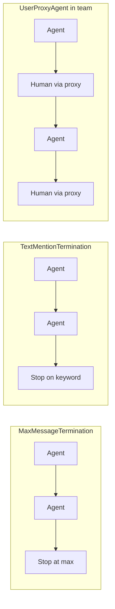
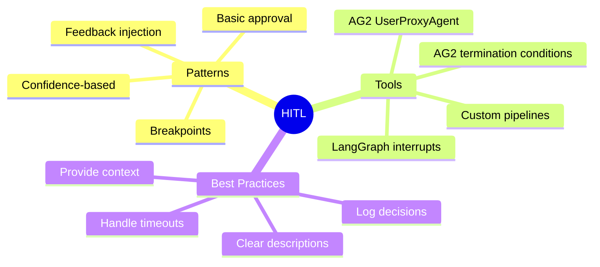

> **Coming from Software Engineering?** Multi-stage approval pipelines are exactly like promotion gates in deployment pipelines: dev -> staging -> prod, each requiring sign-off. If you've configured GitHub Actions environments with required reviewers, or set up Spinnaker deployment stages with manual judgments, this is the same pattern applied to agent workflows.

## Multi-Stage Approval Pipeline

For critical workflows, require approval at multiple stages:

```python
from typing import Callable, List, Dict, Any
from dataclasses import dataclass
from enum import Enum

class ApprovalStatus(Enum):
    PENDING = "pending"
    APPROVED = "approved"
    REJECTED = "rejected"
    NEEDS_REVISION = "needs_revision"

@dataclass
class Stage:
    name: str
    action: Callable
    requires_approval: bool = True
    approvers: List[str] = None

class ApprovalPipeline:
    """Multi-stage pipeline with human approvals."""

    def __init__(self, stages: List[Stage]):
        self.stages = stages
        self.results = {}
        self.current_stage = 0

    def run(self, initial_input: Any) -> Dict:
        """Run the pipeline with approval gates."""
        current_input = initial_input

        for i, stage in enumerate(self.stages):
            self.current_stage = i
            print(f"\n{'='*50}")
            print(f"Stage {i+1}: {stage.name}")
            print('='*50)

            # Execute stage action
            result = stage.action(current_input)
            print(f"\nOutput: {result}")

            # Check if approval needed
            if stage.requires_approval:
                status = self._get_approval(stage, result)

                if status == ApprovalStatus.REJECTED:
                    print(f"Stage '{stage.name}' rejected. Pipeline stopped.")
                    return {"status": "rejected", "stage": stage.name, "results": self.results}

                elif status == ApprovalStatus.NEEDS_REVISION:
                    revision = input("Enter revision instructions: ")
                    result = stage.action(f"{current_input}\nRevision: {revision}")
                    print(f"Revised output: {result}")

            self.results[stage.name] = result
            current_input = result

        print(f"\nPipeline completed successfully!")
        return {"status": "completed", "results": self.results}

    def _get_approval(self, stage: Stage, result: Any) -> ApprovalStatus:
        """Get human approval for a stage."""
        print(f"\nReview required for: {stage.name}")
        if stage.approvers:
            print(f"   Approvers: {', '.join(stage.approvers)}")

        print("\nOptions:")
        print("  [a] Approve")
        print("  [r] Reject")
        print("  [v] Request revision")

        while True:
            choice = input("\nYour choice: ").strip().lower()
            if choice == 'a':
                return ApprovalStatus.APPROVED
            elif choice == 'r':
                return ApprovalStatus.REJECTED
            elif choice == 'v':
                return ApprovalStatus.NEEDS_REVISION
            print("Invalid choice. Enter 'a', 'r', or 'v'")

# Example: Email drafting pipeline
def draft_email(task):
    return f"Draft email about: {task}"

def review_tone(draft):
    return f"Reviewed: {draft} [Tone: Professional]"

def add_signature(content):
    return f"{content}\n\nBest regards,\nThe Team"

pipeline = ApprovalPipeline([
    Stage("Draft", draft_email, requires_approval=True),
    Stage("Tone Review", review_tone, requires_approval=True, approvers=["manager"]),
    Stage("Finalize", add_signature, requires_approval=False)
])

# Run pipeline
result = pipeline.run("Project update for stakeholders")
```

---

## AG2 Human-in-the-Loop

AG2 has built-in HITL support through `UserProxyAgent`, which prompts the human for input during team conversations:

```python
from autogen_agentchat.agents import AssistantAgent, UserProxyAgent
from autogen_agentchat.teams import RoundRobinGroupChat
from autogen_agentchat.conditions import MaxMessageTermination, TextMentionTermination
from autogen_ext.models.openai import OpenAIChatCompletionClient
import asyncio

model_client = OpenAIChatCompletionClient(model="gpt-4o")

# Create assistant
assistant = AssistantAgent(
    name="assistant",
    model_client=model_client,
    system_message="You are a helpful assistant. Propose actions clearly."
)

# Create user proxy - prompts the human for input during the run
user_proxy = UserProxyAgent(
    name="user",
)

# Every response will pause for human review via the UserProxyAgent
termination = MaxMessageTermination(max_messages=10)
team = RoundRobinGroupChat(
    participants=[user_proxy, assistant],
    termination_condition=termination,
)

result = asyncio.run(team.run(task="Help me plan a marketing campaign"))
```

### Termination Conditions for HITL

AG2 uses composable termination condition objects instead of per-agent input modes:

```python
from autogen_agentchat.conditions import MaxMessageTermination, TextMentionTermination

# Stop after a fixed number of messages
max_msg = MaxMessageTermination(max_messages=10)

# Stop when "DONE" appears
text_stop = TextMentionTermination("DONE")

# Combine: stop when either condition is met
termination = max_msg | text_stop
```



---

## Best Practices

### 1. Clear Action Descriptions

```python
# Bad - vague
action = "do the thing"

# Good - specific and clear
action = {
    "type": "send_email",
    "recipient": "john@example.com",
    "subject": "Meeting Confirmation",
    "body": "Your meeting is confirmed for tomorrow at 2pm.",
    "impact": "Email will be sent immediately and cannot be unsent"
}
```

### 2. Provide Context

```python
def format_approval_request(action: dict, context: dict) -> str:
    """Format a clear approval request."""
    return f"""
    ACTION APPROVAL REQUEST
    ========================

    What: {action['type']}
    Details: {action['details']}

    Context:
    - Task: {context['task']}
    - Step: {context['step']} of {context['total_steps']}
    - Previous actions: {context['history']}

    Impact: {action['impact']}
    Reversible: {action['reversible']}

    ========================
    """
```

### 3. Timeout Handling

```python
import threading

def get_approval_with_timeout(action: str, timeout: int = 300) -> bool:
    """Get approval with timeout."""
    result = {"approved": None}

    def ask_human():
        response = input(f"Approve '{action}'? (yes/no): ")
        result["approved"] = response.lower() in ["yes", "y"]

    thread = threading.Thread(target=ask_human)
    thread.start()
    thread.join(timeout=timeout)

    if thread.is_alive():
        print(f"\nTimeout! No response in {timeout}s. Defaulting to reject.")
        return False

    return result["approved"]
```

---

## Summary



---

## Quick Reference

```python
# LangGraph Breakpoint
app = workflow.compile(
    checkpointer=checkpointer,
    interrupt_before=["critical_node"]
)

# AG2 Human-in-the-Loop with UserProxyAgent
from autogen_agentchat.agents import AssistantAgent, UserProxyAgent
from autogen_agentchat.teams import RoundRobinGroupChat
from autogen_agentchat.conditions import MaxMessageTermination
from autogen_ext.models.openai import OpenAIChatCompletionClient
import asyncio

model_client = OpenAIChatCompletionClient(model="gpt-4o")
user = UserProxyAgent(name="user")
assistant = AssistantAgent(name="assistant", model_client=model_client)
termination = MaxMessageTermination(max_messages=10)
team = RoundRobinGroupChat(
    participants=[user, assistant],
    termination_condition=termination,
)
result = asyncio.run(team.run(task="Your task here"))

# Confidence-based HITL
if agent_confidence < threshold:
    human_feedback = get_human_input()
```

---

## What's Next?

You've mastered multi-agent systems! Next month, we'll explore **Evaluation & Observability** - measuring how well your agents perform!
