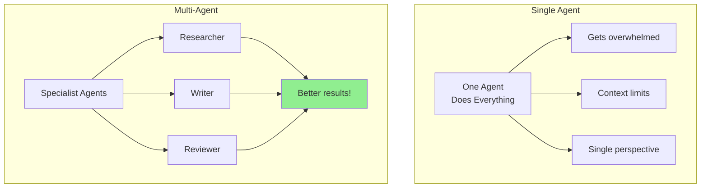
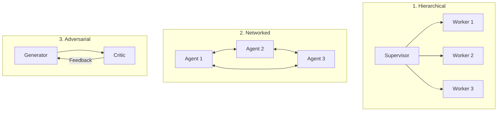
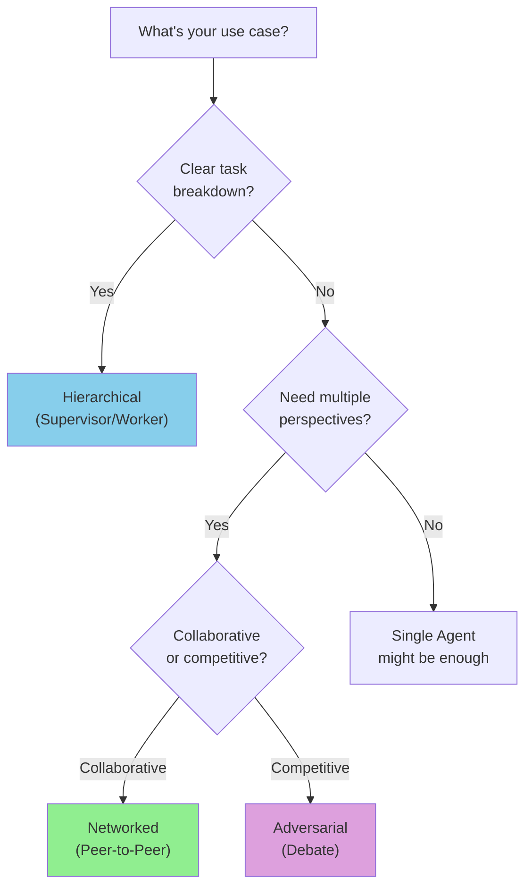
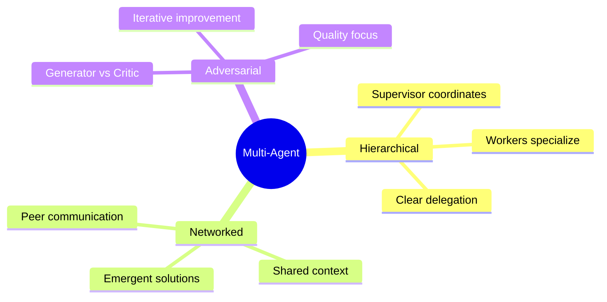

# Multi-Agent Topologies

Welcome to Month 4! You've mastered single agents. Now let's explore **multi-agent systems** - multiple AI agents working together to solve complex problems.

> **Coming from Software Engineering?** Multi-agent topologies map directly to distributed system architectures you already know. Hub-and-spoke is a load balancer with backend workers. Pipeline topology is a message queue chain (like Kafka consumers). Hierarchical is microservices with an API gateway. Mesh is peer-to-peer networking. The concepts of message passing, coordination, fault tolerance, and consensus all carry over — the "services" are just LLM-powered agents instead of containers.

---

## Why Multiple Agents?



Benefits of multi-agent systems:
- **Specialization**: Each agent masters one thing
- **Parallel processing**: Agents work simultaneously
- **Diverse perspectives**: Different "viewpoints" on problems
- **Scalability**: Add agents for new capabilities

---

## The Three Main Topologies



---

## Topology 1: Hierarchical (Supervisor/Worker)

One agent coordinates, others execute:

```python
# script_id: day_050_agent_topologies/agent_topologies
from openai import OpenAI
import json

client = OpenAI()

class HierarchicalSystem:
    """Supervisor delegates to specialized workers."""

    def __init__(self):
        self.workers = {}

    def add_worker(self, name: str, specialty: str, system_prompt: str):
        """Register a worker agent."""
        self.workers[name] = {
            "specialty": specialty,
            "system_prompt": system_prompt
        }

    def supervisor_decide(self, task: str) -> list[dict]:
        """Supervisor decides which workers to use."""
        worker_descriptions = "\n".join([
            f"- {name}: {info['specialty']}"
            for name, info in self.workers.items()
        ])

        response = client.chat.completions.create(
            model="gpt-4o",
            messages=[{
                "role": "system",
                "content": f"""You are a supervisor. Assign subtasks to workers.

Available workers:
{worker_descriptions}

Return JSON array of assignments:
[{{"worker": "name", "task": "specific subtask"}}]"""
            }, {
                "role": "user",
                "content": f"Task: {task}"
            }],
            response_format={"type": "json_object"}
        )

        result = json.loads(response.choices[0].message.content)
        return result.get("assignments", result)

    def execute_worker(self, worker_name: str, task: str) -> str:
        """Have a worker execute their task."""
        worker = self.workers.get(worker_name)
        if not worker:
            return f"Unknown worker: {worker_name}"

        response = client.chat.completions.create(
            model="gpt-4o-mini",
            messages=[
                {"role": "system", "content": worker["system_prompt"]},
                {"role": "user", "content": task}
            ]
        )
        return response.choices[0].message.content

    def run(self, task: str) -> dict:
        """Run the full hierarchical workflow."""
        # Supervisor assigns tasks
        assignments = self.supervisor_decide(task)
        print(f"Supervisor assigned {len(assignments)} tasks")

        # Workers execute
        results = {}
        for assignment in assignments:
            worker = assignment.get("worker")
            subtask = assignment.get("task")
            print(f"  {worker} working on: {subtask[:50]}...")
            results[worker] = self.execute_worker(worker, subtask)

        # Supervisor synthesizes
        synthesis_prompt = f"Original task: {task}\n\nWorker results:\n"
        for worker, result in results.items():
            synthesis_prompt += f"\n{worker}:\n{result}\n"
        synthesis_prompt += "\nSynthesize these into a final response."

        final = client.chat.completions.create(
            model="gpt-4o",
            messages=[
                {"role": "system", "content": "You are synthesizing worker outputs."},
                {"role": "user", "content": synthesis_prompt}
            ]
        )

        return {
            "assignments": assignments,
            "worker_results": results,
            "final": final.choices[0].message.content
        }

# Usage
system = HierarchicalSystem()

system.add_worker(
    "researcher",
    "Finding and verifying information",
    "You are a research specialist. Find accurate information."
)

system.add_worker(
    "writer",
    "Creating clear, engaging content",
    "You are a writing specialist. Create clear, well-structured content."
)

system.add_worker(
    "critic",
    "Reviewing and improving quality",
    "You are a quality reviewer. Find issues and suggest improvements."
)

result = system.run("Write a blog post about machine learning for beginners")
print(result["final"])
```

---

## Topology 2: Networked (Peer-to-Peer)

Agents communicate directly with each other:

```python
# script_id: day_050_agent_topologies/agent_topologies
class NetworkedSystem:
    """Agents collaborate as peers."""

    def __init__(self):
        self.agents = {}
        self.conversation_history = []

    def add_agent(self, name: str, role: str, system_prompt: str):
        """Add an agent to the network."""
        self.agents[name] = {
            "role": role,
            "system_prompt": system_prompt
        }

    def agent_respond(self, agent_name: str, context: str) -> str:
        """Get response from specific agent."""
        agent = self.agents[agent_name]

        # Include conversation history
        history = "\n".join([
            f"{h['agent']}: {h['message']}"
            for h in self.conversation_history[-5:]
        ])

        response = client.chat.completions.create(
            model="gpt-4o-mini",
            messages=[
                {"role": "system", "content": agent["system_prompt"]},
                {"role": "user", "content": f"Conversation so far:\n{history}\n\nContext: {context}\n\nYour response:"}
            ]
        )

        message = response.choices[0].message.content
        self.conversation_history.append({
            "agent": agent_name,
            "message": message
        })

        return message

    def run_discussion(self, topic: str, rounds: int = 3) -> list:
        """Run a multi-round discussion between agents."""
        self.conversation_history = []

        # Initial prompt
        context = f"Discussion topic: {topic}"

        for round_num in range(rounds):
            print(f"\n=== Round {round_num + 1} ===")

            for agent_name in self.agents:
                response = self.agent_respond(agent_name, context)
                print(f"\n{agent_name}: {response[:200]}...")

            # Update context with latest discussion
            context = "Continue the discussion. Build on previous points."

        return self.conversation_history

# Usage
network = NetworkedSystem()

network.add_agent(
    "optimist",
    "Sees opportunities",
    "You see the positive potential in ideas. Focus on benefits and opportunities."
)

network.add_agent(
    "skeptic",
    "Questions assumptions",
    "You question assumptions critically. Point out potential problems."
)

network.add_agent(
    "synthesizer",
    "Finds common ground",
    "You find middle ground. Synthesize different viewpoints constructively."
)

discussion = network.run_discussion("Should AI replace human jobs?", rounds=2)
```

---

## Topology 3: Adversarial (Debate)

Agents challenge each other to improve outputs:

```python
# script_id: day_050_agent_topologies/agent_topologies
class AdversarialSystem:
    """Generator and Critic improve outputs through iteration."""

    def __init__(self, max_rounds: int = 3):
        self.max_rounds = max_rounds

    def generate(self, task: str, previous_feedback: str = None) -> str:
        """Generator creates or improves content."""
        prompt = f"Task: {task}"
        if previous_feedback:
            prompt += f"\n\nPrevious feedback to address:\n{previous_feedback}"

        response = client.chat.completions.create(
            model="gpt-4o",
            messages=[
                {"role": "system", "content": "You are a content creator. Create high-quality output. If feedback is given, improve based on it."},
                {"role": "user", "content": prompt}
            ]
        )
        return response.choices[0].message.content

    def critique(self, task: str, content: str) -> dict:
        """Critic evaluates and provides feedback."""
        response = client.chat.completions.create(
            model="gpt-4o",
            messages=[
                {"role": "system", "content": """You are a strict critic. Evaluate content quality.
Return JSON with:
- score: 1-10
- issues: list of specific problems
- suggestions: list of improvements
- approved: true if score >= 8"""},
                {"role": "user", "content": f"Task: {task}\n\nContent to evaluate:\n{content}"}
            ],
            response_format={"type": "json_object"}
        )
        return json.loads(response.choices[0].message.content)

    def run(self, task: str) -> dict:
        """Run the adversarial improvement loop."""
        history = []
        content = None
        feedback = None

        for round_num in range(self.max_rounds):
            print(f"\n=== Round {round_num + 1} ===")

            # Generate
            content = self.generate(task, feedback)
            print(f"Generated: {content[:100]}...")

            # Critique
            critique = self.critique(task, content)
            print(f"Score: {critique.get('score', 'N/A')}/10")

            history.append({
                "round": round_num + 1,
                "content": content,
                "critique": critique
            })

            # Check if approved
            if critique.get("approved", False):
                print("Content approved!")
                break

            # Prepare feedback for next round
            feedback = f"Score: {critique.get('score')}\n"
            feedback += "Issues:\n" + "\n".join(f"- {i}" for i in critique.get("issues", []))
            feedback += "\nSuggestions:\n" + "\n".join(f"- {s}" for s in critique.get("suggestions", []))

        return {
            "final_content": content,
            "history": history,
            "final_score": history[-1]["critique"].get("score") if history else None
        }

# Usage
adversarial = AdversarialSystem(max_rounds=3)
result = adversarial.run("Write a compelling product description for a smart water bottle")
print(f"\nFinal content:\n{result['final_content']}")
```

---

## Choosing the Right Topology



| Topology | Best For | Example |
|----------|----------|---------|
| Hierarchical | Clear subtask division | Research → Write → Review |
| Networked | Brainstorming, discussions | Multi-perspective analysis |
| Adversarial | Quality improvement | Content refinement |

---

## Checkpoint

Run the Adversarial (Debate) example: `AdversarialSystem(max_rounds=3).run("Write a compelling product description for a smart water bottle")`. You should see per-round `Score: N/10` lines that trend upward, and the loop break early with "Content approved!" once the critic returns `approved: true` (score >= 8) — not always run all three rounds. If it always burns all three rounds, the critic isn't returning the `approved` flag; confirm you set `response_format={"type": "json_object"}` and that the critic's JSON actually includes `"approved"`.

## Summary



---

## Quick Reference

| Topology | Coordination pattern | Maps to (SWE) | When to reach for it |
|----------|----------------------|---------------|----------------------|
| Hierarchical | `supervisor_decide()` assigns, workers `execute()`, supervisor synthesizes | Load balancer + backend workers | Task decomposes into clear, independent subtasks |
| Networked | `agent_respond()` reads shared `conversation_history`, every agent sees prior turns | Peer-to-peer / group chat | Brainstorming, multi-perspective debate |
| Adversarial | `generate()` ↔ `critique()` loop until `approved` or `max_rounds` | Retry-with-feedback loop | Iterative quality refinement |
| (Single agent) | One model, one prompt | Monolith | Task is small enough not to need orchestration |

Implementation tips:
- Use a cheaper model (`gpt-4o-mini`) for workers and a stronger one (`gpt-4o`) for the supervisor/synthesis step to control cost.
- For JSON coordination, set `response_format={"type": "json_object"}` and always `json.loads(...)` defensively.
- Cap loops with `max_rounds` so an adversarial system can't spin forever.

---

## Exercises

1. **Add a fourth worker.** Register an `editor` worker in the `HierarchicalSystem` that proofreads the writer's output, then confirm the supervisor's synthesis still runs cleanly.
2. **Stop the chatter early.** In `NetworkedSystem`, add a check after each round that asks a "moderator" agent whether the group has reached consensus, and break out of `run_discussion` early if so.
3. **Track cost.** Wrap each `client.chat.completions.create(...)` call so you accumulate `response.usage` token counts and print a per-run total. (Reference REFERENCE.md for $/1M rates.)
4. **Pick a topology.** Given the task "summarize 50 customer reviews into one paragraph," argue which topology fits best and why a single agent might actually be enough.

<details><summary>Solutions (approaches)</summary>

1. `system.add_worker("editor", "Polishing grammar and flow", "You are a copy editor...")` — the supervisor already lists workers dynamically from `self.workers`, so no other change is needed.
2. After the per-agent loop, call a moderator agent with the recent history and a yes/no prompt; `if "yes" in reply.lower(): break`.
3. `total = 0` before the run; after each call `total += response.usage.total_tokens`; multiply by the rate (e.g. gpt-4o-mini input $0.15/1M) to estimate dollars.
4. Hierarchical is overkill; the work is one summarization step — a single agent (or at most adversarial for a quality pass) is the right call. Multi-agent earns its keep only when subtasks are genuinely independent or need distinct viewpoints.
</details>

---

## What's Next?

Now let's explore **CrewAI** - a framework designed specifically for multi-agent task orchestration!
