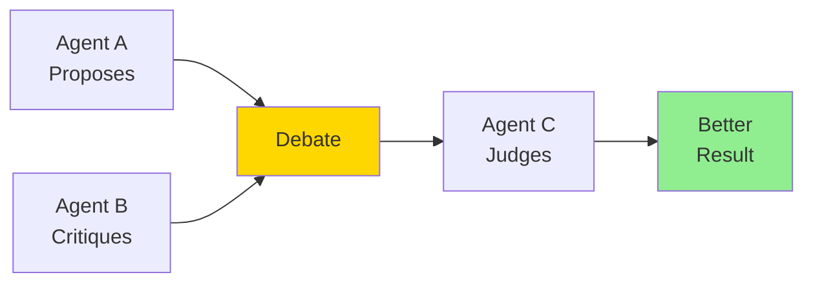
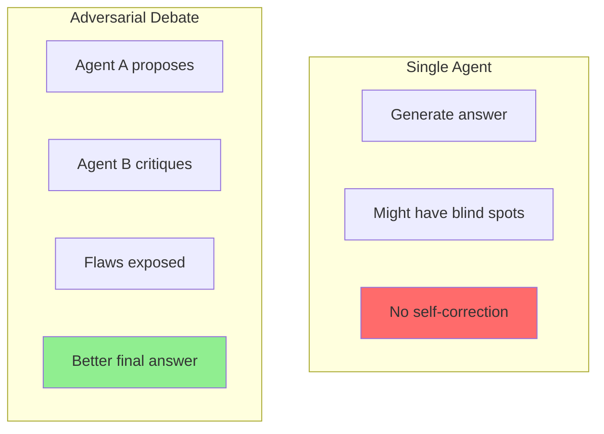
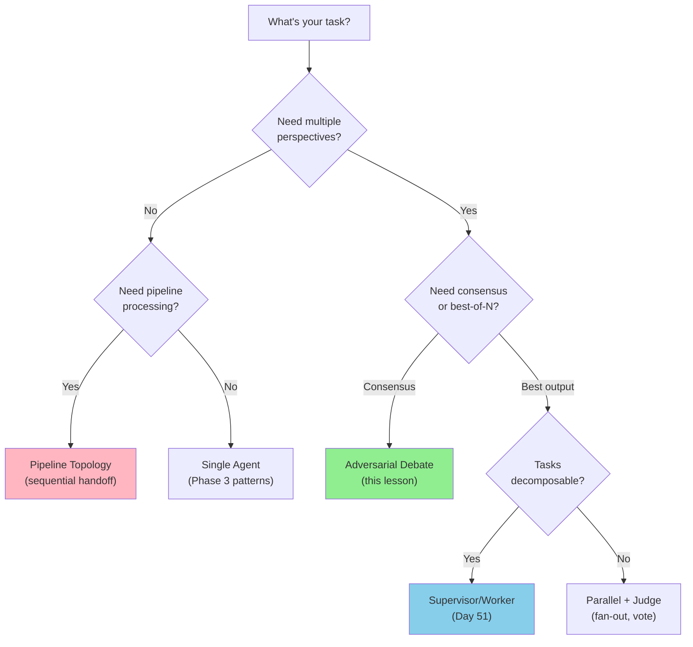
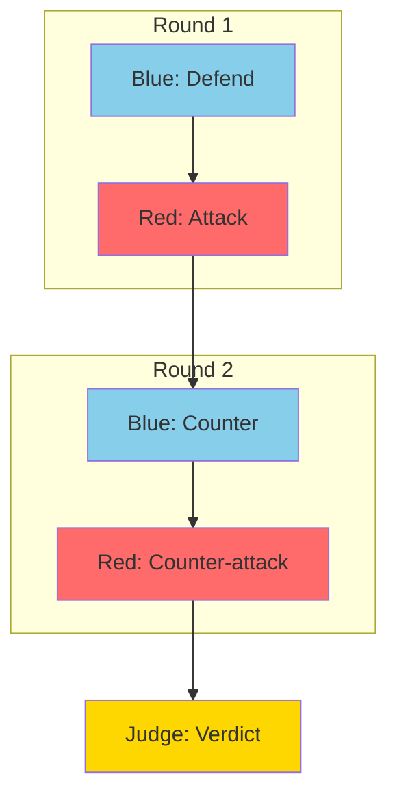
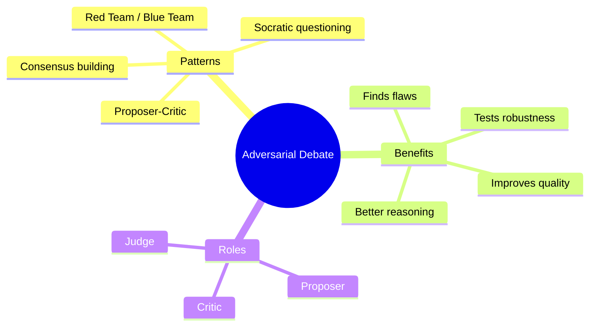

# Adversarial Debate: Agents Critiquing Each Other

What if agents argued with each other to find better answers? Adversarial debate uses the power of disagreement to improve quality.

> **Coming from Software Engineering?** Think of adversarial debate as code review, automated. One agent writes the "PR," another agent reviews it and pushes back, and a third agent merges the best version. You've seen this dynamic in pair programming and design reviews — having a second set of eyes catches errors the author missed. The pattern is the same; you're just automating the reviewer role with a differently-prompted LLM.

---

## The Debate Pattern



Key roles:
- **Proposer**: Generates initial answer
- **Critic**: Finds flaws and suggests improvements
- **Judge**: Evaluates and decides final answer

---

## Why Debate Works



Benefits:
- Exposes blind spots
- Forces justification
- Catches errors
- Improves reasoning quality

### Choosing the Right Agent Topology

Before diving into code, here's a decision tree for picking the right multi-agent pattern. Refer back to this after you've seen all topologies (Days 50-52):



| Topology | Best For | Tradeoff |
|----------|----------|----------|
| **Pipeline** | Document processing, ETL | Simple but no error correction |
| **Supervisor/Worker** | Decomposable tasks, research | Flexible but supervisor is bottleneck |
| **Adversarial Debate** | Accuracy-critical decisions | Better quality but 2-3x cost |
| **Parallel + Judge** | Creative tasks, brainstorming | Fast but judge adds latency |

---

## Basic Debate Implementation

```python
# script_id: day_052_adversarial_debate/debate_system
from openai import OpenAI
import json

client = OpenAI()

def proposer(question: str) -> str:
    """Generate an initial answer."""
    response = client.chat.completions.create(
        model="gpt-4o",
        messages=[
            {"role": "system", "content": """You are a knowledgeable expert.
Provide a well-reasoned answer to the question.
Be thorough and explain your reasoning."""},
            {"role": "user", "content": question}
        ]
    )
    return response.choices[0].message.content

def critic(question: str, answer: str) -> str:
    """Critique the proposed answer."""
    response = client.chat.completions.create(
        model="gpt-4o",
        messages=[
            {"role": "system", "content": """You are a critical reviewer.
Your job is to find flaws, gaps, and errors in the given answer.
Be thorough but fair. Point out:
1. Factual errors
2. Logical flaws
3. Missing information
4. Unclear explanations
5. Better alternatives"""},
            {"role": "user", "content": f"Question: {question}\n\nAnswer to critique:\n{answer}"}
        ]
    )
    return response.choices[0].message.content

def judge(question: str, answer: str, critique: str) -> str:
    """Judge and produce final answer."""
    response = client.chat.completions.create(
        model="gpt-4o",
        messages=[
            {"role": "system", "content": """You are an impartial judge.
Review the original answer and the critique.
Produce a final, improved answer that:
1. Addresses valid criticisms
2. Keeps correct parts of the original
3. Is clear and well-structured"""},
            {"role": "user", "content": f"""Question: {question}

Original Answer:
{answer}

Critique:
{critique}

Please provide the final, improved answer."""}
        ]
    )
    return response.choices[0].message.content

def debate(question: str) -> dict:
    """Run a full debate cycle."""

    print("=" * 60)
    print(f"Question: {question}")
    print("=" * 60)

    # Step 1: Proposer
    print("\n[PROPOSER]")
    answer = proposer(question)
    print(answer[:200] + "...")

    # Step 2: Critic
    print("\n[CRITIC]")
    critique = critic(question, answer)
    print(critique[:200] + "...")

    # Step 3: Judge
    print("\n[JUDGE - Final Answer]")
    final = judge(question, answer, critique)
    print(final)

    return {
        "question": question,
        "initial_answer": answer,
        "critique": critique,
        "final_answer": final
    }

# Usage
result = debate("Should companies adopt a 4-day work week?")
```

---

## Multi-Round Debate

Allow multiple rounds of argument:

```python
# script_id: day_052_adversarial_debate/debate_system
def multi_round_debate(question: str, rounds: int = 3) -> str:
    """Run multiple rounds of debate."""

    # Initial answer
    current_answer = proposer(question)
    debate_history = [{"role": "proposer", "content": current_answer}]

    for round_num in range(rounds):
        print(f"\n--- Round {round_num + 1} ---")

        # Critic responds
        critique = critic(question, current_answer)
        debate_history.append({"role": "critic", "content": critique})

        # Proposer defends/improves
        defense_response = client.chat.completions.create(
            model="gpt-4o",
            messages=[
                {"role": "system", "content": """You are defending your answer.
Address the critique by:
1. Accepting valid points and improving your answer
2. Defending correct parts with evidence
3. Providing a revised, stronger answer"""},
                {"role": "user", "content": f"""Question: {question}

Your previous answer:
{current_answer}

Critique to address:
{critique}

Provide your revised answer."""}
            ]
        )

        current_answer = defense_response.choices[0].message.content
        debate_history.append({"role": "proposer", "content": current_answer})

    # Final judgment
    final = judge(question, current_answer, debate_history[-2]["content"])

    return final

# Usage
result = multi_round_debate("Is remote work better than office work?", rounds=2)
print(result)
```

---

## Red Team / Blue Team

One team attacks, one defends:

```python
# script_id: day_052_adversarial_debate/debate_system
def red_blue_debate(topic: str, position: str) -> dict:
    """Red team attacks, blue team defends."""

    # Blue team: Defend the position
    def blue_team(position: str, attack: str = None) -> str:
        context = f"Position to defend: {position}"
        if attack:
            context += f"\n\nAttack to counter:\n{attack}"

        response = client.chat.completions.create(
            model="gpt-4o",
            messages=[
                {"role": "system", "content": """You are the BLUE TEAM.
Your job is to DEFEND the given position with strong arguments.
Use facts, logic, and evidence to support your case."""},
                {"role": "user", "content": context}
            ]
        )
        return response.choices[0].message.content

    # Red team: Attack the position
    def red_team(position: str, defense: str) -> str:
        response = client.chat.completions.create(
            model="gpt-4o",
            messages=[
                {"role": "system", "content": """You are the RED TEAM.
Your job is to ATTACK the given position and find weaknesses.
Challenge assumptions, find counterexamples, and poke holes in the argument."""},
                {"role": "user", "content": f"""Position being defended: {position}

Current defense:
{defense}

Find weaknesses and attack!"""}
            ]
        )
        return response.choices[0].message.content

    # Run debate
    print(f"Topic: {topic}")
    print(f"Position: {position}")
    print("=" * 60)

    # Round 1
    defense1 = blue_team(position)
    print("\n[BLUE TEAM - Initial Defense]")
    print(defense1[:300] + "...")

    attack1 = red_team(position, defense1)
    print("\n[RED TEAM - Attack]")
    print(attack1[:300] + "...")

    # Round 2
    defense2 = blue_team(position, attack1)
    print("\n[BLUE TEAM - Counter]")
    print(defense2[:300] + "...")

    # Judgment
    verdict = client.chat.completions.create(
        model="gpt-4o",
        messages=[
            {"role": "system", "content": "You are a neutral judge. Evaluate the debate and determine the strength of the position after testing."},
            {"role": "user", "content": f"""Position: {position}

Final defense: {defense2}

Red team's best attack: {attack1}

Rate the position's strength (1-10) and explain."""}
        ]
    )

    return {
        "topic": topic,
        "position": position,
        "final_defense": defense2,
        "best_attack": attack1,
        "verdict": verdict.choices[0].message.content
    }

# Usage
result = red_blue_debate(
    "AI Safety",
    "AI development should be paused until safety is guaranteed"
)
```



---

## Socratic Debate

Use questions to improve reasoning:

```python
# script_id: day_052_adversarial_debate/debate_system
def socratic_debate(claim: str, max_questions: int = 5) -> dict:
    """Challenge a claim with Socratic questioning."""

    dialogue = []

    # Initial claim
    dialogue.append({"role": "claimant", "content": claim})

    for i in range(max_questions):
        # Questioner asks probing question
        question_response = client.chat.completions.create(
            model="gpt-4o",
            messages=[
                {"role": "system", "content": """You are a Socratic questioner.
Ask ONE probing question that:
- Challenges assumptions
- Requests evidence
- Explores implications
- Tests consistency

Be respectful but rigorous. Ask questions that lead to deeper understanding."""},
                {"role": "user", "content": f"Claim: {claim}\n\nPrevious dialogue:\n" +
                    "\n".join([f"{d['role']}: {d['content']}" for d in dialogue[-4:]])}
            ]
        )

        question = question_response.choices[0].message.content
        dialogue.append({"role": "questioner", "content": question})
        print(f"\n[Question {i+1}]: {question}")

        # Claimant responds
        answer_response = client.chat.completions.create(
            model="gpt-4o",
            messages=[
                {"role": "system", "content": """You are defending your claim.
Answer the question honestly and thoughtfully.
If the question reveals a flaw, acknowledge it and refine your position.
If your position is strong, explain why."""},
                {"role": "user", "content": f"Your claim: {claim}\n\nQuestion: {question}"}
            ]
        )

        answer = answer_response.choices[0].message.content
        dialogue.append({"role": "claimant", "content": answer})
        print(f"[Answer]: {answer[:200]}...")

    # Final refined position
    final = client.chat.completions.create(
        model="gpt-4o",
        messages=[
            {"role": "system", "content": "Based on the Socratic dialogue, provide a refined, well-examined version of the original claim."},
            {"role": "user", "content": f"Original claim: {claim}\n\nDialogue:\n" +
                "\n".join([f"{d['role']}: {d['content'][:100]}..." for d in dialogue])}
        ]
    )

    return {
        "original_claim": claim,
        "dialogue": dialogue,
        "refined_claim": final.choices[0].message.content
    }

# Usage
result = socratic_debate("Artificial General Intelligence will be achieved within 10 years")
print("\n[REFINED CLAIM]:", result["refined_claim"])
```

---

## Consensus Building

Multiple agents debate until they agree:

```python
# script_id: day_052_adversarial_debate/debate_system
def build_consensus(question: str, num_agents: int = 3, max_rounds: int = 5) -> str:
    """Multiple agents debate until consensus."""

    # Generate initial opinions
    opinions = []
    for i in range(num_agents):
        response = client.chat.completions.create(
            model="gpt-4o",
            messages=[
                {"role": "system", "content": f"You are Agent {i+1}. Provide your independent opinion."},
                {"role": "user", "content": question}
            ]
        )
        opinions.append(response.choices[0].message.content)

    print(f"Initial opinions from {num_agents} agents gathered.")

    for round_num in range(max_rounds):
        # Check for consensus
        consensus_check = client.chat.completions.create(
            model="gpt-4o",
            messages=[
                {"role": "system", "content": """Analyze these opinions and determine:
1. Do they agree on the main points? (yes/no)
2. What are the key disagreements?
3. What do they agree on?

Return JSON: {"consensus": true/false, "agreements": [...], "disagreements": [...]}"""},
                {"role": "user", "content": "\n\n".join([f"Agent {i+1}: {o}" for i, o in enumerate(opinions)])}
            ],
            response_format={"type": "json_object"}
        )

        check = json.loads(consensus_check.choices[0].message.content)

        if check.get("consensus"):
            print(f"Consensus reached in round {round_num + 1}!")
            break

        print(f"Round {round_num + 1}: No consensus. Disagreements: {check.get('disagreements', [])[:2]}")

        # Agents revise based on others' views
        new_opinions = []
        for i, opinion in enumerate(opinions):
            other_opinions = [o for j, o in enumerate(opinions) if j != i]

            revision = client.chat.completions.create(
                model="gpt-4o",
                messages=[
                    {"role": "system", "content": f"""You are Agent {i+1}. Consider other agents' views.
Where you agree, acknowledge it.
Where you disagree, explain why or find middle ground.
Try to move toward consensus while maintaining intellectual honesty."""},
                    {"role": "user", "content": f"""Your opinion: {opinion}

Other agents' opinions:
{chr(10).join(other_opinions)}

Provide your revised opinion."""}
                ]
            )
            new_opinions.append(revision.choices[0].message.content)

        opinions = new_opinions

    # Generate final consensus statement
    final = client.chat.completions.create(
        model="gpt-4o",
        messages=[
            {"role": "system", "content": "Synthesize these opinions into a final consensus statement."},
            {"role": "user", "content": f"Question: {question}\n\nFinal opinions:\n" +
                "\n\n".join([f"Agent {i+1}: {o}" for i, o in enumerate(opinions)])}
        ]
    )

    return final.choices[0].message.content
```

---

## Summary



---

## Quick Reference

```python
# script_id: day_052_adversarial_debate/quick_reference
# Basic debate
answer = proposer(question)
critique = critic(question, answer)
final = judge(question, answer, critique)

# Multi-round
for round in range(3):
    critique = critic(question, answer)
    answer = defend(answer, critique)

# Red team / Blue team
defense = blue_team(position)
attack = red_team(position, defense)
verdict = judge(defense, attack)
```

---

## What's Next?

Now let's explore **CrewAI** - a framework that makes building agent teams easy!
