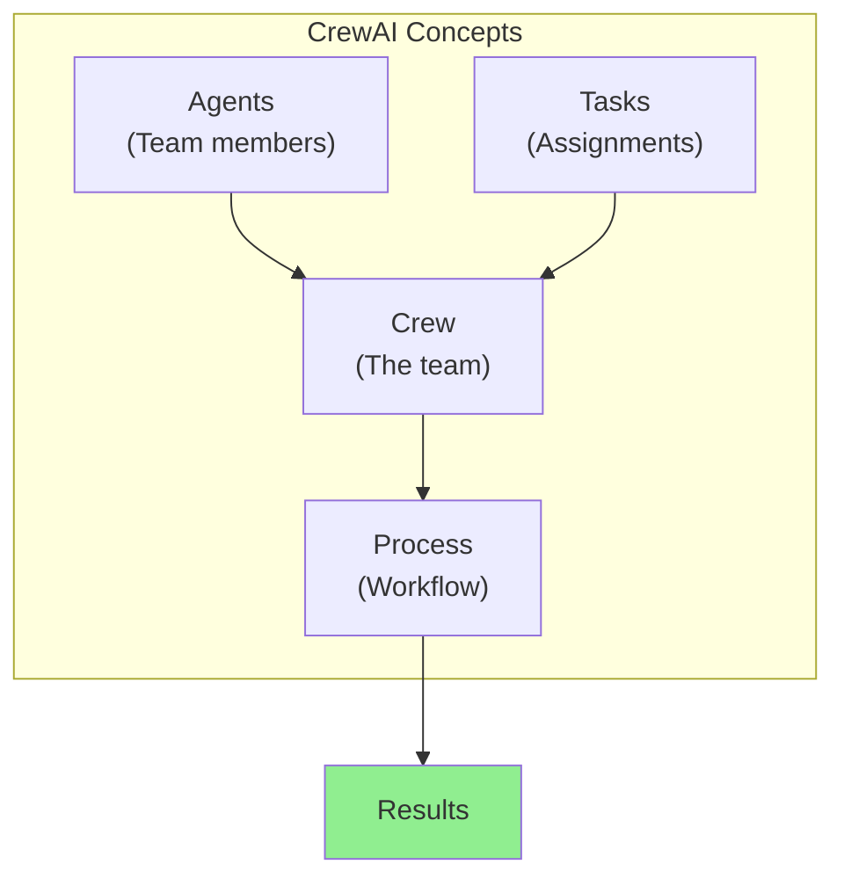
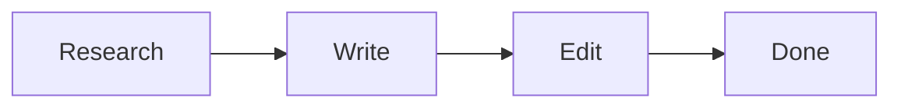
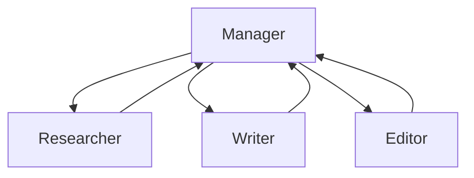
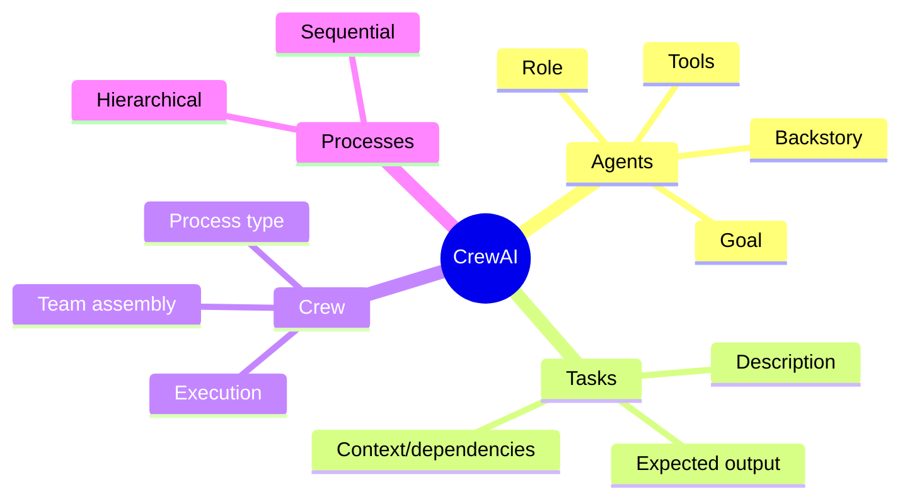

# Task-Oriented Frameworks: CrewAI

CrewAI is a framework for orchestrating **role-playing AI agents**. Think of it as assembling a team where each member has a specific role, backstory, and goal.

> **Coming from Software Engineering?** CrewAI is essentially a dependency injection framework for LLM agents. You define roles (like service interfaces), tasks (like API contracts), and a crew (like a service mesh). If you've used Spring Boot with its component scanning, or even Docker Compose with service definitions, the mental model is similar: declare your components and their relationships, then let the framework handle orchestration.

---

## What is CrewAI?



CrewAI provides:
- **Role-based agents** with personalities
- **Task management** with dependencies
- **Sequential or parallel** execution
- **Built-in collaboration** between agents

---

## Installation

```bash
pip install crewai crewai-tools
```

---

## Core Concepts

### 1. Agents

Agents are team members with roles and personalities:

```python
# script_id: day_053_crewai_basics/crew_pipeline
from crewai import Agent

# Define agents with roles
researcher = Agent(
    role="Senior Research Analyst",
    goal="Uncover cutting-edge developments in AI and data science",
    backstory="""You are a seasoned researcher with a PhD in Computer Science.
    You have 15 years of experience analyzing technology trends.
    You're known for your thorough, unbiased research.""",
    verbose=True,
    allow_delegation=False
)

writer = Agent(
    role="Tech Content Writer",
    goal="Create engaging content about AI technology",
    backstory="""You are a skilled writer who specializes in making
    complex technical topics accessible to general audiences.
    You've written for major tech publications.""",
    verbose=True,
    allow_delegation=False
)

editor = Agent(
    role="Content Editor",
    goal="Ensure content is accurate, engaging, and well-structured",
    backstory="""You are a meticulous editor with 10 years of experience
    in tech journalism. You have a keen eye for detail and clarity.""",
    verbose=True,
    allow_delegation=False
)
```

### 2. Tasks

Tasks are specific assignments for agents:

```python
# script_id: day_053_crewai_basics/crew_pipeline
from crewai import Task

# Define tasks
research_task = Task(
    description="""Research the latest developments in Large Language Models.
    Focus on:
    1. Recent breakthroughs in the last 6 months
    2. Key players and their contributions
    3. Practical applications
    4. Future trends

    Your final report should be comprehensive and well-organized.""",
    agent=researcher,
    expected_output="A detailed research report on LLM developments"
)

writing_task = Task(
    description="""Using the research provided, write an engaging blog post
    about LLM developments for a technical audience.

    The post should:
    - Be 800-1000 words
    - Include an introduction, main sections, and conclusion
    - Use clear, accessible language
    - Include practical examples""",
    agent=writer,
    expected_output="A well-written blog post about LLMs",
    context=[research_task]  # This task depends on research_task
)

editing_task = Task(
    description="""Review and edit the blog post for:
    1. Technical accuracy
    2. Grammar and style
    3. Clarity and flow
    4. Engagement

    Provide the final polished version.""",
    agent=editor,
    expected_output="A polished, publication-ready blog post",
    context=[writing_task]
)
```

### 3. Crew

The crew brings agents and tasks together:

```python
# script_id: day_053_crewai_basics/crew_pipeline
from crewai import Crew, Process

# Create the crew
content_crew = Crew(
    agents=[researcher, writer, editor],
    tasks=[research_task, writing_task, editing_task],
    process=Process.sequential,  # Tasks run one after another
    verbose=True
)

# Run the crew
result = content_crew.kickoff()
print(result)
```

---

## Process Types

### Sequential Process

Tasks run one after another:



```python
# script_id: day_053_crewai_basics/crew_pipeline
crew = Crew(
    agents=[researcher, writer, editor],
    tasks=[research_task, writing_task, editing_task],
    process=Process.sequential
)
```

### Hierarchical Process

A manager agent coordinates others:



```python
# script_id: day_053_crewai_basics/crew_pipeline
from crewai import Crew, Process

manager = Agent(
    role="Project Manager",
    goal="Coordinate the team to produce high-quality content",
    backstory="You are an experienced project manager...",
    allow_delegation=True
)

crew = Crew(
    agents=[researcher, writer, editor],
    tasks=[research_task, writing_task, editing_task],
    process=Process.hierarchical,
    manager_agent=manager
)
```

---

## Adding Tools to Agents

```python
# script_id: day_053_crewai_basics/agent_with_tools
from crewai import Agent
from crewai_tools import SerperDevTool, WebsiteSearchTool

# Define tools
search_tool = SerperDevTool()
web_tool = WebsiteSearchTool()

# Agent with tools
researcher = Agent(
    role="Research Analyst",
    goal="Find accurate information on given topics",
    backstory="You are a thorough researcher...",
    tools=[search_tool, web_tool],
    verbose=True
)
```

### Custom Tools

```python
# script_id: day_053_crewai_basics/custom_tool
from crewai_tools import BaseTool
from pydantic import BaseModel, Field

class CalculatorInput(BaseModel):
    expression: str = Field(description="Math expression to evaluate")

class CalculatorTool(BaseTool):
    name: str = "Calculator"
    description: str = "Performs mathematical calculations"
    args_schema: type[BaseModel] = CalculatorInput

    def _run(self, expression: str) -> str:
        import ast, operator
        try:
            def safe_eval(node):
                if isinstance(node, ast.Constant): return node.value
                elif isinstance(node, ast.BinOp):
                    ops = {ast.Add: operator.add, ast.Sub: operator.sub,
                           ast.Mult: operator.mul, ast.Div: operator.truediv}
                    return ops[type(node.op)](safe_eval(node.left), safe_eval(node.right))
                elif isinstance(node, ast.UnaryOp) and isinstance(node.op, ast.USub):
                    return -safe_eval(node.operand)
                raise ValueError("Unsupported expression")
            result = safe_eval(ast.parse(expression, mode='eval').body)
            return f"Result: {result}"
        except Exception as e:
            return f"Error: {str(e)}"

# Use custom tool
calculator = CalculatorTool()
analyst = Agent(
    role="Data Analyst",
    goal="Analyze numerical data",
    backstory="...",
    tools=[calculator]
)
```

---

## Complete Example: Content Creation Pipeline

```python
# script_id: day_053_crewai_basics/content_creation_pipeline
from crewai import Agent, Task, Crew, Process

# Define the team
researcher = Agent(
    role="Market Research Specialist",
    goal="Gather comprehensive market intelligence",
    backstory="""You are an expert market researcher with deep knowledge
    of technology trends. You excel at finding and synthesizing information
    from multiple sources.""",
    verbose=True
)

strategist = Agent(
    role="Content Strategist",
    goal="Develop compelling content strategies",
    backstory="""You are a creative strategist who understands how to
    position content for maximum impact. You know what resonates with
    different audiences.""",
    verbose=True
)

writer = Agent(
    role="Senior Copywriter",
    goal="Create engaging, persuasive content",
    backstory="""You are an award-winning copywriter known for creating
    content that both informs and inspires action. You adapt your style
    to different formats and audiences.""",
    verbose=True
)

# Define the workflow
research = Task(
    description="""Research the topic: {topic}

    Provide:
    - Key facts and statistics
    - Current trends
    - Target audience insights
    - Competitor analysis""",
    agent=researcher,
    expected_output="Comprehensive research report"
)

strategy = Task(
    description="""Based on the research, develop a content strategy for {topic}.

    Include:
    - Key messages
    - Content angles
    - Recommended format
    - Call to action""",
    agent=strategist,
    expected_output="Content strategy document",
    context=[research]
)

content = Task(
    description="""Create the final content piece for {topic}.

    Requirements:
    - Follow the strategy
    - Use research insights
    - Engage the target audience
    - Include a clear CTA""",
    agent=writer,
    expected_output="Final content piece",
    context=[research, strategy]
)

# Create and run crew
crew = Crew(
    agents=[researcher, strategist, writer],
    tasks=[research, strategy, content],
    process=Process.sequential,
    verbose=True
)

# Execute with input
result = crew.kickoff(inputs={"topic": "AI in Healthcare"})
print(result)
```

---

## Handling Agent Communication

Agents can share information through task context:

```python
# script_id: day_053_crewai_basics/agent_communication
# Task outputs are automatically passed to dependent tasks
task1 = Task(
    description="Research topic X",
    agent=researcher,
    expected_output="Research findings"
)

task2 = Task(
    description="Analyze the research and provide insights",
    agent=analyst,
    expected_output="Analysis report",
    context=[task1]  # Receives output from task1
)

task3 = Task(
    description="Write recommendations based on research and analysis",
    agent=writer,
    expected_output="Recommendations document",
    context=[task1, task2]  # Receives outputs from both
)
```

---

## Error Handling and Retries

```python
# script_id: day_053_crewai_basics/error_handling
from crewai import Crew

crew = Crew(
    agents=[researcher, writer],
    tasks=[research_task, writing_task],
    process=Process.sequential,
    max_rpm=10,  # Rate limit
    verbose=True
)

try:
    result = crew.kickoff()
except Exception as e:
    print(f"Crew execution failed: {e}")
    # Handle failure - maybe retry with different parameters
```

---

## Checkpoint

Run the Content Creation Pipeline: assemble the researcher/strategist/writer crew and call `crew.kickoff(inputs={"topic": "AI in Healthcare"})`. With `verbose=True` you should watch each agent run *in order* — researcher, then strategist, then writer — with each one's output flowing into the next via `context=[...]`, and a final content piece returned. If the writer runs before research finishes (or ignores the research), check that you listed `context=[research, strategy]` on the content task; that's what enforces the dependency.

## Summary



---

## Quick Reference

```python
# script_id: day_053_crewai_basics/quick_reference
from crewai import Agent, Task, Crew, Process

# Agent
agent = Agent(
    role="...",
    goal="...",
    backstory="...",
    tools=[...],
    verbose=True
)

# Task
task = Task(
    description="...",
    agent=agent,
    expected_output="...",
    context=[other_tasks]
)

# Crew
crew = Crew(
    agents=[...],
    tasks=[...],
    process=Process.sequential
)

result = crew.kickoff(inputs={"key": "value"})
```

---

## Exercises

1. **Research Team**: Create a crew of 3 researchers that explore different aspects of a topic and synthesize findings

2. **Code Review Pipeline**: Build a crew with a developer, reviewer, and tester for code quality

3. **Customer Support**: Design a crew that handles customer inquiries with specialists for different areas

---

## What's Next?

Next, we'll go deeper into CrewAI's core unit of work: **Task Definitions** — `expected_output`, dependency chaining, structured Pydantic outputs, and task templates.
