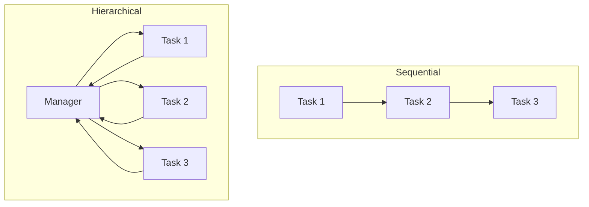
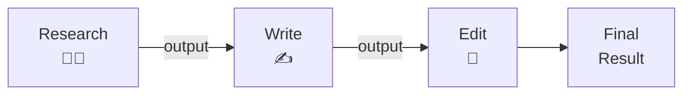
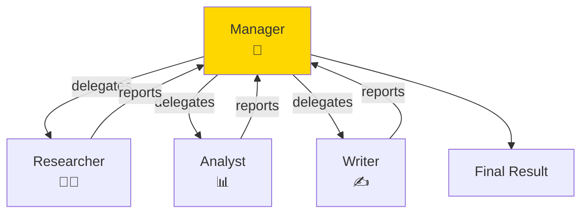
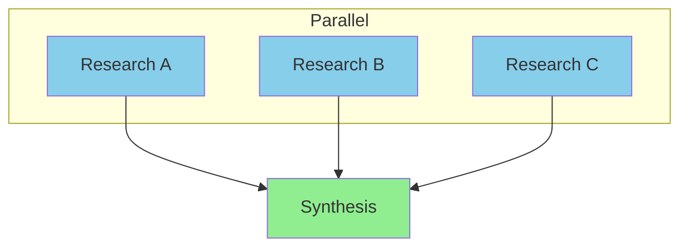
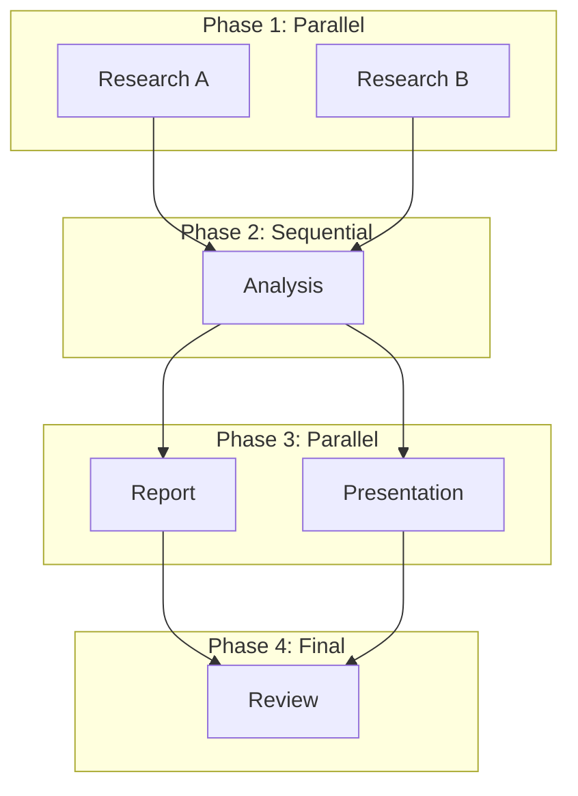
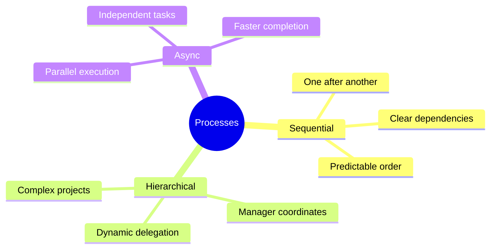

# Sequential and Parallel Processes in CrewAI

CrewAI gives you two independent levers. The PROCESS controls who runs the tasks: sequential (tasks run one after another, in order) or hierarchical (a manager agent decides who does what). Separately, `async_execution` lets independent tasks run at the same time within either process. This guide covers all three. (Note: there is no `Process.parallel` — parallelism comes from async tasks, not a process type.)

> **Coming from Software Engineering?** Sequential vs. parallel execution is the same tradeoff you face with any pipeline: sequential is simpler to debug and guarantees ordering, parallel is faster but requires coordination. Think of it like synchronous vs. async request handling, or a Makefile with vs. without `-j` flag. The DAG (directed acyclic graph — the dependency graph of which task must finish before which) concepts from build systems (Make, Bazel, Gradle) apply directly here.

---

## Process Types Overview



| Process | When to Use |
|---------|-------------|
| Sequential | Tasks depend on each other |
| Hierarchical | Manager coordinates workers |
| Async tasks | Run independent tasks concurrently within either process |

---

## Sequential Process

Tasks execute one after another, in order:

```python
# script_id: day_055_sequential_parallel/sequential_process
from crewai import Agent, Task, Crew, Process

# Create agents
researcher = Agent(
    role="Researcher",
    goal="Find accurate information",
    backstory="Expert researcher"
)

writer = Agent(
    role="Writer",
    goal="Create engaging content",
    backstory="Professional writer"
)

editor = Agent(
    role="Editor",
    goal="Polish content",
    backstory="Meticulous editor"
)

# Create tasks (order matters!)
task1 = Task(
    description="Research AI trends",
    expected_output="Research notes",
    agent=researcher
)

task2 = Task(
    description="Write article based on research",
    expected_output="Draft article",
    agent=writer,
    context=[task1]  # Uses task1 output
)

task3 = Task(
    description="Edit and polish the article",
    expected_output="Final article",
    agent=editor,
    context=[task2]  # Uses task2 output
)

# Create crew with sequential process
crew = Crew(
    agents=[researcher, writer, editor],
    tasks=[task1, task2, task3],
    process=Process.sequential,  # One after another
    verbose=True
)

# Run
result = crew.kickoff()
print(result)
```



---

## Hierarchical Process

A manager agent coordinates worker agents:

```python
# script_id: day_055_sequential_parallel/hierarchical_process
from crewai import Agent, Task, Crew, Process

# Create worker agents
researcher = Agent(
    role="Research Specialist",
    goal="Gather comprehensive information",
    backstory="Expert at finding and synthesizing information"
)

analyst = Agent(
    role="Data Analyst",
    goal="Analyze data and find insights",
    backstory="Skilled at interpreting complex data"
)

writer = Agent(
    role="Content Writer",
    goal="Create clear, engaging content",
    backstory="Experienced technical writer"
)

# Create manager agent
manager = Agent(
    role="Project Manager",
    goal="Coordinate the team to deliver excellent results",
    backstory="""You are an experienced project manager who excels at
    delegating tasks, coordinating team members, and ensuring quality output.
    You decide which team member should handle each part of the project.""",
    allow_delegation=True  # Manager can delegate!
)

# Create tasks (manager will assign these)
# Note: no agent= here on purpose — under a hierarchical process the manager
# decides which agent handles each task.
research_task = Task(
    description="Research the topic of machine learning in healthcare",
    expected_output="Comprehensive research findings"
)

analysis_task = Task(
    description="Analyze the research and identify key trends",
    expected_output="Analysis report with insights"
)

writing_task = Task(
    description="Write a report combining research and analysis",
    expected_output="Final comprehensive report"
)

# Create hierarchical crew
crew = Crew(
    agents=[researcher, analyst, writer],
    tasks=[research_task, analysis_task, writing_task],
    process=Process.hierarchical,  # Manager coordinates
    manager_agent=manager,  # Specify the manager
    verbose=True
)

# Run - manager will delegate and coordinate
result = crew.kickoff()
```



---

## Using Manager LLM

Instead of a manager agent, use an LLM directly:

```python
# script_id: day_055_sequential_parallel/manager_llm
from crewai import Crew, Process

crew = Crew(
    agents=[researcher, analyst, writer],
    tasks=[research_task, analysis_task, writing_task],
    process=Process.hierarchical,
    manager_llm="gpt-4o",  # Use LLM as manager instead of agent
    verbose=True
)
```

> **Note:** A plain string model id like `manager_llm="gpt-4o"` works in current CrewAI and is the idiomatic form. If you want explicit LLM configuration, use CrewAI's own wrapper — `from crewai import LLM; manager_llm=LLM(model="gpt-4o")` — not LangChain's `ChatOpenAI`. Verify against the [CrewAI docs](https://docs.crewai.com) for your installed version.

---

## Async Task Execution

Run independent tasks in parallel:

`process=Process.sequential` still controls the overall walk through the task list. `async_execution=True` is per-task: when CrewAI hits a run of async tasks it launches them together instead of waiting one at a time. The first non-async task that lists them in `context` acts as a join point (like awaiting `Promise.all`, or a WaitGroup) — it blocks until all the async tasks it depends on finish.

```python
# script_id: day_055_sequential_parallel/async_task_execution
from crewai import Task

# These tasks don't depend on each other - can run in parallel
task1 = Task(
    description="Research topic A",
    expected_output="Research on A",
    agent=researcher,
    async_execution=True  # Run async
)

task2 = Task(
    description="Research topic B",
    expected_output="Research on B",
    agent=researcher,
    async_execution=True  # Run async
)

task3 = Task(
    description="Research topic C",
    expected_output="Research on C",
    agent=researcher,
    async_execution=True  # Run async
)

# This task waits for all async tasks
synthesis_task = Task(
    description="Combine all research into final report",
    expected_output="Combined report",
    agent=writer,
    context=[task1, task2, task3],  # Waits for all three
    async_execution=False  # Runs after async tasks complete
)

crew = Crew(
    agents=[researcher, writer],
    tasks=[task1, task2, task3, synthesis_task],
    process=Process.sequential
)
```



---

## Choosing the Right Process

### Use Sequential When:

```python
# script_id: day_055_sequential_parallel/when_sequential
# Tasks have clear dependencies
# Each task needs the previous task's output
# Order matters

crew = Crew(
    agents=[...],
    tasks=[step1, step2, step3],  # Must run in order
    process=Process.sequential
)
```

**Good for:**
- Content pipelines (research → write → edit)
- Data processing (extract → transform → load)
- Review workflows (draft → review → approve)

### Use Hierarchical When:

```python
# script_id: day_055_sequential_parallel/when_hierarchical
# Tasks can be delegated flexibly
# Manager can decide the best approach
# Complex coordination needed

crew = Crew(
    agents=[...],
    tasks=[...],
    process=Process.hierarchical,
    manager_agent=manager
)
```

**Good for:**
- Complex projects with many agents
- When task assignment should be dynamic
- When coordination logic is complex

---

## Mixing Approaches

Combine sequential and async for optimal flow:

This is the same dependency graph a build system computes: `async_execution` marks the targets with no edges between them (free to run in parallel), and `context` lists the edges (what must finish first).

```python
# script_id: day_055_sequential_parallel/mixing_approaches
# Phase 1: Parallel research
research_a = Task(description="Research A", agent=researcher1, async_execution=True)
research_b = Task(description="Research B", agent=researcher2, async_execution=True)

# Phase 2: Sequential processing (waits for research)
analysis = Task(
    description="Analyze all research",
    agent=analyst,
    context=[research_a, research_b],
    async_execution=False
)

# Phase 3: Parallel outputs
report = Task(
    description="Write report",
    agent=writer,
    context=[analysis],
    async_execution=True
)

presentation = Task(
    description="Create presentation",
    agent=designer,
    context=[analysis],
    async_execution=True
)

# Phase 4: Final review (waits for outputs)
final_review = Task(
    description="Review all outputs",
    agent=editor,
    context=[report, presentation],
    async_execution=False
)
```



---

## Execution Control

### Rate Limiting (max_rpm)

```python
# script_id: day_055_sequential_parallel/max_iterations
crew = Crew(
    agents=[...],
    tasks=[...],
    process=Process.sequential,
    max_rpm=10,  # Rate limit: max 10 requests per minute
    verbose=True
)
```

### Memory and Caching

```python
# script_id: day_055_sequential_parallel/memory_and_caching
crew = Crew(
    agents=[...],
    tasks=[...],
    process=Process.sequential,
    memory=True,  # Enable memory between tasks
    cache=True,   # Cache LLM responses
    verbose=True
)
```

### Custom Execution

```python
# script_id: day_055_sequential_parallel/custom_execution
# Kickoff with inputs
result = crew.kickoff(inputs={
    "topic": "Artificial Intelligence",
    "audience": "Business executives"
})

# Tasks can use these inputs in their descriptions
task = Task(
    description="Research {topic} for {audience}",  # Variables replaced
    expected_output="Research report",
    agent=researcher
)
```

---

## Error Handling

```python
# script_id: day_055_sequential_parallel/error_handling
from crewai import Crew

crew = Crew(
    agents=[researcher, writer],
    tasks=[research_task, writing_task],
    process=Process.sequential,
    verbose=True
)

try:
    result = crew.kickoff()
except Exception as e:
    print(f"Crew execution failed: {e}")
    # Handle error - maybe retry or use fallback
```

---

## Monitoring Execution

```python
# script_id: day_055_sequential_parallel/monitoring_execution
# Verbose mode shows each step
crew = Crew(
    agents=[...],
    tasks=[...],
    verbose=True  # See what's happening
)

# Note: current CrewAI takes a boolean only — use verbose=True. (Older 0.x
# releases accepted integer levels like verbose=2.) Check the CrewAI docs for
# your installed version.
crew = Crew(
    agents=[...],
    tasks=[...],
    verbose=True
)
```

---

## Summary



---

## Quick Reference

```python
# script_id: day_055_sequential_parallel/quick_reference
# Sequential process
crew = Crew(
    agents=[a1, a2, a3],
    tasks=[t1, t2, t3],
    process=Process.sequential
)

# Hierarchical process
crew = Crew(
    agents=[a1, a2, a3],
    tasks=[t1, t2, t3],
    process=Process.hierarchical,
    manager_agent=manager
)

# Async tasks
task = Task(
    description="...",
    async_execution=True
)

# Run with inputs
result = crew.kickoff(inputs={"topic": "AI"})
```

---

## Exercises

1. **Sequential pipeline.** Build a research -> write -> edit crew with `Process.sequential`. Confirm the order is deterministic and each task sees the prior output via `context`.

2. **Switch to hierarchical.** Take the same three tasks and run them under `Process.hierarchical` with a manager agent. Compare: who decided the order, and was the result different from sequential?

3. **Parallelize independent work.** Mark three independent research tasks `async_execution=True` and have a synthesis task depend on all three. Time it against a fully sequential version — the speedup is your reward for finding the parallelizable parts.

4. **Mix the phases.** Recreate the four-phase "Mixing Approaches" flow (parallel research -> sequential analysis -> parallel outputs -> final review). Draw the DAG first, then implement it.

<details><summary>Solutions (approaches)</summary>

1. `Crew(agents=[...], tasks=[t1, t2, t3], process=Process.sequential)` with `context=[prev]` chaining.
2. Add `process=Process.hierarchical, manager_agent=manager`; leave tasks without explicit `agent` so the manager assigns them.
3. Set `async_execution=True` on the independent tasks and `context=[t1, t2, t3]` on the synthesizer:

```text
t1 = Task(..., async_execution=True)
t2 = Task(..., async_execution=True)
synth = Task(..., context=[t1, t2], async_execution=False)
```

4. Follow the "Mixing Approaches" section verbatim — it already wires the four phases via `async_execution` flags and `context` lists.
</details>

---

## Checkpoint

Run the Async Task Execution example: mark `task1`/`task2`/`task3` with `async_execution=True` and give the `synthesis_task` `context=[task1, task2, task3]`. The three research tasks should run concurrently while the synthesis task waits for all three before starting — time it against a fully sequential version and the parallel run should be noticeably faster. If the synthesis task starts before the others finish (or errors on missing context), confirm it has `async_execution=False` and lists all three upstream tasks in its `context`. Wrap `crew.kickoff()` in `time.perf_counter()` before and after to measure. Note: parallel speedup only shows up when the tasks really overlap — give each async task its own agent, and watch for provider rate limits, which can serialize the calls anyway.

---

## What's Next?

That wraps Phase 4. Next we move into **Phase 5: Evaluation & Security**, starting with **LangSmith and Phoenix** — tracing and observability so you can see what your multi-agent systems are actually doing.
