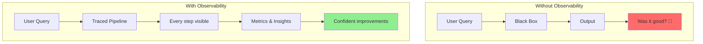
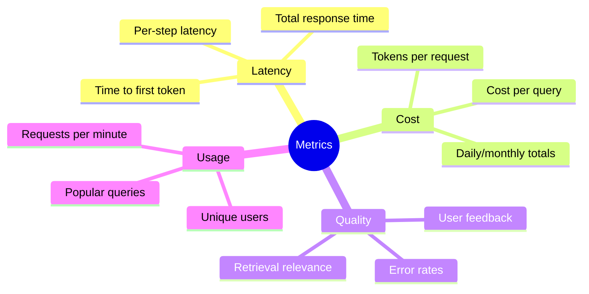
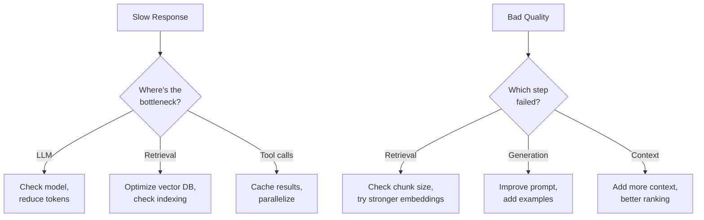
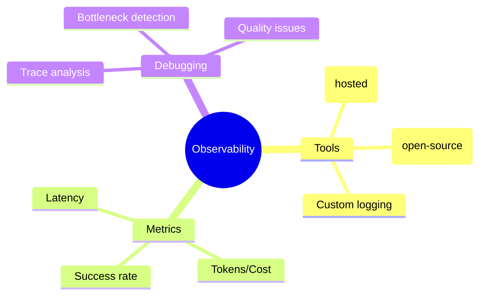

# Observability & Tracing with LangSmith and Phoenix

You've built agents and RAG systems. But how do you know they're working well? How do you debug when things go wrong? Welcome to **observability** - seeing exactly what your AI systems are doing.

> **Coming from Software Engineering?** LangSmith and Phoenix are the Datadog/New Relic/Jaeger of the AI world. They provide distributed tracing for LLM calls — each trace shows the full chain of prompts, retrievals, and tool calls, just like a distributed trace shows HTTP hops across microservices. If you've used OpenTelemetry, structured logging, or APM tools, you already understand the "instrument, collect, visualize, alert" pipeline. The concepts are identical; the telemetry data just includes tokens and prompts instead of HTTP status codes.

---

## Why Observability Matters



What you can see:
- Every LLM call (prompts, responses, tokens, latency)
- Tool executions
- Retrieval operations
- Error traces
- Cost breakdowns

---

## LangSmith: Production Tracing

### Setup

```bash
pip install langsmith langchain langchain-openai
```

```python
# script_id: day_056_langsmith_phoenix/langsmith_traced_pipeline
import os

# Set environment variables
# Current LangSmith docs use LANGSMITH_TRACING / LANGSMITH_API_KEY / LANGSMITH_PROJECT;
# the LANGCHAIN_* names below are still-supported aliases.
os.environ["LANGCHAIN_TRACING_V2"] = "true"
os.environ["LANGCHAIN_API_KEY"] = "your-langsmith-api-key"
os.environ["LANGCHAIN_PROJECT"] = "my-ai-project"
```

### Basic Tracing

```python
# script_id: day_056_langsmith_phoenix/langsmith_traced_pipeline
from langchain_openai import ChatOpenAI
from langchain_core.messages import HumanMessage

# LangSmith automatically traces LangChain operations!
llm = ChatOpenAI(model="gpt-4o-mini")

response = llm.invoke([HumanMessage(content="What is AI?")])
print(response.content)

# Check LangSmith dashboard to see the trace!
```

### Tracing Custom Functions

```python
# script_id: day_056_langsmith_phoenix/langsmith_traced_pipeline
from langsmith import traceable

@traceable(name="my_rag_pipeline")
def rag_query(question: str) -> str:
    """A traced RAG pipeline."""

    # Step 1: Embed
    embedding = embed_question(question)

    # Step 2: Retrieve
    docs = retrieve_documents(embedding)

    # Step 3: Generate
    answer = generate_answer(question, docs)

    return answer

@traceable(name="embed_question")
def embed_question(question: str) -> list:
    """Embed the question."""
    # Your embedding logic
    return [0.1, 0.2, 0.3]

@traceable(name="retrieve_documents")
def retrieve_documents(embedding: list) -> list:
    """Retrieve relevant documents."""
    # Your retrieval logic
    return ["doc1", "doc2"]

@traceable(name="generate_answer")
def generate_answer(question: str, docs: list) -> str:
    """Generate the final answer."""
    llm = ChatOpenAI(model="gpt-4o-mini")
    context = "\n".join(docs)
    response = llm.invoke([
        HumanMessage(content=f"Context: {context}\n\nQuestion: {question}")
    ])
    return response.content

# When you call this, all steps are traced!
answer = rag_query("What is machine learning?")
```

### Adding Metadata

```python
# script_id: day_056_langsmith_phoenix/langsmith_metadata
from langsmith import traceable

@traceable(
    name="production_query",
    tags=["production", "v2"],
    metadata={"version": "2.0", "team": "ai-platform"}
)
def production_query(user_id: str, query: str) -> str:
    """Query with rich metadata for filtering."""
    # ...
    pass

# Or add run-time metadata
from langsmith.run_helpers import get_current_run_tree

@traceable
def process_query(query: str):
    run = get_current_run_tree()
    if run:
        run.metadata["query_length"] = len(query)
        run.tags.append("short" if len(query) < 50 else "long")
    # ...
```

---

## Phoenix: Open-Source Tracing

Phoenix is a free, open-source alternative:

### Setup

```bash
pip install arize-phoenix openinference-instrumentation-openai openai
```

```python
# script_id: day_056_langsmith_phoenix/phoenix_instrument_openai
import phoenix as px

# Launch Phoenix (opens web UI)
session = px.launch_app()
print(f"Phoenix UI: {session.url}")
```

### Instrument OpenAI

```python
# script_id: day_056_langsmith_phoenix/phoenix_instrument_openai
from phoenix.otel import register
from openinference.instrumentation.openai import OpenAIInstrumentor

# Setup tracing
tracer_provider = register(project_name="my-project")
OpenAIInstrumentor().instrument(tracer_provider=tracer_provider)

# Now all OpenAI calls are traced!
from openai import OpenAI
client = OpenAI()

response = client.chat.completions.create(
    model="gpt-4o-mini",
    messages=[{"role": "user", "content": "Hello!"}]
)
# Check Phoenix UI to see traces
```

### Custom Spans

```python
# script_id: day_056_langsmith_phoenix/phoenix_custom_spans
from opentelemetry import trace

tracer = trace.get_tracer(__name__)

def my_pipeline(query: str):
    with tracer.start_as_current_span("my_pipeline") as span:
        span.set_attribute("query", query)

        with tracer.start_as_current_span("step_1"):
            result1 = do_step_1(query)

        with tracer.start_as_current_span("step_2"):
            result2 = do_step_2(result1)

        span.set_attribute("success", True)
        return result2
```

---

## Key Metrics to Track



**Time to first token** = how long until the model starts streaming its answer — the LLM equivalent of time-to-first-byte. It drives perceived speed even when the full response takes longer.

We go deeper on capturing and visualizing these in Day 057 — here they are just a byproduct of tracing.

### Building a Metrics Dashboard

```python
# script_id: day_056_langsmith_phoenix/metrics_dashboard
from dataclasses import dataclass, field
from datetime import datetime
from collections import defaultdict
import statistics

@dataclass
class QueryMetrics:
    query_id: str
    timestamp: datetime
    latency_ms: float
    input_tokens: int
    output_tokens: int
    total_cost: float
    success: bool
    error: str | None = None

class MetricsCollector:
    """Collect and analyze metrics."""

    def __init__(self):
        self.metrics: list[QueryMetrics] = []

    def record(self, metrics: QueryMetrics):
        """Record a query's metrics."""
        self.metrics.append(metrics)

    def summary(self, last_n: int = None) -> dict:
        """Get summary statistics."""
        data = self.metrics[-last_n:] if last_n else self.metrics

        if not data:
            return {"error": "No data"}

        latencies = [m.latency_ms for m in data]
        costs = [m.total_cost for m in data]
        successes = [m.success for m in data]

        return {
            "total_queries": len(data),
            "success_rate": sum(successes) / len(successes),
            "latency": {
                "mean": statistics.mean(latencies),
                "median": statistics.median(latencies),
                # p95 needs enough samples to be meaningful; fall back to max for small batches
                "p95": sorted(latencies)[int(len(latencies) * 0.95)] if len(latencies) > 20 else max(latencies),
            },
            "cost": {
                "total": sum(costs),
                "average": statistics.mean(costs),
            },
            "tokens": {
                "input_total": sum(m.input_tokens for m in data),
                "output_total": sum(m.output_tokens for m in data),
            }
        }

# Usage
collector = MetricsCollector()

# After each query
collector.record(QueryMetrics(
    query_id="q123",
    timestamp=datetime.now(),
    latency_ms=1500,
    input_tokens=150,
    output_tokens=200,
    total_cost=0.001,
    success=True
))

print(collector.summary())
```

---

## Debugging with Traces

### Common Issues to Look For



### Trace Analysis Code

```python
# script_id: day_056_langsmith_phoenix/trace_analysis
def analyze_trace(trace: dict) -> dict:
    """Analyze a trace for issues."""
    issues = []

    # Check latency
    total_latency = trace.get("latency_ms", 0)
    if total_latency > 5000:
        issues.append({
            "type": "high_latency",
            "severity": "warning",
            "details": f"Total latency {total_latency}ms exceeds 5s threshold"
        })

    # Check token usage
    input_tokens = trace.get("input_tokens", 0)
    if input_tokens > 3000:
        issues.append({
            "type": "high_token_usage",
            "severity": "info",
            "details": f"Input tokens ({input_tokens}) are high, consider summarization"
        })

    # Check for errors
    if trace.get("error"):
        issues.append({
            "type": "error",
            "severity": "critical",
            "details": trace["error"]
        })

    # Check retrieval relevance.
    # A retrieval score is how closely a fetched chunk matches the query — on a 0-1
    # scale where 1 means near-identical meaning (the same embedding-similarity
    # numbers you computed back in Phase 2). Below ~0.7 usually means the retriever
    # pulled in only loosely related text; treat it as a rule of thumb, not a law,
    # and tune it to your data.
    retrieval_scores = trace.get("retrieval_scores", [])
    if retrieval_scores and max(retrieval_scores) < 0.7:
        issues.append({
            "type": "low_relevance",
            "severity": "warning",
            "details": f"Best retrieval score ({max(retrieval_scores):.2f}) is low"
        })

    return {
        "trace_id": trace.get("id"),
        "issues": issues,
        "issue_count": len(issues),
        "has_critical": any(i["severity"] == "critical" for i in issues)
    }
```

---

## Summary



> **Also worth knowing:** [Langfuse](https://langfuse.com) is an open-source alternative to LangSmith that offers tracing, evaluation, and prompt management. It's self-hostable and has a generous free tier.

---

## Quick Reference

```python
# script_id: day_056_langsmith_phoenix/quick_reference
# LangSmith
# Current docs use LANGSMITH_TRACING / LANGSMITH_API_KEY / LANGSMITH_PROJECT;
# the LANGCHAIN_* names below are still-supported aliases.
import os
os.environ["LANGCHAIN_TRACING_V2"] = "true"
os.environ["LANGCHAIN_API_KEY"] = "key"

from langsmith import traceable
@traceable
def my_function(): pass

# Phoenix
import phoenix as px
px.launch_app()

from phoenix.otel import register
register(project_name="my-project")
```

---

## Exercises

1. **Trace a multi-step pipeline.** Decorate a small RAG-style pipeline (`embed -> retrieve -> generate`) with `@traceable` on each step. Run it and find the nested trace in the LangSmith dashboard — confirm you can see each step's inputs and outputs.

2. **Instrument with Phoenix.** Use `OpenAIInstrumentor` to auto-trace a few `client.chat.completions.create` calls, then open the Phoenix UI and inspect the spans, token counts, and latency.

3. **Tag and filter.** Add `tags` and `metadata` (e.g. `version`, `team`) to a traced function, then filter for those runs in the dashboard. This is how you separate prod traffic from experiments.

4. **Auto-flag bad traces.** Use the `analyze_trace` helper to scan a batch of trace dicts and surface high-latency or low-relevance runs. Print only the traces with `has_critical == True`.

<details><summary>Solutions (approaches)</summary>

1. Mirror the lesson's `rag_query` example — each helper gets its own `@traceable(name=...)` so the parent trace nests them.
2. `register(project_name=...)` then `OpenAIInstrumentor().instrument(tracer_provider=...)`; calls are captured automatically afterward.
3. `@traceable(tags=["production"], metadata={"version": "2.0"})`, or set `run.metadata[...]` at runtime via `get_current_run_tree()`.
4. Map `analyze_trace` over your traces and filter:

```text
flagged = [analyze_trace(t) for t in traces]
critical = [r for r in flagged if r["has_critical"]]
```
</details>

---

## Checkpoint

Run the `MetricsCollector` example above and call `collector.summary()` after recording a couple of queries — you should see a non-zero `total_queries` and a real `latency.mean` in the printed dict. If it comes back `{"error": "No data"}`, you're almost certainly printing a different collector instance than the one you called `.record(...)` on (or you skipped the `record` step entirely).

---

## What's Next?

Now that you can see what's happening with third-party tracing, next we **capture token counts and latency ourselves** and visualize them.
