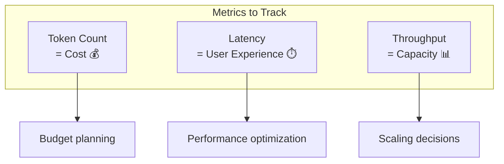
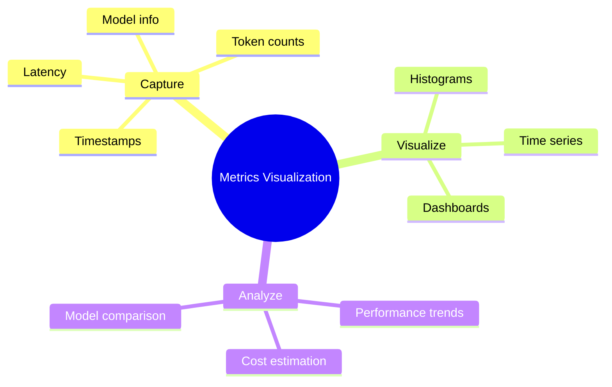

# Visualizing Token Counts and Latency

Understanding your agent's performance means tracking tokens and timing. This guide shows you how to capture and visualize these critical metrics.

> **Coming from Software Engineering?** This is performance monitoring — the same discipline as tracking p50/p95/p99 latencies, request throughput, and resource utilization for your APIs. Token count is your "compute cost per request," latency is your response time, and throughput is your QPS. If you've built Grafana dashboards for service metrics or set up PagerDuty alerts on latency thresholds, you'll apply those exact skills here. The metrics just have different names.

---

## Why Track Tokens and Latency?



Key reasons:
- **Cost control**: Tokens = money
- **Performance**: Latency affects UX
- **Debugging**: Identify slow steps
- **Optimization**: Find improvement opportunities

---

## Capturing Token Metrics

### From OpenAI Responses

```python
# script_id: day_057_token_latency_visualization/metrics_system
from openai import OpenAI
from dataclasses import dataclass
from datetime import datetime
import time

client = OpenAI()

@dataclass
class TokenMetrics:
    prompt_tokens: int
    completion_tokens: int
    total_tokens: int
    latency_ms: float
    model: str
    timestamp: datetime

def call_with_metrics(messages: list, model: str = "gpt-4o-mini") -> tuple[str, TokenMetrics]:
    """Make API call and capture metrics."""

    start_time = time.time()

    response = client.chat.completions.create(
        model=model,
        messages=messages
    )

    latency_ms = (time.time() - start_time) * 1000

    metrics = TokenMetrics(
        prompt_tokens=response.usage.prompt_tokens,
        completion_tokens=response.usage.completion_tokens,
        total_tokens=response.usage.total_tokens,
        latency_ms=latency_ms,
        model=model,
        timestamp=datetime.now()
    )

    return response.choices[0].message.content, metrics

# Usage
content, metrics = call_with_metrics(
    [{"role": "user", "content": "Explain quantum computing in simple terms"}]
)

print(f"Response: {content[:100]}...")
print(f"\nMetrics:")
print(f"  Prompt tokens: {metrics.prompt_tokens}")
print(f"  Completion tokens: {metrics.completion_tokens}")
print(f"  Total tokens: {metrics.total_tokens}")
print(f"  Latency: {metrics.latency_ms:.0f}ms")
```

---

## Metrics Collection System

Build a comprehensive metrics collector:

```python
# script_id: day_057_token_latency_visualization/metrics_system
from dataclasses import dataclass, field
from datetime import datetime
from typing import List, Dict, Optional
import json
import statistics

@dataclass
class APICall:
    """Record of a single API call."""
    timestamp: datetime
    model: str
    prompt_tokens: int
    completion_tokens: int
    total_tokens: int
    latency_ms: float
    endpoint: str = "chat"
    success: bool = True
    error: Optional[str] = None
    metadata: Dict = field(default_factory=dict)

class MetricsCollector:
    """Collect and analyze API metrics."""

    def __init__(self):
        self.calls: List[APICall] = []

    def record(self, call: APICall):
        """Record an API call."""
        self.calls.append(call)

    def get_summary(self) -> Dict:
        """Get summary statistics."""
        if not self.calls:
            return {"message": "No data"}

        total_tokens = sum(c.total_tokens for c in self.calls)
        latencies = [c.latency_ms for c in self.calls]

        return {
            "total_calls": len(self.calls),
            "total_tokens": total_tokens,
            "total_prompt_tokens": sum(c.prompt_tokens for c in self.calls),
            "total_completion_tokens": sum(c.completion_tokens for c in self.calls),
            "avg_tokens_per_call": total_tokens / len(self.calls),
            "avg_latency_ms": statistics.mean(latencies),
            "p50_latency_ms": statistics.median(latencies),
            "p95_latency_ms": sorted(latencies)[int(len(latencies) * 0.95)] if len(latencies) > 1 else latencies[0],
            "success_rate": sum(1 for c in self.calls if c.success) / len(self.calls)
        }

    def get_by_model(self) -> Dict:
        """Get metrics grouped by model."""
        models = {}
        for call in self.calls:
            if call.model not in models:
                models[call.model] = {"calls": 0, "tokens": 0, "latency": []}
            models[call.model]["calls"] += 1
            models[call.model]["tokens"] += call.total_tokens
            models[call.model]["latency"].append(call.latency_ms)

        # Calculate averages
        for model, data in models.items():
            data["avg_latency"] = statistics.mean(data["latency"])
            del data["latency"]  # Remove raw data

        return models

# Global collector
metrics = MetricsCollector()

# Wrapper function
def tracked_call(messages: list, model: str = "gpt-4o-mini", **kwargs) -> str:
    """Make API call with automatic tracking."""

    start = time.time()

    try:
        response = client.chat.completions.create(
            model=model,
            messages=messages,
            **kwargs
        )

        call = APICall(
            timestamp=datetime.now(),
            model=model,
            prompt_tokens=response.usage.prompt_tokens,
            completion_tokens=response.usage.completion_tokens,
            total_tokens=response.usage.total_tokens,
            latency_ms=(time.time() - start) * 1000
        )
        metrics.record(call)

        return response.choices[0].message.content

    except Exception as e:
        call = APICall(
            timestamp=datetime.now(),
            model=model,
            prompt_tokens=0,
            completion_tokens=0,
            total_tokens=0,
            latency_ms=(time.time() - start) * 1000,
            success=False,
            error=str(e)
        )
        metrics.record(call)
        raise
```

---

## Terminal Visualization

Simple ASCII visualizations:

```python
# script_id: day_057_token_latency_visualization/metrics_system
def print_latency_histogram(calls: List[APICall], buckets: int = 10):
    """Print ASCII histogram of latencies."""

    if not calls:
        print("No data")
        return

    latencies = [c.latency_ms for c in calls]
    min_lat, max_lat = min(latencies), max(latencies)
    bucket_size = (max_lat - min_lat) / buckets

    # Count per bucket
    counts = [0] * buckets
    for lat in latencies:
        bucket = min(int((lat - min_lat) / bucket_size), buckets - 1)
        counts[bucket] += 1

    # Print histogram
    max_count = max(counts)
    print("\nLatency Distribution:")
    print("-" * 50)

    for i, count in enumerate(counts):
        low = min_lat + i * bucket_size
        high = low + bucket_size
        bar_length = int(count / max_count * 30) if max_count > 0 else 0
        bar = "█" * bar_length
        print(f"{low:6.0f}-{high:6.0f}ms | {bar} ({count})")

def print_token_timeline(calls: List[APICall]):
    """Print token usage over time."""

    print("\nToken Usage Timeline:")
    print("-" * 60)

    cumulative = 0
    for call in calls[-20:]:  # Last 20 calls
        cumulative += call.total_tokens
        time_str = call.timestamp.strftime("%H:%M:%S")
        bar = "▓" * (call.total_tokens // 100)
        print(f"{time_str} | {bar} {call.total_tokens} (total: {cumulative})")

# Usage
print_latency_histogram(metrics.calls)
print_token_timeline(metrics.calls)
```

---

## Web Dashboard with Streamlit

Create an interactive dashboard:

```python
# script_id: day_057_token_latency_visualization/streamlit_dashboard
import streamlit as st
import pandas as pd
import plotly.express as px
import plotly.graph_objects as go
from datetime import datetime, timedelta

def create_dashboard(metrics: MetricsCollector):
    """Create Streamlit dashboard for metrics."""

    st.title("🔍 Agent Metrics Dashboard")

    # Summary stats
    summary = metrics.get_summary()

    col1, col2, col3, col4 = st.columns(4)
    col1.metric("Total Calls", summary["total_calls"])
    col2.metric("Total Tokens", f"{summary['total_tokens']:,}")
    col3.metric("Avg Latency", f"{summary['avg_latency_ms']:.0f}ms")
    col4.metric("Success Rate", f"{summary['success_rate']:.1%}")

    # Convert to DataFrame
    df = pd.DataFrame([
        {
            "timestamp": c.timestamp,
            "model": c.model,
            "prompt_tokens": c.prompt_tokens,
            "completion_tokens": c.completion_tokens,
            "total_tokens": c.total_tokens,
            "latency_ms": c.latency_ms
        }
        for c in metrics.calls
    ])

    # Latency over time
    st.subheader("📈 Latency Over Time")
    fig_latency = px.line(df, x="timestamp", y="latency_ms", title="Latency Trend")
    st.plotly_chart(fig_latency, use_container_width=True)

    # Token usage by model
    st.subheader("🎯 Tokens by Model")
    model_data = metrics.get_by_model()
    fig_tokens = px.bar(
        x=list(model_data.keys()),
        y=[d["tokens"] for d in model_data.values()],
        title="Token Usage by Model"
    )
    st.plotly_chart(fig_tokens, use_container_width=True)

    # Latency distribution
    st.subheader("📊 Latency Distribution")
    fig_hist = px.histogram(df, x="latency_ms", nbins=20, title="Latency Histogram")
    st.plotly_chart(fig_hist, use_container_width=True)

    # Raw data table
    st.subheader("📋 Recent Calls")
    st.dataframe(df.tail(50))

# Run with: streamlit run dashboard.py
if __name__ == "__main__":
    # Load or create metrics
    create_dashboard(metrics)
```

---

## Cost Estimation

Track and estimate costs:

```python
# script_id: day_057_token_latency_visualization/metrics_system
# Pricing per 1K tokens (example rates, check current pricing)
PRICING = {
    "gpt-4o": {"prompt": 0.0025, "completion": 0.01},
    "gpt-4o-mini": {"prompt": 0.00015, "completion": 0.0006},
}

def estimate_cost(call: APICall) -> float:
    """Estimate cost for an API call."""
    pricing = PRICING.get(call.model, {"prompt": 0.01, "completion": 0.03})

    prompt_cost = (call.prompt_tokens / 1000) * pricing["prompt"]
    completion_cost = (call.completion_tokens / 1000) * pricing["completion"]

    return prompt_cost + completion_cost

def get_cost_summary(calls: List[APICall]) -> Dict:
    """Get cost summary."""
    total_cost = sum(estimate_cost(c) for c in calls)

    by_model = {}
    for call in calls:
        if call.model not in by_model:
            by_model[call.model] = 0
        by_model[call.model] += estimate_cost(call)

    return {
        "total_cost": total_cost,
        "by_model": by_model,
        "avg_cost_per_call": total_cost / len(calls) if calls else 0
    }

# Usage
cost_summary = get_cost_summary(metrics.calls)
print(f"Total cost: ${cost_summary['total_cost']:.4f}")
print(f"By model: {cost_summary['by_model']}")
```

---

## Real-Time Monitoring

Monitor metrics in real-time:

```python
# script_id: day_057_token_latency_visualization/metrics_system
import threading
import time

class RealTimeMonitor:
    """Monitor metrics in real-time."""

    def __init__(self, metrics: MetricsCollector, interval: int = 5):
        self.metrics = metrics
        self.interval = interval
        self.running = False

    def start(self):
        """Start monitoring."""
        self.running = True
        thread = threading.Thread(target=self._monitor_loop, daemon=True)
        thread.start()

    def stop(self):
        """Stop monitoring."""
        self.running = False

    def _monitor_loop(self):
        """Main monitoring loop."""
        last_count = 0

        while self.running:
            current_count = len(self.metrics.calls)

            if current_count > last_count:
                new_calls = self.metrics.calls[last_count:]
                self._display_update(new_calls)
                last_count = current_count

            time.sleep(self.interval)

    def _display_update(self, new_calls: List[APICall]):
        """Display update for new calls."""
        for call in new_calls:
            status = "✅" if call.success else "❌"
            print(f"\r{status} {call.model}: {call.total_tokens} tokens, {call.latency_ms:.0f}ms", end="")
        print()  # Newline

# Usage
monitor = RealTimeMonitor(metrics)
monitor.start()

# Make some calls...
tracked_call([{"role": "user", "content": "Hello"}])

# Stop monitoring
monitor.stop()
```

## Checkpoint

Run the `call_with_metrics(...)` example and confirm the printed `prompt_tokens` and `completion_tokens` are both greater than zero and that `latency_ms` is a realistic number (typically a few hundred to a couple thousand). If `latency_ms` comes back near zero, you probably wrapped `time.time()` around something other than the actual API call; if tokens are zero, check that you're reading `response.usage` and not a cached/mocked response.

---

## Summary



---

## Quick Reference

```python
# script_id: day_057_token_latency_visualization/quick_reference
# Capture metrics
response = client.chat.completions.create(...)
tokens = response.usage.total_tokens
latency = end_time - start_time

# Track calls
metrics.record(APICall(
    prompt_tokens=response.usage.prompt_tokens,
    completion_tokens=response.usage.completion_tokens,
    latency_ms=latency * 1000
))

# Get summary
summary = metrics.get_summary()
print(f"Avg latency: {summary['avg_latency_ms']}ms")

# Estimate costs
cost = estimate_cost(call)
```

---

## Exercises

1. **Capture metrics on a call.** Use `call_with_metrics` to make an API call and print prompt/completion/total tokens plus latency. Confirm the numbers match what you'd expect from the prompt size.

2. **Collect and summarize.** Route a handful of calls through `tracked_call`, then print `metrics.get_summary()`. Identify your p50 and p95 latency — the p95 is what your slowest users actually feel.

3. **Estimate cost.** Use `estimate_cost` / `get_cost_summary` to total the spend across your calls and break it down by model. Which model is eating your budget?

4. **Visualize it.** Render the ASCII `print_latency_histogram`, or build the Streamlit dashboard, to spot the shape of your latency distribution (tight vs. long-tailed).

<details><summary>Solutions (approaches)</summary>

1. `content, m = call_with_metrics([...])` then print the `TokenMetrics` fields.
2. Make several `tracked_call(...)` calls, then `print(metrics.get_summary())` — `p50_latency_ms` and `p95_latency_ms` are already computed.
3. `get_cost_summary(metrics.calls)` returns `total_cost` and a `by_model` breakdown:

```text
cs = get_cost_summary(metrics.calls)
print(cs["total_cost"], cs["by_model"])
```

4. `print_latency_histogram(metrics.calls)` for the terminal, or run `streamlit run dashboard.py` with the `create_dashboard` function.
</details>

---

## What's Next?

Now let's learn about **Automated Evaluation** - using LLMs to evaluate agent quality!
