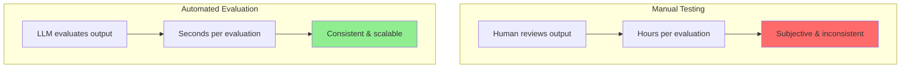
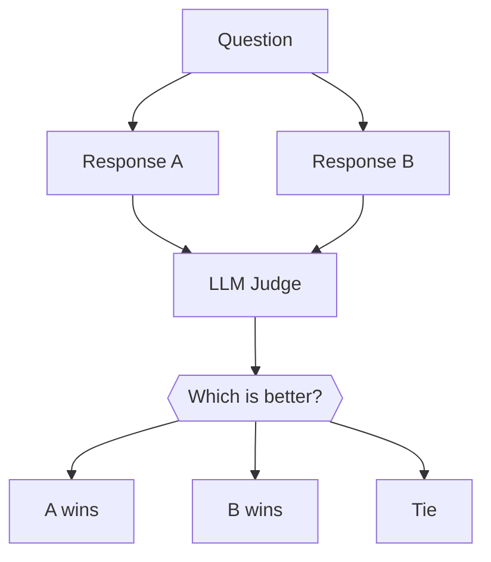
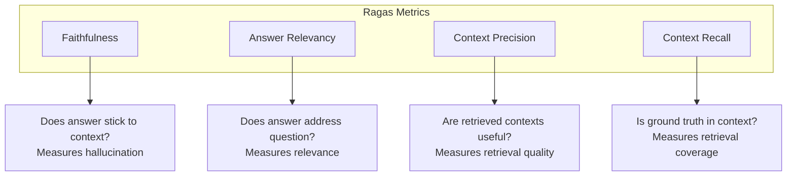
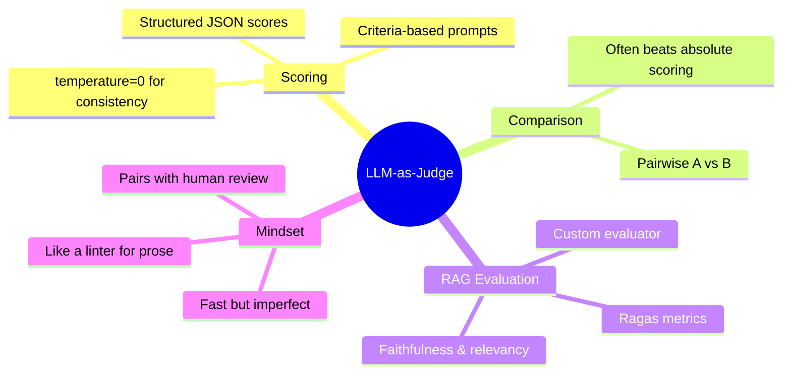

# Automated Evaluation: LLM-as-Judge & Ragas

How do you know if your agent is actually good? Manual testing doesn't scale. In this guide, you'll learn to use LLMs to automatically evaluate agent responses and RAG systems.

> **Coming from Software Engineering?** LLM-as-judge is like using a linter or static analysis tool for natural language output. Just as ESLint checks code quality against rules, an LLM judge checks response quality against criteria. You've used automated quality gates in CI — this is the same concept applied to AI output. The tradeoff is similar too: automated checks are fast and consistent but imperfect; human review is accurate but doesn't scale.

---

## Why Automated Evaluation?



Benefits of automated evaluation:
- **Scale**: Evaluate thousands of responses
- **Consistency**: Same criteria every time
- **Speed**: Seconds vs. hours
- **Iteration**: Test changes quickly

---

## LLM-as-Judge: The Basics

Use one LLM to evaluate another's output:

```python
# script_id: day_058_llm_as_judge_part1/evaluate_response
from openai import OpenAI

client = OpenAI()

def evaluate_response(question: str, response: str, criteria: list[str]) -> dict:
    """
    Use an LLM to evaluate a response.

    Args:
        question: The original question
        response: The response to evaluate
        criteria: List of criteria to judge

    Returns:
        Evaluation scores and reasoning
    """

    criteria_text = "\n".join([f"- {c}" for c in criteria])

    eval_prompt = f"""You are an expert evaluator. Evaluate the following response.

QUESTION: {question}

RESPONSE: {response}

CRITERIA:
{criteria_text}

For each criterion, provide:
1. A score from 1-5 (1=poor, 5=excellent)
2. Brief reasoning

Format your response as:
CRITERION: [name]
SCORE: [1-5]
REASONING: [your reasoning]

Then provide an OVERALL score (1-5) and summary."""

    evaluation = client.chat.completions.create(
        model="gpt-4o",
        messages=[{"role": "user", "content": eval_prompt}],
        temperature=0  # Consistent evaluations
    )

    return evaluation.choices[0].message.content

# Example usage
question = "What is machine learning?"
response = "Machine learning is a subset of AI where computers learn from data without being explicitly programmed."

criteria = [
    "Accuracy: Is the information correct?",
    "Completeness: Does it cover the key points?",
    "Clarity: Is it easy to understand?"
]

evaluation = evaluate_response(question, response, criteria)
print(evaluation)
```

---

## Structured Evaluation with Scores

Get numerical scores for easy comparison:

```python
# script_id: day_058_llm_as_judge_part1/evaluate_with_scores
from openai import OpenAI
import json

client = OpenAI()

def evaluate_with_scores(question: str, response: str) -> dict:
    """Get structured evaluation scores."""

    eval_prompt = f"""Evaluate this response on a scale of 1-5 for each criterion.

Question: {question}
Response: {response}

Return a JSON object with these scores:
- accuracy: How factually correct is the response?
- completeness: How thoroughly does it answer the question?
- clarity: How clear and understandable is it?
- relevance: How relevant is it to the question?
- conciseness: Is it appropriately concise (not too verbose)?

Also include:
- overall: Overall quality score (1-5)
- feedback: Brief constructive feedback

Return ONLY valid JSON."""

    result = client.chat.completions.create(
        model="gpt-4o",
        messages=[{"role": "user", "content": eval_prompt}],
        response_format={"type": "json_object"},
        temperature=0
    )

    return json.loads(result.choices[0].message.content)

# Example
scores = evaluate_with_scores(
    "Explain photosynthesis",
    "Photosynthesis is when plants make food from sunlight."
)

print(f"Accuracy: {scores['accuracy']}/5")
print(f"Completeness: {scores['completeness']}/5")
print(f"Clarity: {scores['clarity']}/5")
print(f"Overall: {scores['overall']}/5")
print(f"Feedback: {scores['feedback']}")
```

---

## Pairwise Comparison

Compare two responses to find the better one:

```python
# script_id: day_058_llm_as_judge_part1/compare_responses
from openai import OpenAI
import json

client = OpenAI()

def compare_responses(question: str, response_a: str, response_b: str) -> dict:
    """
    Compare two responses and determine which is better.

    This is often more reliable than absolute scoring!
    """

    comparison_prompt = f"""Compare these two responses to the same question.

QUESTION: {question}

RESPONSE A:
{response_a}

RESPONSE B:
{response_b}

Evaluate which response is better and why. Consider:
- Accuracy
- Completeness
- Clarity
- Helpfulness

Return JSON with:
- winner: "A" or "B" or "tie"
- confidence: "high", "medium", or "low"
- reasoning: Brief explanation of your choice
- a_strengths: List of response A's strengths
- b_strengths: List of response B's strengths"""

    result = client.chat.completions.create(
        model="gpt-4o",
        messages=[{"role": "user", "content": comparison_prompt}],
        response_format={"type": "json_object"},
        temperature=0
    )

    return json.loads(result.choices[0].message.content)

# Example
result = compare_responses(
    "What is a neural network?",
    "A neural network is a computer system inspired by the brain.",
    "A neural network is a machine learning model consisting of layers of interconnected nodes (neurons) that process information. Each connection has a weight that adjusts during training. Neural networks excel at pattern recognition tasks like image classification and natural language processing."
)

print(f"Winner: Response {result['winner']}")
print(f"Confidence: {result['confidence']}")
print(f"Reasoning: {result['reasoning']}")
```



---

## RAG Evaluation with Ragas

Ragas is a framework specifically designed to evaluate RAG pipelines:

```bash
pip install "ragas>=0.2"
```

### Key Ragas Metrics

```python
# script_id: day_058_llm_as_judge_part1/ragas_basic_eval
# Ragas 0.2+ API: build an EvaluationDataset from per-sample dicts. The field
# names changed from the older API — it's now user_input / response /
# retrieved_contexts / reference (not question / answer / contexts / ground_truth).
from ragas import evaluate, EvaluationDataset
from ragas.metrics import (
    faithfulness,
    answer_relevancy,
    context_precision,
    context_recall
)

# Prepare evaluation data (one dict per sample)
samples = [
    {
        "user_input": "What is the capital of France?",
        "response": "The capital of France is Paris.",
        "retrieved_contexts": ["Paris is the capital and largest city of France."],
        "reference": "Paris",
    },
    {
        "user_input": "Who wrote Romeo and Juliet?",
        "response": "Romeo and Juliet was written by William Shakespeare.",
        "retrieved_contexts": [
            "William Shakespeare wrote many plays including Romeo and Juliet, Hamlet, and Macbeth."
        ],
        "reference": "William Shakespeare",
    },
]

dataset = EvaluationDataset.from_list(samples)

# Run evaluation
results = evaluate(
    dataset=dataset,
    metrics=[
        faithfulness,        # Is the response grounded in the retrieved context?
        answer_relevancy,    # Is the response relevant to the question?
        context_precision,   # Are the retrieved contexts relevant?
        context_recall       # Do the contexts contain the reference answer?
    ]
)

print(results)
```

### Understanding Ragas Metrics



### Custom RAG Evaluator

```python
# script_id: day_058_llm_as_judge_part1/custom_rag_evaluator
from openai import OpenAI
import json

client = OpenAI()

class RAGEvaluator:
    """Evaluate RAG system responses."""

    def __init__(self):
        self.metrics = {}

    def evaluate_faithfulness(self, answer: str, contexts: list[str]) -> float:
        """Check if answer is grounded in the provided contexts."""

        context_text = "\n".join(contexts)

        prompt = f"""Evaluate if this answer is faithful to (grounded in) the given contexts.

CONTEXTS:
{context_text}

ANSWER:
{answer}

For each claim in the answer, check if it's supported by the contexts.
Return JSON:
{{
    "claims": ["claim1", "claim2", ...],
    "supported_claims": ["claim1", ...],
    "unsupported_claims": ["claim2", ...],
    "faithfulness_score": 0.0-1.0
}}"""

        result = client.chat.completions.create(
            model="gpt-4o",
            messages=[{"role": "user", "content": prompt}],
            response_format={"type": "json_object"}
        )

        data = json.loads(result.choices[0].message.content)
        return data["faithfulness_score"]

    def evaluate_relevancy(self, question: str, answer: str) -> float:
        """Check if answer is relevant to the question."""

        prompt = f"""Evaluate if this answer is relevant to the question.

QUESTION: {question}

ANSWER: {answer}

Consider:
- Does it address what was asked?
- Is it on-topic?
- Does it provide useful information?

Return JSON:
{{
    "addresses_question": true/false,
    "on_topic": true/false,
    "provides_value": true/false,
    "relevancy_score": 0.0-1.0,
    "reasoning": "..."
}}"""

        result = client.chat.completions.create(
            model="gpt-4o",
            messages=[{"role": "user", "content": prompt}],
            response_format={"type": "json_object"}
        )

        data = json.loads(result.choices[0].message.content)
        return data["relevancy_score"]

    def evaluate_context_quality(self, question: str, contexts: list[str]) -> float:
        """Check if retrieved contexts are relevant to the question."""

        context_text = "\n---\n".join([f"Context {i+1}: {c}" for i, c in enumerate(contexts)])

        prompt = f"""Evaluate the quality of these retrieved contexts for answering the question.

QUESTION: {question}

CONTEXTS:
{context_text}

For each context, rate its relevance to the question.
Return JSON:
{{
    "context_ratings": [
        {{"context_num": 1, "relevance": "high/medium/low", "useful_for_answer": true/false}},
        ...
    ],
    "overall_context_quality": 0.0-1.0,
    "reasoning": "..."
}}"""

        result = client.chat.completions.create(
            model="gpt-4o",
            messages=[{"role": "user", "content": prompt}],
            response_format={"type": "json_object"}
        )

        data = json.loads(result.choices[0].message.content)
        return data["overall_context_quality"]

    def full_evaluation(self, question: str, answer: str, contexts: list[str]) -> dict:
        """Run full RAG evaluation."""

        return {
            "faithfulness": self.evaluate_faithfulness(answer, contexts),
            "relevancy": self.evaluate_relevancy(question, answer),
            "context_quality": self.evaluate_context_quality(question, contexts)
        }

# Usage
evaluator = RAGEvaluator()

result = evaluator.full_evaluation(
    question="What are the benefits of exercise?",
    answer="Exercise improves cardiovascular health, builds muscle, and boosts mood through endorphin release.",
    contexts=[
        "Regular exercise strengthens the heart and improves blood circulation.",
        "Physical activity releases endorphins, which are natural mood elevators.",
        "Strength training helps build and maintain muscle mass."
    ]
)

print(f"Faithfulness: {result['faithfulness']:.2%}")
print(f"Relevancy: {result['relevancy']:.2%}")
print(f"Context Quality: {result['context_quality']:.2%}")
```

---

## Summary



---

## Quick Reference

| Pattern | When to use | Key detail |
|---|---|---|
| Criteria scoring | Free-form quality review | `temperature=0`; ask for score + reasoning |
| Structured scores | Comparing many responses | `response_format={"type": "json_object"}` |
| Pairwise comparison | "Which is better, A or B?" | More reliable than absolute scores |
| Ragas `evaluate()` | RAG pipelines | `EvaluationDataset.from_list([...])` |
| Custom RAG evaluator | Bespoke metrics | One prompt per dimension, parse JSON |

Tips:
- Always set `temperature=0` for the judge so scores are reproducible.
- Ragas 0.2+ fields are `user_input` / `response` / `retrieved_contexts` / `reference` — not the old `question` / `answer` / `contexts` / `ground_truth`.
- Prefer pairwise comparison when absolute scores feel arbitrary; it's easier for a judge to say "B is better" than "B is a 4.2".

---

## Exercises

1. Extend `evaluate_with_scores` to also return a boolean `pass` field that is `True` only when every individual criterion scores at least 4. Use it to filter a batch of responses.
2. Run `compare_responses` twice on the same pair but swap `response_a` and `response_b`. Does the winner stay consistent? Note what you observe (this is a preview of position bias, covered tomorrow).
3. Add a fifth Ragas-style dimension to `RAGEvaluator` — `answer_completeness` (does the answer cover everything the context supports?) — following the same prompt-and-parse pattern.
4. Build the smallest possible Ragas run: two samples, only the `faithfulness` and `answer_relevancy` metrics, and print each score.

<details><summary>Solutions (approaches)</summary>

1. Parse the JSON, then `result["pass"] = all(result[c] >= 4 for c in ["accuracy", "completeness", "clarity", "relevance", "conciseness"])`.
2. Swap the arguments; an unbiased judge should flip the winner. If it always picks the same slot, that's position bias.
3. Copy `evaluate_relevancy`, change the prompt to ask "is anything in the context missing from the answer?", return a `completeness_score`, and add it to the `full_evaluation` dict.
4. ```text
   from ragas import evaluate, EvaluationDataset
   from ragas.metrics import faithfulness, answer_relevancy
   ds = EvaluationDataset.from_list([
       {"user_input": "...", "response": "...", "retrieved_contexts": ["..."], "reference": "..."},
       {"user_input": "...", "response": "...", "retrieved_contexts": ["..."], "reference": "..."},
   ])
   r = evaluate(dataset=ds, metrics=[faithfulness, answer_relevancy])
   print(r)
   ```
</details>

---

## What's Next?

You can now score and compare responses, but naive judges have systematic biases (position, verbosity, self-enhancement). Next up: **LLM-as-Judge Part 2** — detecting and correcting those biases, calibrating with anchors, measuring reliability with Cohen's Kappa, and running multi-judge consensus cost-efficiently.
