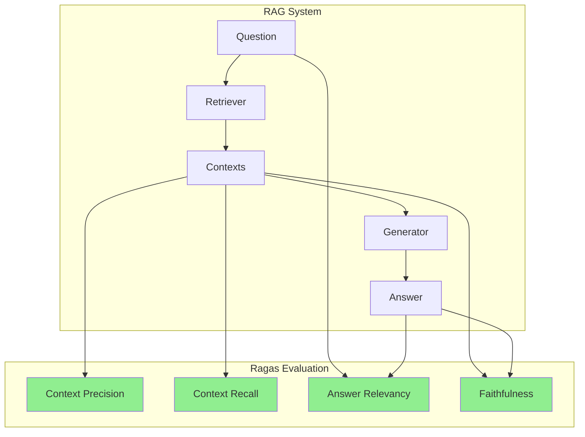
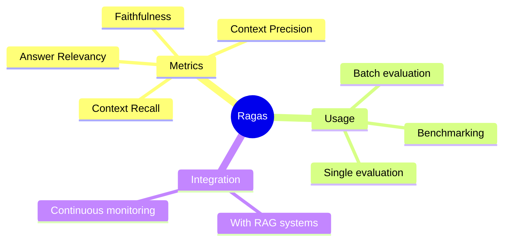

# Evaluating RAG Systems with Ragas

Ragas is a framework specifically designed to evaluate Retrieval-Augmented Generation systems. This guide shows you how to measure retrieval and generation quality.

> **Coming from Software Engineering?** Ragas metrics are like test coverage and performance benchmarks for your RAG pipeline. Faithfulness measures "does the output match the retrieved data?" (like asserting a function returns values from its input). Context relevance measures "did we retrieve the right documents?" (like asserting your SQL query returns the right rows). Answer relevance measures "did we actually answer the question?" (like asserting API response matches the request). Context recall measures "did we retrieve everything we needed?" — like checking your query didn't miss rows it should have returned. If you've built test suites with coverage metrics, this is the same discipline. One difference: unlike a normal assert, Ragas doesn't string-compare — it uses an LLM to read each answer against its context and grade it 0-1 (the LLM-as-judge idea from Day 58). Treat the scores as an automated reviewer's grade: approximate, and they can shift slightly run to run.

---

## What is Ragas?



Ragas measures:
- **Faithfulness**: Is the answer grounded in retrieved context?
- **Answer Relevancy**: Does the answer address the question?
- **Context Precision**: Are retrieved contexts relevant?
- **Context Recall**: Do contexts contain the needed information?

Precision = of the chunks we pulled back, what fraction were actually relevant (low precision = junk mixed in). Recall = of the info needed to answer, what fraction made it into the chunks (low recall = a needed chunk was missed). Like search results: precision = no spam, recall = nothing important left out.

---

## Installation

```bash
pip install "ragas>=0.2"
```

---

## Basic Ragas Evaluation

Ragas scores by calling an LLM and an embedding model under the hood, so it needs API credentials and makes small paid API calls — set `OPENAI_API_KEY` in your environment before running (Ragas uses OpenAI models by default).

```python
# script_id: day_060_ragas_evaluation/basic_ragas_eval
from ragas import evaluate, EvaluationDataset
# On newer Ragas this import path is moving to ragas.metrics.collections; check your version's docs.
from ragas.metrics import faithfulness, answer_relevancy, context_precision, context_recall

# Prepare your evaluation data
eval_data = {
    "user_input": [
        "What is the capital of France?",
        "Who invented the telephone?",
        "What is photosynthesis?"
    ],
    "response": [
        "The capital of France is Paris, which is known for the Eiffel Tower.",
        "Alexander Graham Bell invented the telephone in 1876.",
        "Photosynthesis is the process by which plants convert sunlight into energy."
    ],
    "retrieved_contexts": [
        ["Paris is the capital city of France. It is known for landmarks like the Eiffel Tower."],
        ["Alexander Graham Bell was a Scottish-born inventor who patented the telephone in 1876."],
        ["Photosynthesis is a biological process where plants use sunlight, water, and CO2 to produce glucose and oxygen."]
    ],
    "reference": [
        "Paris",
        "Alexander Graham Bell",
        "Photosynthesis is the process by which plants convert light energy into chemical energy"
    ]
}

# Create dataset using EvaluationDataset
eval_dataset = EvaluationDataset.from_dict(eval_data)

# Run evaluation — metrics are module-level instances, not classes
results = evaluate(
    dataset=eval_dataset,
    metrics=[faithfulness, answer_relevancy, context_precision, context_recall],
)

print(results)

# results[key] is a list of per-sample scores, not a single float.
# Use the pandas frame for aggregate scores (one column per metric).
df = results.to_pandas()
print(f"\nFaithfulness: {df['faithfulness'].mean():.3f}")
print(f"Answer Relevancy: {df['answer_relevancy'].mean():.3f}")
print(f"Context Precision: {df['context_precision'].mean():.3f}")
print(f"Context Recall: {df['context_recall'].mean():.3f}")
```

`faithfulness` and `answer_relevancy` need only `user_input` / `response` / `retrieved_contexts`; `context_recall` (and reference-based `context_precision`) also need a `reference` — a human-written correct answer. With no reference, those metrics return `None`.

---

## Understanding Each Metric

Every metric returns a float in [0,1] where higher is better.

### Faithfulness

Measures if the answer can be inferred from the context:

```python
# script_id: day_060_ragas_evaluation/faithfulness_examples
from ragas.metrics import faithfulness

# High faithfulness - answer matches context
high_faith = {
    "user_input": "What color is the sky?",
    "response": "The sky is blue.",
    "retrieved_contexts": [["The sky appears blue due to Rayleigh scattering."]]
}

# Low faithfulness - answer includes hallucination
low_faith = {
    "user_input": "What color is the sky?",
    "response": "The sky is blue, and it's always sunny in Philadelphia.",
    "retrieved_contexts": [["The sky appears blue due to Rayleigh scattering."]]
}
```

### Answer Relevancy

Measures if the answer addresses the question:

```python
# script_id: day_060_ragas_evaluation/answer_relevancy_examples
from ragas.metrics import answer_relevancy

# High relevancy - directly answers question
high_rel = {
    "user_input": "What is machine learning?",
    "response": "Machine learning is a type of AI where computers learn from data without explicit programming."
}

# Low relevancy - doesn't answer question
low_rel = {
    "user_input": "What is machine learning?",
    "response": "Python is a popular programming language used by many developers."
}
```

### Context Precision

Measures if retrieved contexts are relevant:

```python
# script_id: day_060_ragas_evaluation/context_precision_examples
from ragas.metrics import context_precision

# High precision - all contexts relevant
high_prec = {
    "user_input": "What is the Eiffel Tower?",
    "retrieved_contexts": [
        ["The Eiffel Tower is a wrought-iron lattice tower in Paris."],
        ["It was built for the 1889 World's Fair."]
    ]
}

# Low precision - some contexts irrelevant
low_prec = {
    "user_input": "What is the Eiffel Tower?",
    "retrieved_contexts": [
        ["The Eiffel Tower is a wrought-iron lattice tower in Paris."],
        ["Pizza is a popular Italian food."]  # Irrelevant!
    ]
}
```

### Context Recall

Measures if contexts contain ground truth information:

```python
# script_id: day_060_ragas_evaluation/context_recall_examples
from ragas.metrics import context_recall

# High recall - context contains needed info
high_rec = {
    "user_input": "When was Python created?",
    "retrieved_contexts": [["Python was created by Guido van Rossum and released in 1991."]],
    "reference": "Python was created in 1991"
}

# Low recall - context missing key info
low_rec = {
    "user_input": "When was Python created?",
    "retrieved_contexts": [["Python is a popular programming language."]],  # Missing date!
    "reference": "Python was created in 1991"
}
```

---

## Custom Evaluation Pipeline

Build a complete evaluation pipeline:

```python
# script_id: day_060_ragas_evaluation/evaluated_rag_system
from ragas import evaluate, EvaluationDataset
from ragas.metrics import faithfulness, answer_relevancy, context_precision, context_recall
from typing import List, Dict

class RAGEvaluator:
    """Evaluate RAG system with Ragas metrics."""

    def __init__(self):
        # In Ragas 0.2+, metrics are module-level instances, not classes
        self.metrics = [faithfulness, answer_relevancy, context_precision, context_recall]
        self.results_history = []

    def evaluate_single(
        self,
        question: str,
        answer: str,
        contexts: List[str],
        reference: str = None
    ) -> Dict:
        """Evaluate a single Q&A pair."""

        data = {
            "user_input": [question],
            "response": [answer],
            "retrieved_contexts": [contexts],
        }

        if reference:
            data["reference"] = [reference]

        eval_dataset = EvaluationDataset.from_dict(data)
        results = evaluate(dataset=eval_dataset, metrics=self.metrics)

        # Turn the per-sample frame into a plain dict of aggregate floats.
        # Metrics with no reference (e.g. context_recall) simply won't appear.
        df = results.to_pandas()
        return {
            m: float(df[m].mean())
            for m in ("faithfulness", "answer_relevancy", "context_precision", "context_recall")
            if m in df.columns
        }

    def evaluate_batch(self, test_cases: List[Dict]) -> Dict:
        """Evaluate a batch of test cases."""

        data = {
            "user_input": [tc["question"] for tc in test_cases],
            "response": [tc["answer"] for tc in test_cases],
            "retrieved_contexts": [tc["contexts"] for tc in test_cases],
        }

        if all("reference" in tc for tc in test_cases):
            data["reference"] = [tc["reference"] for tc in test_cases]

        eval_dataset = EvaluationDataset.from_dict(data)
        results = evaluate(dataset=eval_dataset, metrics=self.metrics)

        self.results_history.append(results)
        return results

    def get_score_breakdown(self, results: Dict) -> str:
        """Get formatted score breakdown."""

        output = "\n📊 Evaluation Results\n"
        output += "=" * 40 + "\n"

        metrics_display = [
            ("Faithfulness", "faithfulness", "Is answer grounded in context?"),
            ("Answer Relevancy", "answer_relevancy", "Does answer address question?"),
            ("Context Precision", "context_precision", "Are contexts relevant?"),
            ("Context Recall", "context_recall", "Do contexts have needed info?")
        ]

        for name, key, description in metrics_display:
            score = results.get(key)
            if score is not None:
                bar = "█" * round(score * 10) + "░" * (10 - round(score * 10))
                output += f"\n{name}:\n"
                output += f"  [{bar}] {score:.2%}\n"
                output += f"  {description}\n"

        return output

# Usage
evaluator = RAGEvaluator()

# Evaluate single
result = evaluator.evaluate_single(
    question="What is the capital of Japan?",
    answer="Tokyo is the capital of Japan, a bustling metropolis.",
    contexts=["Tokyo is the capital and largest city of Japan."],
    reference="Tokyo"
)

print(evaluator.get_score_breakdown(result))
```

---

## Evaluating Your RAG System

Integrate with your existing RAG:

```python
# script_id: day_060_ragas_evaluation/evaluated_rag_system
from openai import OpenAI
import chromadb

client = OpenAI()

class EvaluatedRAG:
    """RAG system with built-in evaluation."""

    def __init__(self, collection_name: str):
        self.chroma = chromadb.EphemeralClient()
        self.collection = self.chroma.get_or_create_collection(collection_name)
        self.evaluator = RAGEvaluator()
        self.query_log = []

    def add_documents(self, documents: List[str], ids: List[str] = None):
        """Add documents to the index."""
        if ids is None:
            ids = [f"doc_{i}" for i in range(len(documents))]

        self.collection.add(documents=documents, ids=ids)

    def query(self, question: str, run_eval: bool = True) -> Dict:
        """Query the RAG system."""

        # Retrieve
        results = self.collection.query(query_texts=[question], n_results=3)
        contexts = results["documents"][0]

        # Generate
        context_text = "\n".join(contexts)
        response = client.chat.completions.create(
            model="gpt-4o-mini",
            messages=[
                {"role": "system", "content": f"Answer based on this context:\n{context_text}"},
                {"role": "user", "content": question}
            ]
        )
        answer = response.choices[0].message.content

        # Package result
        result = {
            "question": question,
            "answer": answer,
            "contexts": contexts
        }

        # Evaluate if requested
        if run_eval:
            eval_result = self.evaluator.evaluate_single(
                question=question,
                answer=answer,
                contexts=contexts
            )
            result["evaluation"] = eval_result

        self.query_log.append(result)
        return result

    def get_evaluation_summary(self) -> Dict:
        """Get summary of all evaluations."""

        if not self.query_log:
            return {"message": "No queries yet"}

        evals = [q["evaluation"] for q in self.query_log if "evaluation" in q]

        return {
            "total_queries": len(self.query_log),
            "evaluated_queries": len(evals),
            "avg_faithfulness": sum(e["faithfulness"] for e in evals) / len(evals),
            "avg_relevancy": sum(e["answer_relevancy"] for e in evals) / len(evals),
            "avg_context_precision": sum(e["context_precision"] for e in evals) / len(evals)
        }

# Usage
rag = EvaluatedRAG("my_knowledge_base")

# Add documents
rag.add_documents([
    "Python was created by Guido van Rossum in 1991.",
    "JavaScript was created by Brendan Eich in 1995.",
    "Python is known for its simple and readable syntax."
])

# Query with evaluation
result = rag.query("When was Python created?")
print(f"Answer: {result['answer']}")
print(f"Faithfulness: {result['evaluation']['faithfulness']:.2%}")

# Get overall summary
summary = rag.get_evaluation_summary()
print(f"\nOverall avg faithfulness: {summary['avg_faithfulness']:.2%}")
```

---

## Benchmarking Against Test Sets

```python
# script_id: day_060_ragas_evaluation/evaluated_rag_system
def run_benchmark(rag_system, test_set: List[Dict]) -> Dict:
    """Run benchmark evaluation."""

    results = []

    for i, test in enumerate(test_set):
        print(f"Evaluating {i+1}/{len(test_set)}...")

        result = rag_system.query(
            question=test["question"],
            run_eval=True
        )

        results.append({
            "question": test["question"],
            "expected": test.get("expected_answer"),
            "actual": result["answer"],
            "metrics": result["evaluation"]
        })

    # Aggregate metrics
    avg_metrics = {
        "faithfulness": sum(r["metrics"]["faithfulness"] for r in results) / len(results),
        "relevancy": sum(r["metrics"]["answer_relevancy"] for r in results) / len(results),
        "precision": sum(r["metrics"]["context_precision"] for r in results) / len(results)
    }

    return {
        "individual_results": results,
        "aggregate_metrics": avg_metrics
    }

# Test set
test_set = [
    {"question": "What is Python?", "expected_answer": "A programming language"},
    {"question": "When was JavaScript created?", "expected_answer": "1995"},
]

benchmark_results = run_benchmark(rag, test_set)
print(f"Avg Faithfulness: {benchmark_results['aggregate_metrics']['faithfulness']:.2%}")
```

## Checkpoint

Run the basic Ragas evaluation and confirm the scores come back as columns in `results.to_pandas()`, each a float between 0 and 1 (the Paris/Bell/photosynthesis samples should score high on faithfulness, since each answer is grounded in its context). If you hit a `KeyError` or empty result, it's almost always the field names: Ragas 0.2+ expects `user_input` / `response` / `retrieved_contexts` / `reference`, not the older `question` / `answer` / `contexts` / `ground_truth`.

---

## Summary



---

## Quick Reference

```python
# script_id: day_060_ragas_evaluation/quick_reference
from ragas import evaluate, EvaluationDataset
from ragas.metrics import faithfulness, answer_relevancy, context_precision, context_recall

# Prepare data
data = {
    "user_input": ["..."],
    "response": ["..."],
    "retrieved_contexts": [["..."]],
    "reference": ["..."]
}

# Evaluate — metrics are module-level instances, not classes to instantiate
eval_dataset = EvaluationDataset.from_dict(data)
results = evaluate(dataset=eval_dataset, metrics=[faithfulness, answer_relevancy])

# Aggregate scores live in the pandas frame (one column per metric)
df = results.to_pandas()
print(df["faithfulness"].mean())
print(df["answer_relevancy"].mean())
```

---

## Exercises

1. Build an `EvaluationDataset` with `EvaluationDataset.from_list([...])` (the per-sample-dict form) instead of `from_dict`, using three samples with `user_input` / `response` / `retrieved_contexts` / `reference`. Confirm you get the same metrics back.
2. Construct one deliberately low-faithfulness sample (an answer that adds a fact not in the context) and one high-faithfulness sample, run only the `faithfulness` metric, and check the scores move in the direction you expect.
3. Extend `RAGEvaluator.evaluate_batch` to also return the per-sample scores (not just the aggregate) so you can spot which question dragged the average down.
4. Wire `EvaluatedRAG` to flag any query whose `faithfulness` drops below 0.7 as `"needs_review": True` in its returned result dict.

<details><summary>Solutions (approaches)</summary>

1. ```text
   samples = [
       {"user_input": "...", "response": "...", "retrieved_contexts": ["..."], "reference": "..."},
       # ...two more
   ]
   ds = EvaluationDataset.from_list(samples)
   results = evaluate(dataset=ds, metrics=[faithfulness, answer_relevancy, context_precision, context_recall])
   ```
2. Low: `response` asserts "...and it's the largest country in Europe" while the context only mentions the capital. High: response stays within the context. Faithfulness should score the first markedly lower.
3. Iterate the dataset alongside `results` (Ragas exposes a per-sample DataFrame via `results.to_pandas()`); return `{"aggregate": results, "per_sample": results.to_pandas().to_dict("records")}`.
4. In `query`, after computing `eval_result`, add `result["needs_review"] = eval_result["faithfulness"] < 0.7`.
</details>

---

## What's Next?

Now let's learn about **Agent Trajectory Evaluation** - measuring how efficiently agents solve problems!
