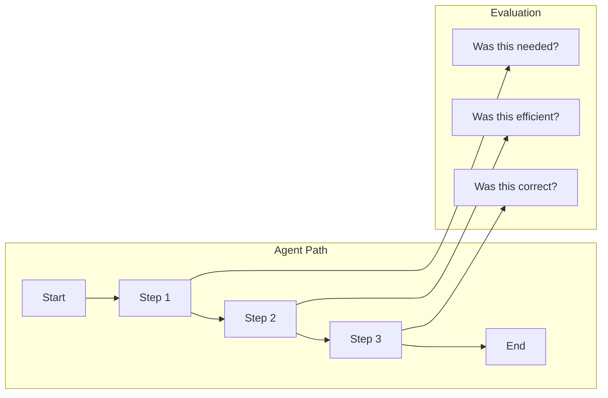
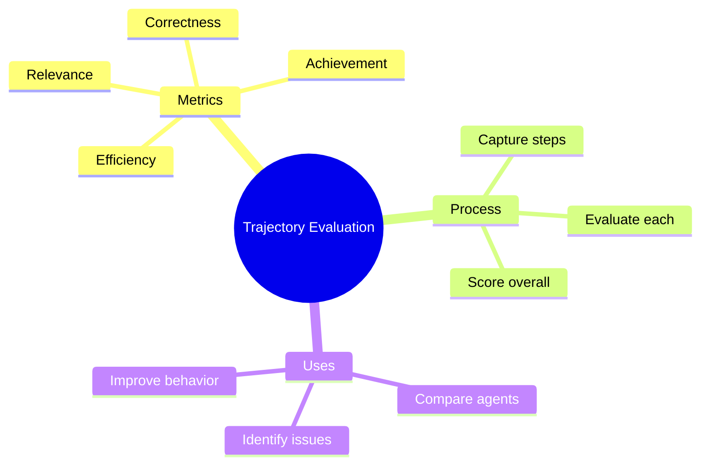

# Evaluating Agent Trajectories

Did your agent take the best path? Trajectory evaluation measures not just the final answer, but how the agent got there.

> **Coming from Software Engineering?** Trajectory evaluation is algorithmic complexity analysis applied to agent behavior. Just as you'd evaluate whether an algorithm took O(n) or O(n²) steps, you're evaluating whether the agent found the answer efficiently or wandered. Think of it like profiling a slow endpoint — you trace the execution path and ask "were all these steps necessary, or did it make redundant calls?" The metrics (step efficiency, tool selection accuracy, goal convergence) are performance metrics for reasoning.

---

## What is Trajectory Evaluation?



Trajectory evaluation asks:
- Did the agent take unnecessary steps?
- Were the steps in the right order?
- Did each step contribute to the goal?
- Was the path efficient?

---

## Capturing Agent Trajectories

First, record what the agent does:

```python
# script_id: day_061_trajectory_evaluation/trajectory_evaluator
from dataclasses import dataclass, field
from typing import List, Dict, Optional
from datetime import datetime
import json

@dataclass
class AgentStep:
    """Single step in agent trajectory."""
    step_number: int
    thought: str
    action: str
    action_input: Dict
    observation: str
    timestamp: datetime = field(default_factory=datetime.now)

@dataclass
class AgentTrajectory:
    """Complete agent trajectory."""
    task: str
    steps: List[AgentStep] = field(default_factory=list)
    final_answer: str = ""
    success: bool = False
    start_time: datetime = field(default_factory=datetime.now)
    end_time: Optional[datetime] = None

    def add_step(self, thought: str, action: str, action_input: Dict, observation: str):
        """Add a step to the trajectory."""
        step = AgentStep(
            step_number=len(self.steps) + 1,
            thought=thought,
            action=action,
            action_input=action_input,
            observation=observation
        )
        self.steps.append(step)

    def complete(self, final_answer: str, success: bool):
        """Mark trajectory as complete."""
        self.final_answer = final_answer
        self.success = success
        self.end_time = datetime.now()

    def to_dict(self) -> Dict:
        """Convert to dictionary."""
        return {
            "task": self.task,
            "steps": [
                {
                    "step": s.step_number,
                    "thought": s.thought,
                    "action": s.action,
                    "action_input": s.action_input,
                    "observation": s.observation
                }
                for s in self.steps
            ],
            "final_answer": self.final_answer,
            "success": self.success,
            "total_steps": len(self.steps)
        }

# Usage example
trajectory = AgentTrajectory(task="Find the weather in Tokyo and convert to Celsius")

trajectory.add_step(
    thought="I need to search for Tokyo weather",
    action="search",
    action_input={"query": "Tokyo weather"},
    observation="Weather in Tokyo: 72°F, sunny"
)

trajectory.add_step(
    thought="I need to convert 72°F to Celsius",
    action="calculate",
    action_input={"expression": "(72-32)*5/9"},
    observation="Result: 22.2"
)

trajectory.complete(
    final_answer="The weather in Tokyo is 22°C and sunny",
    success=True
)
```

---

## Trajectory Evaluation Metrics

### 1. Step Efficiency

```python
# script_id: day_061_trajectory_evaluation/trajectory_evaluator
def evaluate_efficiency(trajectory: AgentTrajectory, optimal_steps: int) -> Dict:
    """Evaluate if agent took efficient path."""

    actual_steps = len(trajectory.steps)

    if actual_steps <= optimal_steps:
        efficiency = 1.0
    else:
        # Penalty for extra steps
        efficiency = optimal_steps / actual_steps

    return {
        "actual_steps": actual_steps,
        "optimal_steps": optimal_steps,
        "efficiency_score": efficiency,
        "excess_steps": max(0, actual_steps - optimal_steps)
    }

# Usage
result = evaluate_efficiency(trajectory, optimal_steps=2)
print(f"Efficiency: {result['efficiency_score']:.2%}")
```

### 2. Step Relevance

```python
# script_id: day_061_trajectory_evaluation/trajectory_evaluator
from openai import OpenAI

client = OpenAI()

def evaluate_step_relevance(step: AgentStep, task: str) -> Dict:
    """Evaluate if a step was relevant to the task."""

    prompt = f"""Evaluate if this agent step was relevant to accomplishing the task.

Task: {task}

Step:
- Thought: {step.thought}
- Action: {step.action}
- Input: {step.action_input}
- Result: {step.observation}

Rate the relevance from 0-1 where:
- 1.0 = Directly necessary for the task
- 0.5 = Somewhat useful
- 0.0 = Completely irrelevant

Return JSON: {{"relevance": 0.0-1.0, "reasoning": "..."}}"""

    response = client.chat.completions.create(
        model="gpt-4o",
        messages=[{"role": "user", "content": prompt}],
        response_format={"type": "json_object"}
    )

    return json.loads(response.choices[0].message.content)

def evaluate_all_steps_relevance(trajectory: AgentTrajectory) -> Dict:
    """Evaluate relevance of all steps."""

    step_scores = []
    for step in trajectory.steps:
        result = evaluate_step_relevance(step, trajectory.task)
        step_scores.append({
            "step": step.step_number,
            "relevance": result["relevance"],
            "reasoning": result["reasoning"]
        })

    avg_relevance = sum(s["relevance"] for s in step_scores) / len(step_scores)

    return {
        "step_scores": step_scores,
        "average_relevance": avg_relevance,
        "irrelevant_steps": [s for s in step_scores if s["relevance"] < 0.5]
    }
```

### 3. Action Correctness

```python
# script_id: day_061_trajectory_evaluation/trajectory_evaluator
def evaluate_action_correctness(trajectory: AgentTrajectory) -> Dict:
    """Evaluate if actions were correct for the situation."""

    prompt = f"""Evaluate the correctness of each action in this agent trajectory.

Task: {trajectory.task}

Trajectory:
{json.dumps([{
    "thought": s.thought,
    "action": s.action,
    "input": s.action_input,
    "result": s.observation
} for s in trajectory.steps], indent=2)}

Final Answer: {trajectory.final_answer}

For each step, evaluate:
1. Was the action appropriate given the thought?
2. Was the action input correct?
3. Did the action produce expected results?

Return JSON:
{{
    "step_evaluations": [
        {{"step": 1, "correct": true/false, "issue": "..."}}
    ],
    "overall_correctness": 0.0-1.0,
    "critical_errors": ["..."]
}}"""

    response = client.chat.completions.create(
        model="gpt-4o",
        messages=[{"role": "user", "content": prompt}],
        response_format={"type": "json_object"}
    )

    return json.loads(response.choices[0].message.content)
```

### 4. Goal Achievement

```python
# script_id: day_061_trajectory_evaluation/trajectory_evaluator
def evaluate_goal_achievement(trajectory: AgentTrajectory) -> Dict:
    """Evaluate if the agent achieved its goal."""

    prompt = f"""Evaluate if this agent successfully achieved its goal.

Task: {trajectory.task}
Final Answer: {trajectory.final_answer}

Evaluate:
1. Does the final answer address the task? (0-1)
2. Is the answer complete? (0-1)
3. Is the answer correct? (0-1)

Return JSON:
{{
    "addresses_task": 0.0-1.0,
    "completeness": 0.0-1.0,
    "correctness": 0.0-1.0,
    "overall_achievement": 0.0-1.0,
    "missing_elements": ["..."]
}}"""

    response = client.chat.completions.create(
        model="gpt-4o",
        messages=[{"role": "user", "content": prompt}],
        response_format={"type": "json_object"}
    )

    return json.loads(response.choices[0].message.content)
```

---

## Complete Trajectory Evaluator

```python
# script_id: day_061_trajectory_evaluation/trajectory_evaluator
class TrajectoryEvaluator:
    """Comprehensive trajectory evaluation."""

    def __init__(self):
        self.client = OpenAI()

    def evaluate(self, trajectory: AgentTrajectory, optimal_steps: int = None) -> Dict:
        """Run full trajectory evaluation."""

        results = {
            "trajectory_summary": {
                "task": trajectory.task,
                "total_steps": len(trajectory.steps),
                "success": trajectory.success,
                "final_answer": trajectory.final_answer[:200]
            }
        }

        # Efficiency
        if optimal_steps:
            results["efficiency"] = evaluate_efficiency(trajectory, optimal_steps)

        # Step relevance
        results["relevance"] = evaluate_all_steps_relevance(trajectory)

        # Action correctness
        results["correctness"] = evaluate_action_correctness(trajectory)

        # Goal achievement
        results["achievement"] = evaluate_goal_achievement(trajectory)

        # Overall score
        results["overall_score"] = self._calculate_overall_score(results)

        return results

    def _calculate_overall_score(self, results: Dict) -> float:
        """Calculate weighted overall score."""

        scores = []
        weights = []

        if "efficiency" in results:
            scores.append(results["efficiency"]["efficiency_score"])
            weights.append(0.2)

        if "relevance" in results:
            scores.append(results["relevance"]["average_relevance"])
            weights.append(0.2)

        if "correctness" in results:
            scores.append(results["correctness"]["overall_correctness"])
            weights.append(0.3)

        if "achievement" in results:
            scores.append(results["achievement"]["overall_achievement"])
            weights.append(0.3)

        if not scores:
            return 0.0

        return sum(s * w for s, w in zip(scores, weights)) / sum(weights)

    def format_report(self, results: Dict) -> str:
        """Format evaluation results as readable report."""

        report = f"""
╔══════════════════════════════════════════════════════════════╗
║                 TRAJECTORY EVALUATION REPORT                  ║
╚══════════════════════════════════════════════════════════════╝

📋 Task: {results['trajectory_summary']['task']}

📊 OVERALL SCORE: {results['overall_score']:.1%}

───────────────────────────────────────────────────────────────
📈 METRICS BREAKDOWN
───────────────────────────────────────────────────────────────
"""

        if "efficiency" in results:
            eff = results["efficiency"]
            report += f"""
⚡ Efficiency: {eff['efficiency_score']:.1%}
   • Steps taken: {eff['actual_steps']}
   • Optimal steps: {eff['optimal_steps']}
   • Excess steps: {eff['excess_steps']}
"""

        if "relevance" in results:
            rel = results["relevance"]
            report += f"""
🎯 Relevance: {rel['average_relevance']:.1%}
   • Irrelevant steps: {len(rel['irrelevant_steps'])}
"""

        if "correctness" in results:
            cor = results["correctness"]
            report += f"""
✅ Correctness: {cor['overall_correctness']:.1%}
   • Critical errors: {len(cor.get('critical_errors', []))}
"""

        if "achievement" in results:
            ach = results["achievement"]
            report += f"""
🏆 Goal Achievement: {ach['overall_achievement']:.1%}
   • Addresses task: {ach['addresses_task']:.1%}
   • Completeness: {ach['completeness']:.1%}
   • Correctness: {ach['correctness']:.1%}
"""

        return report

# Usage
evaluator = TrajectoryEvaluator()
results = evaluator.evaluate(trajectory, optimal_steps=2)
print(evaluator.format_report(results))
```

---

## Comparing Trajectories

Compare different agent approaches:

```python
# script_id: day_061_trajectory_evaluation/trajectory_evaluator
def compare_trajectories(trajectories: List[AgentTrajectory], optimal_steps: int) -> Dict:
    """Compare multiple trajectories for the same task."""

    evaluator = TrajectoryEvaluator()
    evaluations = []

    for i, traj in enumerate(trajectories):
        eval_result = evaluator.evaluate(traj, optimal_steps)
        evaluations.append({
            "trajectory_id": i + 1,
            "steps": len(traj.steps),
            "overall_score": eval_result["overall_score"],
            "success": traj.success
        })

    # Find best
    best = max(evaluations, key=lambda x: x["overall_score"])

    return {
        "comparisons": evaluations,
        "best_trajectory": best["trajectory_id"],
        "best_score": best["overall_score"],
        "average_score": sum(e["overall_score"] for e in evaluations) / len(evaluations)
    }
```

---

## Summary



---

## Quick Reference

```python
# script_id: day_061_trajectory_evaluation/trajectory_evaluator
# Capture trajectory
trajectory = AgentTrajectory(task="...")
trajectory.add_step(thought="...", action="...", action_input={}, observation="...")
trajectory.complete(final_answer="...", success=True)

# Evaluate
evaluator = TrajectoryEvaluator()
results = evaluator.evaluate(trajectory, optimal_steps=3)

# Key metrics
print(f"Efficiency: {results['efficiency']['efficiency_score']:.1%}")
print(f"Relevance: {results['relevance']['average_relevance']:.1%}")
print(f"Overall: {results['overall_score']:.1%}")
```

---

## Exercises

1. Build a second `AgentTrajectory` for the same Tokyo-weather task that takes a redundant extra step (e.g. searches twice). Run `evaluate_efficiency` with `optimal_steps=2` and confirm the efficiency score drops.
2. Add a `tool_repetition_penalty` to `TrajectoryEvaluator`: detect when the same `action` is used on consecutive steps and reflect it in the overall score.
3. Capture three trajectories that solve one task differently, then use `compare_trajectories` to pick the best. Print the full comparison list, not just the winner.
4. Extend `AgentStep` and `to_dict` to record how long each step took (use the existing `timestamp`), then report the slowest step in `format_report`.

<details><summary>Solutions (approaches)</summary>

1. Add an extra `add_step(...)` that re-searches; `evaluate_efficiency` returns `optimal_steps / actual_steps`, so 2/3 ≈ 0.67.
2. Compare `trajectory.steps[i].action` to `steps[i-1].action`; count repeats, subtract a small weighted penalty inside `_calculate_overall_score`.
3. ```text
   result = compare_trajectories([t1, t2, t3], optimal_steps=2)
   for c in result["comparisons"]:
       print(c)
   print("Best:", result["best_trajectory"])
   ```
4. Compute `delta = steps[i].timestamp - steps[i-1].timestamp` per step; track the max and add a `"Slowest step: #N (Xs)"` line to the report.
</details>

---

## What's Next?

Now let's learn about **Security & Guardrails** - protecting your agents from attacks and misuse!
